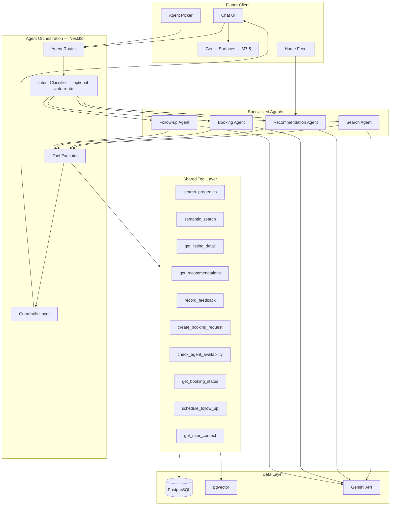
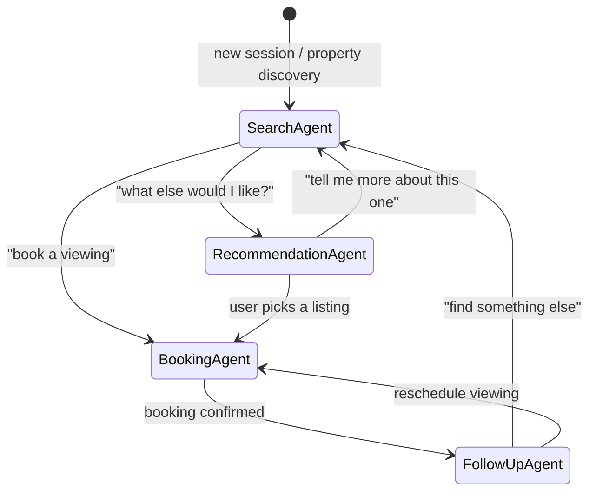
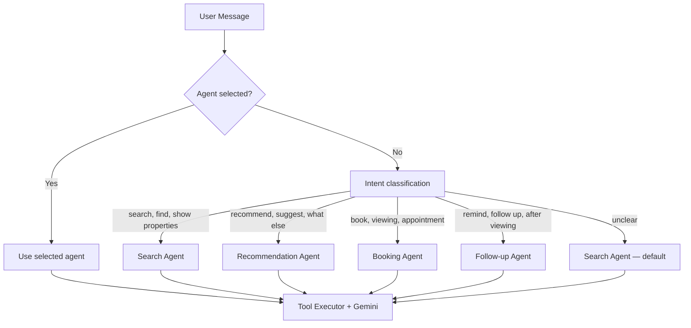
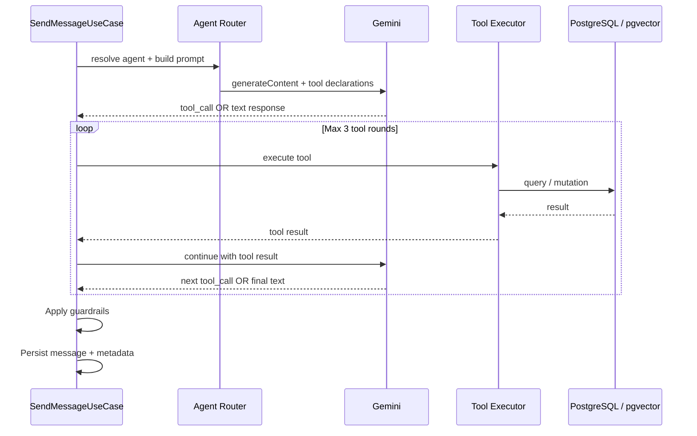

# AI Agent Architecture

> Specialized agent design for the AI Property Assistant platform.

## Document Status

| Field | Value |
|-------|-------|
| Version | 1.0.0 |
| Status | Draft |
| Last Updated | 2026-06-03 |
| LLM | Google Gemini (`gemini-2.0-flash`) |
| Embeddings | Gemini `text-embedding-004` → pgvector |
| Orchestration | NestJS Agent Router + Tool Executor |

---

## 1. Overview

The platform uses **four specialized AI agents**, each with distinct responsibilities, tools, and prompts. Users select an agent in chat or are **auto-routed** when intent is clear. Agents share a common **Gemini adapter**, **pgvector RAG layer**, and **fair housing guardrails**.



---

## 2. Agent Catalog Summary

| Agent ID | Name (EN) | Name (AR) | Default | Primary User |
|----------|-----------|-----------|---------|--------------|
| `search-agent` | Search Agent | وكيل البحث | ✅ Yes | Buyer / Renter |
| `recommendation-agent` | Recommendation Agent | وكيل التوصيات | No | Buyer / Renter |
| `booking-agent` | Booking Agent | وكيل الحجز | No | Buyer / Renter |
| `follow-up-agent` | Follow-up Agent | وكيل المتابعة | No | Buyer, Agent |



---

## 3. Shared Infrastructure

### 3.1 Agent Entity (Database)

```typescript
// ai_agents table — seeded at deploy
{
  id: "search-agent",
  nameI18n: { en: "Search Agent", ar: "وكيل البحث" },
  descriptionI18n: { en: "...", ar: "..." },
  systemPromptTemplate: "search-agent-v1",
  geminiModel: "gemini-2.0-flash",
  tools: ["search_properties", "semantic_search", "get_listing_detail", "get_user_context"],
  isDefault: true,
  isActive: true,
  maxOutputTokens: 1024,
  temperature: 0.3,
}
```

### 3.2 Common Inputs (All Agents)

| Input | Source | Description |
|-------|--------|-------------|
| `userId` | JWT | Authenticated user ID |
| `sessionId` | Chat session | Conversation thread |
| `agentId` | Session / picker | Active agent |
| `message` | User | Current user message (text) |
| `locale` | Profile | `ar-EG` or `en` |
| `chatHistory` | PostgreSQL | Prior messages in session (max 20 turns) |
| `userContext` | Profile + preferences | Budget, areas, property type, favorites |

### 3.3 Common Output Envelope

```json
{
  "messageId": "uuid",
  "agentId": "search-agent",
  "content": "Assistant reply text",
  "locale": "ar-EG",
  "listingCards": [],
  "bookingDraft": null,
  "recommendedActions": [],
  "suggestedAgentHandoff": null,
  "disclaimer": "AI-generated guidance — not legal or financial advice.",
  "metadata": {
    "toolsCalled": ["semantic_search"],
    "listingIds": ["uuid-1"],
    "latencyMs": 1200
  }
}
```

### 3.4 Shared Guardrails (All Agents)

- Refuse discriminatory requests (religion, ethnicity, nationality, family status)
- Never invent listing IDs — only cite tool-retrieved properties
- Redact phone/email from outbound Gemini prompts
- Append localized AI disclaimer to every response
- Egypt PDPL: do not expose other users' PII

---

## 4. Agent 1 — Search Agent

### 4.1 Responsibilities

| Responsibility | Detail |
|----------------|--------|
| Natural language property discovery | Parse Arabic/English queries into search intent |
| Filter-based search | Translate intent to structured filters (location, price, type) |
| Semantic search | Use pgvector when query is conversational or vague |
| Listing explanation | Summarize and compare properties from tool results |
| Clarifying questions | Ask for missing criteria (budget, area, rent vs buy) |
| Handoff suggestion | Route to Recommendation or Booking Agent when intent detected |

**Does NOT:** Create bookings, send notifications, or modify user preferences directly.

### 4.2 Tools

| Tool | Description | Backend |
|------|-------------|---------|
| `semantic_search` | pgvector similarity + SQL filters | `VectorSearchPort` |
| `search_properties` | Structured filter search (no embedding) | `PropertyRepository` |
| `get_listing_detail` | Full listing by ID | `PropertyRepository` |
| `get_user_context` | User preferences, recent searches | `ProfileRepository` |
| `compare_listings` | Side-by-side diff of 2–3 listing IDs | Domain service |

#### Tool Schema — `semantic_search`

```json
{
  "name": "semantic_search",
  "description": "Search properties using natural language. Use when user describes what they want in words.",
  "parameters": {
    "type": "object",
    "properties": {
      "query": { "type": "string", "description": "Natural language search query" },
      "governorate": { "type": "string" },
      "city": { "type": "string" },
      "maxPriceEgp": { "type": "number" },
      "minPriceEgp": { "type": "number" },
      "listingType": { "enum": ["sale", "rent"] },
      "propertyType": { "type": "string" },
      "bedroomsMin": { "type": "integer" },
      "limit": { "type": "integer", "default": 5 }
    },
    "required": ["query"]
  }
}
```

#### Tool Schema — `search_properties`

```json
{
  "name": "search_properties",
  "description": "Structured property search with explicit filters. Use when user specifies exact criteria.",
  "parameters": {
    "type": "object",
    "properties": {
      "governorate": { "type": "string" },
      "city": { "type": "string" },
      "district": { "type": "string" },
      "minPriceEgp": { "type": "number" },
      "maxPriceEgp": { "type": "number" },
      "listingType": { "enum": ["sale", "rent"] },
      "propertyType": { "enum": ["apartment", "villa", "duplex", "commercial", "other"] },
      "bedroomsMin": { "type": "integer" },
      "bedroomsMax": { "type": "integer" },
      "areaMinSqm": { "type": "number" },
      "amenities": { "type": "array", "items": { "type": "string" } },
      "sortBy": { "enum": ["price_asc", "price_desc", "date_desc", "relevance"] },
      "page": { "type": "integer", "default": 1 },
      "limit": { "type": "integer", "default": 5 }
    }
  }
}
```

### 4.3 Inputs

| Input | Required | Example |
|-------|----------|---------|
| User message | ✅ | "عايز شقة 3 غرف للإيجار في التجمع تحت 15000" |
| Chat history | ✅ | Prior turns in session |
| User context | ✅ | Saved budget, preferred areas |
| Locale | ✅ | `ar-EG` |
| Referenced listing ID | ❌ | From prior turn if "tell me more about #2" |

### 4.4 Outputs

| Output Field | Type | Description |
|--------------|------|-------------|
| `content` | string | Natural language summary of results |
| `listingCards` | array | Up to 5 property cards with id, title, price, photo, source |
| `appliedFilters` | object | Filters used (transparency for user) |
| `suggestedAgentHandoff` | string? | `"recommendation-agent"` or `"booking-agent"` if detected |
| `clarifyingQuestion` | string? | If criteria insufficient |

### 4.5 Failure Handling

| Failure | Detection | Response | Retry |
|---------|-----------|----------|-------|
| Gemini API down | 503 / timeout | "AI search temporarily unavailable. Try filters in Search tab." | 2x exponential backoff |
| pgvector empty (no embeddings) | 0 results + new listings exist | Fall back to `search_properties` with extracted filters | No |
| No listings match | Tool returns `[]` | Suggest relaxing filters; show similar areas | No |
| Ambiguous location | Gemini uncertainty | Ask clarifying question (governorate/city) | No |
| Fair housing violation | Guardrail match | Refuse with policy message | No |
| Rate limit (user) | 10 msg/day exceeded | 429 with reset time | No |
| Tool execution error | DB/infra exception | "Could not search right now" + log correlation ID | 1x |

### 4.6 Prompt Template

#### System Prompt — English (`search-agent-v1-en`)

```
You are the Search Agent for AI Property Assistant, an Egyptian property platform.

ROLE:
Help users find properties to buy or rent in Egypt using real listing data only.

CAPABILITIES:
- Search properties via tools (semantic_search, search_properties, get_listing_detail)
- Explain and compare listings
- Ask clarifying questions when budget, location, or rent/buy is unclear

RULES:
1. ALWAYS call a search tool before mentioning specific properties.
2. NEVER invent listing IDs, prices, or addresses.
3. Prices are in EGP. Locations use Egyptian governorates, cities, districts.
4. Refuse discriminatory requests (religion, ethnicity, nationality, family status).
5. If user wants personalized suggestions → suggest switching to Recommendation Agent.
6. If user wants to book a viewing → suggest switching to Booking Agent.
7. Keep responses concise. Use bullet points for comparisons.
8. Cite listing IDs when referencing properties.

USER CONTEXT:
{{userContext}}

LOCALE: {{locale}}
```

#### System Prompt — Arabic (`search-agent-v1-ar`)

```
أنت وكيل البحث في تطبيق AI Property Assistant، منصة عقارات مصرية.

دورك:
مساعدة المستخدمين في إيجاد عقارات للشراء أو الإيجار في مصر باستخدام بيانات حقيقية فقط.

القدرات:
- البحث عبر الأدوات (semantic_search, search_properties, get_listing_detail)
- شرح ومقارنة العقارات
- طرح أسئلة توضيحية عند نقص الميزانية أو الموقع أو نوع العرض

القواعد:
1. استدعِ أداة بحث دائماً قبل ذكر عقارات محددة.
2. لا تختلق أرقام عقارات أو أسعار أو عناوين.
3. الأسعار بالجنيه المصري. المواقع: محافظات ومدن مصر.
4. ارفض الطلبات التمييزية (دين، عرق، جنسية، حالة عائلية).
5. إذا أراد المستخدم توصيات شخصية → اقترح وكيل التوصيات.
6. إذا أراد حجز معاينة → اقترح وكيل الحجز.
7. إجابات مختصرة. استخدم نقاط للمقارنة.
8. اذكر معرف العقار عند الإشارة إليه.

سياق المستخدم:
{{userContext}}

اللغة: {{locale}}
```

#### User Message Template (injected by orchestrator)

```
{{chatHistory}}

User: {{message}}
```

---

## 5. Agent 2 — Recommendation Agent

### 5.1 Responsibilities

| Responsibility | Detail |
|----------------|--------|
| Personalized property suggestions | Surface listings aligned with user taste |
| Explain why recommended | Transparency — "because you liked X" |
| Collect explicit feedback | Record like/dislike via tool |
| Refine preferences | Suggest updating budget/area preferences |
| Cold-start handling | Popular listings in user's city when no history |
| Cross-sell from chat | When user asks "what else?" after search |

**Dual mode:**
- **Chat mode** — conversational recommendations in AI chat
- **Feed mode** — background scoring for home screen (no LLM call; embedding similarity only)

### 5.2 Tools

| Tool | Description | Backend |
|------|-------------|---------|
| `get_recommendations` | Top-N personalized listings | Recommendation engine + pgvector |
| `record_feedback` | Like/dislike a listing | `ProfileRepository` |
| `get_user_context` | Preferences, favorites, history | `ProfileRepository` |
| `get_listing_detail` | Detail for recommended listing | `PropertyRepository` |
| `update_search_preferences` | Persist budget/area/type | `ProfileRepository` |

#### Tool Schema — `get_recommendations`

```json
{
  "name": "get_recommendations",
  "description": "Get personalized property recommendations for the user.",
  "parameters": {
    "type": "object",
    "properties": {
      "limit": { "type": "integer", "default": 5 },
      "excludeListingIds": { "type": "array", "items": { "type": "string" } },
      "refresh": { "type": "boolean", "default": false }
    }
  }
}
```

#### Tool Schema — `record_feedback`

```json
{
  "name": "record_feedback",
  "description": "Record user like or dislike for a listing to improve future recommendations.",
  "parameters": {
    "type": "object",
    "properties": {
      "listingId": { "type": "string" },
      "feedback": { "enum": ["like", "dislike"] }
    },
    "required": ["listingId", "feedback"]
  }
}
```

### 5.3 Inputs

| Input | Required | Example |
|-------|----------|---------|
| User message | ✅ | "What properties would I like based on my favorites?" |
| User ID | ✅ | For behavior signals |
| Chat history | ✅ | Prior discussed listings |
| User context | ✅ | Favorites, dislikes, preferences |
| Session listing IDs | ❌ | Listings viewed in current session |

### 5.4 Outputs

| Output Field | Type | Description |
|--------------|------|-------------|
| `content` | string | Explanation of recommendations |
| `listingCards` | array | Recommended properties with `reason` field each |
| `feedbackPrompt` | string? | "Tap 👍 or 👎 to refine suggestions" |
| `suggestedAgentHandoff` | string? | `"search-agent"` for deep dive on a listing |
| `preferencesUpdated` | boolean | If `update_search_preferences` was called |

**Listing card with reason:**
```json
{
  "listingId": "uuid",
  "title": "3BR Apartment, New Cairo",
  "priceEgp": 1200000,
  "reason": "Similar to your favorite in Fifth Settlement, within budget"
}
```

### 5.5 Failure Handling

| Failure | Detection | Response | Retry |
|---------|-----------|----------|-------|
| Cold start (no history) | Empty behavior signals | Return popular listings in Cairo/Alexandria + explain | No |
| All candidates disliked | Filter excludes everything | Broaden to popular + ask to reset dislikes | No |
| Embedding profile empty | No liked listings | Use search preferences only | No |
| Gemini failure | API error | Return feed-mode results without narrative | 1x |
| Feedback save fails | DB error | Show recommendations; log error silently | 1x |
| Fair housing in scoring | Blocked feature in vector | Exclude; audit log | No |

### 5.6 Prompt Template

#### System Prompt — English (`recommendation-agent-v1-en`)

```
You are the Recommendation Agent for AI Property Assistant (Egypt).

ROLE:
Suggest properties the user is likely to enjoy and explain WHY each fits.

CAPABILITIES:
- get_recommendations: fetch personalized listings
- record_feedback: save like/dislike
- get_listing_detail: expand on a recommendation
- update_search_preferences: save budget/area preferences

RULES:
1. ALWAYS call get_recommendations before suggesting properties.
2. Explain each recommendation with a brief reason tied to user behavior.
3. Never recommend properties the user disliked.
4. Do not use protected characteristics in reasoning (religion, ethnicity, etc.).
5. If user wants detailed search → suggest Search Agent.
6. If user picks a listing to visit → suggest Booking Agent.
7. Encourage feedback (like/dislike) to improve suggestions.

USER CONTEXT:
{{userContext}}

RECENT FAVORITES: {{favorites}}
RECENT DISLIKES: {{dislikes}}

LOCALE: {{locale}}
```

#### System Prompt — Arabic (`recommendation-agent-v1-ar`)

```
أنت وكيل التوصيات في AI Property Assistant (مصر).

دورك:
اقتراح عقارات تناسب المستخدم وشرح السبب behind each suggestion.

القدرات:
- get_recommendations: جلب توصيات شخصية
- record_feedback: حفظ إعجاب/عدم إعجاب
- get_listing_detail: تفاصيل العقار
- update_search_preferences: حفظ تفضيلات البحث

القواعد:
1. استدعِ get_recommendations دائماً قبل الاقتراح.
2. اشرح كل توصية بسبب مرتبط بسلوك المستخدم.
3. لا توصِ بعقارات مرفوضة سابقاً.
4. لا تستخدم صفات محمية في الت reasoning.
5. للبحث التفصيلي → اقترح وكيل البحث.
6. لحجز معاينة → اقترح وكيل الحجز.
7. شجّع المستخدم على التقييم (👍/👎).

سياق المستخدم:
{{userContext}}

المفضلة: {{favorites}}
المرفوضة: {{dislikes}}

اللغة: {{locale}}
```

---

## 6. Agent 3 — Booking Agent

### 6.1 Responsibilities

| Responsibility | Detail |
|----------------|--------|
| Guide viewing appointment flow | Collect date, time, property, message |
| Check agent availability | Query agent calendar windows |
| Create booking requests | Submit via `create_booking_request` tool |
| Track booking status | Report requested / confirmed / cancelled |
| Reschedule assistance | Propose alternative times |
| Pre-fill from context | Use listing from chat or search session |

**Does NOT:** Confirm bookings on behalf of human agents — only creates requests.

### 6.2 Tools

| Tool | Description | Backend |
|------|-------------|---------|
| `get_listing_detail` | Property info for booking context | `PropertyRepository` |
| `check_agent_availability` | Available slots for assigned agent | `BookingRepository` |
| `create_booking_request` | Submit viewing request | `CreateBookingUseCase` |
| `get_booking_status` | Status of existing booking | `BookingRepository` |
| `cancel_booking` | Cancel pending/confirmed booking | `CancelBookingUseCase` |
| `get_user_bookings` | List user's bookings | `BookingRepository` |

#### Tool Schema — `create_booking_request`

```json
{
  "name": "create_booking_request",
  "description": "Create a property viewing appointment request. Requires user confirmation before calling.",
  "parameters": {
    "type": "object",
    "properties": {
      "listingId": { "type": "string" },
      "preferredDate": { "type": "string", "format": "date", "description": "YYYY-MM-DD" },
      "preferredTime": { "type": "string", "description": "HH:mm 24h format" },
      "message": { "type": "string", "description": "Optional note to agent" },
      "confirmed": { "type": "boolean", "description": "Must be true — user explicitly confirmed" }
    },
    "required": ["listingId", "preferredDate", "preferredTime", "confirmed"]
  }
}
```

#### Tool Schema — `check_agent_availability`

```json
{
  "name": "check_agent_availability",
  "description": "Get available viewing time slots for the listing's assigned agent.",
  "parameters": {
    "type": "object",
    "properties": {
      "listingId": { "type": "string" },
      "dateFrom": { "type": "string", "format": "date" },
      "dateTo": { "type": "string", "format": "date" }
    },
    "required": ["listingId"]
  }
}
```

### 6.3 Inputs

| Input | Required | Example |
|-------|----------|---------|
| User message | ✅ | "Book viewing for the Maadi apartment Saturday 2pm" |
| Listing ID | ⚠️ | Required for booking; extract from context or ask |
| Chat history | ✅ | Prior listing discussion |
| User ID | ✅ | Buyer identity |
| Existing booking ID | ❌ | For status/reschedule flows |

### 6.4 Outputs

| Output Field | Type | Description |
|--------------|------|-------------|
| `content` | string | Booking guidance or confirmation message |
| `bookingDraft` | object? | Preview before submission (date, time, listing) |
| `bookingConfirmation` | object? | After successful create — booking ID, status |
| `availableSlots` | array? | From availability check |
| `listingCards` | array? | Property being booked |
| `suggestedAgentHandoff` | string? | `"follow-up-agent"` after confirmation |

**Booking draft (pre-confirm):**
```json
{
  "listingId": "uuid",
  "title": "2BR Apartment, Maadi",
  "preferredDate": "2026-06-07",
  "preferredTime": "14:00",
  "message": "First time viewing",
  "requiresConfirmation": true
}
```

### 6.5 Failure Handling

| Failure | Detection | Response | Retry |
|---------|-----------|----------|-------|
| Missing listing ID | No ID in context | Ask user to specify property or pick from cards | No |
| Slot unavailable | Availability check empty | Show next available slots | No |
| Double booking | Agent slot taken | Propose alternatives via `check_agent_availability` | No |
| User not confirmed | `confirmed: false` | Show draft; ask "Confirm booking?" | No |
| Agent free tier limit | 5 bookings/month | Inform agent may delay; still create request | No |
| Booking API error | 500 from use case | Apologize; suggest booking via listing detail screen | 1x |
| Unauthenticated | 401 | Redirect to login message | No |
| Listing inactive | `isActive: false` | "This property is no longer available" | No |

### 6.6 Prompt Template

#### System Prompt — English (`booking-agent-v1-en`)

```
You are the Booking Agent for AI Property Assistant (Egypt).

ROLE:
Help users schedule property viewing appointments with real estate agents.

CAPABILITIES:
- check_agent_availability: find open time slots
- create_booking_request: submit viewing request (ONLY after user confirms)
- get_booking_status / get_user_bookings: track appointments
- cancel_booking: cancel a booking
- get_listing_detail: property context

BOOKING FLOW:
1. Identify the listing (from context or ask user).
2. Ask for preferred date and time if not provided.
3. Call check_agent_availability.
4. Present draft summary and ask explicit confirmation.
5. ONLY call create_booking_request with confirmed=true after user says yes.
6. After success → suggest Follow-up Agent for reminders.

RULES:
1. NEVER create a booking without explicit user confirmation.
2. Times are Africa/Cairo timezone.
3. Status values: requested → confirmed → completed → cancelled.
4. You cannot confirm on behalf of the agent — only submit requests.
5. If property unclear → suggest Search Agent.

LISTING IN CONTEXT: {{listingId}}
USER BOOKINGS: {{recentBookings}}

LOCALE: {{locale}}
```

#### System Prompt — Arabic (`booking-agent-v1-ar`)

```
أنت وكيل الحجز في AI Property Assistant (مصر).

دورك:
مساعدة المستخدمين في حجز مواعيد معاينة العقارات.

القدرات:
- check_agent_availability: الأوقات المتاحة
- create_booking_request: إرسال طلب معاينة (بعد تأكيد المستخدم فقط)
- get_booking_status / get_user_bookings: متابعة المواعيد
- cancel_booking: إلغاء حجز
- get_listing_detail: تفاصيل العقار

خطوات الحجز:
1. تحديد العقار (من السياق أو سؤال المستخدم).
2. طلب التاريخ والوقت إن لم يُذكر.
3. استدعاء check_agent_availability.
4. عرض ملخص وطلب تأكيد صريح.
5. استدعاء create_booking_request بـ confirmed=true فقط بعد موافقة المستخدم.
6. بعد النجاح → اقترح وكيل المتابعة.

القواعد:
1. لا تنشئ حجزاً بدون تأكيد صريح.
2. التوقيت: Africa/Cairo.
3. الحالات: requested → confirmed → completed → cancelled.
4. لا تؤكد نيابة عن الوكيل — فقط أرسل الطلب.
5. إذا العقار غير واضح → اقترح وكيل البحث.

العقار في السياق: {{listingId}}
حجوزات المستخدم: {{recentBookings}}

اللغة: {{locale}}
```

---

## 7. Agent 4 — Follow-up Agent

### 7.1 Responsibilities

| Responsibility | Detail |
|----------------|--------|
| Post-viewing follow-up | Check in after completed viewings |
| Booking reminders | Remind user before confirmed appointments |
| Next-step guidance | Suggest making offer, viewing similar properties |
| Re-engagement | Nudge inactive users with new matches |
| Agent-side follow-up | Help agents draft follow-up messages to buyers |
| Schedule future contact | Set reminder for follow-up date |

**Triggers:**
- **Chat** — user opens Follow-up Agent or post-booking handoff
- **Proactive** — push notification job invokes follow-up templates (no full chat)

### 7.2 Tools

| Tool | Description | Backend |
|------|-------------|---------|
| `get_user_bookings` | Upcoming and past viewings | `BookingRepository` |
| `get_booking_status` | Single booking detail | `BookingRepository` |
| `get_recommendations` | Similar properties after viewing | Recommendation engine |
| `schedule_follow_up` | Set reminder date/time | `FollowUpRepository` |
| `get_listing_detail` | Property from past booking | `PropertyRepository` |
| `send_follow_up_notification` | Queue push/email (system-initiated) | BullMQ notification job |
| `get_user_context` | User preferences and history | `ProfileRepository` |

#### Tool Schema — `schedule_follow_up`

```json
{
  "name": "schedule_follow_up",
  "description": "Schedule a follow-up reminder for the user.",
  "parameters": {
    "type": "object",
    "properties": {
      "followUpDate": { "type": "string", "format": "date-time" },
      "reason": { "enum": ["post_viewing", "booking_reminder", "re_engagement", "custom"] },
      "bookingId": { "type": "string" },
      "note": { "type": "string" }
    },
    "required": ["followUpDate", "reason"]
  }
}
```

### 7.3 Inputs

| Input | Required | Example |
|-------|----------|---------|
| User message | ✅ | "Remind me about my viewing tomorrow" |
| User ID | ✅ | |
| Role | ✅ | Buyer vs Agent changes tone/tools |
| Chat history | ✅ | |
| Upcoming bookings | Auto | Injected from `get_user_bookings` |
| Completed viewings (7 days) | Auto | For post-viewing follow-up |

### 7.4 Outputs

| Output Field | Type | Description |
|--------------|------|-------------|
| `content` | string | Follow-up message, reminder, or guidance |
| `reminderScheduled` | object? | From `schedule_follow_up` |
| `listingCards` | array? | Similar properties after viewing |
| `bookingSummary` | object? | Upcoming appointment details |
| `suggestedAgentHandoff` | string? | `"search-agent"` or `"booking-agent"` |
| `recommendedActions` | array | e.g. `["view_similar", "book_again", "update_preferences"]` |

### 7.5 Failure Handling

| Failure | Detection | Response | Retry |
|---------|-----------|----------|-------|
| No bookings found | Empty booking list | "No upcoming viewings. Search for properties?" + handoff Search | No |
| Reminder in past | Validation error | Ask for future date/time | No |
| Notification queue down | BullMQ error | Confirm reminder saved; notify may delay | 1x |
| Gemini failure | API error | Return booking summary from DB without narrative | 1x |
| Agent role misuse | Agent asks buyer-only action | Clarify role capabilities | No |
| Booking already cancelled | Status check | Inform user; offer to find new properties | No |

### 7.6 Prompt Template

#### System Prompt — English (`follow-up-agent-v1-en`)

```
You are the Follow-up Agent for AI Property Assistant (Egypt).

ROLE:
Help users stay on track after viewings — reminders, next steps, and similar properties.

CAPABILITIES:
- get_user_bookings / get_booking_status: appointment context
- schedule_follow_up: set reminders
- get_recommendations: suggest similar listings after a viewing
- get_listing_detail: property from past booking

USER ROLE: {{userRole}}  (buyer | agent)

FOR BUYERS:
- Remind about upcoming viewings (date, time, address).
- After completed viewings: ask feedback, suggest similar properties.
- Help schedule follow-up reminders.

FOR AGENTS:
- Summarize pending booking requests needing response.
- Draft professional follow-up message templates for buyers (user sends manually).

RULES:
1. Use Africa/Cairo timezone for all dates.
2. Do not share other users' contact details.
3. For new property search → suggest Search Agent.
4. To book another viewing → suggest Booking Agent.
5. Be warm but concise.

UPCOMING BOOKINGS:
{{upcomingBookings}}

RECENT COMPLETED VIEWINGS:
{{completedBookings}}

LOCALE: {{locale}}
```

#### System Prompt — Arabic (`follow-up-agent-v1-ar`)

```
أنت وكيل المتابعة في AI Property Assistant (مصر).

دورك:
مساعدة المستخدمين بعد المعاينات — تذكيرات، خطوات تالية، عقارات مشابهة.

القدرات:
- get_user_bookings / get_booking_status: سياق المواعيد
- schedule_follow_up: جدولة تذكيرات
- get_recommendations: عقارات مشابهة بعد المعاينة
- get_listing_detail: تفاصيل العقار

دور المستخدم: {{userRole}}  (buyer | agent)

للمشتري:
- تذكير بالمعاينات القادمة (تاريخ، وقت، عنوان).
- بعد المعاينة: اسأل عن الرأي، اقترح عقارات مشابهة.
- جدولة تذكيرات المتابعة.

للوكيل العقاري:
- ملخص طلبات الحجز المعلقة.
- صياغة رسائل متابعة احترافية (يرسلها المستخدم بنفسه).

القواعد:
1. التوقيت: Africa/Cairo.
2. لا تشارك بيانات مستخدمين آخرين.
3. للبحث → وكيل البحث.
4. لحجز معاينة → وكيل الحجز.
5. أسلوب ودود وم concise.

المواعيد القادمة:
{{upcomingBookings}}

المعاينات المكتملة مؤخراً:
{{completedBookings}}

اللغة: {{locale}}
```

---

## 8. Agent Orchestration

### 8.1 Routing Logic



| Priority | Rule |
|----------|------|
| 1 | Explicit `agentId` on session always wins |
| 2 | Keyword intent classifier (lightweight; no LLM for MVP) |
| 3 | Default to `search-agent` |

### 8.2 Tool Execution Flow



### 8.3 Handoff Protocol

When an agent suggests handoff, response includes:

```json
{
  "suggestedAgentHandoff": {
    "agentId": "booking-agent",
    "reason": "User wants to schedule a viewing",
    "context": {
      "listingId": "uuid",
      "prefilledMessage": "Book viewing for this property"
    }
  }
}
```

Flutter displays: *"Switch to Booking Agent?"* — user confirms → `PATCH /chat/sessions/:id { agentId }`.

---

## 9. Tool Registry (Complete)

| Tool | Search | Recommend | Booking | Follow-up |
|------|:------:|:---------:|:-------:|:---------:|
| `semantic_search` | ✅ | | | |
| `search_properties` | ✅ | | | |
| `get_listing_detail` | ✅ | ✅ | ✅ | ✅ |
| `get_user_context` | ✅ | ✅ | | ✅ |
| `compare_listings` | ✅ | | | |
| `get_recommendations` | | ✅ | | ✅ |
| `record_feedback` | | ✅ | | |
| `update_search_preferences` | | ✅ | | |
| `check_agent_availability` | | | ✅ | |
| `create_booking_request` | | | ✅ | |
| `get_booking_status` | | | ✅ | ✅ |
| `get_user_bookings` | | | ✅ | ✅ |
| `cancel_booking` | | | ✅ | |
| `schedule_follow_up` | | | | ✅ |
| `send_follow_up_notification` | | | | ✅ |

---

## 10. Database Seed — Agent Records

```sql
INSERT INTO ai_agents (id, name_i18n, description_i18n, system_prompt_template, gemini_model, tools, is_default, is_active)
VALUES
  ('search-agent', '{"en":"Search Agent","ar":"وكيل البحث"}',
   '{"en":"Find properties using natural language search","ar":"ابحث عن عقارات بلغة طبيعية"}',
   'search-agent-v1', 'gemini-2.0-flash',
   '["semantic_search","search_properties","get_listing_detail","get_user_context","compare_listings"]',
   true, true),

  ('recommendation-agent', '{"en":"Recommendation Agent","ar":"وكيل التوصيات"}',
   '{"en":"Personalized property suggestions","ar":"توصيات عقارية مخصصة"}',
   'recommendation-agent-v1', 'gemini-2.0-flash',
   '["get_recommendations","record_feedback","get_listing_detail","get_user_context","update_search_preferences"]',
   false, true),

  ('booking-agent', '{"en":"Booking Agent","ar":"وكيل الحجز"}',
   '{"en":"Schedule property viewings","ar":"حجز مواعيد المعاينة"}',
   'booking-agent-v1', 'gemini-2.0-flash',
   '["get_listing_detail","check_agent_availability","create_booking_request","get_booking_status","get_user_bookings","cancel_booking"]',
   false, true),

  ('follow-up-agent', '{"en":"Follow-up Agent","ar":"وكيل المتابعة"}',
   '{"en":"Reminders and next steps after viewings","ar":"تذكيرات وخطوات بعد المعاينة"}',
   'follow-up-agent-v1', 'gemini-2.0-flash',
   '["get_user_bookings","get_booking_status","get_recommendations","schedule_follow_up","get_listing_detail","send_follow_up_notification","get_user_context"]',
   false, true);
```

---

## 11. Observability per Agent

| Metric | Agents |
|--------|--------|
| `agent.invocations` | All |
| `agent.tool_calls` | All (by tool name) |
| `agent.handoffs` | All (source → target) |
| `agent.gemini.latency_ms` | All |
| `search_agent.listings_returned` | Search |
| `recommendation_agent.feedback_recorded` | Recommendation |
| `booking_agent.requests_created` | Booking |
| `follow_up_agent.reminders_scheduled` | Follow-up |
| `agent.guardrail.refusal` | All |

---

## 12. Related Documents

| Document | Path |
|----------|------|
| AI Services Architecture | [ai_services_architecture.md](./ai_services_architecture.md) |
| AI Provider Strategy | [ai_provider_strategy.md](./ai_provider_strategy.md) |
| Backend Architecture | [backend_architecture.md](./backend_architecture.md) |
| AI Chat Feature | [../features/ai_chat/README.md](../features/ai_chat/README.md) |

## Approval

| Role | Name | Date | Status |
|------|------|------|--------|
| Product Owner | — | — | Pending |
| Tech Lead | — | — | Pending |
