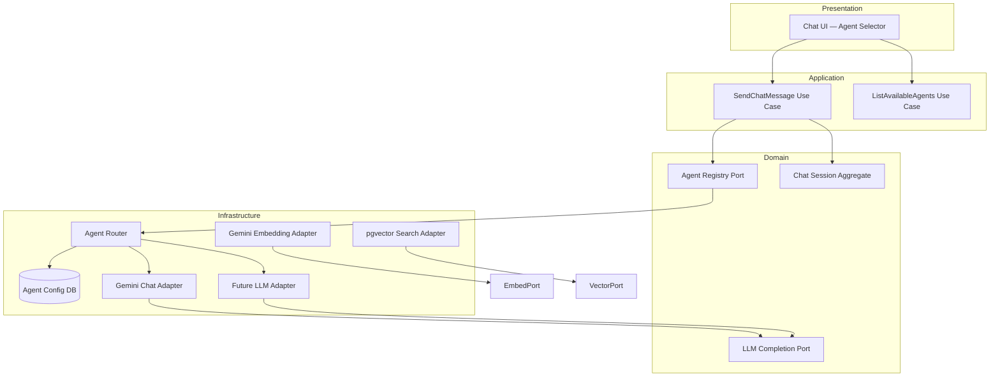
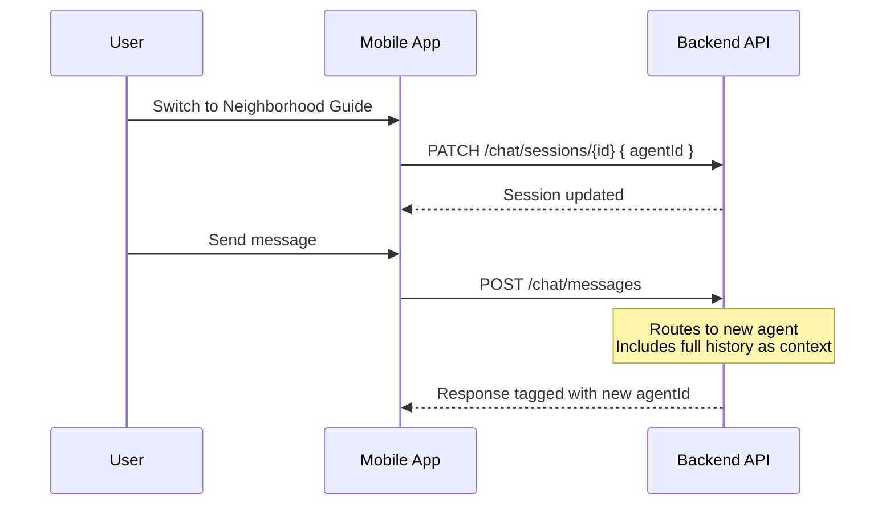
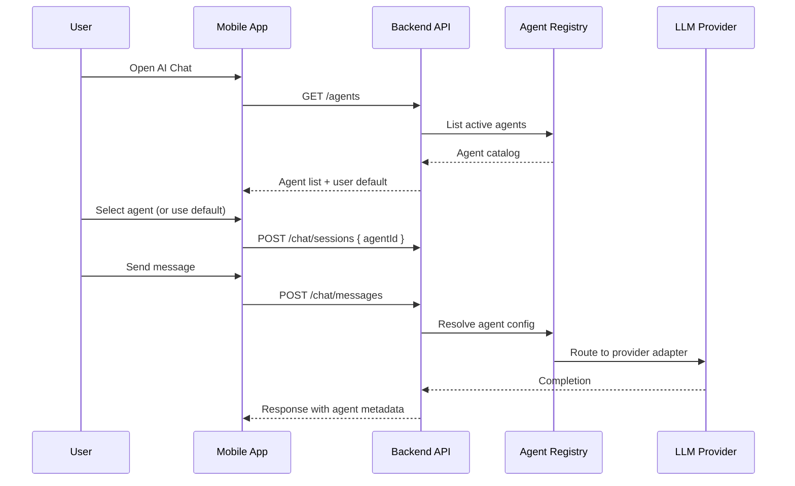

# AI Provider Strategy

> Pluggable, user-selectable AI agents for chat and recommendations.

## Document Status

| Field | Value |
|-------|-------|
| Version | 1.0.0 |
| Status | Draft |
| Last Updated | 2026-06-03 |

## Decision Summary

| Decision | Choice |
|----------|--------|
| LLM provider (MVP) | **Google Gemini** |
| Embeddings | **Gemini text-embedding-004** |
| Vector store | **pgvector** (PostgreSQL) |
| AI approach | **Custom pluggable agent system** |
| User control | Users **select which agent** to use per chat session (default persisted in profile) |
| Admin control | Platform admins configure available agents, models, and provider credentials |
| MVP agents | **Search**, **Recommendation**, **Booking**, **Follow-up** — see [ai_agent_architecture.md](./ai_agent_architecture.md) |

## Goals

1. **Provider independence** — Swap or add LLM backends without changing domain logic
2. **User choice** — Let users pick the agent best suited to their task
3. **Specialization** — Each agent has distinct system prompts, tools, and knowledge scope
4. **Operational flexibility** — Route agents to different models based on cost, latency, or capability
5. **Graceful fallback** — Degrade to a default agent when a provider is unavailable

## Architecture — Pluggable Agent Pattern



## Core Concepts

### AI Agent (Domain Entity)

An **AI Agent** is a platform-defined assistant persona, not a raw LLM model.

| Field | Description |
|-------|-------------|
| `id` | Unique identifier (e.g., `property-assistant`) |
| `name` | Display name (localized: ar-EG, en) |
| `description` | Short description shown in agent picker |
| `systemPrompt` | Base instructions defining behavior and guardrails |
| `providerId` | Which LLM provider adapter to use |
| `modelId` | Model identifier within that provider |
| `tools` | Allowed tool set (search properties, get neighborhood info, etc.) |
| `isDefault` | Whether this is the fallback agent |
| `isActive` | Admin can enable/disable without deleting |
| `supportedLocales` | e.g., `["ar-EG", "en"]` |

### User Agent Preference

- Stored in user profile: `preferredAgentId`
- Default used when starting a new chat session
- **Mid-session switching allowed** — user can change agent without starting a new session

### Mid-Session Agent Switching

When a user switches agents during an active chat:

1. Client calls `PATCH /chat/sessions/{id}` with new `agentId`
2. Server validates agent is active
3. Subsequent messages route to the new agent's provider, prompt, and tools
4. **Conversation history is preserved** — new agent receives prior messages as context
5. Each message record stores `agentId` so the UI shows which agent sent each reply
6. Optional: inject a system notice ("You are now speaking with Neighborhood Guide")



### Provider Adapter (Infrastructure Port)

```typescript
// Conceptual interface — implementation detail for api_design phase
interface LLMCompletionPort {
  complete(request: CompletionRequest): Promise<CompletionResponse>;
  embed?(text: string): Promise<number[]>;
}

interface CompletionRequest {
  modelId: string;
  systemPrompt: string;
  messages: Message[];
  tools?: ToolDefinition[];
  temperature?: number;
  maxTokens?: number;
}
```

Each provider (OpenAI, Anthropic, custom HTTP endpoint, self-hosted Ollama) implements `LLMCompletionPort`.

## Agent Catalog (MVP Proposal)

| Agent ID | Name | Provider (MVP) | Model |
|----------|------|----------------|-------|
| `search-agent` | Search Agent | **Gemini** | `gemini-2.0-flash` |
| `recommendation-agent` | Recommendation Agent | **Gemini** | `gemini-2.0-flash` |
| `booking-agent` | Booking Agent | **Gemini** | `gemini-2.0-flash` |
| `follow-up-agent` | Follow-up Agent | **Gemini** | `gemini-2.0-flash` |

> Full agent specs: [ai_agent_architecture.md](./ai_agent_architecture.md)

Additional agents can be added by admin without mobile app updates (fetched via API).

## User Flow — Agent Selection



## Configuration Management

| Config Level | Managed By | Storage |
|--------------|------------|---------|
| Provider credentials | Admin | Environment / secrets manager |
| Agent definitions | Admin | PostgreSQL `ai_agents` table |
| User default agent | User | Profile preference |
| Session agent | User | Chat session record |

Admin API (future): CRUD for agents, enable/disable, assign provider + model.

## Security & Guardrails

- **All agents** share platform-wide guardrails: fair housing, no discriminatory advice, PII redaction
- Agent-specific prompts **cannot** override safety policies (applied as outer wrapper)
- Provider API keys never exposed to mobile client
- Rate limiting per user and per agent
- Audit log: agent used, provider, token count, latency

## Egypt Market Considerations

- Agents must support **Arabic (ar-EG)** and **English** responses
- System prompts include Egypt-specific context: EGP pricing, governorates, common property types (شقة، فيلا، duplex)
- Neighborhood agent grounded in Egyptian cities: Cairo, Giza, Alexandria, etc.
- Compliance with Egypt Personal Data Protection Law (Law No. 151 of 2020)

## Failure Modes

| Scenario | Behavior |
|----------|----------|
| Selected agent disabled | Fall back to platform default agent; notify user |
| Provider unavailable | Retry once; fall back to default agent on alternate provider if configured |
| All providers down | Return cached FAQ response or graceful error; no silent failure |
| Agent not found | 400 with list of valid agents |

## Relationship to Recommendations

Recommendations may use a separate **internal scoring agent** or embedding model — not user-selectable. User-selectable agents apply to **AI Chat** only for MVP.

## Resolved Decisions

| Question | Decision |
|----------|----------|
| Mid-session agent switching | ✅ Allowed — history preserved, messages tagged by agent |
| LLM provider | ✅ **Google Gemini** |
| Vector store | ✅ **pgvector** (PostgreSQL) |
| Embeddings | ✅ **Gemini text-embedding-004** |
| Admin agent management at MVP | Seed agents via migration; admin UI deferred |

## Resolved — Production AI Runtime

| Environment | Gemini access |
|-------------|---------------|
| Local dev | AI Studio (`GEMINI_API_KEY`) optional |
| Staging / Production | **Vertex AI** (`@google-cloud/vertexai`) — see [deployment_architecture.md](./deployment_architecture.md) |

## Open Questions

1. Gemini model per agent (all `gemini-2.0-flash` vs pro for Buying Advisor)
2. Streaming chat responses — ✅ SSE via [Gemini Integration Layer](./gemini_integration_layer.md)

## Related Documents

- [Deployment Architecture](./deployment_architecture.md)
- [Gemini Integration Layer](./gemini_integration_layer.md)
- [AI Agent Architecture](./ai_agent_architecture.md)
- [AI Services Architecture](./ai_services_architecture.md)
- [System Design](./system_design.md)
- [Clean Architecture](./clean_architecture.md)
- [AI Chat Feature](../features/ai_chat/README.md)
- [Requirements](../specs/requirements.md)

## Approval

| Role | Name | Date | Status |
|------|------|------|--------|
| Product Owner | — | — | Pending |
| Tech Lead | — | — | Pending |
