# AI Services Architecture

> Gemini-powered AI layer with pgvector RAG and pluggable agent system.

## Document Status

| Field | Value |
|-------|-------|
| Version | 1.0.0 |
| Status | Draft |
| Last Updated | 2026-06-03 |
| LLM Provider | **Google Gemini** |
| Embeddings | **Gemini Embedding API** |
| Vector Store | **pgvector** (PostgreSQL extension) |
| Pattern | Pluggable agents + RAG |

---

## 1. Overview

AI services run **inside the NestJS backend** as an infrastructure module — not a separate microservice for MVP. The system uses **Google Gemini** for chat completions and embeddings, with **pgvector** for retrieval-augmented generation (RAG) over property listings.

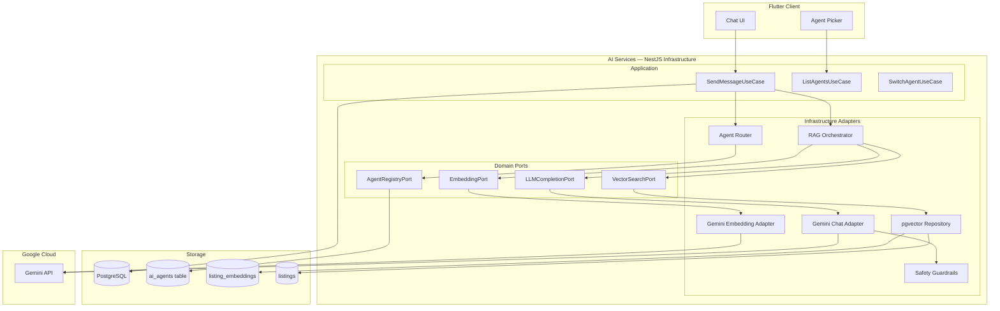

---

## 2. Design Principles

| Principle | Implementation |
|-----------|----------------|
| **Provider abstraction** | Domain defines `LLMCompletionPort` — Gemini is one adapter |
| **Agent ≠ Model** | Agent = persona + prompt + tools; model configured per agent |
| **RAG grounding** | Property answers must cite pgvector-retrieved listings |
| **Vectors in PostgreSQL** | pgvector avoids separate vector DB operational overhead |
| **Safety first** | Fair housing guardrails wrap every Gemini call |
| **User choice** | User selects agent; mid-session switch supported |

---

## 3. Component Architecture

```mermaid
flowchart LR
    subgraph input [Input]
        UserMsg[User Message]
        Session[Chat Session Context]
        AgentConfig[Agent Config]
    end

    subgraph rag [RAG Pipeline]
        QueryEmbed[Embed Query — Gemini]
        VectorSearch[pgvector Similarity Search]
        ContextBuilder[Context Builder]
        ListingCards[Listing Context Block]
    end

    subgraph generation [Generation]
        PromptBuilder[System + User + RAG Context]
        GeminiCall[Gemini generateContent]
        ToolCall[Function Calling — optional]
        ResponseParse[Parse Response]
    end

    subgraph output [Output]
        Guardrails[Fair Housing Filter]
        Persist[Persist Message + agentId]
        ClientResponse[JSON to Mobile]
    end

    UserMsg --> QueryEmbed
    QueryEmbed --> VectorSearch
    VectorSearch --> ContextBuilder
    ContextBuilder --> ListingCards
    ListingCards --> PromptBuilder
    Session --> PromptBuilder
    AgentConfig --> PromptBuilder
    PromptBuilder --> GeminiCall
    GeminiCall --> ToolCall
    ToolCall --> ResponseParse
    ResponseParse --> Guardrails
    Guardrails --> Persist
    Persist --> ClientResponse
```

---

## 4. Gemini Integration

> Full design: [gemini_integration_layer.md](./gemini_integration_layer.md) — streaming, function/tool calling, memory, context, safety, prompt versioning.

### 4.1 Models (Proposed)

| Use Case | Gemini Model | Notes |
|----------|--------------|-------|
| Chat — Property Assistant | `gemini-2.0-flash` | Fast, cost-effective |
| Chat — Neighborhood Guide | `gemini-2.0-flash` | Same model, different prompt |
| Chat — Buying Advisor | `gemini-2.0-flash` | Egypt legal disclaimer in prompt |
| Embeddings | `text-embedding-004` | 768-dim vectors for pgvector |
| Recommendations (internal) | Embedding similarity | No user-facing LLM call |

### 4.2 Domain Ports

```typescript
// Conceptual — domain layer (no Gemini imports)

interface LLMCompletionPort {
  complete(request: CompletionRequest): Promise<CompletionResponse>;
}

interface EmbeddingPort {
  embed(text: string): Promise<number[]>;
  embedBatch(texts: string[]): Promise<number[][]>;
}

interface VectorSearchPort {
  searchSimilar(
    embedding: number[],
    filters: SearchFilters,
    limit: number,
  ): Promise<SimilarListing[]>;
}

interface CompletionRequest {
  modelId: string;
  systemPrompt: string;
  messages: ChatMessage[];
  tools?: ToolDefinition[];
  temperature?: number;
  maxOutputTokens?: number;
}
```

### 4.3 Gemini Adapter (Infrastructure)

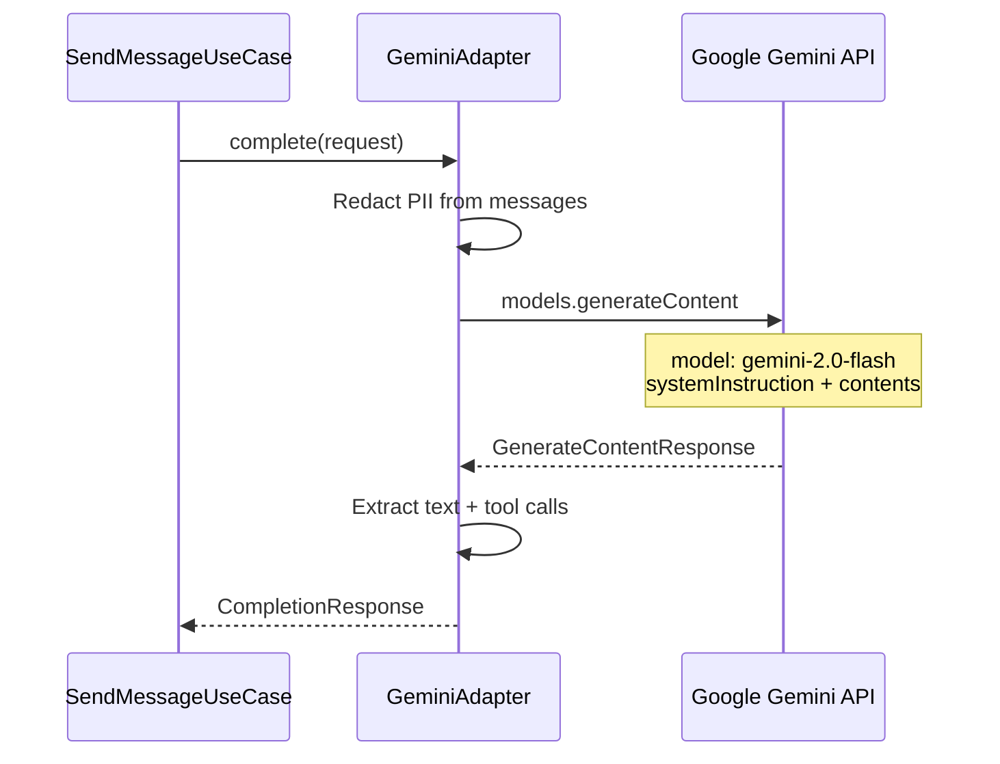

| Concern | Handling |
|---------|----------|
| API key | `GEMINI_API_KEY` in secrets manager |
| Retries | 2 retries with exponential backoff on 429/503 |
| Timeout | 30s chat, 10s embedding |
| Token limits | Trim RAG context to fit model window |
| Streaming | SSE via `GeminiStreamHandler` — see [gemini_integration_layer.md](./gemini_integration_layer.md) §3 |

---

## 5. pgvector — Vector Database

### 5.1 Why pgvector in PostgreSQL

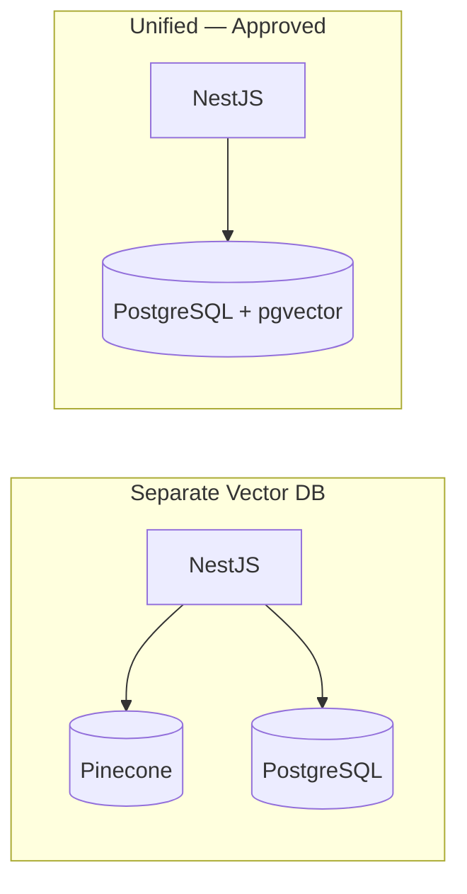

| Benefit | Detail |
|---------|--------|
| Single database | Listings + embeddings co-located — JOIN filters + vectors in one query |
| ACID transactions | Upsert listing + embedding atomically |
| Operational simplicity | No extra vector DB to manage for MVP |
| Prisma + raw SQL | Prisma for CRUD; `$queryRaw` for vector ops |

### 5.2 Schema

```sql
-- Enable extension
CREATE EXTENSION IF NOT EXISTS vector;

CREATE TABLE listing_embeddings (
    listing_id    UUID PRIMARY KEY REFERENCES listings(id) ON DELETE CASCADE,
    embedding     vector(768) NOT NULL,
    model_version TEXT NOT NULL DEFAULT 'text-embedding-004',
    embedded_at   TIMESTAMPTZ NOT NULL DEFAULT NOW()
);

-- HNSW index for fast approximate nearest neighbor
CREATE INDEX listing_embeddings_hnsw_idx
    ON listing_embeddings
    USING hnsw (embedding vector_cosine_ops);
```

### 5.3 Embedding Pipeline

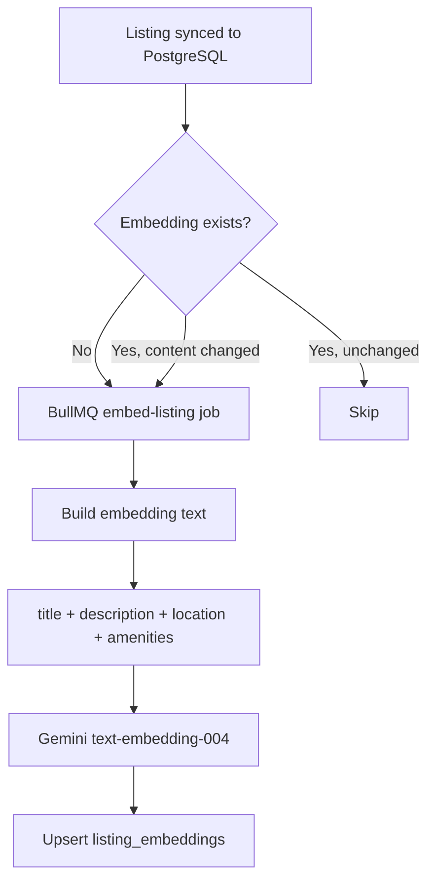

**Embedding text template:**
```
{title}. {description}. {propertyType} in {district}, {city}, {governorate}.
{bedrooms} bedrooms, {areaSqm} sqm, {priceEgp} EGP, {listingType}.
Amenities: {amenities joined}.
```

### 5.4 Vector Search Query

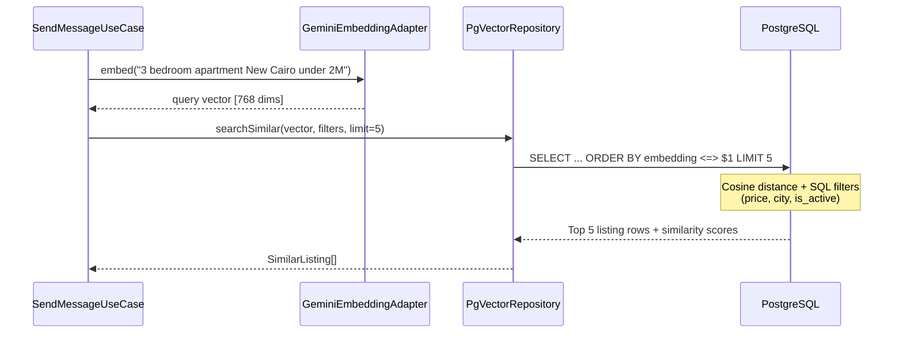

```sql
-- Conceptual similarity search with filters
SELECT l.*, (le.embedding <=> $1::vector) AS distance
FROM listings l
JOIN listing_embeddings le ON le.listing_id = l.id
WHERE l.is_active = true
  AND l.price_egp <= $2
  AND l.location->>'city' = $3
ORDER BY le.embedding <=> $1::vector
LIMIT 5;
```

---

## 6. RAG Flow — End to End

> Full RAG design: [rag_architecture.md](./rag_architecture.md) — chunking, embedding, retrieval, caching, evaluation.

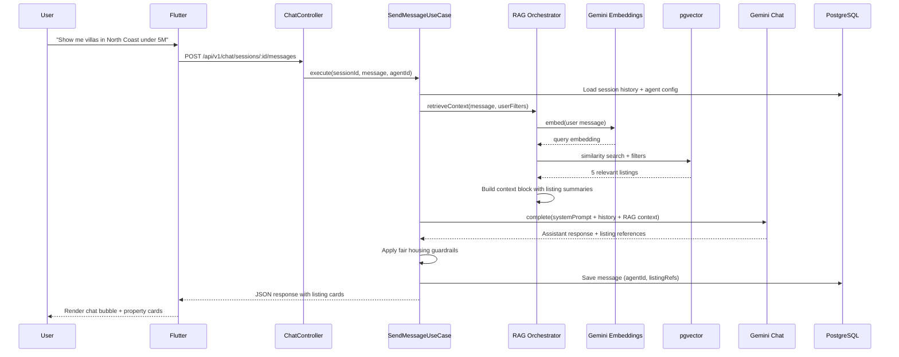

---

## 7. Agent System

### 7.1 Agent Catalog (MVP)

| Agent ID | Name | Purpose |
|----------|------|---------|
| `search-agent` | Search Agent | Natural language + structured property search |
| `recommendation-agent` | Recommendation Agent | Personalized suggestions + feedback |
| `booking-agent` | Booking Agent | Viewing appointment scheduling |
| `follow-up-agent` | Follow-up Agent | Reminders and post-viewing next steps |

See [ai_agent_architecture.md](./ai_agent_architecture.md) for full specs, tools, prompts, and failure handling.

### 7.2 Agent Router

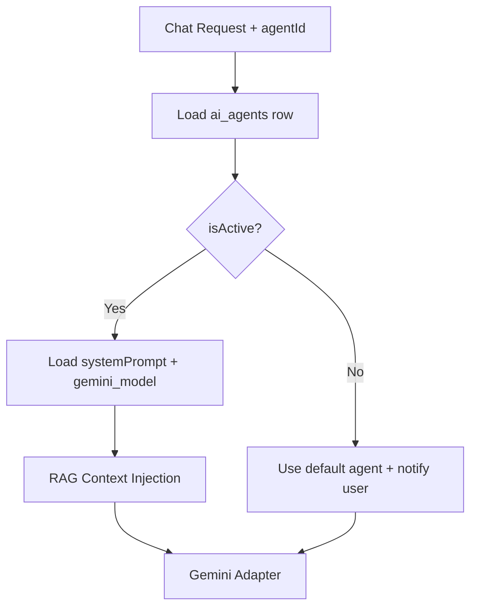

### 7.3 Mid-Session Agent Switch

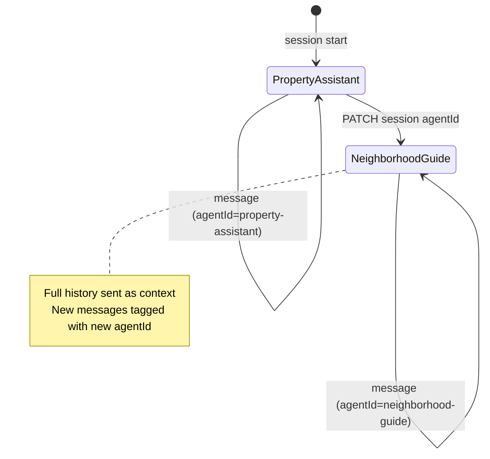

---

## 8. Safety & Guardrails

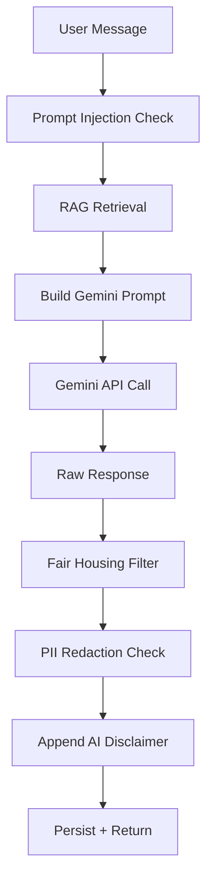

| Guardrail | Action |
|-----------|--------|
| Discriminatory request | Refuse; return fair housing policy message |
| Prompt injection | Strip system override patterns; sandbox RAG context |
| PII in outbound prompt | Redact phone/email before Gemini call |
| Hallucinated listing | RAG context required for property claims; cite listing IDs |
| Legal/financial advice | Buying Advisor includes "not legal advice" disclaimer |
| AI disclaimer | Every response includes short disclaimer (ar/en) |

---

## 9. Recommendations (Embedding-Based)

Recommendations use the same pgvector infrastructure — no separate ML service for MVP.

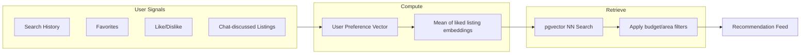

---

## 10. Failure Modes

| Scenario | Behavior |
|----------|----------|
| Gemini API 429 rate limit | Retry 2x; return "AI busy, try again" |
| Gemini API 503 | Retry 1x; degrade gracefully |
| Embedding failure | Skip RAG; Gemini responds with general advice + warning |
| pgvector empty (new listing) | Background job pending; exclude from RAG until embedded |
| Agent disabled mid-session | Fallback to default agent; notify user |
| Daily message limit reached | 429 to client with reset time |

---

## 11. Observability

> Full strategy: [monitoring_strategy.md](./monitoring_strategy.md).

| Metric | Purpose |
|--------|---------|
| `gemini.chat.latency_ms` | p50/p95 response time |
| `gemini.chat.tokens_input/output` | Cost tracking |
| `gemini.embed.latency_ms` | Embedding pipeline health |
| `pgvector.search.latency_ms` | RAG retrieval performance |
| `rag.listings_retrieved_count` | Context quality |
| `ai.guardrail.refusal_count` | Fair housing blocks |

Structured logs include: `sessionId`, `agentId`, `model`, `listingIds[]`, `correlationId` — never log full prompts in production.

---

## 12. Environment Variables

| Variable | Purpose |
|----------|---------|
| `GEMINI_API_KEY` | Google AI Studio / Vertex API key |
| `GEMINI_CHAT_MODEL` | Default model override |
| `GEMINI_EMBED_MODEL` | Default embedding model |
| `PGVECTOR_DIMENSIONS` | 768 (match embedding model) |
| `RAG_TOP_K` | Listings retrieved per query (default: 5) |
| `AI_DAILY_MESSAGE_LIMIT` | Free tier limit (default: 10) |

---

## 13. Related Documents

| Document | Path |
|----------|------|
| Monitoring Strategy | [monitoring_strategy.md](./monitoring_strategy.md) |
| Gemini Integration Layer | [gemini_integration_layer.md](./gemini_integration_layer.md) |
| AI Provider Strategy | [ai_provider_strategy.md](./ai_provider_strategy.md) |
| Backend Architecture | [backend_architecture.md](./backend_architecture.md) |
| Flutter Architecture | [flutter_architecture.md](./flutter_architecture.md) |
| System Design | [system_design.md](./system_design.md) |

## Approval

| Role | Name | Date | Status |
|------|------|------|--------|
| Tech Lead | — | — | Pending |
| AI/ML Lead | — | — | Pending |
