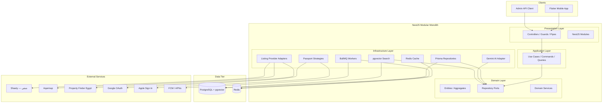
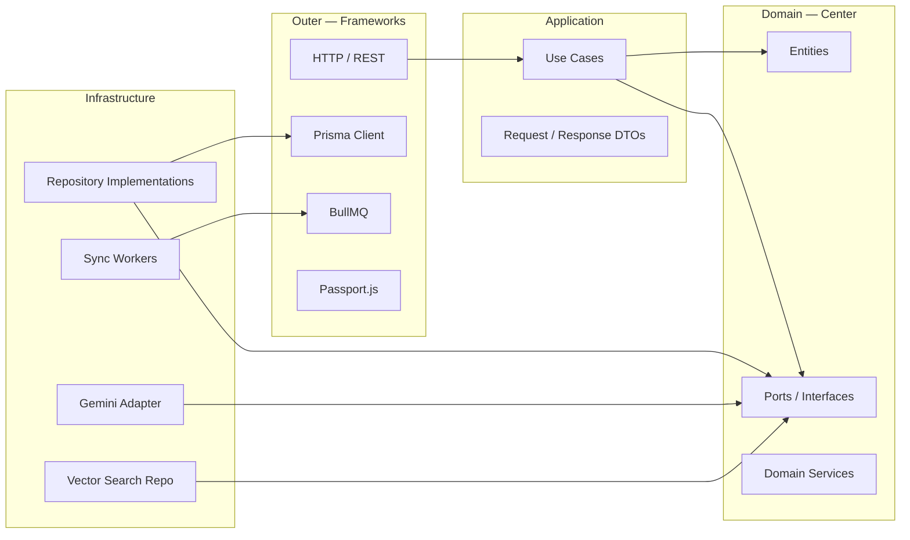
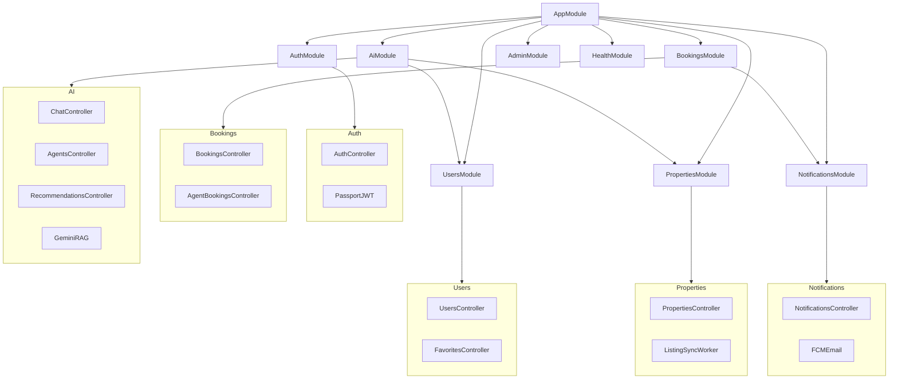
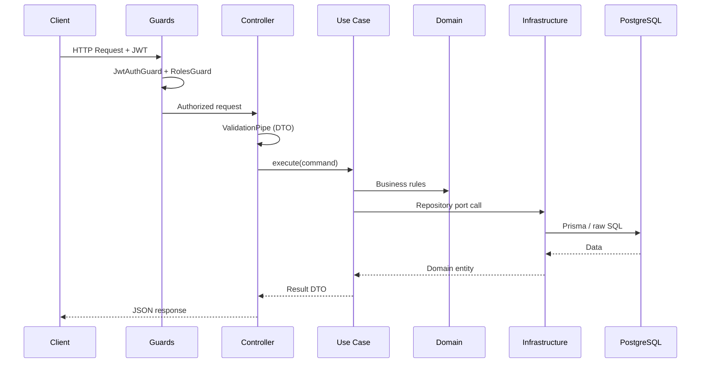
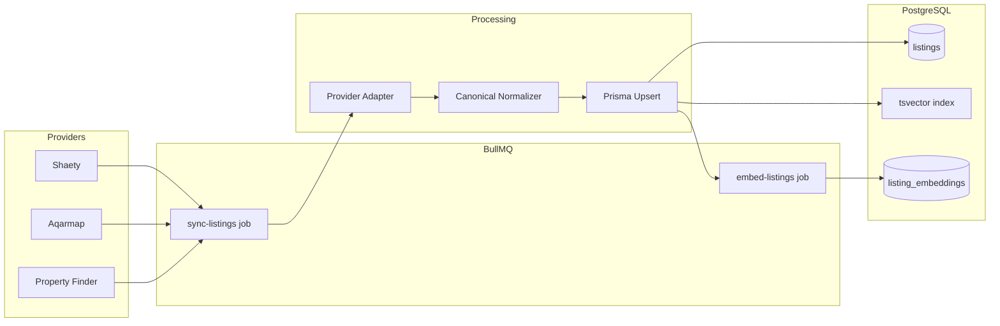
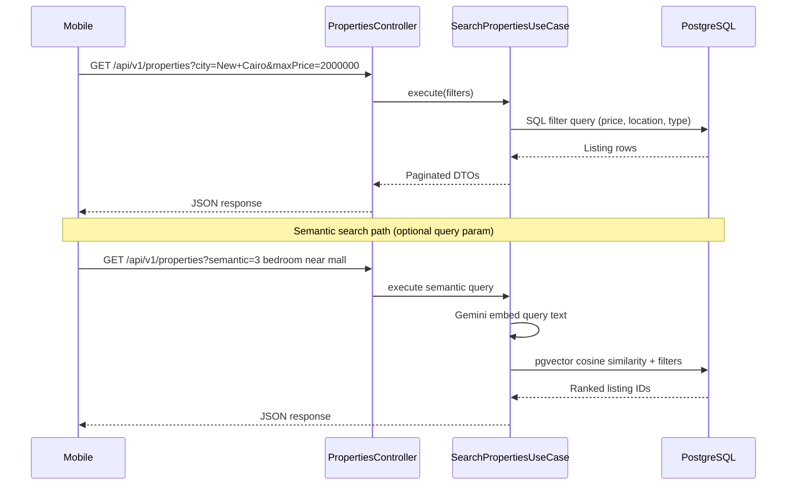
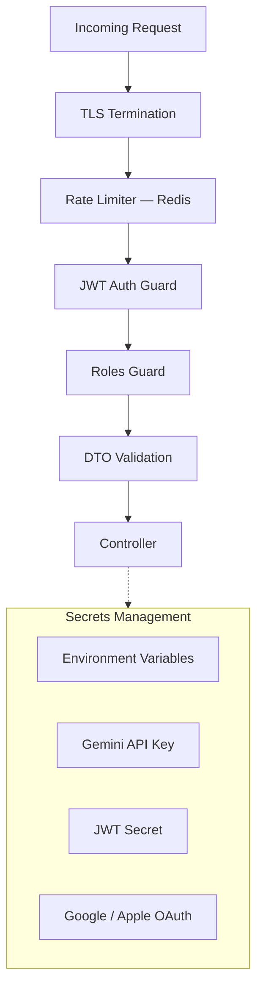
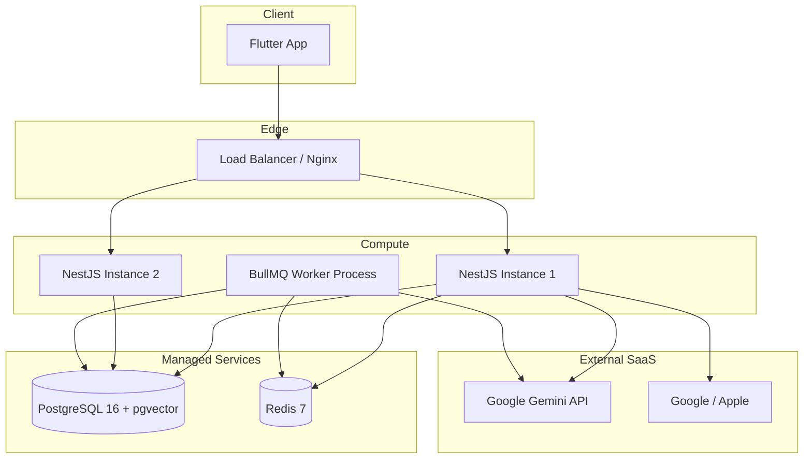

# Backend Architecture

> NestJS modular monolith with Clean Architecture and PostgreSQL.

## Document Status

| Field | Value |
|-------|-------|
| Version | 1.1.0 |
| Status | Draft |
| Last Updated | 2026-06-03 |
| Project structure | [../backend/PROJECT_STRUCTURE.md](../backend/PROJECT_STRUCTURE.md) |
| Runtime | Node.js LTS |
| Framework | NestJS |
| Database | PostgreSQL + Prisma |
| Vector Store | pgvector (PostgreSQL extension) |
| API Style | REST JSON `/api/v1/*` |

---

## 1. Overview

The backend is a **modular monolith** — one deployable NestJS application organized by bounded context. Business logic lives in framework-free `domain/` and `application/` layers; NestJS modules in `presentation/` are thin HTTP adapters.



---

## 2. Layer Architecture



### Dependency Rule

| Layer | May Import | Must NOT Import |
|-------|------------|-----------------|
| `domain/` | Nothing external | NestJS, Prisma, Gemini SDK |
| `application/` | `domain/` | NestJS decorators, Prisma |
| `infrastructure/` | `domain/`, `application/` | NestJS controllers |
| `presentation/` | All layers (wiring only) | — |

---

## 3. Project Structure

Full folder tree: **[backend/PROJECT_STRUCTURE.md](../backend/PROJECT_STRUCTURE.md)**

```
backend/src/
├── domain/           # auth | users | properties | bookings | ai | notifications
├── application/      # use-cases + app DTOs per module
├── infrastructure/   # prisma, gemini, rag, passport, queue, fcm, email
└── presentation/     # NestJS modules (Auth, Users, Properties, Bookings, AI, Notifications)
```

---

## 4. NestJS Module Map



| NestJS Module | Presentation | Domain | Primary use cases |
|---------------|--------------|--------|-------------------|
| **Auth** | `auth.controller` | `domain/auth` | Register, login, OAuth, refresh, password reset |
| **Users** | `users.controller`, `favorites.controller` | `domain/users` | Profile, preferences, favorites, account delete |
| **Properties** | `properties.controller` | `domain/properties` | Search, detail, listing sync |
| **Bookings** | `bookings.controller`, `agent-bookings.controller` | `domain/bookings` | Request, confirm, cancel, availability |
| **AI** | `chat`, `agents`, `recommendations` controllers | `domain/ai` | Chat, RAG, agents, recommendations |
| **Notifications** | `notifications.controller` | `domain/notifications` | Push, email, preferences |
| **Admin** | `admin.controller` | cross-cutting | Sync status, agent toggle |

---

## 5. Request Lifecycle



---

## 6. PostgreSQL Data Architecture

```mermaid
erDiagram
    users ||--o{ refresh_tokens : has
    users ||--o{ chat_sessions : owns
    users ||--o{ bookings : requests
    users ||--o{ favorites : saves
    users ||--o{ user_preferences : has

    listings ||--o{ listing_embeddings : has
    listings ||--o{ favorites : referenced
    listings ||--o{ bookings : referenced

    chat_sessions ||--o{ chat_messages : contains
    ai_agents ||--o{ chat_sessions : assigned
    ai_agents ||--o{ chat_messages : generated

    agents ||--|| users : extends
    agents ||--o{ bookings : manages
    agents ||--o{ agent_availability : sets

    users {
        uuid id PK
        string email UK
        string password_hash
        enum role
        string locale
        uuid preferred_agent_id FK
        timestamp created_at
    }

    listings {
        uuid id PK
        string external_id
        enum provider
        decimal price_egp
        jsonb location
        tsvector search_vector
        boolean is_active
    }

    listing_embeddings {
        uuid listing_id PK_FK
        vector embedding
        string model_version
        timestamp embedded_at
    }

    ai_agents {
        string id PK
        jsonb name_i18n
        text system_prompt
        string gemini_model
        boolean is_active
    }
```

### Storage Split

| Data Type | Storage | Access |
|-----------|---------|--------|
| Users, bookings, chat, agents | PostgreSQL tables | Prisma |
| Full-text search (keywords) | PostgreSQL `tsvector` | Prisma raw SQL |
| Semantic / similarity search | **pgvector** `listing_embeddings` | Vector cosine query |
| Session cache, rate limits | Redis | ioredis |
| Job queues | Redis (BullMQ) | BullMQ |

---

## 7. Listing Sync Pipeline



---

## 8. Property Search Flow



---

## 9. Security Architecture



| Concern | Implementation |
|---------|----------------|
| Authentication | Passport.js — local, Google, Apple |
| Tokens | JWT access (15 min) + refresh rotation |
| Authorization | `@Roles('buyer', 'agent', 'admin')` + domain checks |
| Password hashing | bcrypt cost ≥ 12 |
| Input validation | `class-validator` on all DTOs |
| Rate limiting | `@nestjs/throttler` + Redis |
| CORS | Whitelist mobile app origins |

---

## 10. Background Jobs (BullMQ)

| Queue | Job | Schedule | Purpose |
|-------|-----|----------|---------|
| `listing-sync` | `sync-provider` | Every 30 min | Ingest Shaety, Aqarmap, PF |
| `embeddings` | `embed-listing` | On listing upsert | Generate + store pgvector embedding |
| `recommendations` | `recompute-user` | On behavior change | Update recommendation scores |
| `notifications` | `send-push` | Event-driven | FCM/APNs dispatch |
| `notifications` | `send-email` | Event-driven | Booking, auth emails |

---

## 11. Deployment Topology



---

## 12. Technology Stack

| Component | Technology |
|-----------|------------|
| Runtime | Node.js 20 LTS |
| Framework | NestJS 10 |
| ORM | Prisma |
| Database | PostgreSQL 16 |
| Vector extension | pgvector |
| Cache / Queue | Redis 7 + BullMQ |
| Auth | Passport + JWT |
| Validation | class-validator + class-transformer |
| API docs | Swagger (dev/staging only) |
| Testing | Jest + Supertest |

---

## 13. Related Documents

| Document | Path |
|----------|------|
| Flutter Architecture | [flutter_architecture.md](./flutter_architecture.md) |
| AI Services Architecture | [ai_services_architecture.md](./ai_services_architecture.md) |
| Listing Providers | [listing_providers.md](./listing_providers.md) |
| System Design | [system_design.md](./system_design.md) |

## Approval

| Role | Name | Date | Status |
|------|------|------|--------|
| Tech Lead | — | — | Pending |
| Backend Lead | — | — | Pending |
