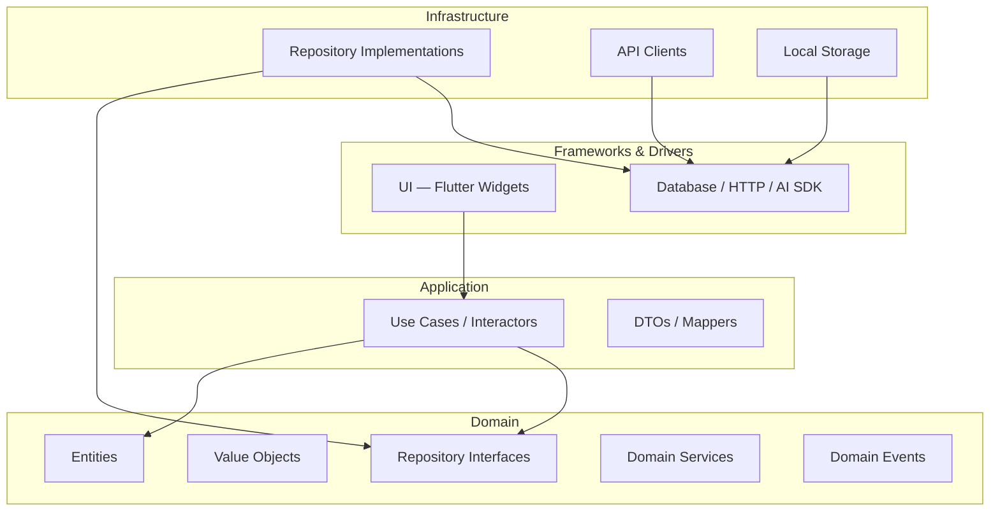
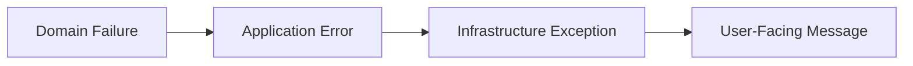

# Clean Architecture

> Layer rules, dependency direction, and project layout for backend and mobile.

## Document Status

| Field | Value |
|-------|-------|
| Version | 1.0.0 |
| Status | Draft |
| Last Updated | 2026-06-03 |

## Core Principle

**Dependencies point inward.** Outer layers depend on inner layers. The domain layer depends on nothing.



## Layer Responsibilities

### Domain (innermost)

- Pure business logic — no framework imports
- Entities, value objects, aggregates, domain events
- Repository **interfaces** (ports)
- Domain services for cross-entity rules
- **Zero** dependencies on Flutter, HTTP, SQL, or AI SDKs

### Application

- Use cases orchestrating domain objects
- Input/output boundaries (commands, queries, presenters)
- Transaction boundaries
- Depends **only** on domain

### Infrastructure

- Repository implementations
- API clients, database mappers, cache adapters
- AI provider adapters
- Implements domain ports; depends on application + domain

### Presentation (UI)

- Flutter widgets, screens, view models / controllers
- Navigation, theming, localization
- Calls use cases; never accesses infrastructure directly

## SOLID Mapping

| Principle | Application |
|-----------|-------------|
| **S** — Single Responsibility | One use case per application service; one reason to change per class |
| **O** — Open/Closed | Extend via new use cases and adapters, not by modifying domain |
| **L** — Liskov Substitution | Repository implementations interchangeable in tests |
| **I** — Interface Segregation | Small repository ports per aggregate, not god-interfaces |
| **D** — Dependency Inversion | Domain defines ports; infrastructure implements them |

## Backend Folder Structure (NestJS)

```
backend/
├── src/
│   ├── domain/                     # Pure TS — no Nest imports
│   │   ├── authentication/
│   │   ├── property/
│   │   ├── chat/
│   │   ├── recommendation/
│   │   ├── booking/
│   │   └── profile/
│   ├── application/                # Use cases
│   │   ├── authentication/
│   │   ├── property/
│   │   ├── chat/
│   │   ├── recommendation/
│   │   ├── booking/
│   │   └── profile/
│   ├── infrastructure/
│   │   ├── persistence/            # Prisma repositories
│   │   ├── vector/                   # pgvector search + embeddings
│   │   ├── listings/               # Shaety, Aqarmap, Property Finder adapters
│   │   ├── ai/                       # Gemini adapter + agent router
│   │   ├── auth/                     # Passport strategies (Google, Apple, local)
│   │   ├── cache/                    # Redis
│   │   ├── queue/                    # BullMQ workers
│   │   └── notifications/
│   └── presentation/               # NestJS modules
│       ├── auth/
│       ├── properties/
│       ├── chat/
│       ├── agents/                   # GET /agents — agent catalog
│       ├── recommendations/
│       ├── bookings/
│       └── profile/
├── test/
│   ├── unit/
│   ├── integration/
│   └── e2e/
└── docs/
```

### NestJS Module Mapping

| Bounded Context | NestJS Module | Domain Package |
|-----------------|---------------|----------------|
| Identity & Access | `AuthModule` | `domain/authentication` |
| Property Catalog | `PropertiesModule` | `domain/property` |
| Conversational AI | `ChatModule`, `AgentsModule` | `domain/chat` |
| Personalization | `RecommendationsModule` | `domain/recommendation` |
| Scheduling | `BookingsModule` | `domain/booking` |
| User Profile | `ProfileModule` | `domain/profile` |

Domain and application layers remain **framework-free**. NestJS decorators and modules exist only in `presentation/` and `infrastructure/` wiring.

## Mobile Folder Structure (Proposed)

```
mobile/
├── lib/
│   ├── core/
│   │   ├── error/
│   │   ├── network/
│   │   ├── theme/
│   │   └── routing/
│   ├── features/
│   │   ├── authentication/
│   │   │   ├── domain/
│   │   │   ├── data/
│   │   │   └── presentation/
│   │   ├── property_search/
│   │   ├── ai_chat/
│   │   ├── recommendation/
│   │   ├── booking/
│   │   └── profile/
│   └── main.dart
├── test/
│   ├── unit/
│   ├── widget/
│   └── integration/
└── docs/
```

## Feature Module Layout (Mobile)

Each feature under `mobile/lib/features/<name>/`:

```
<feature>/
├── domain/
│   ├── entities/
│   ├── repositories/       # abstract interfaces
│   └── usecases/
├── data/
│   ├── models/
│   ├── datasources/
│   └── repositories/       # implementations
└── presentation/
    ├── pages/
    ├── widgets/
    └── providers/          # or view models
```

## Dependency Rules

| From | To | Allowed |
|------|----|---------|
| presentation | application, domain | ✅ |
| application | domain | ✅ |
| infrastructure | application, domain | ✅ |
| domain | anything outer | ❌ |
| presentation | infrastructure | ❌ (inject via DI) |

## Dependency Injection

- **Backend**: Constructor injection; wire in composition root (`main` / bootstrap module)
- **Mobile**: Manual constructor injection or lightweight DI (Provider / get_it — TBD at implementation)
- All use cases receive interfaces, never concrete implementations

## Error Handling



- Domain: typed failures (`InvalidCredentials`, `PropertyNotFound`)
- Application: map domain failures to result types
- Infrastructure: catch SDK/HTTP errors, map to domain failures
- Presentation: display friendly messages; log technical details

## Testing Strategy by Layer

| Layer | Test Type | Focus |
|-------|-----------|-------|
| Domain | Unit | Business rules, invariants, value object validation |
| Application | Unit | Use case orchestration with fake repositories |
| Infrastructure | Integration | DB queries, API contracts, AI adapter mocks |
| Presentation | Widget / Integration | UI states, navigation, user flows |
| End-to-end | Integration | Critical paths across API + mobile |

## Mapping Specs to Code

| Spec Artifact | Code Location |
|---------------|---------------|
| `features/<name>/requirements.md` | Domain entities + use cases |
| `features/<name>/data_model.md` | Domain + infrastructure mappers |
| `features/<name>/api_design.md` | Presentation controllers + mobile data sources |
| `features/<name>/tests.md` | `tests/` directories |

## Implementation Gate

No code in `backend/` or `mobile/` until:

1. Feature specs (requirements → tests) are complete
2. Architecture documents are approved
3. Explicit approval received to begin implementation

## Related Documents

| Document | Path |
|----------|------|
| System Design | [system_design.md](./system_design.md) |
| Flutter Architecture | [flutter_architecture.md](./flutter_architecture.md) |
| Backend Architecture | [backend_architecture.md](./backend_architecture.md) |
| AI Services Architecture | [ai_services_architecture.md](./ai_services_architecture.md) |
| AI Provider Strategy | [ai_provider_strategy.md](./ai_provider_strategy.md) |
| Requirements | [../specs/requirements.md](../specs/requirements.md) |
| Roadmap | [../tasks/roadmap.md](../tasks/roadmap.md) |

## Approval

| Role | Name | Date | Status |
|------|------|------|--------|
| Tech Lead | — | — | Pending |
| Architect | — | — | Pending |
