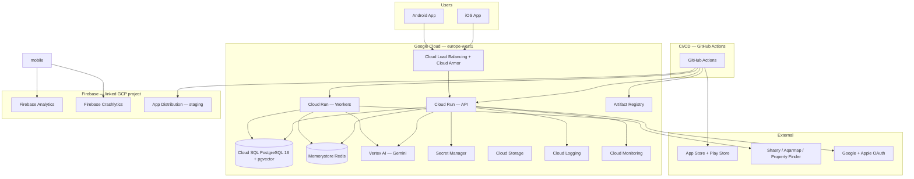
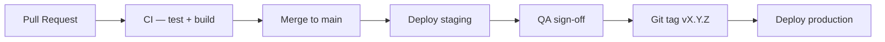
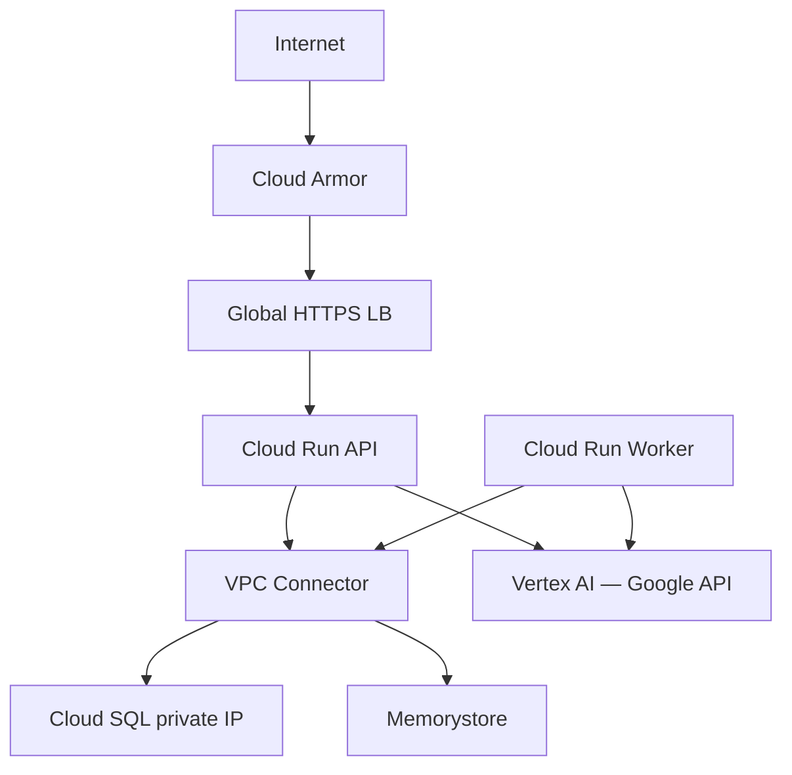
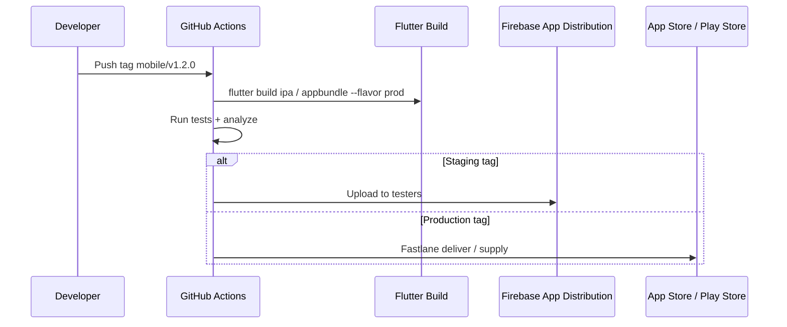
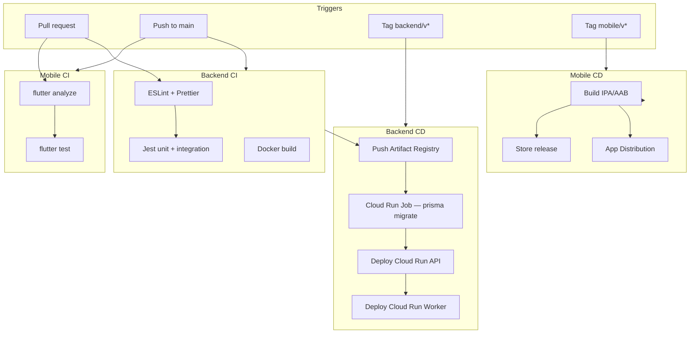
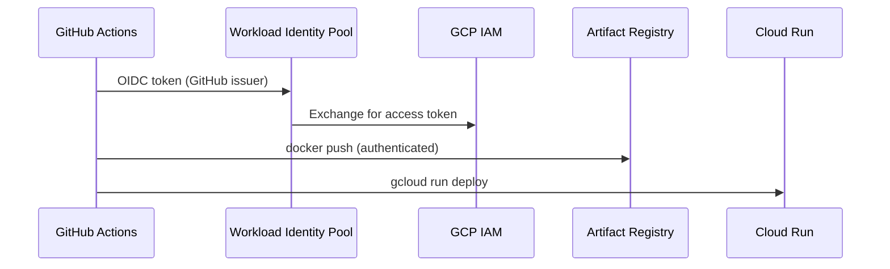
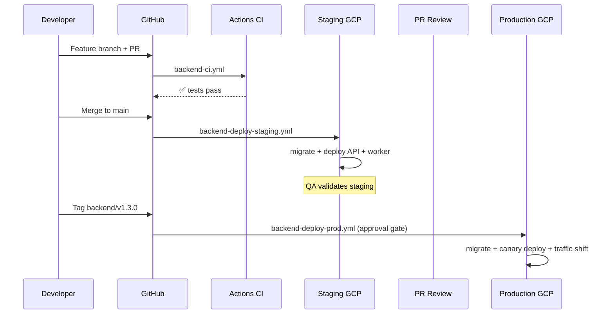
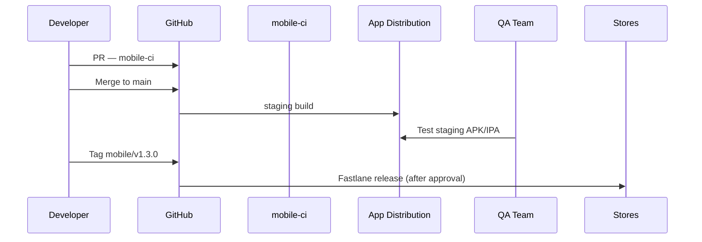
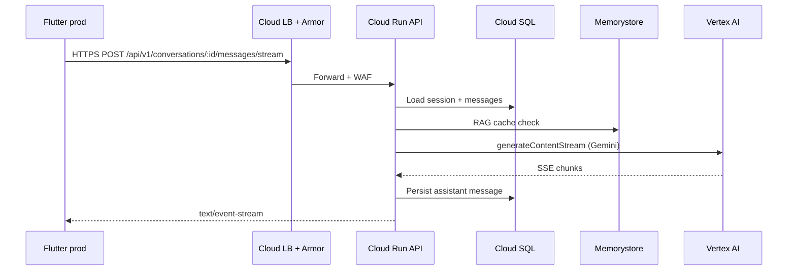

# Deployment Architecture

> Google Cloud deployment for Flutter mobile, NestJS backend, and Vertex AI — CI/CD via GitHub Actions.

## Document Status

| Field | Value |
|-------|-------|
| Version | 1.0.0 |
| Status | Draft |
| Last Updated | 2026-06-03 |
| Cloud | **Google Cloud Platform (GCP)** |
| AI Runtime | **Vertex AI** (Gemini) |
| CI/CD | **GitHub Actions** |
| Mobile | **Flutter** (iOS + Android) |
| Backend | **NestJS** (modular monolith) |

---

## 1. Overview



### 1.1 Stack Mapping

| Layer | Technology | GCP Service |
|-------|------------|-------------|
| **Frontend** | Flutter | App Store, Play Store, Firebase App Distribution |
| **Backend API** | NestJS | Cloud Run (container) |
| **Background jobs** | BullMQ workers | Cloud Run (separate service) |
| **Database** | PostgreSQL 16 + pgvector | Cloud SQL |
| **Cache / queue** | Redis | Memorystore for Redis |
| **AI** | Gemini via Vertex AI SDK | Vertex AI API (`europe-west1`) |
| **Secrets** | API keys, DB passwords | Secret Manager |
| **Images / assets** | Listing images (proxy cache) | Cloud Storage (optional) |
| **Observability** | Logs, metrics, alerts | Cloud Logging + Cloud Monitoring |
| **Mobile analytics** | Firebase | Same GCP project |

---

## 2. Environments

| Environment | Purpose | GCP project | API URL | Vertex |
|-------------|---------|-------------|---------|--------|
| **local** | Developer machines | — | `localhost:3000` | AI Studio key (dev only) |
| **dev** | Shared integration | `re-agent-dev` | `api-dev.*.run.app` | Vertex (dev project) |
| **staging** | QA, UAT, demos | `re-agent-staging` | `api-staging.*.run.app` | Vertex |
| **production** | Live users | `re-agent-prod` | `api.propertyassistant.eg` | Vertex |



**Rules:**

- No direct deploy to production from feature branches
- Staging uses anonymized/synthetic listing data where possible
- Production secrets only in `re-agent-prod` Secret Manager
- Database migrations run as a **pre-deploy job** (Cloud Run Job)

---

## 3. Google Cloud Infrastructure

### 3.1 Region Strategy

| Service | Region | Rationale |
|---------|--------|-----------|
| Cloud Run, Cloud SQL, Memorystore, Vertex AI | `europe-west1` (Belgium) | Low latency to Egypt; Vertex GA region |
| Cloud Storage | `europe-west1` | Co-locate with compute |
| Firebase | Global (linked project) | Standard Firebase setup |

Post-MVP: evaluate `me-west1` (Tel Aviv) if Vertex models and latency improve.

### 3.2 Cloud Run — NestJS API

| Setting | Staging | Production |
|---------|---------|------------|
| Service name | `api-staging` | `api-prod` |
| CPU | 1 | 2 |
| Memory | 512 MiB | 1 GiB |
| Min instances | 0 | 1 (reduce cold start) |
| Max instances | 5 | 50 |
| Concurrency | 80 | 80 |
| Timeout | 60s (streaming chat) | 60s |
| Ingress | Internal + Cloud Load Balancing | Same |
| Auth | Public HTTPS (JWT on app) | + Cloud Armor WAF |

**Container:** multi-stage Docker build from `backend/Dockerfile` → Artifact Registry.

```dockerfile
# Conceptual — backend/Dockerfile
FROM node:22-alpine AS builder
WORKDIR /app
COPY package*.json prisma ./
RUN npm ci && npx prisma generate
COPY . .
RUN npm run build

FROM node:22-alpine AS runner
WORKDIR /app
ENV NODE_ENV=production
COPY --from=builder /app/dist ./dist
COPY --from=builder /app/node_modules ./node_modules
COPY --from=builder /app/prisma ./prisma
CMD ["node", "dist/main.js"]
```

### 3.3 Cloud Run — BullMQ Workers

Separate service so long-running sync/embed jobs do not block API requests.

| Setting | Value |
|---------|-------|
| Service name | `worker-prod` |
| CPU | 1 |
| Memory | 512 MiB |
| Min instances | 1 (always-on consumer) |
| Max instances | 3 |
| Timeout | 300s |
| No public ingress | VPC / internal only |

**Queues:** `listing-sync`, `embed-listing`, `embed-chunks`, `notifications`, `evaluate-faithfulness`.

### 3.4 Cloud SQL — PostgreSQL

| Setting | Staging | Production |
|---------|---------|------------|
| Version | PostgreSQL 16 | PostgreSQL 16 |
| Tier | db-custom-2-7680 | db-custom-4-15360 (scale as needed) |
| HA | Zonal | Regional HA |
| Extensions | `vector`, `pgcrypto`, `citext` | Same |
| Backups | Daily, 7-day retention | Daily, 30-day PITR |
| Connection | Cloud SQL Auth Proxy sidecar / connector | Same |

**Network:** Private IP via VPC; Cloud Run uses **Cloud SQL Auth Proxy** (built-in connector).

### 3.5 Memorystore — Redis

| Setting | Staging | Production |
|---------|---------|------------|
| Tier | Basic 1 GB | Standard HA 2 GB |
| Use | BullMQ, RAG cache, rate limits | Same |
| Network | VPC authorized network | Same |

### 3.6 Vertex AI — Gemini

| Aspect | Configuration |
|--------|---------------|
| SDK | `@google-cloud/vertexai` |
| Auth | Workload Identity / service account key (CI only) |
| Models | `gemini-2.0-flash`, `text-embedding-004` |
| Region | `europe-west1` |
| IAM role | `roles/aiplatform.user` on API + worker SA |

**Environment variables (Cloud Run):**

```
GEMINI_PROVIDER=vertex
VERTEX_PROJECT_ID=re-agent-prod
VERTEX_LOCATION=europe-west1
GEMINI_CHAT_MODEL=gemini-2.0-flash
GEMINI_EMBED_MODEL=text-embedding-004
```

Local dev may use `GEMINI_PROVIDER=ai_studio` + `GEMINI_API_KEY`; **staging and production use Vertex only**.

See [gemini_integration_layer.md](./gemini_integration_layer.md) — update `GeminiClient` factory by `GEMINI_PROVIDER`.

### 3.7 Secret Manager

| Secret | Consumers |
|--------|-----------|
| `database-url` | API, workers, migrate job |
| `redis-url` | API, workers |
| `jwt-secret` / `jwt-refresh-secret` | API |
| `google-oauth-client-secret` | API |
| `apple-signin-key` | API |
| `listing-provider-*` | Workers |
| `fcm-service-account` | Workers |

Mounted as env vars in Cloud Run from Secret Manager references — never in Git.

### 3.8 Networking



| Component | Purpose |
|-----------|---------|
| **VPC** | Private connectivity to Cloud SQL + Redis |
| **Serverless VPC Access** | Cloud Run ↔ VPC |
| **Cloud Armor** | Rate limit, geo filter (optional), OWASP rules |
| **Managed SSL** | `api.propertyassistant.eg` on load balancer |

### 3.9 Firebase (Flutter)

| Product | Use |
|---------|-----|
| Firebase Analytics | Product funnels |
| Firebase Crashlytics | Crash reporting |
| Firebase App Distribution | Staging builds to QA |
| `google-services.json` / `GoogleService-Info.plist` | Per environment flavor |

Flutter **flavors:** `dev`, `staging`, `prod` — each points to matching API base URL.

---

## 4. Flutter Deployment

### 4.1 Build Flavors

| Flavor | API base URL | Firebase project | Distribution |
|--------|--------------|------------------|--------------|
| `dev` | `http://10.0.2.2:3000` / dev Cloud Run | `re-agent-dev` | Local / APK |
| `staging` | `https://api-staging....run.app` | `re-agent-staging` | App Distribution |
| `prod` | `https://api.propertyassistant.eg` | `re-agent-prod` | App Store + Play Store |

### 4.2 Mobile Release Flow



| Platform | Artifact | Tool |
|----------|----------|------|
| Android | `.aab` | `flutter build appbundle` + Fastlane `supply` |
| iOS | `.ipa` | `flutter build ipa` + Fastlane `deliver` |
| Staging | APK/IPA | Firebase App Distribution |

**Signing:** Android keystore + iOS certificates in GitHub **encrypted secrets**; match/fastlane optional.

---

## 5. NestJS Deployment

### 5.1 Repository Layout (Deployable Units)

```
backend/
├── Dockerfile
├── docker-compose.yml          # local only
├── prisma/
│   └── migrations/
└── src/
```

| Deployable | Image tag | Cloud Run service |
|------------|-----------|-------------------|
| API | `api:$GIT_SHA` | `api-prod` |
| Worker | `worker:$GIT_SHA` | `worker-prod` |
| Migrate job | `api:$GIT_SHA` | Job `migrate-prod` (one-shot) |

### 5.2 Health Checks

| Endpoint | Use |
|----------|-----|
| `GET /health` | Liveness — process up |
| `GET /health/ready` | Readiness — DB + Redis ping |

Cloud Run uses `/health` for startup and liveness probes.

---

## 6. CI/CD — GitHub Actions

### 6.1 Workflow Overview



### 6.2 Workflow Files (Planned)

| File | Trigger | Actions |
|------|---------|---------|
| `.github/workflows/backend-ci.yml` | PR touching `backend/` | Lint, test, Docker build (no push) |
| `.github/workflows/backend-deploy-staging.yml` | Push to `main` | Build, push AR, migrate, deploy staging |
| `.github/workflows/backend-deploy-prod.yml` | Tag `backend/v*.*.*` | Promote image, migrate, deploy prod |
| `.github/workflows/mobile-ci.yml` | PR touching `mobile/` | analyze, test |
| `.github/workflows/mobile-staging.yml` | Push to `main` | Build staging → App Distribution |
| `.github/workflows/mobile-release.yml` | Tag `mobile/v*.*.*` | Build prod → stores |

### 6.3 GCP Authentication from GitHub

**Workload Identity Federation** (recommended — no long-lived JSON keys):



| GitHub Environment | GCP SA | Roles |
|--------------------|--------|-------|
| `staging` | `github-deploy-staging@...` | `run.admin`, `artifactregistry.writer`, `cloudsql.client` |
| `production` | `github-deploy-prod@...` | Same (prod project) + manual approval gate |

### 6.4 Deployment Steps (Backend — Production)

| Step | Command / action | Rollback |
|------|------------------|----------|
| 1 | Run unit + integration tests | — |
| 2 | `docker build` + push `api:$SHA` to Artifact Registry | — |
| 3 | Run Cloud Run Job `migrate-prod` (`prisma migrate deploy`) | Forward-only; test on staging |
| 4 | Deploy `api-prod` to new revision (traffic 0%) | — |
| 5 | Smoke test `GET /health/ready` on canary URL | — |
| 6 | Shift 100% traffic to new revision | `gcloud run services update-traffic --to-revisions=PREVIOUS=100` |
| 7 | Deploy `worker-prod` same image tag | Roll back worker revision |

### 6.5 Deployment Steps (Mobile — Production)

| Step | Action |
|------|--------|
| 1 | `flutter test` + `flutter analyze` |
| 2 | Decode signing secrets |
| 3 | `flutter build appbundle --flavor prod --release` |
| 4 | `flutter build ipa --flavor prod --release` |
| 5 | Fastlane upload to Play Console (internal → production track) |
| 6 | Fastlane upload to App Store Connect (TestFlight → release) |
| 7 | Tag release in GitHub + changelog |

---

## 7. End-to-End Deployment Flow

### 7.1 Feature → Production (Backend)



### 7.2 Feature → Stores (Mobile)



### 7.3 Runtime Request Flow (Production)



---

## 8. IAM & Service Accounts

| Service account | Used by | Key roles |
|---------------|---------|-----------|
| `api-prod@` | Cloud Run API | `cloudsql.client`, `aiplatform.user`, `secretmanager.secretAccessor` |
| `worker-prod@` | Cloud Run Worker | Same + listing sync secrets |
| `github-deploy-prod@` | GitHub Actions | `run.admin`, `artifactregistry.writer`, `iam.serviceAccountUser` |
| `migrate-job@` | Migrate Cloud Run Job | `cloudsql.client` |

**Principle of least privilege** — no default compute SA with Editor role.

---

## 9. Observability on GCP

| Signal | GCP service | Notes |
|--------|-------------|-------|
| Logs | Cloud Logging | Pino JSON from Cloud Run |
| Metrics | Cloud Monitoring + Prometheus sidecar (optional) | Custom AI metrics |
| Traces | Cloud Trace (OpenTelemetry Phase 2) | `correlationId` |
| Uptime | Cloud Monitoring uptime check | `/health` |
| Alerts | Notification channels → Slack/PagerDuty | See [monitoring_strategy.md](./monitoring_strategy.md) |

---

## 10. Cost Controls (GCP)

| Resource | Cost lever |
|----------|------------|
| Cloud Run | Min instances only in prod; scale to zero in staging |
| Cloud SQL | Right-size tier; read replica post-MVP if needed |
| Vertex AI | Token quotas per user; daily budget alert |
| Memorystore | Start Basic staging / Standard HA prod |
| Egress | CDN for static assets; keep API payloads small |

---

## 11. Disaster Recovery

| Scenario | RTO target | Action |
|----------|------------|--------|
| Bad API deployment | < 5 min | Roll back Cloud Run revision |
| DB corruption | < 4 h | Restore Cloud SQL PITR backup |
| Region outage | < 24 h | Manual failover runbook (Phase 2 multi-region) |
| Vertex AI outage | Immediate | Graceful degradation message; queue retries |

---

## 12. Local Development Parity

```yaml
# docker-compose.yml (backend) — local only
services:
  api:
    build: .
    ports: ["3000:3000"]
    env_file: .env.local
  postgres:
    image: pgvector/pgvector:pg16
  redis:
    image: redis:7-alpine
  worker:
    build: .
    command: node dist/worker.js
```

| Concern | Local | Cloud |
|---------|-------|-------|
| Gemini | AI Studio API key | Vertex AI |
| DB | Docker PostgreSQL | Cloud SQL |
| Queue | Docker Redis | Memorystore |

---

## 13. Implementation Checklist

| # | Task | Owner |
|---|------|-------|
| 1 | Create GCP projects (dev, staging, prod) | Infra |
| 2 | Enable APIs: Run, SQL, Redis, Vertex, Secret Manager, AR | Infra |
| 3 | VPC + Serverless VPC connector + private Cloud SQL | Infra |
| 4 | Workload Identity Federation for GitHub | Infra |
| 5 | `backend/Dockerfile` + health endpoints | Backend |
| 6 | GitHub Actions workflows (§6.2) | Infra |
| 7 | Flutter flavors + Firebase per env | Mobile |
| 8 | Vertex adapter in `GeminiClient` | Backend |
| 9 | Fastlane lanes for iOS/Android | Mobile |
| 10 | Cloud Armor + managed cert on prod LB | Infra |

---

## 14. Resolved Decisions

| Question | Decision |
|----------|----------|
| Cloud provider | **Google Cloud** |
| AI production runtime | **Vertex AI** (not AI Studio) |
| API hosting | **Cloud Run** (not GKE for MVP) |
| CI/CD | **GitHub Actions** |
| DB | **Cloud SQL** PostgreSQL 16 + pgvector |
| Primary region | **europe-west1** |

---

## 15. Related Documents

| Document | Path |
|----------|------|
| Backend Architecture | [backend_architecture.md](./backend_architecture.md) |
| Gemini Integration Layer | [gemini_integration_layer.md](./gemini_integration_layer.md) |
| Monitoring Strategy | [monitoring_strategy.md](./monitoring_strategy.md) |
| AI Provider Strategy | [ai_provider_strategy.md](./ai_provider_strategy.md) |
| System Design | [system_design.md](./system_design.md) |

## Approval

| Role | Name | Date | Status |
|------|------|------|--------|
| Tech Lead | — | — | Pending |
| DevOps / SRE | — | — | Pending |
| Security | — | — | Pending |
