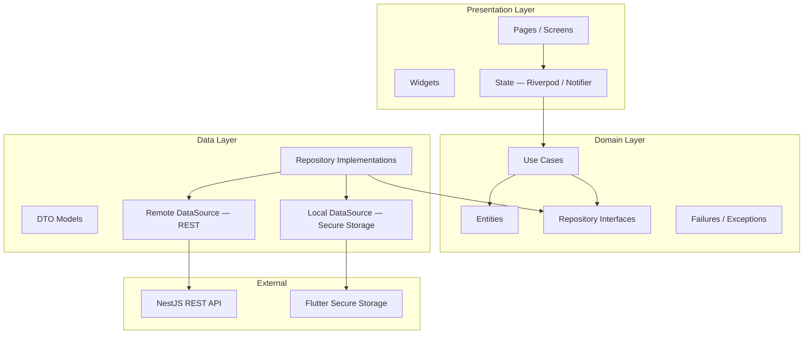
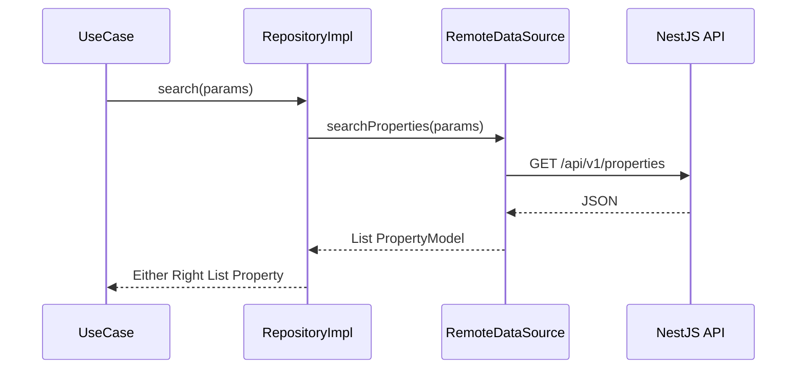
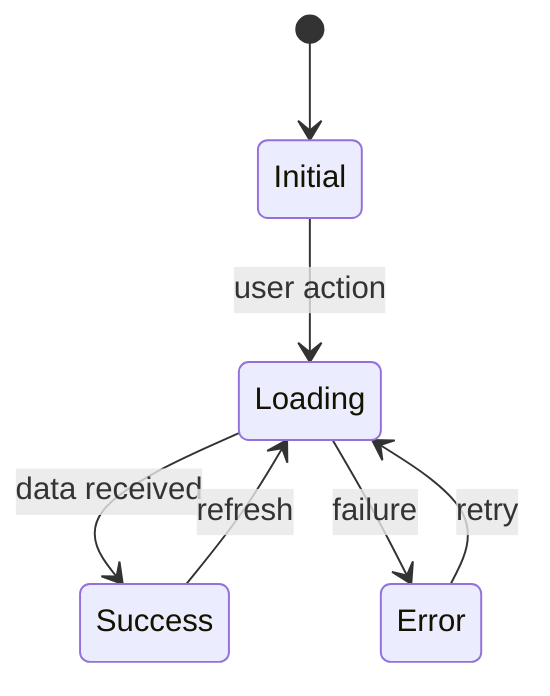
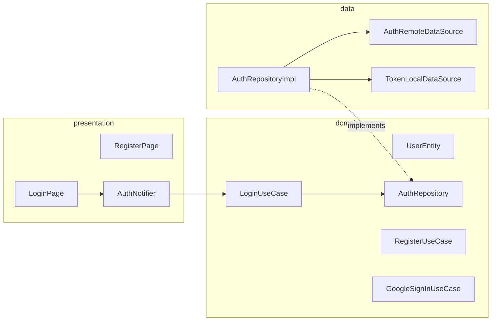
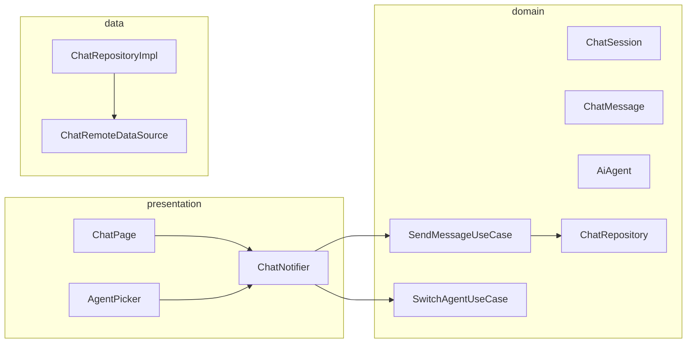
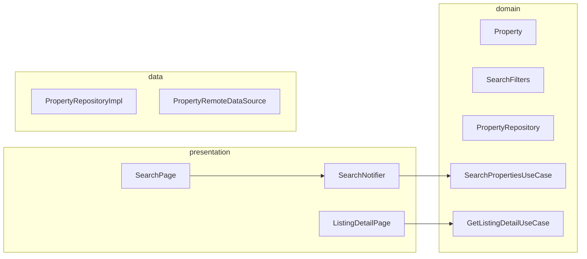
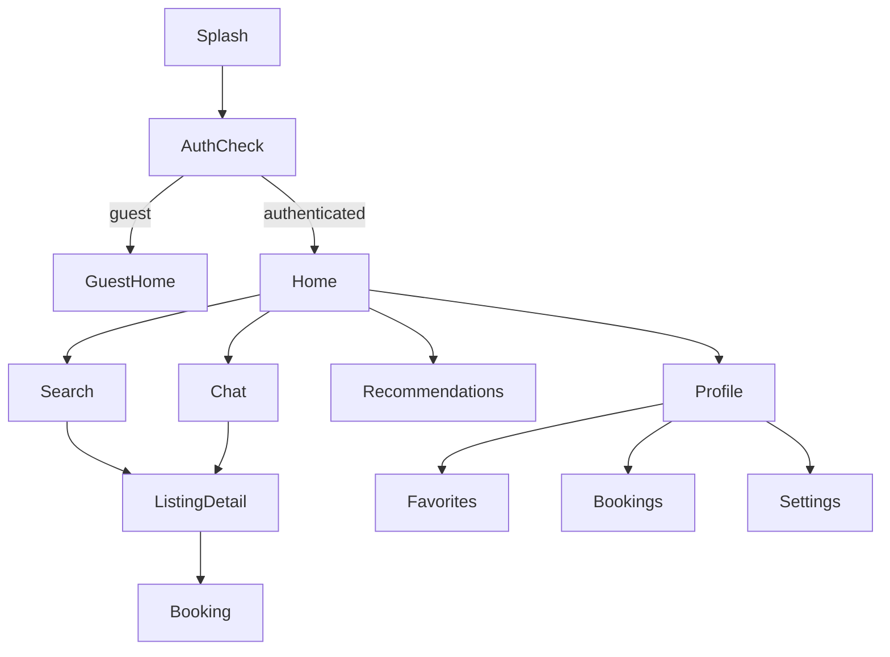
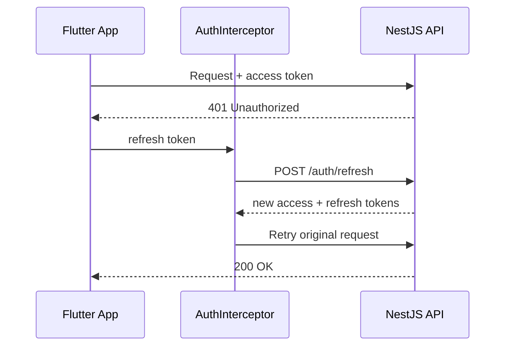
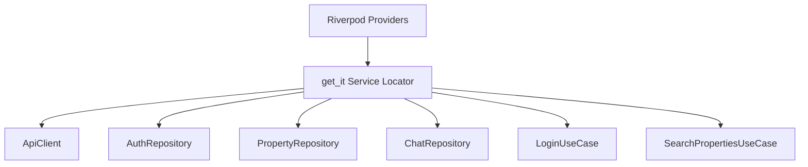
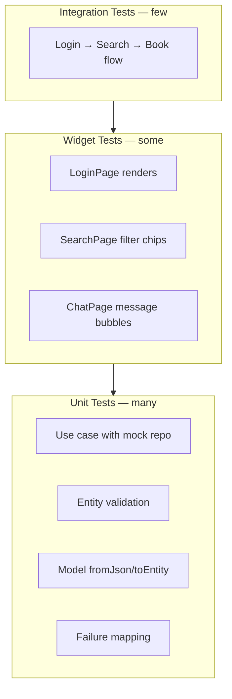

# Flutter Architecture

> Clean Architecture design for the AI Property Assistant mobile client.

## Document Status

| Field | Value |
|-------|-------|
| Version | 1.0.0 |
| Status | Draft |
| Last Updated | 2026-06-03 |
| Platform | Flutter (iOS + Android) |
| Pattern | Clean Architecture + Feature-first |

---

## 1. Overview

The Flutter app follows **Clean Architecture** with **feature-first** organization. Each feature is a vertical slice containing its own `domain`, `data`, and `presentation` layers. Shared concerns live in `core/`.



**Rule:** Dependencies always point **inward**. Domain knows nothing about Flutter, HTTP, or JSON.

---

## 2. Project Structure

```
mobile/
├── lib/
│   ├── main.dart
│   ├── app.dart                          # MaterialApp, theme, router
│   │
│   ├── core/
│   │   ├── config/
│   │   │   └── env.dart                  # API base URL, feature flags
│   │   ├── di/
│   │   │   └── injection.dart            # get_it service locator
│   │   ├── error/
│   │   │   ├── exceptions.dart
│   │   │   ├── failures.dart
│   │   │   └── error_mapper.dart
│   │   ├── network/
│   │   │   ├── api_client.dart           # Dio wrapper
│   │   │   ├── auth_interceptor.dart     # JWT attach + refresh
│   │   │   └── network_info.dart
│   │   ├── routing/
│   │   │   └── app_router.dart           # go_router config
│   │   ├── theme/
│   │   │   ├── app_theme.dart
│   │   │   └── app_colors.dart
│   │   ├── l10n/
│   │   │   └── (generated ARB — ar-EG, en)
│   │   └── utils/
│   │       ├── validators.dart
│   │       └── formatters.dart           # EGP currency
│   │
│   └── features/
│       ├── authentication/
│       ├── property_search/
│       ├── ai_chat/
│       ├── recommendation/
│       ├── booking/
│       └── profile/
│
├── test/
│   ├── unit/
│   ├── widget/
│   └── integration/
│
└── assets/
    └── images/
```

---

## 3. Feature Module Anatomy

Every feature follows the same three-layer layout:

```
features/<feature_name>/
├── domain/
│   ├── entities/
│   │   └── *.dart                        # Pure Dart classes
│   ├── repositories/
│   │   └── *_repository.dart             # abstract interface
│   └── usecases/
│       └── *.dart                        # Single-responsibility use cases
│
├── data/
│   ├── models/
│   │   └── *_model.dart                  # JSON serializable DTOs
│   ├── datasources/
│   │   ├── *_remote_datasource.dart
│   │   └── *_local_datasource.dart       # optional
│   └── repositories/
│       └── *_repository_impl.dart
│
└── presentation/
    ├── pages/
    │   └── *_page.dart
    ├── widgets/
    │   └── *.dart
    └── providers/
        └── *_provider.dart               # Riverpod Notifier / AsyncNotifier
```

---

## 4. Layer Responsibilities

### 4.1 Domain Layer

| Component | Responsibility | Example |
|-----------|----------------|---------|
| **Entity** | Business object — immutable, equatable | `Property`, `ChatMessage`, `Booking` |
| **Repository interface** | Contract for data access | `abstract class PropertyRepository` |
| **Use case** | Single application action | `SearchPropertiesUseCase` |
| **Failure** | Typed error for UI mapping | `ServerFailure`, `AuthFailure` |

```dart
// domain/usecases/search_properties.dart — conceptual
class SearchPropertiesUseCase {
  SearchPropertiesUseCase(this._repository);
  final PropertyRepository _repository;

  Future<Either<Failure, List<Property>>> call(SearchParams params) {
    return _repository.search(params);
  }
}
```

**No imports from:** `flutter`, `dio`, `json_annotation`, `riverpod`.

### 4.2 Data Layer

| Component | Responsibility |
|-----------|----------------|
| **Model** | JSON ↔ Entity mapping (`fromJson`, `toEntity`) |
| **RemoteDataSource** | HTTP calls via `ApiClient` |
| **LocalDataSource** | Token cache, draft preferences |
| **RepositoryImpl** | Orchestrates remote/local; maps exceptions → Failures |



### 4.3 Presentation Layer

| Component | Responsibility |
|-----------|----------------|
| **Page** | Screen scaffold; watches provider state |
| **Widget** | Reusable UI components |
| **Provider** | Calls use cases; exposes `AsyncValue` to UI |



---

## 5. Feature Architecture Diagrams

### 5.1 Authentication Feature



### 5.2 AI Chat Feature



### 5.3 Property Search Feature



---

## 6. Core Cross-Cutting Concerns

### 6.1 Navigation (go_router)



| Route | Path | Auth |
|-------|------|------|
| Home | `/` | Optional |
| Search | `/search` | Optional |
| Listing | `/properties/:id` | Optional |
| Chat | `/chat` | Required |
| Chat Session | `/chat/:sessionId` | Required |
| Bookings | `/bookings` | Required |
| Profile | `/profile` | Required |
| Login | `/login` | Guest only |

### 6.2 State Management — Riverpod

| Pattern | Use Case |
|---------|----------|
| `AsyncNotifierProvider` | Search results, chat messages, bookings list |
| `NotifierProvider` | Auth session, locale, theme |
| `Provider` | DI — inject use cases and repositories |
| `FutureProvider` | One-shot loads (agent catalog) |

### 6.3 JWT Token Flow



Tokens stored in **Flutter Secure Storage** — never in SharedPreferences.

### 6.4 Localization & RTL

| Concern | Implementation |
|---------|----------------|
| Arabic (ar-EG) | Flutter ARB files, `Directionality.rtl` |
| English (en) | Default LTR |
| EGP formatting | `intl` package with `ar_EG` / `en_EG` locale |
| Dynamic font scaling | No fixed pixel heights on text containers |

---

## 7. Dependency Injection



Registration in `core/di/injection.dart`:

1. **Singletons** — `ApiClient`, `NetworkInfo`
2. **Lazy singletons** — repositories
3. **Factories** — use cases (stateless)

---

## 8. Error Handling Strategy

```mermaid
flowchart TD
    DioException --> DataSource
    DataSource --> RepositoryImpl
    RepositoryImpl -->|map| Failure
    Failure --> UseCase
    UseCase -->|Either Left/Right| Provider
    Provider --> UI

    UI -->|ServerFailure| SnackBar retry
    UI -->|AuthFailure| Redirect login
    UI -->|NetworkFailure| Offline message
    UI -->|ValidationFailure| Inline field error
```

---

## 9. Testing Pyramid



| Layer | Tool | Target |
|-------|------|--------|
| Domain use cases | `flutter_test` + mock repos | 90%+ coverage |
| Data models | `flutter_test` | JSON round-trip |
| Widgets | `flutter_test` | Critical UI states |
| Integration | `integration_test` | Auth + search + book happy path |

---

## 10. Package Dependencies (Proposed)

| Package | Purpose |
|---------|---------|
| `go_router` | Declarative routing |
| `flutter_riverpod` | State management + DI bridge |
| `get_it` | Service locator |
| `dio` | HTTP client |
| `flutter_secure_storage` | JWT storage |
| `dartz` or `fpdart` | `Either` for error handling |
| `equatable` | Value equality on entities |
| `json_annotation` | DTO serialization |
| `intl` | EGP formatting, dates |
| `cached_network_image` | Listing photos |
| `genui` | **M7.5** — Generative UI surfaces in AI chat (A2UI renderer) |
| `genai_primitives` | Shared GenAI message primitives for GenUI |

### 10.1 GenUI in AI Chat (M7.5)

The chat feature adopts [Flutter GenUI](https://docs.flutter.dev/ai/genui) behind a thin adapter in `features/ai_chat/genui/`:

- **Catalog** — maps A2UI component names to existing widgets (`ListingCardTile`, filter chips).
- **Surface** — renders agent-generated layouts inside `ChatPage` below assistant text.
- **Transport** — SSE `a2ui_surface` events from NestJS (server-side generation); not client-direct Gemini.

See [features/ai_chat/genui_design.md](../features/ai_chat/genui_design.md).

---

## 11. Related Documents

| Document | Path |
|----------|------|
| Backend Architecture | [backend_architecture.md](./backend_architecture.md) |
| AI Services Architecture | [ai_services_architecture.md](./ai_services_architecture.md) |
| System Design | [system_design.md](./system_design.md) |
| Clean Architecture (shared rules) | [clean_architecture.md](./clean_architecture.md) |

## Approval

| Role | Name | Date | Status |
|------|------|------|--------|
| Tech Lead | — | — | Pending |
| Mobile Lead | — | — | Pending |
