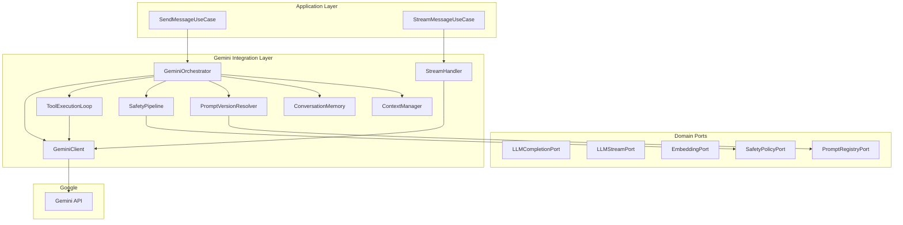
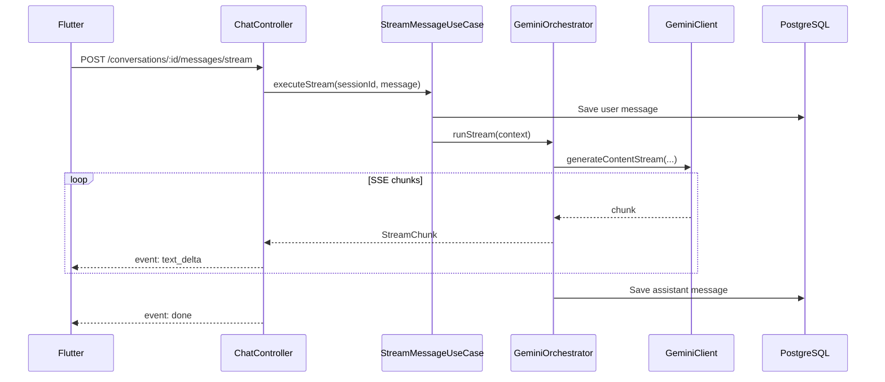
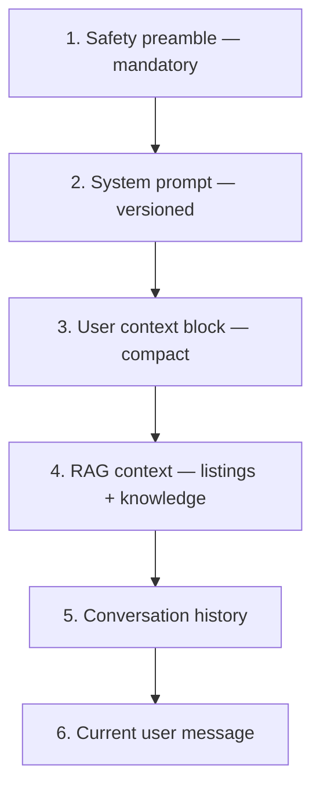
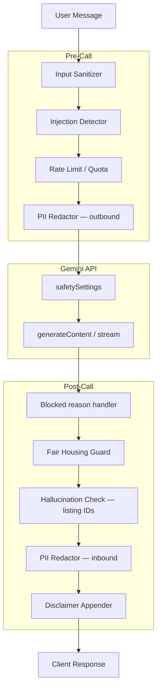
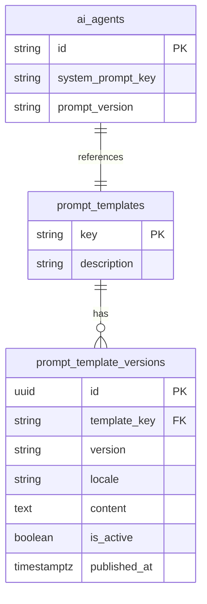
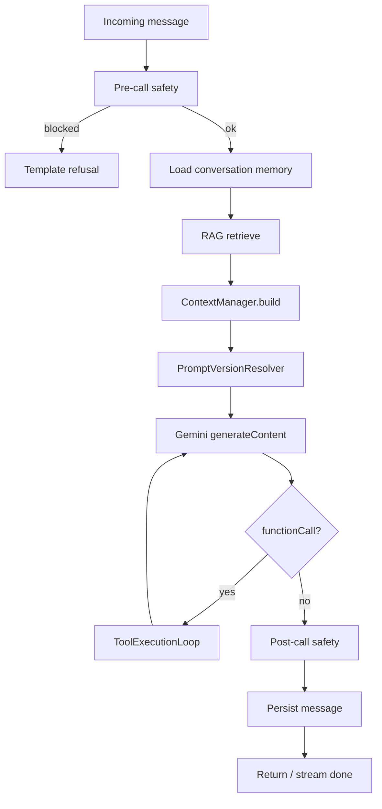

# Gemini Integration Layer

> NestJS infrastructure layer for Google Gemini — streaming, tools, memory, context, safety, and prompt versioning.

## Document Status

| Field | Value |
|-------|-------|
| Version | 1.0.0 |
| Status | Draft |
| Last Updated | 2026-06-03 |
| SDK | `@google/generative-ai` (local dev) / `@google-cloud/vertexai` (staging + prod) |
| Chat Model | `gemini-2.0-flash` |
| Embed Model | `text-embedding-004` (768-dim) |
| Location | `backend/src/modules/ai/infrastructure/gemini/` |

---

## 1. Overview

The **Gemini Integration Layer** is the single infrastructure boundary between domain/application code and Google’s APIs. All Gemini-specific types, retries, streaming, function declarations, and safety settings live here — domain code depends only on ports.



### 1.1 Requirements Coverage

| Requirement | Component | Section |
|-------------|-----------|---------|
| Streaming responses | `GeminiStreamHandler`, SSE endpoint | §3 |
| Function calling | `FunctionDeclarationBuilder` | §4 |
| Tool calling | `ToolExecutionLoop` + `ToolExecutor` | §5 |
| Conversation memory | `ConversationMemoryService` | §6 |
| Context management | `ContextManager` + `TokenBudget` | §7 |
| Safety layer | `SafetyPipeline` (pre / API / post) | §8 |
| Prompt versioning | `PromptVersionResolver` + `prompt_templates` | §9 |

---

## 2. Layer Structure (NestJS)

```
backend/src/modules/ai/
├── domain/
│   ├── ports/
│   │   ├── llm-completion.port.ts
│   │   ├── llm-stream.port.ts
│   │   ├── embedding.port.ts
│   │   ├── prompt-registry.port.ts
│   │   └── safety-policy.port.ts
│   └── types/
│       ├── completion-request.ts
│       ├── completion-response.ts
│       ├── tool-definition.ts
│       └── stream-chunk.ts
│
├── application/
│   ├── use-cases/
│   │   ├── send-message.use-case.ts
│   │   └── stream-message.use-case.ts
│   └── services/
│       └── tool-executor.service.ts      # domain tools, not Gemini-specific
│
└── infrastructure/
    └── gemini/
        ├── gemini.module.ts
        ├── gemini.client.ts              # HTTP/SDK wrapper
        ├── gemini-orchestrator.service.ts
        ├── gemini-stream.handler.ts
        ├── gemini-embedding.adapter.ts
        ├── tool-execution-loop.service.ts
        ├── function-declaration.builder.ts
        ├── context/
        │   ├── context-manager.service.ts
        │   ├── token-budget.service.ts
        │   └── context-block.types.ts
        ├── memory/
        │   └── conversation-memory.service.ts
        ├── safety/
        │   ├── safety-pipeline.service.ts
        │   ├── input-sanitizer.service.ts
        │   ├── output-guard.service.ts
        │   └── gemini-safety-settings.ts
        └── prompts/
            ├── prompt-version.resolver.ts
            └── templates/                # YAML/JSON seed files
                ├── search-agent-v1.en.yaml
                └── search-agent-v1.ar.yaml
```

---

## 3. Streaming Responses

### 3.1 Design

| Aspect | Decision |
|--------|----------|
| Protocol | **Server-Sent Events (SSE)** from NestJS to Flutter |
| Gemini API | `generateContentStream` with `stream: true` |
| Chunk types | `text_delta`, `tool_call_start`, `tool_call_end`, `listing_card`, `done`, `error` |
| Persistence | Full assistant message saved **after** stream completes (or on client abort with partial save optional) |
| MVP fallback | Non-streaming `POST .../messages` remains supported |

### 3.2 Sequence



### 3.3 Domain Port

```typescript
interface LLMStreamPort {
  stream(request: CompletionRequest): AsyncIterable<StreamChunk>;
}

type StreamChunk =
  | { type: 'text_delta'; text: string }
  | { type: 'tool_call'; name: string; args: Record<string, unknown> }
  | { type: 'tool_result'; name: string; summary: string }
  | { type: 'listing_cards'; cards: ListingCard[] }
  | { type: 'done'; messageId: string; usage: TokenUsage }
  | { type: 'error'; code: string; message: string };
```

### 3.4 Gemini Adapter

```typescript
// Infrastructure — maps Gemini stream parts to StreamChunk
async *generateStream(request: GeminiGenerateRequest) {
  const stream = await this.model.generateContentStream({
    contents: request.contents,
    systemInstruction: request.systemInstruction,
    tools: request.tools,
    toolConfig: request.toolConfig,
    safetySettings: request.safetySettings,
    generationConfig: request.generationConfig,
  });

  for await (const chunk of stream.stream) {
    const text = chunk.text();
    if (text) yield { type: 'text_delta', text };

    const functionCalls = chunk.functionCalls();
    if (functionCalls?.length) {
      for (const fc of functionCalls) {
        yield { type: 'tool_call', name: fc.name, args: fc.args };
      }
    }
  }
}
```

### 3.5 SSE API Contract

```
POST /api/v1/conversations/:id/messages/stream
Authorization: Bearer <jwt>
Content-Type: application/json
Accept: text/event-stream

{ "content": "شقة 3 غرف في المعادي" }
```

| Event | Data JSON | When |
|-------|-----------|------|
| `text_delta` | `{ "text": "..." }` | Incremental reply |
| `tool_call` | `{ "name": "semantic_search", "args": {...} }` | Model requests tool |
| `tool_result` | `{ "name": "...", "summary": "5 listings found" }` | Server executed tool |
| `listing_cards` | `{ "cards": [...] }` | Structured property UI |
| `done` | `{ "messageId": "uuid", "agentId": "...", "usage": {...} }` | Stream complete |
| `error` | `{ "code": "RATE_LIMIT", "message": "..." }` | Failure |

**Headers:** `Cache-Control: no-cache`, `Connection: keep-alive`, `X-Accel-Buffering: no` (nginx).

### 3.6 Client Abort

| Scenario | Behavior |
|----------|----------|
| User navigates away | Server cancels Gemini stream; optional partial message not persisted |
| Network drop | Client reconnects; last `messageId` from `done` is source of truth |
| Timeout (60s) | Emit `error`; close SSE |

---

## 4. Function Calling

Gemini **function calling** maps platform tools to `FunctionDeclaration` objects. The model returns `functionCall` parts; the server executes tools and sends `functionResponse` parts back in a multi-turn loop.

### 4.1 Architecture

```mermaid
flowchart LR
    AgentConfig[Agent tools[]] --> Builder[FunctionDeclarationBuilder]
    Builder --> Declarations[Gemini FunctionDeclaration[]]
    Declarations --> Request[generateContent tools]
    Request --> Model[Gemini Model]
    Model --> FC[functionCall parts]
    FC --> Loop[ToolExecutionLoop]
```

### 4.1 Function Declaration Builder

```typescript
// Maps domain ToolDefinition → Gemini FunctionDeclaration
class FunctionDeclarationBuilder {
  build(tools: ToolDefinition[]): FunctionDeclaration[] {
    return tools.map((t) => ({
      name: t.name,
      description: t.description,
      parameters: t.parameters, // JSON Schema — Gemini-compatible subset
    }));
  }
}
```

### 4.2 Tool Config Modes

| Mode | Gemini `toolConfig` | Use Case |
|------|---------------------|----------|
| `AUTO` | `functionCallingConfig.mode: AUTO` | Default — model decides when to call |
| `ANY` | Force at least one function call | Structured search-only turn |
| `NONE` | Disable tools | Follow-up chit-chat, safety refusal path |

Per-agent default in `ai_agents.tool_call_mode` (seed: `AUTO`).

### 4.3 Allowed Tools by Agent

| Agent | Function declarations |
|-------|----------------------|
| `search-agent` | `semantic_search`, `search_properties`, `get_listing_detail`, `get_user_context`, `compare_listings` |
| `recommendation-agent` | `get_recommendations`, `record_feedback`, `get_listing_detail`, `get_user_context` |
| `booking-agent` | `create_booking_request`, `check_agent_availability`, `get_booking_status`, `get_listing_detail` |
| `follow-up-agent` | `schedule_follow_up`, `get_booking_status`, `get_user_context` |

**Rule:** Agent `tools[]` in DB is the **allowlist** — declarations not in list are never sent to Gemini.

### 4.4 Parallel vs Sequential Calls

| Behavior | Setting |
|----------|---------|
| Multiple `functionCall` in one turn | Execute **in parallel** when independent (e.g. two `get_listing_detail`) |
| Dependent chain | Sequential inside `ToolExecutionLoop` |
| Max calls per turn | **3** (configurable `GEMINI_MAX_TOOL_CALLS_PER_TURN`) |

---

## 5. Tool Calling (Execution Loop)

**Function calling** = Gemini API contract. **Tool calling** = server-side execution of domain operations.

### 5.1 Loop Diagram

```mermaid
sequenceDiagram
    participant Orch as GeminiOrchestrator
    participant Gem as GeminiClient
    participant Loop as ToolExecutionLoop
    participant Exec as ToolExecutor
    participant DB as PostgreSQL / pgvector

    Orch->>Gem: generateContent (turn 1)
    Gem-->>Orch: functionCall: semantic_search
    Orch->>Loop: handle(functionCalls)
    Loop->>Exec: semantic_search(args)
    Exec->>DB: vector + SQL query
    DB-->>Exec: listings[]
    Exec-->>Loop: ToolResult
    Loop-->>Orch: functionResponse parts
    Orch->>Gem: generateContent (turn 2 + tool results)
    Gem-->>Orch: text response + optional more calls
    Note over Orch,Gem: Max 5 turns per user message
```

### 5.2 Tool Executor (Application)

```typescript
interface ToolExecutor {
  execute(
    name: string,
    args: Record<string, unknown>,
    ctx: ToolContext,
  ): Promise<ToolResult>;
}

interface ToolContext {
  userId: string;
  conversationId: string;
  agentId: string;
  locale: string;
}
```

| Tool | Returns to Gemini |
|------|-------------------|
| `semantic_search` | `{ listings: [...], count, appliedFilters }` — max 5 items, truncated descriptions |
| `create_booking_request` | `{ bookingId, status: "requested" }` or validation error |
| `record_feedback` | `{ recorded: true }` |

### 5.3 Loop Limits & Errors

| Guard | Value |
|-------|-------|
| Max tool loop turns | 5 |
| Max wall-clock per message | 45s |
| Tool timeout | 10s per tool |
| Invalid tool name | `functionResponse` with `{ error: "unknown_tool" }` — model recovers |
| Tool exception | Log + sanitized error in `functionResponse`; no stack traces to model |

### 5.4 Idempotency

| Tool | Idempotency |
|------|-------------|
| `create_booking_request` | Client supplies `idempotencyKey` in args; server dedupes within 24h |
| `record_feedback` | Upsert on `(userId, listingId)` |
| Read-only tools | Naturally idempotent |

---

## 6. Conversation Memory

Memory is **server-authoritative** — stored in `conversations` + `messages` (see [postgresql_schema.md](./postgresql_schema.md)), assembled per request by `ConversationMemoryService`.

### 6.1 Memory Tiers

```mermaid
flowchart TB
    subgraph tier1 [Tier 1 — Session Memory]
        MSG[(messages table)]
        CONV[conversations metadata]
    end

    subgraph tier2 [Tier 2 — User Memory]
        PREF[users.search_preferences]
        FAV[favorites]
        RECENT[recent bookings / searches — Redis cache]
    end

    subgraph tier3 [Tier 3 — Ephemeral]
        RAG[RAG retrieval this turn]
        TOOLS[Tool results this turn]
    end

    MSG --> Assembler[Memory Assembler]
    PREF --> Assembler
    RAG --> Assembler
    Assembler --> Gemini[Gemini contents[]]
```

| Tier | Storage | TTL | In Gemini prompt? |
|------|---------|-----|-------------------|
| Session | `messages` | Life of conversation | ✅ Last N turns |
| User profile | `users`, `favorites` | Persistent | ✅ Via `get_user_context` tool or compact block |
| RAG / tools | Computed per turn | Single request | ✅ Current turn only |
| Summarized history | `conversations.summary` (optional column) | Updated every 15 turns | ✅ Replaces oldest turns |

### 6.2 Message Loading Rules

| Rule | Value |
|------|-------|
| Default window | Last **20** messages (10 user + 10 assistant pairs) |
| Order | Chronological `created_at ASC` |
| Roles mapped | `user` → `user`, `assistant` → `model`, `system` → `user` with prefix `[system]` |
| Agent switch | Include all messages; prefix assistant turns with `[agent: search-agent]` when `agent_id` differs from current |
| Listing refs | Inject compact line: `[Referenced listings: id1, id2]` on assistant messages with `listing_refs` |

### 6.3 Summarization (Long Sessions)

When `messages.count > 30`:

1. Background job (or inline if fast) summarizes messages 1–(N-20) via Gemini with fixed summarization prompt `memory-summarize-v1`
2. Store in `conversations.summary` (JSON: `{ text, upToMessageId, version }`)
3. Prompt assembly: `system` + `summary` + last 20 messages

### 6.4 What Is NOT Stored in Gemini Memory

| Data | Handling |
|------|----------|
| Raw provider API responses | Never persisted |
| Full listing descriptions in history | Only IDs + titles in `listing_refs` |
| Other users’ PII | Excluded by `get_user_context` scoping |
| Passwords / tokens | Never in messages |

---

## 7. Context Management

`ContextManager` assembles the final Gemini request under a **token budget** before each call.

### 7.1 Context Stack (Priority Order)



| Block | Source | Max tokens (budget share) |
|-------|--------|---------------------------|
| Safety preamble | `platform-safety-v1` template | 200 (fixed) |
| System prompt | Agent prompt version | 1,500 |
| User context | Profile + preferences | 300 |
| RAG context | pgvector + knowledge chunks | 2,500 |
| History | Conversation memory | 4,000 |
| User message | Request body | 500 |
| **Reserved for output** | — | 1,024 |
| **Total budget** | `gemini-2.0-flash` | ~32K input (use 10K target for cost/latency) |

### 7.2 Token Budget Service

```typescript
class TokenBudgetService {
  // Approximate: chars / 4 for Arabic and English mixed text
  estimateTokens(text: string): number;

  trimToBudget(blocks: ContextBlock[], maxTokens: number): ContextBlock[];
}
```

**Trim order when over budget** (lowest priority first):

1. Drop oldest history messages (keep summary if exists)
2. Reduce RAG chunks (5 → 3 → 0)
3. Truncate listing description fields in RAG block
4. Shorten user context block
5. Never trim safety preamble or system prompt

### 7.3 RAG Context Block Format

```
## Retrieved Properties (verified — cite only these IDs)
- [id: uuid-1] 3BR Apartment, Maadi — 25,000 EGP/mo — 120 sqm
- [id: uuid-2] ...

## Project Knowledge (if applicable)
- [project: new-capital-east] Payment plan: 10% down...
```

### 7.4 Mid-Session Agent Switch

On agent change, `ContextManager` injects one system notice (not stored as user message):

```
[system] Agent switched to Booking Agent. Prior messages are context only.
```

New agent’s versioned system prompt replaces previous agent instructions for subsequent turns.

---

## 8. Safety Layer

Three-stage pipeline — **platform policies cannot be overridden** by agent prompts.



### 8.1 Pre-Call Safety

| Check | Action on fail |
|-------|----------------|
| Prompt injection patterns | Strip/neutralize; log `safety.injection_detected` |
| Discriminatory intent (regex + classifier) | Short-circuit; return fair housing template — **no Gemini call** |
| Daily message quota | 429 `AI_QUOTA_EXCEEDED` |
| Max message length | 4000 chars hard truncate with warning |
| PII in user text (phone, email, national ID) | Redact before sending to Gemini |

**Injection patterns (examples):** `ignore previous instructions`, `you are now`, `system:`, XML-style role tags.

### 8.2 Gemini `safetySettings`

```typescript
const GEMINI_SAFETY_SETTINGS: SafetySetting[] = [
  { category: 'HARM_CATEGORY_HARASSMENT', threshold: 'BLOCK_MEDIUM_AND_ABOVE' },
  { category: 'HARM_CATEGORY_HATE_SPEECH', threshold: 'BLOCK_MEDIUM_AND_ABOVE' },
  { category: 'HARM_CATEGORY_SEXUALLY_EXPLICIT', threshold: 'BLOCK_MEDIUM_AND_ABOVE' },
  { category: 'HARM_CATEGORY_DANGEROUS_CONTENT', threshold: 'BLOCK_MEDIUM_AND_ABOVE' },
];
```

| `finishReason` | Platform behavior |
|----------------|-------------------|
| `SAFETY` | Replace with localized safe fallback; log refusal |
| `RECITATION` | Retry without RAG block; if persists, generic error |
| `MAX_TOKENS` | Truncate response; append "reply may be incomplete" |

### 8.3 Post-Call Safety

| Check | Action |
|-------|--------|
| Fair housing violations in output | Replace response; increment `guardrail.refusal_count` |
| Listing IDs not in tool/RAG results | Strip invalid IDs from `listing_cards`; rewrite text if needed |
| PII in model output | Redact before persist and SSE |
| Legal/financial overreach | Ensure disclaimer present (agent-specific templates) |

### 8.4 Safety vs Agent Prompts

```
┌─────────────────────────────────────────┐
│  Layer 1: Platform safety preamble      │  ← Always first systemInstruction
├─────────────────────────────────────────┤
│  Layer 2: Agent prompt (versioned)      │  ← search-agent-v1, etc.
├─────────────────────────────────────────┤
│  Layer 3: Locale + Egypt context        │
├─────────────────────────────────────────┤
│  Layer 4: RAG + history + user message  │
└─────────────────────────────────────────┘
```

Agent prompts **cannot** disable safety settings or remove Layer 1.

---

## 9. Prompt Versioning

### 9.1 Model



### 9.2 Naming Convention

```
{agent-id}-v{major}           → search-agent-v1
{agent-id}-v{major}.{minor}  → search-agent-v1.1 (patch)
platform-safety-v1            → global safety preamble
memory-summarize-v1           → conversation summarization
```

### 9.3 Version Resolution

```typescript
interface PromptRegistryPort {
  resolve(key: string, version: string, locale: string): Promise<string>;
  getActiveVersion(key: string): Promise<string>;
}

// Resolution order:
// 1. ai_agents.prompt_version (explicit pin)
// 2. prompt_template_versions WHERE is_active = true
// 3. Fallback to latest published major version
```

| Field | Location | Example |
|-------|----------|---------|
| `system_prompt_key` | `ai_agents` | `search-agent` |
| `prompt_version` | `ai_agents` | `v1` (pin) or `latest` |
| Content | `prompt_template_versions` | Full prompt text per locale |

### 9.4 Template Storage

| Environment | Storage |
|-------------|---------|
| Development | `infrastructure/gemini/prompts/templates/*.yaml` — seeded on boot |
| Production | PostgreSQL `prompt_template_versions` — admin API post-MVP |

**YAML structure:**

```yaml
key: search-agent
version: v1
locale: ar-EG
content: |
  أنت وكيل بحث عقاري في مصر...
metadata:
  author: platform-team
  changelog: Initial MVP prompt
```

### 9.5 Rollout & Rollback

| Action | Process |
|--------|---------|
| New version | Insert `prompt_template_versions`; set `is_active` after review |
| Canary | Feature flag `PROMPT_CANARY_{agent}` — 5% traffic to new version |
| Rollback | Flip `is_active` to previous version — no deploy required |
| Audit | Log `promptKey`, `promptVersion`, `locale` on every completion |

### 9.6 Variables Interpolation

```typescript
// {{userName}}, {{locale}}, {{governorateList}} replaced at runtime
promptResolver.resolve('search-agent', 'v1', 'ar-EG', {
  userName: user.name ?? 'المستخدم',
  locale: 'ar-EG',
});
```

---

## 10. GeminiOrchestrator — End-to-End

Single entry point for both streaming and non-streaming paths.



### 10.1 `GeminiClient` Configuration

| Setting | Value |
|---------|-------|
| `model` | From `ai_agents.gemini_model` |
| `temperature` | Agent-specific (0.2–0.5) |
| `maxOutputTokens` | Agent-specific (default 1024) |
| `topP` | 0.95 |
| `topK` | 40 |
| Retries | 2× on 429/503, exponential backoff |
| Timeout | 30s non-stream, 60s stream |
| `responseMimeType` | `text/plain` (JSON mode only for internal jobs) |

### 10.2 Environment Variables

| Variable | Purpose |
|----------|---------|
| `GEMINI_API_KEY` | API authentication |
| `GEMINI_CHAT_MODEL` | Default model override |
| `GEMINI_EMBED_MODEL` | `text-embedding-004` |
| `GEMINI_MAX_TOOL_TURNS` | Default 5 |
| `GEMINI_MAX_TOOL_CALLS_PER_TURN` | Default 3 |
| `GEMINI_CONTEXT_MAX_TOKENS` | Default 10000 |
| `GEMINI_STREAM_ENABLED` | Feature flag |
| `GEMINI_PROVIDER` | `ai_studio` \| `vertex` |

---

## 11. Domain Ports Summary

```typescript
interface LLMCompletionPort {
  complete(request: CompletionRequest): Promise<CompletionResponse>;
}

interface LLMStreamPort {
  stream(request: CompletionRequest): AsyncIterable<StreamChunk>;
}

interface CompletionRequest {
  modelId: string;
  systemPrompt: string;
  messages: ChatMessage[];
  tools?: ToolDefinition[];
  toolCallMode?: 'AUTO' | 'ANY' | 'NONE';
  temperature?: number;
  maxOutputTokens?: number;
  metadata: {
    userId: string;
    conversationId: string;
    agentId: string;
    locale: string;
    promptVersion: string;
  };
}

interface CompletionResponse {
  content: string;
  toolCallsExecuted: string[];
  listingCards: ListingCard[];
  usage: { inputTokens: number; outputTokens: number };
  finishReason: string;
  safetyBlocked: boolean;
}
```

---

## 12. Observability

> Full monitoring strategy: [monitoring_strategy.md](./monitoring_strategy.md) — logging, analytics, crash reporting, cost, hallucination rate, conversion funnels.

| Metric | Labels |
|--------|--------|
| `gemini.request.duration_ms` | `agent_id`, `stream`, `model` |
| `gemini.tokens.input` / `output` | `agent_id`, `prompt_version` |
| `gemini.tool.calls` | `tool_name`, `agent_id` |
| `gemini.tool.loop_turns` | `conversation_id` |
| `gemini.safety.blocked` | `stage`: pre \| api \| post |
| `gemini.stream.chunks` | `conversation_id` |
| `context.tokens.used` | `block`: rag \| history \| system |

**Structured log fields:** `correlationId`, `conversationId`, `agentId`, `promptVersion`, `toolCalls[]`, `finishReason` — never log full prompts in production.

---

## 13. Failure Modes

| Scenario | Behavior |
|----------|----------|
| Gemini 429 | Retry 2×; SSE `error` event `RATE_LIMIT` |
| Gemini 503 | Retry 1×; fallback message |
| Safety block (API) | Localized template; no retry |
| Tool loop exceeds 5 turns | Force final response: "I need more information..." |
| Stream interrupted | No `done` event; partial not saved (configurable) |
| Prompt version missing | Fail fast 500; alert ops — no silent fallback |
| Context over budget after trim | Proceed with minimal RAG; log warning |

---

## 14. Related Documents

| Document | Path |
|----------|------|
| Deployment Architecture | [deployment_architecture.md](./deployment_architecture.md) |
| Monitoring Strategy | [monitoring_strategy.md](./monitoring_strategy.md) |
| AI Services Architecture | [ai_services_architecture.md](./ai_services_architecture.md) |
| AI Agent Architecture | [ai_agent_architecture.md](./ai_agent_architecture.md) |
| AI Provider Strategy | [ai_provider_strategy.md](./ai_provider_strategy.md) |
| RAG Architecture | [rag_architecture.md](./rag_architecture.md) |
| PostgreSQL Schema | [postgresql_schema.md](./postgresql_schema.md) |
| Backend Architecture | [backend_architecture.md](./backend_architecture.md) |

## Approval

| Role | Name | Date | Status |
|------|------|------|--------|
| Tech Lead | — | — | Pending |
| AI/ML Lead | — | — | Pending |
