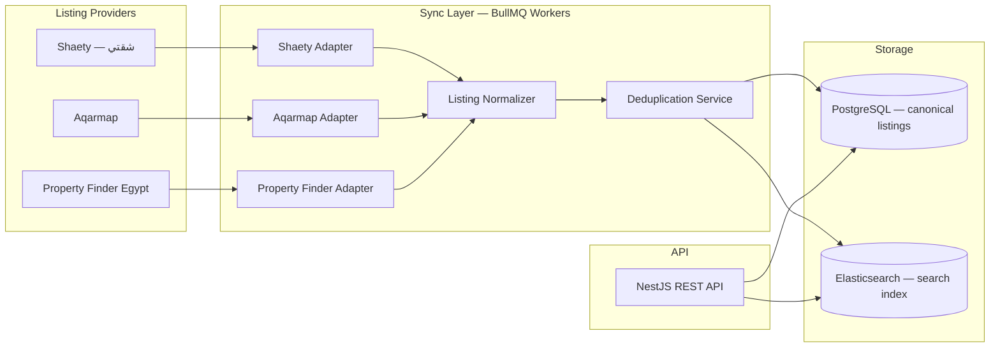
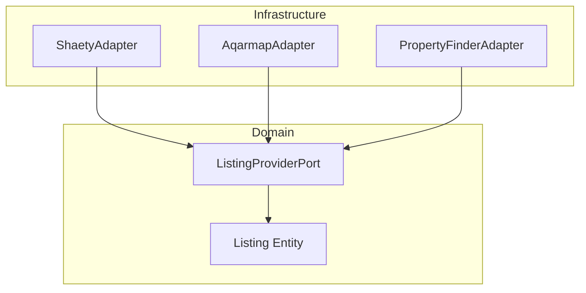

# Listing Providers Strategy

> Multi-source property ingestion from Egyptian listing platforms.

## Document Status

| Field | Value |
|-------|-------|
| Version | 0.1.0 |
| Status | Draft |
| Last Updated | 2026-06-03 |

## Decision Summary

| Decision | Choice |
|----------|--------|
| Data approach | **Third-party feeds** — no internal CMS for MVP |
| Mobile API | **REST** (MVP) |
| ORM | **Prisma** |
| Primary provider (recommended) | **Shaety — شقتي** |
| Additional providers | **Aqarmap**, **Property Finder Egypt** |

## Provider Catalog

| Provider | Name (EN) | Name (AR) | Priority | Notes |
|----------|-----------|-----------|----------|-------|
| **Shaety** | Shaety | شقتي | **Primary** | Product owner recommended; target first integration |
| **Aqarmap** | Aqarmap | عقار ماب | Secondary | Major Egypt real estate portal |
| **Property Finder Egypt** | Property Finder Egypt | — | Secondary | International brand, Egypt listings |

## Architecture — Multi-Provider Ingestion

## Canonical Listing Model

Each provider adapter maps its native format to a **unified domain model**:

| Field | Type | Notes |
|-------|------|-------|
| `id` | UUID | Platform-internal ID |
| `externalId` | string | Provider's listing ID |
| `provider` | enum | `shaety`, `aqarmap`, `property_finder_eg` |
| `title` | string | ar-EG + en where available |
| `description` | string | |
| `price` | decimal | EGP |
| `propertyType` | enum | apartment, villa, duplex, commercial, etc. |
| `listingType` | enum | sale, rent |
| `bedrooms` | int | |
| `bathrooms` | int | |
| `areaSqm` | decimal | |
| `location` | object | governorate, city, district, coordinates |
| `amenities` | string[] | normalized vocabulary |
| `images` | string[] | CDN or provider URLs |
| `sourceUrl` | string | Link back to original listing |
| `syncedAt` | datetime | Last successful sync |
| `isActive` | boolean | Deactivated if removed from provider |

## Provider Adapter Pattern (Clean Architecture)

Each adapter implements `ListingProviderPort`:

- `fetchListings(since?: Date): Promise<RawListing[]>`
- `fetchListingById(externalId: string): Promise<RawListing>`
- `mapToCanonical(raw: RawListing): CanonicalListing`

Domain layer never imports provider-specific code.

## Sync Strategy

| Aspect | MVP Approach |
|--------|--------------|
| Frequency | Scheduled job every 15–60 minutes per provider |
| Initial load | Full import on first connect |
| Incremental | Fetch listings updated since `lastSyncedAt` |
| Failure handling | Retry with exponential backoff; alert on 3 consecutive failures |
| Deactivation | Listings missing from provider for 24h marked `isActive: false` |
| Ordering | **Shaety first** in rollout; Aqarmap and Property Finder follow |

## Deduplication (Cross-Provider)

Same physical property may appear on multiple portals.

| Signal | Weight |
|--------|--------|
| Matching coordinates (within ~50m) | High |
| Same price + bedrooms + area | Medium |
| Similar title/address | Medium |

MVP: store all listings with `provider` tag; deduplication UI ("same property on 2 sites") deferred to post-MVP. Normalizer assigns `duplicateGroupId` when confidence > threshold.

## REST API (Mobile)

Mobile communicates via **REST JSON** for MVP:

| Method | Endpoint | Purpose |
|--------|----------|---------|
| GET | `/api/v1/properties` | Search with filters |
| GET | `/api/v1/properties/:id` | Listing detail |
| GET | `/api/v1/properties/:id/source` | Original provider URL |

GraphQL deferred post-MVP.

## Legal & Compliance Notes

- Verify API access terms, rate limits, and attribution requirements per provider
- Store `sourceUrl` and display provider attribution in listing detail UI
- Respect robots.txt / ToS if scraping is required (prefer official APIs/partnerships)
- Egypt PDPL: minimize stored PII from listing contacts; agent contact via platform only where possible

## Rollout Plan

| Phase | Provider | Goal |
|-------|----------|------|
| 1 | **Shaety (شقتي)** | First working sync + search |
| 2 | **Aqarmap** | Expand catalog coverage |
| 3 | **Property Finder Egypt** | Full multi-provider catalog |

## Open Questions (for property_search feature spec)

1. Official API availability and credentials for each provider
2. Shaety API documentation and partnership requirements
3. Image hosting — proxy through CDN or hotlink to provider URLs
4. Contact/agent data handling per provider

## Related Documents

- [System Design](./system_design.md)
- [Property Search Feature](../features/property_search/README.md)
- [Requirements](../specs/requirements.md)

## Approval

| Role | Name | Date | Status |
|------|------|------|--------|
| Product Owner | — | — | Pending |
| Tech Lead | — | — | Pending |
