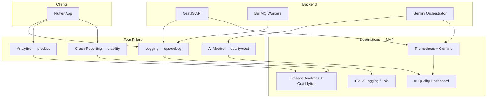
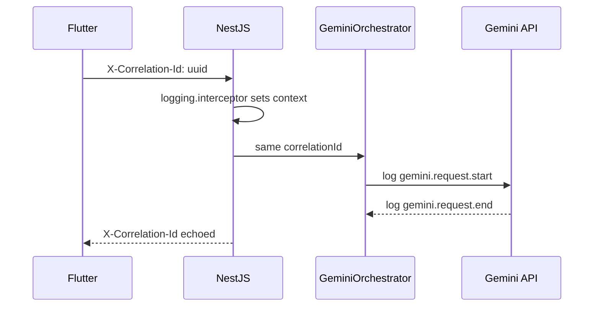
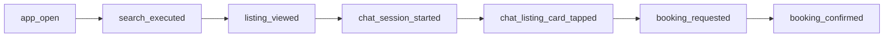
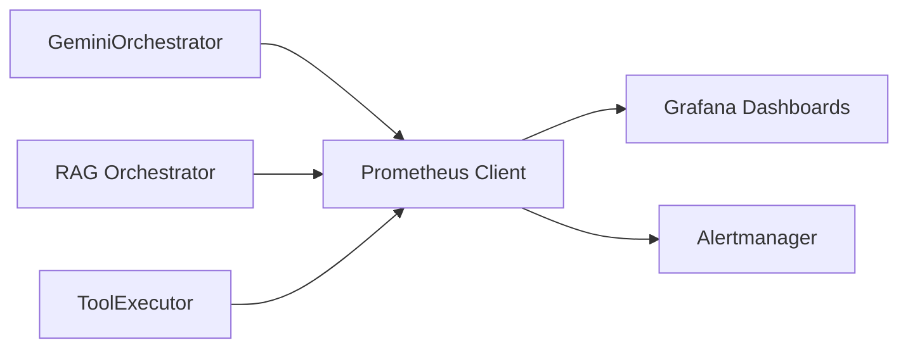
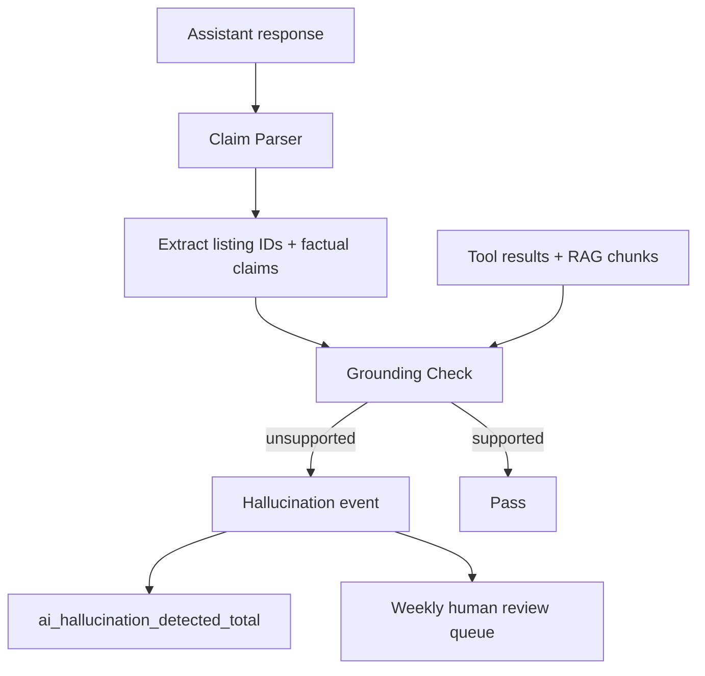
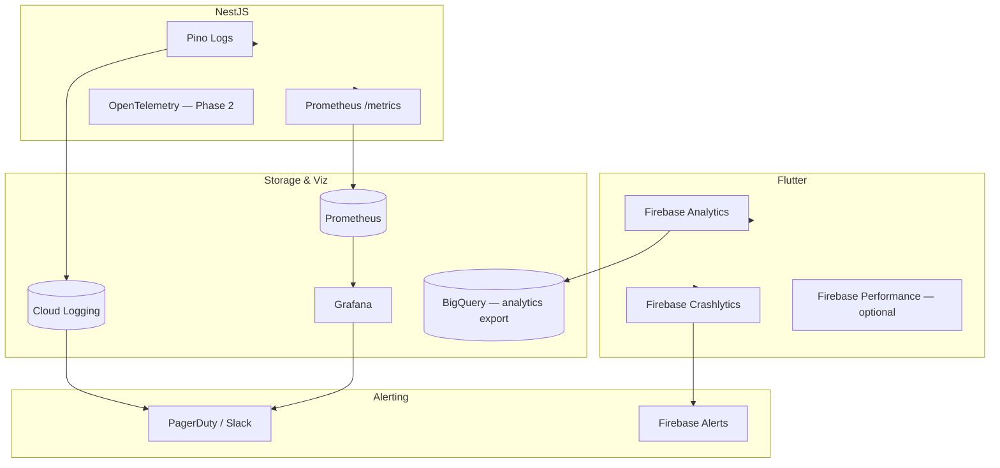

# Monitoring Strategy

> Observability for AI Property Assistant — logging, analytics, crash reporting, and AI-specific metrics.

## Document Status

| Field | Value |
|-------|-------|
| Version | 1.0.0 |
| Status | Draft |
| Last Updated | 2026-06-03 |
| Scope | Flutter mobile + NestJS backend + Gemini AI layer |
| SRS Traceability | NFR-OBS-001 through NFR-OBS-005 |

---

## 1. Overview

Monitoring spans four pillars. Each pillar has a distinct audience and retention policy.



### 1.1 Pillar Summary

| Pillar | Purpose | Primary tool (MVP) | Audience |
|--------|---------|-------------------|----------|
| **Logging** | Debug incidents, audit API/AI flows | Pino → Cloud Logging | Engineering, SRE |
| **Analytics** | Funnels, engagement, conversion | Firebase Analytics | Product, Growth |
| **Crash reporting** | Unhandled errors, ANRs | Firebase Crashlytics | Mobile team |
| **AI metrics** | Latency, cost, tokens, hallucinations | Prometheus + custom events | AI/ML, Engineering |

### 1.2 Priority Metrics (Tracked)

| Metric | Pillar(s) | Definition |
|--------|-----------|------------|
| **Latency** | Logging, AI metrics | p50/p95/p99 per layer (API, RAG, Gemini, E2E chat) |
| **Cost** | AI metrics | Estimated USD/EGP spend from token usage + embed calls |
| **Hallucination rate** | AI metrics | % of assistant turns with unsupported listing claims |
| **Token usage** | AI metrics, Logging | Input/output tokens per request, agent, user tier |
| **Conversion rate** | Analytics | Funnel: search → chat → listing view → booking |

---

## 2. Logging

### 2.1 Principles

| Principle | Implementation |
|-----------|----------------|
| Structured only | JSON lines — no unstructured `console.log` in production |
| Correlation | `correlationId` propagated API → workers → Gemini |
| No secrets | Never log passwords, JWTs, `GEMINI_API_KEY`, full prompts |
| PII minimization | Redact email, phone, national ID — Egypt PDPL |
| Sampling | Debug body logs at 1% in production |

### 2.2 Correlation ID Flow



| Header / field | Set by | Propagated to |
|----------------|--------|---------------|
| `X-Correlation-Id` | Mobile (UUID v4) or API if missing | All backend logs, AI logs, worker jobs |
| `X-Request-Id` | API gateway / NestJS | HTTP access logs |
| `userId` | JWT (hashed in logs optional) | Analytics join only — not in public logs |

### 2.3 Log Schema (Backend)

```json
{
  "timestamp": "2026-06-03T12:00:00.000Z",
  "level": "info",
  "service": "api",
  "correlationId": "550e8400-e29b-41d4-a716-446655440000",
  "requestId": "req-abc123",
  "message": "chat.message.completed",
  "context": {
    "userId": "usr_hash_8f3a",
    "conversationId": "uuid",
    "agentId": "search-agent",
    "durationMs": 2340,
    "statusCode": 200
  }
}
```

### 2.4 Standard Log Events

| Event | Level | When | Key fields |
|-------|-------|------|------------|
| `http.request` | info | Every API call | `method`, `path`, `statusCode`, `durationMs` |
| `auth.login` | info | Successful login | `provider`, `role` |
| `chat.message.start` | info | User message received | `conversationId`, `agentId` |
| `chat.message.completed` | info | Response sent | `durationMs`, `stream`, `toolCalls[]` |
| `gemini.request` | info | Gemini round-trip | `model`, `inputTokens`, `outputTokens`, `finishReason` |
| `rag.retrieve` | info | RAG pipeline | `listingCount`, `durationMs`, `cacheHit` |
| `tool.execute` | info | Tool executed | `toolName`, `durationMs`, `success` |
| `safety.blocked` | warn | Guardrail fired | `stage`, `reason` |
| `sync.provider` | info/error | Listing sync | `provider`, `records`, `error` |
| `job.failed` | error | BullMQ failure | `queue`, `jobId`, `attempts` |

### 2.5 Log Levels

| Level | Use |
|-------|-----|
| `error` | Unhandled exceptions, Gemini hard failures, sync failures |
| `warn` | Retries, safety blocks, budget trims, degraded RAG |
| `info` | Business events, completed requests |
| `debug` | Prompt assembly (dev/staging only) |

### 2.6 NestJS Implementation

| Component | Path | Role |
|-----------|------|------|
| `LoggingInterceptor` | `common/interceptors/logging.interceptor.ts` | HTTP timing + correlation |
| `PinoLogger` | `infrastructure/logging/` | JSON serializer |
| `AsyncLocalStorage` | Request context | `correlationId` in workers via job payload |

### 2.7 Retention

| Environment | Retention | Storage |
|-------------|-----------|---------|
| Production | 30 days hot, 90 days archive | Cloud Logging / Loki |
| Staging | 14 days | Same stack, separate project |
| Local | Console pretty-print | Developer machine |

---

## 3. Analytics (Product)

### 3.1 Tooling (MVP)

| Platform | SDK | Events |
|----------|-----|--------|
| **Firebase Analytics** | `firebase_analytics` (Flutter) | Screen views, funnels, user properties |
| **Backend events** (optional) | Internal `AnalyticsService` → BigQuery/Firebase | Server-side booking confirmations |

Post-MVP: PostHog or Mixpanel if cohort analysis needs exceed Firebase.

### 3.2 User Properties

| Property | Values | Purpose |
|----------|--------|---------|
| `locale` | `ar-EG`, `en` | Segment by language |
| `role` | `buyer`, `agent` | Role-based funnels |
| `preferred_agent_id` | agent slug | Agent adoption |
| `subscription_tier` | `free`, `plus` (post-MVP) | Monetization |
| `signup_method` | `email`, `google`, `apple` | Acquisition |

### 3.3 Core Event Catalog

| Event | Trigger | Parameters |
|-------|---------|------------|
| `app_open` | Cold/warm start | `source` |
| `search_executed` | Filter or NL search | `listing_type`, `city`, `result_count` |
| `listing_viewed` | Property detail opened | `listing_id`, `source` (search/chat/rec) |
| `listing_favorited` | Heart tap | `listing_id` |
| `chat_session_started` | New conversation | `agent_id` |
| `chat_message_sent` | User sends message | `agent_id`, `message_length_bucket` |
| `chat_listing_card_tapped` | Card in chat | `listing_id`, `agent_id` |
| `agent_switched` | Mid-session switch | `from_agent`, `to_agent` |
| `booking_requested` | Booking form submit | `listing_id`, `agent_id` |
| `booking_confirmed` | Agent confirms | `booking_id` |
| `recommendation_feedback` | Like/dislike | `listing_id`, `sentiment` |

### 3.4 Conversion Funnels



#### Conversion Rate Definitions

| Funnel | Formula | MVP target | Window |
|--------|---------|------------|--------|
| **Search → View** | `listing_viewed` / `search_executed` (unique users) | > 60% | 7-day |
| **View → Chat** | `chat_session_started` / `listing_viewed` | > 25% | 7-day |
| **Chat → Booking request** | `booking_requested` / `chat_session_started` | > 8% | 30-day |
| **Booking request → Confirmed** | `booking_confirmed` / `booking_requested` | > 50% | 30-day |
| **Search → Booking (E2E)** | `booking_confirmed` / `search_executed` | +15% vs baseline | 30-day |
| **AI-assisted conversion** | `booking_requested` within 10 min of `chat_message_sent` / chat users | Track only | 30-day |

### 3.5 Dashboards (Product)

| Dashboard | Widgets |
|-----------|---------|
| Acquisition | DAU, MAU, signups by provider |
| Engagement | Sessions/user, messages/session, agent distribution |
| Conversion | Funnel drop-off, AI-assisted booking % |
| Retention | D1/D7/D30 cohort retention |

---

## 4. Crash Reporting

### 4.1 Mobile — Firebase Crashlytics

| Capability | Configuration |
|------------|---------------|
| Fatal crashes | Auto-captured |
| Non-fatal | `FirebaseCrashlytics.instance.recordError()` for caught API failures |
| Keys | `correlationId`, `screen`, `agent_id` on crash report |
| Breadcrumbs | Navigation + last API endpoint |

### 4.2 Flutter Integration

```dart
// Set context before API calls
await FirebaseCrashlytics.instance.setCustomKey(
  'correlation_id',
  correlationId,
);

// Non-fatal: chat stream failure
FirebaseCrashlytics.instance.recordError(
  error,
  stackTrace,
  reason: 'chat_stream_failed',
);
```

### 4.3 Backend Error Tracking (Optional MVP+)

| Tool | Use |
|------|-----|
| **Sentry** (`@sentry/nestjs`) | Unhandled NestJS exceptions, worker failures |
| Release tracking | Git SHA as `release` |
| Alerts | New issue spike > 10/hour |

### 4.4 Stability SLOs

| Metric | Target | Alert |
|--------|--------|-------|
| Crash-free users (mobile) | > 99.5% | < 99% over 24h |
| ANR rate (Android) | < 0.5% | > 1% |
| API 5xx rate | < 0.1% | > 1% over 5 min (NFR-OBS-003) |

---

## 5. AI Metrics

Dedicated instrumentation in [gemini_integration_layer.md](./gemini_integration_layer.md) and RAG pipeline.

### 5.1 Metric Export (Prometheus)



**Naming convention:** `ai_<domain>_<metric>_<unit>` (snake_case).

### 5.2 Latency Metrics

| Metric | Type | Labels | Target p95 |
|--------|------|--------|------------|
| `ai_gemini_request_duration_ms` | Histogram | `agent_id`, `model`, `stream` | < 2,500 ms |
| `ai_rag_retrieve_duration_ms` | Histogram | `source` (property/project) | < 400 ms |
| `ai_embed_query_duration_ms` | Histogram | `model` | < 200 ms |
| `ai_tool_execute_duration_ms` | Histogram | `tool_name` | < 500 ms |
| `ai_chat_e2e_duration_ms` | Histogram | `agent_id`, `has_tools` | < 3,000 ms |
| `api_http_request_duration_ms` | Histogram | `route`, `method`, `status` | < 500 ms (non-AI) |

**Histogram buckets (ms):** `50, 100, 250, 500, 1000, 2500, 5000, 10000`

```typescript
// Example — NestJS prometheus client
aiChatE2eDuration.observe(
  { agent_id: 'search-agent', has_tools: 'true' },
  durationMs,
);
```

### 5.3 Token Usage Metrics

| Metric | Type | Labels |
|--------|------|--------|
| `ai_gemini_tokens_input_total` | Counter | `agent_id`, `model`, `prompt_version` |
| `ai_gemini_tokens_output_total` | Counter | `agent_id`, `model` |
| `ai_gemini_embed_tokens_total` | Counter | `operation` (query/listing/knowledge) |
| `ai_context_tokens_estimated` | Histogram | `block` (system/rag/history) |

**Per-request log (aggregated to counters):**

```json
{
  "message": "gemini.request",
  "inputTokens": 4200,
  "outputTokens": 380,
  "totalTokens": 4580,
  "agentId": "search-agent",
  "promptVersion": "v1"
}
```

| Quota | Enforcement | Metric |
|-------|-------------|--------|
| Free tier 10 msgs/day | API 429 | `ai_quota_exceeded_total` |
| Agent tier limits | Booking module | `agent_booking_quota_exceeded_total` |

### 5.4 Cost Metrics

Cost is **derived** from token counters — not billed in real time from Google.

#### Gemini Pricing Model (Indicative — update when Google changes rates)

| Model | Input ($/1M tokens) | Output ($/1M tokens) |
|-------|---------------------|----------------------|
| `gemini-2.0-flash` | ~$0.10 | ~$0.40 |
| `text-embedding-004` | ~$0.01 / 1M chars | — |

| Metric | Type | Calculation |
|--------|------|-------------|
| `ai_cost_usd_estimate_total` | Counter | Σ (input_tokens × rate_in + output_tokens × rate_out) per model |
| `ai_cost_per_conversation_usd` | Histogram | Sum tokens in session / sessions |
| `ai_cost_per_booking_usd` | Gauge (daily) | Daily AI cost / `booking_confirmed` count |

**Grafana panel:** Daily spend USD + EGP (FX rate config), breakdown by `agent_id`.

| Alert | Condition |
|-------|-----------|
| Daily AI spend spike | > 150% of 7-day average |
| Cost per booking | > $2.00 (tune post-MVP) |

### 5.5 Hallucination Rate

**Definition:** An assistant message contains a **property claim** (price, location, bedrooms, availability) that is **not supported** by tool results or RAG context for that turn.



#### Detection Methods

| Method | When | Cost |
|--------|------|------|
| **Rule-based** | Every response | Listing IDs in text ∉ `toolListingIds ∪ ragListingIds` → hallucination |
| **Citation parser** | Every response | Property claims without `[id: uuid]` or card ref |
| **LLM-as-judge** | 5% sample + all flagged | Async BullMQ job; Gemini flash evaluates faithfulness |
| **Human review** | 50 samples/week | Gold standard for rate calibration |

| Metric | Type | Formula |
|--------|------|---------|
| `ai_hallucination_detected_total` | Counter | Rule + judge flagged |
| `ai_hallucination_rate` | Gauge (daily) | `flagged / assistant_messages` × 100 |
| `ai_citation_rate` | Gauge | Messages with valid listing refs / property-related messages |
| `ai_faithfulness_score` | Histogram | LLM-judge 0–1 on sample |

| Target (MVP) | Source |
|--------------|--------|
| Hallucination rate **< 3%** | [rag_architecture.md](./rag_architecture.md) §8.3 |
| Citation rate **≥ 95%** | Same |

#### Post-Call Guardrail Integration

From [gemini_integration_layer.md](./gemini_integration_layer.md) §8.3:

- Invalid listing IDs stripped → increment `ai_guardrail_listing_id_stripped_total`
- If > 2 IDs stripped → count toward hallucination proxy

### 5.6 Additional AI Quality Metrics

| Metric | Target | Labels |
|--------|--------|--------|
| `ai_safety_blocked_total` | Monitor trend | `stage`: pre \| api \| post, `reason` |
| `ai_tool_calls_total` | — | `tool_name`, `agent_id` |
| `ai_tool_loop_turns` | Histogram | max 5 |
| `ai_rag_empty_retrieval_total` | < 5% of queries | `agent_id` |
| `ai_stream_aborted_total` | — | `reason` |
| `ai_empty_response_total` | < 0.1% | `agent_id` |

### 5.7 Per-Agent Dashboard

| Panel | Agents |
|-------|--------|
| Messages / day | search, recommendation, booking, follow-up |
| p95 latency | Per agent |
| Token usage | Per agent |
| Hallucination rate | Per agent |
| Tool call distribution | Per agent |
| Handoff rate | `suggestedAgentHandoff` analytics event |

---

## 6. Unified Observability Architecture



### 6.1 OpenTelemetry (Phase 2 — NFR-OBS-005)

| Span | Parent |
|------|--------|
| `POST /conversations/:id/messages` | HTTP |
| `rag.retrieve` | HTTP |
| `gemini.generateContent` | HTTP |
| `tool.semantic_search` | HTTP |

Trace ID = `correlationId` for log-trace correlation.

---

## 7. Alerting

### 7.1 Critical Alerts (Pager / Slack)

| Alert | Condition | Runbook |
|-------|-----------|---------|
| API error rate high | 5xx > 1% for 5 min | NFR-OBS-003 |
| Gemini unavailable | `ai_gemini_errors_total` > 10% for 5 min | Failover message |
| Chat p95 latency | `ai_chat_e2e_duration_ms` p95 > 5s for 15 min | Scale / reduce RAG K |
| Daily AI cost spike | > 150% of 7d avg | Review abuse / quotas |
| Hallucination rate | > 5% over 24h (rule-based) | Prompt rollback |
| Listing sync failed | 3 consecutive per provider | NFR-OBS-004 |
| Crash-free users | < 99% / 24h | Mobile hotfix |

### 7.2 Warning Alerts

| Alert | Condition |
|-------|-----------|
| RAG empty retrieval | > 10% for 1h |
| Embed queue depth | > 1000 jobs |
| Token usage per user | > 50k tokens/day (abuse) |
| Booking conversion drop | E2E funnel -20% WoW |

---

## 8. Dashboards

### 8.1 Engineering — Grafana

| Dashboard | Panels |
|-----------|--------|
| **API Health** | RPS, latency p50/p95, 4xx/5xx, top slow routes |
| **AI Operations** | Gemini latency, token rates, cost estimate, tool calls |
| **RAG** | Retrieval latency, empty rate, cache hit, embed lag |
| **Workers** | Queue depth, job failure rate, sync status |

### 8.2 AI Quality — Weekly Review

| Panel | Owner |
|-------|-------|
| Hallucination rate trend | AI/ML |
| Citation rate | AI/ML |
| Faithfulness sample scores | AI/ML |
| Recall@5 (offline golden set) | AI/ML |
| Agent comparison table | Product + Eng |

### 8.3 Product — Firebase / Looker

| Dashboard | Panels |
|-----------|--------|
| Growth | DAU, MAU, retention |
| Conversion | Full funnel + AI-assisted slice |
| Engagement | Chat depth, agent picker usage |

### 8.4 Executive — Monthly

| KPI | Source |
|-----|--------|
| Search → booking conversion | Analytics |
| AI cost / booking | Prometheus + Analytics |
| Crash-free rate | Crashlytics |
| Hallucination rate | AI metrics |
| p95 chat latency | Prometheus |

---

## 9. Implementation Checklist

### 9.1 Backend (NestJS)

| Task | Module |
|------|--------|
| Pino JSON logger + correlation middleware | `common/` |
| `LoggingInterceptor` | `common/interceptors/` |
| Prometheus `/metrics` endpoint | `infrastructure/metrics/` |
| `MetricsService` wrappers | `ai/infrastructure/gemini/` |
| Hallucination checker post-response | `ai/infrastructure/safety/` |
| BullMQ `evaluate-faithfulness` job | `ai/infrastructure/jobs/` |
| Cost counter from token usage | `ai/infrastructure/metrics/` |

### 9.2 Mobile (Flutter)

| Task | Package |
|------|---------|
| Firebase init | `firebase_core` |
| Analytics events | `firebase_analytics` |
| Crashlytics + keys | `firebase_crashlytics` |
| Correlation ID on Dio | `core/network/` |
| Performance traces (optional) | `firebase_performance` |

### 9.3 Infrastructure

| Task | Tool |
|------|------|
| Log drain | Cloud Logging / Loki |
| Prometheus scrape | K8s ServiceMonitor or sidecar |
| Grafana dashboards | JSON in `infra/grafana/` |
| Alert rules | `infra/prometheus/alerts.yml` |

---

## 10. Privacy & Compliance (Egypt PDPL)

| Rule | Implementation |
|------|----------------|
| No PII in logs | Hash `userId`; redact email/phone |
| Analytics consent | Opt-in banner; disable if declined |
| Right to erasure | Delete Firebase user data on account delete |
| Data residency | Prefer EU/US GCP regions with DPA — document in privacy policy |
| AI audit | Store `agentId`, `promptVersion`, `listingIds[]` — not full prompts |

---

## 11. Environment Variables

| Variable | Purpose |
|----------|---------|
| `LOG_LEVEL` | `info` \| `debug` |
| `LOG_PRETTY` | `true` local only |
| `METRICS_ENABLED` | Expose `/metrics` |
| `GEMINI_INPUT_COST_PER_1M` | Cost estimation override |
| `GEMINI_OUTPUT_COST_PER_1M` | Cost estimation override |
| `AI_HALLUCINATION_SAMPLE_RATE` | LLM-judge sample (default 0.05) |
| `SENTRY_DSN` | Backend errors (optional) |
| `ALERT_SLACK_WEBHOOK` | Alert destination |

---

## 12. Metric Quick Reference

| Track | Metric name(s) | Dashboard |
|-------|----------------|-----------|
| **Latency** | `ai_chat_e2e_duration_ms`, `ai_gemini_request_duration_ms`, `api_http_request_duration_ms` | Grafana AI Ops |
| **Cost** | `ai_cost_usd_estimate_total`, `ai_cost_per_booking_usd` | Grafana AI Cost |
| **Hallucination rate** | `ai_hallucination_rate`, `ai_citation_rate` | AI Quality |
| **Token usage** | `ai_gemini_tokens_input_total`, `ai_gemini_tokens_output_total` | Grafana AI Ops |
| **Conversion rate** | Firebase funnel `search → booking_confirmed` | Firebase / Product |

---

## 13. Related Documents

| Document | Path |
|----------|------|
| Gemini Integration Layer | [gemini_integration_layer.md](./gemini_integration_layer.md) |
| RAG Evaluation Metrics | [rag_architecture.md](./rag_architecture.md) §8 |
| AI Services Architecture | [ai_services_architecture.md](./ai_services_architecture.md) §11 |
| AI Agent Observability | [ai_agent_architecture.md](./ai_agent_architecture.md) §11 |
| SRS NFR-OBS | [requirements.md](../specs/requirements.md) §4.8 |
| Vision Success Metrics | [vision.md](../specs/vision.md) |

## Approval

| Role | Name | Date | Status |
|------|------|------|--------|
| Tech Lead | — | — | Pending |
| Product Owner | — | — | Pending |
| SRE | — | — | Pending |
