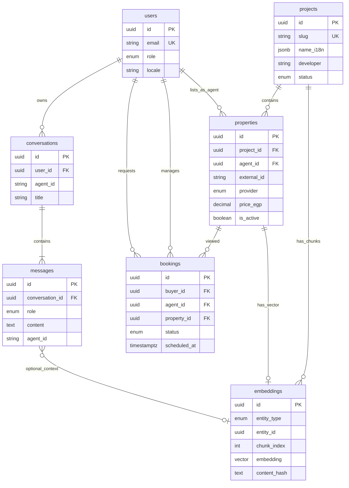
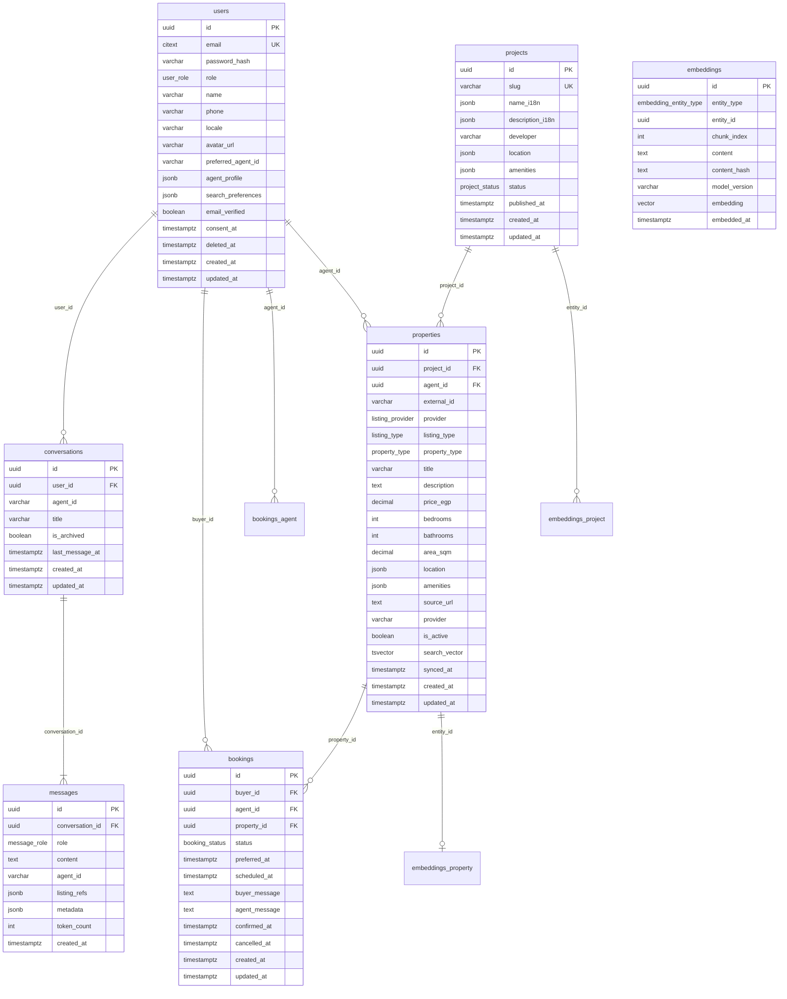
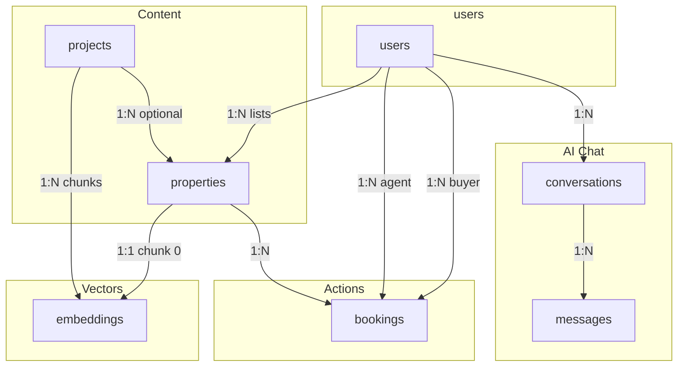

# PostgreSQL Schema

> Database schema for AI Property Assistant — PostgreSQL 16 + pgvector + Prisma.

## Document Status

| Field | Value |
|-------|-------|
| Version | 1.0.0 |
| Status | Draft |
| Last Updated | 2026-06-03 |
| ORM | Prisma |
| Extensions | `vector`, `pg_trgm` (optional) |

---

## 1. Overview

Seven core tables model users, listings, developments, bookings, AI chat, and vector embeddings. Supporting tables for auth and AI agent config are listed in §10.



---

## 2. Entity Relationship Diagram (Detailed)



---

## 3. Enums

```sql
CREATE TYPE user_role AS ENUM ('buyer', 'agent', 'admin');

CREATE TYPE listing_provider AS ENUM ('shaety', 'aqarmap', 'property_finder');

CREATE TYPE listing_type AS ENUM ('sale', 'rent');

CREATE TYPE property_type AS ENUM (
  'apartment', 'villa', 'duplex', 'townhouse',
  'commercial', 'land', 'other'
);

CREATE TYPE project_status AS ENUM ('draft', 'active', 'completed', 'archived');

CREATE TYPE booking_status AS ENUM (
  'requested', 'confirmed', 'completed', 'cancelled', 'declined'
);

CREATE TYPE message_role AS ENUM ('user', 'assistant', 'system');

CREATE TYPE embedding_entity_type AS ENUM ('property', 'project');
```

---

## 4. Table Definitions

### 4.1 `users`

Registered buyers, real estate agents, and admins.

| Column | Type | Constraints | Description |
|--------|------|-------------|-------------|
| `id` | `UUID` | PK, default `gen_random_uuid()` | |
| `email` | `CITEXT` | UNIQUE, NOT NULL | Case-insensitive |
| `password_hash` | `VARCHAR(255)` | NULL | NULL for OAuth-only |
| `role` | `user_role` | NOT NULL, default `'buyer'` | |
| `name` | `VARCHAR(120)` | | Display name |
| `phone` | `VARCHAR(20)` | | E.164 preferred |
| `locale` | `VARCHAR(10)` | NOT NULL, default `'ar-EG'` | `ar-EG` \| `en` |
| `avatar_url` | `TEXT` | | |
| `preferred_agent_id` | `VARCHAR(50)` | | Default AI agent |
| `agent_profile` | `JSONB` | | Bio, service areas (when `role = agent`) |
| `search_preferences` | `JSONB` | | Budget, areas, types |
| `email_verified` | `BOOLEAN` | NOT NULL, default `false` | |
| `consent_at` | `TIMESTAMPTZ` | | PDPL consent timestamp |
| `deleted_at` | `TIMESTAMPTZ` | | Soft delete |
| `created_at` | `TIMESTAMPTZ` | NOT NULL, default `now()` | |
| `updated_at` | `TIMESTAMPTZ` | NOT NULL | |

**`agent_profile` JSON example:**
```json
{
  "bio": { "en": "...", "ar": "..." },
  "serviceAreas": ["Cairo", "New Cairo", "Giza"],
  "licenseNumber": null
}
```

**`search_preferences` JSON example:**
```json
{
  "listingType": "rent",
  "maxPriceEgp": 15000,
  "propertyTypes": ["apartment"],
  "cities": ["Cairo"]
}
```

---

### 4.2 `projects`

Real estate developments, compounds, and off-plan projects (RAG knowledge + property grouping).

| Column | Type | Constraints | Description |
|--------|------|-------------|-------------|
| `id` | `UUID` | PK | |
| `slug` | `VARCHAR(100)` | UNIQUE, NOT NULL | URL-safe key |
| `name_i18n` | `JSONB` | NOT NULL | `{ "en": "...", "ar": "..." }` |
| `description_i18n` | `JSONB` | | Full marketing copy |
| `developer` | `VARCHAR(120)` | | e.g. Palm Hills |
| `location` | `JSONB` | NOT NULL | Governorate, city, coordinates |
| `amenities` | `JSONB` | | Pool, gym, security, etc. |
| `status` | `project_status` | NOT NULL, default `'active'` | |
| `published_at` | `TIMESTAMPTZ` | | |
| `created_at` | `TIMESTAMPTZ` | NOT NULL | |
| `updated_at` | `TIMESTAMPTZ` | NOT NULL | |

**`location` JSON example:**
```json
{
  "governorate": "Cairo",
  "city": "New Cairo",
  "district": "Fifth Settlement",
  "latitude": 30.017,
  "longitude": 31.423
}
```

---

### 4.3 `properties`

Property listings synced from Shaety, Aqarmap, Property Finder Egypt.

| Column | Type | Constraints | Description |
|--------|------|-------------|-------------|
| `id` | `UUID` | PK | |
| `project_id` | `UUID` | FK → `projects(id)` ON DELETE SET NULL | Optional compound link |
| `agent_id` | `UUID` | FK → `users(id)` ON DELETE SET NULL | Listing agent |
| `external_id` | `VARCHAR(100)` | NOT NULL | Provider listing ID |
| `provider` | `listing_provider` | NOT NULL | |
| `listing_type` | `listing_type` | NOT NULL | sale / rent |
| `property_type` | `property_type` | NOT NULL | |
| `title` | `VARCHAR(500)` | NOT NULL | |
| `description` | `TEXT` | | |
| `price_egp` | `DECIMAL(14,2)` | NOT NULL | |
| `bedrooms` | `INT` | | |
| `bathrooms` | `INT` | | |
| `area_sqm` | `DECIMAL(10,2)` | | |
| `location` | `JSONB` | NOT NULL | Governorate, city, district, lat/lng |
| `amenities` | `JSONB` | default `'[]'` | Normalized tags |
| `images` | `JSONB` | default `'[]'` | URL array |
| `source_url` | `TEXT` | | Original listing link |
| `is_active` | `BOOLEAN` | NOT NULL, default `true` | |
| `search_vector` | `TSVECTOR` | | Full-text index |
| `synced_at` | `TIMESTAMPTZ` | NOT NULL | Last provider sync |
| `created_at` | `TIMESTAMPTZ` | NOT NULL | |
| `updated_at` | `TIMESTAMPTZ` | NOT NULL | |

**Unique constraint:**
```sql
UNIQUE (provider, external_id)
```

**`location` JSON example:**
```json
{
  "governorate": "Cairo",
  "city": "Maadi",
  "district": "Degla",
  "latitude": 29.960,
  "longitude": 31.270
}
```

---

### 4.4 `bookings`

Property viewing appointments between buyers and agents.

| Column | Type | Constraints | Description |
|--------|------|-------------|-------------|
| `id` | `UUID` | PK | |
| `buyer_id` | `UUID` | FK → `users(id)` NOT NULL | |
| `agent_id` | `UUID` | FK → `users(id)` NOT NULL | Must be `role = agent` |
| `property_id` | `UUID` | FK → `properties(id)` NOT NULL | |
| `status` | `booking_status` | NOT NULL, default `'requested'` | |
| `preferred_at` | `TIMESTAMPTZ` | NOT NULL | Buyer requested time |
| `scheduled_at` | `TIMESTAMPTZ` | | Confirmed time |
| `buyer_message` | `TEXT` | | Optional note |
| `agent_message` | `TEXT` | | Decline / reschedule note |
| `confirmed_at` | `TIMESTAMPTZ` | | |
| `cancelled_at` | `TIMESTAMPTZ` | | |
| `created_at` | `TIMESTAMPTZ` | NOT NULL | |
| `updated_at` | `TIMESTAMPTZ` | NOT NULL | |

**Indexes:**
```sql
CREATE INDEX bookings_buyer_id_idx ON bookings (buyer_id);
CREATE INDEX bookings_agent_id_idx ON bookings (agent_id);
CREATE INDEX bookings_status_idx ON bookings (status);
CREATE INDEX bookings_scheduled_at_idx ON bookings (scheduled_at) WHERE status = 'confirmed';
```

---

### 4.5 `conversations`

AI chat sessions (one user, one active agent at a time, switchable mid-session).

| Column | Type | Constraints | Description |
|--------|------|-------------|-------------|
| `id` | `UUID` | PK | |
| `user_id` | `UUID` | FK → `users(id)` ON DELETE CASCADE | |
| `agent_id` | `VARCHAR(50)` | NOT NULL | Current AI agent (`search-agent`, etc.) |
| `title` | `VARCHAR(200)` | | Auto-generated from first message |
| `is_archived` | `BOOLEAN` | NOT NULL, default `false` | |
| `last_message_at` | `TIMESTAMPTZ` | | Denormalized for sort |
| `created_at` | `TIMESTAMPTZ` | NOT NULL | |
| `updated_at` | `TIMESTAMPTZ` | NOT NULL | |

---

### 4.6 `messages`

Chat messages within a conversation.

| Column | Type | Constraints | Description |
|--------|------|-------------|-------------|
| `id` | `UUID` | PK | |
| `conversation_id` | `UUID` | FK → `conversations(id)` ON DELETE CASCADE | |
| `role` | `message_role` | NOT NULL | user / assistant / system |
| `content` | `TEXT` | NOT NULL | Message body |
| `agent_id` | `VARCHAR(50)` | | AI agent that generated reply (assistant only) |
| `listing_refs` | `JSONB` | default `'[]'` | Property cards cited |
| `metadata` | `JSONB` | | Tools called, latency, tokens |
| `token_count` | `INT` | | Approximate |
| `created_at` | `TIMESTAMPTZ` | NOT NULL | |

**`listing_refs` JSON example:**
```json
[
  { "propertyId": "uuid", "title": "3BR Maadi", "priceEgp": 25000 }
]
```

**`metadata` JSON example:**
```json
{
  "toolsCalled": ["semantic_search"],
  "latencyMs": 1200,
  "model": "gemini-2.0-flash"
}
```

---

### 4.7 `embeddings`

Vector embeddings for semantic search and RAG (pgvector).

| Column | Type | Constraints | Description |
|--------|------|-------------|-------------|
| `id` | `UUID` | PK | |
| `entity_type` | `embedding_entity_type` | NOT NULL | `property` \| `project` |
| `entity_id` | `UUID` | NOT NULL | FK polymorphic |
| `chunk_index` | `INT` | NOT NULL, default `0` | 0 for property (single chunk) |
| `content` | `TEXT` | NOT NULL | Text that was embedded |
| `content_hash` | `VARCHAR(64)` | NOT NULL | SHA-256 for change detection |
| `model_version` | `VARCHAR(50)` | NOT NULL | e.g. `text-embedding-004` |
| `embedding` | `vector(768)` | NOT NULL | Gemini embedding |
| `embedded_at` | `TIMESTAMPTZ` | NOT NULL, default `now()` | |

**Unique constraint:**
```sql
UNIQUE (entity_type, entity_id, chunk_index)
```

| entity_type | entity_id | chunk_index | Usage |
|-------------|-----------|-------------|-------|
| `property` | `properties.id` | `0` | One embedding per listing |
| `project` | `projects.id` | `0..N` | Section chunks (overview, amenities, payment) |

---

## 5. Relationships Summary



| Relationship | Cardinality | FK |
|--------------|-------------|-----|
| User → Conversations | 1:N | `conversations.user_id` |
| Conversation → Messages | 1:N | `messages.conversation_id` |
| User (buyer) → Bookings | 1:N | `bookings.buyer_id` |
| User (agent) → Bookings | 1:N | `bookings.agent_id` |
| Property → Bookings | 1:N | `bookings.property_id` |
| Project → Properties | 1:N | `properties.project_id` (optional) |
| User (agent) → Properties | 1:N | `properties.agent_id` (optional) |
| Property → Embeddings | 1:1 | `embeddings` where `entity_type=property`, `chunk_index=0` |
| Project → Embeddings | 1:N | `embeddings` where `entity_type=project` |

---

## 6. Indexes

### 6.1 B-tree Indexes

```sql
-- users
CREATE UNIQUE INDEX users_email_idx ON users (email) WHERE deleted_at IS NULL;
CREATE INDEX users_role_idx ON users (role);

-- properties
CREATE INDEX properties_location_city_idx
  ON properties ((location->>'city'));
CREATE INDEX properties_price_egp_idx ON properties (price_egp);
CREATE INDEX properties_listing_type_idx ON properties (listing_type);
CREATE INDEX properties_is_active_idx ON properties (is_active) WHERE is_active = true;
CREATE INDEX properties_project_id_idx ON properties (project_id);
CREATE INDEX properties_provider_external_idx ON properties (provider, external_id);

-- projects
CREATE INDEX projects_status_idx ON projects (status);
CREATE INDEX projects_slug_idx ON projects (slug);

-- conversations
CREATE INDEX conversations_user_id_idx ON conversations (user_id);
CREATE INDEX conversations_last_message_at_idx ON conversations (user_id, last_message_at DESC);

-- messages
CREATE INDEX messages_conversation_id_idx ON messages (conversation_id, created_at);
```

### 6.2 Full-Text Search

```sql
CREATE INDEX properties_search_vector_idx
  ON properties USING gin (search_vector);

-- Trigger to maintain search_vector on insert/update
-- to_tsvector('simple', coalesce(title,'') || ' ' || coalesce(description,''))
```

### 6.3 pgvector (HNSW)

```sql
CREATE INDEX embeddings_hnsw_idx
  ON embeddings
  USING hnsw (embedding vector_cosine_ops)
  WITH (m = 16, ef_construction = 64);

-- Partial indexes per entity type (optional, query planning)
CREATE INDEX embeddings_property_idx
  ON embeddings (entity_id)
  WHERE entity_type = 'property';

CREATE INDEX embeddings_project_idx
  ON embeddings (entity_id)
  WHERE entity_type = 'project';
```

### 6.4 Sample Vector Query

```sql
-- Semantic property search (hybrid with filters)
SELECT
  p.*,
  e.embedding <=> $1::vector AS distance
FROM properties p
JOIN embeddings e
  ON e.entity_type = 'property'
 AND e.entity_id = p.id
 AND e.chunk_index = 0
WHERE p.is_active = true
  AND p.location->>'city' = $2
  AND p.price_egp <= $3
ORDER BY distance
LIMIT 5;
```

---

## 7. SQL DDL (Core Tables)

```sql
CREATE EXTENSION IF NOT EXISTS "pgcrypto";
CREATE EXTENSION IF NOT EXISTS "vector";
CREATE EXTENSION IF NOT EXISTS "citext";

-- Enums (see §3)

CREATE TABLE users (
  id                UUID PRIMARY KEY DEFAULT gen_random_uuid(),
  email             CITEXT NOT NULL,
  password_hash     VARCHAR(255),
  role              user_role NOT NULL DEFAULT 'buyer',
  name              VARCHAR(120),
  phone             VARCHAR(20),
  locale            VARCHAR(10) NOT NULL DEFAULT 'ar-EG',
  avatar_url        TEXT,
  preferred_agent_id VARCHAR(50),
  agent_profile     JSONB,
  search_preferences JSONB,
  email_verified    BOOLEAN NOT NULL DEFAULT false,
  consent_at        TIMESTAMPTZ,
  deleted_at        TIMESTAMPTZ,
  created_at        TIMESTAMPTZ NOT NULL DEFAULT now(),
  updated_at        TIMESTAMPTZ NOT NULL DEFAULT now()
);

CREATE TABLE projects (
  id                UUID PRIMARY KEY DEFAULT gen_random_uuid(),
  slug              VARCHAR(100) NOT NULL UNIQUE,
  name_i18n         JSONB NOT NULL,
  description_i18n  JSONB,
  developer         VARCHAR(120),
  location          JSONB NOT NULL,
  amenities         JSONB DEFAULT '[]',
  status            project_status NOT NULL DEFAULT 'active',
  published_at      TIMESTAMPTZ,
  created_at        TIMESTAMPTZ NOT NULL DEFAULT now(),
  updated_at        TIMESTAMPTZ NOT NULL DEFAULT now()
);

CREATE TABLE properties (
  id                UUID PRIMARY KEY DEFAULT gen_random_uuid(),
  project_id        UUID REFERENCES projects(id) ON DELETE SET NULL,
  agent_id          UUID REFERENCES users(id) ON DELETE SET NULL,
  external_id       VARCHAR(100) NOT NULL,
  provider          listing_provider NOT NULL,
  listing_type      listing_type NOT NULL,
  property_type     property_type NOT NULL,
  title             VARCHAR(500) NOT NULL,
  description       TEXT,
  price_egp         DECIMAL(14,2) NOT NULL,
  bedrooms          INT,
  bathrooms         INT,
  area_sqm          DECIMAL(10,2),
  location          JSONB NOT NULL,
  amenities         JSONB NOT NULL DEFAULT '[]',
  images            JSONB NOT NULL DEFAULT '[]',
  source_url        TEXT,
  is_active         BOOLEAN NOT NULL DEFAULT true,
  search_vector     TSVECTOR,
  synced_at         TIMESTAMPTZ NOT NULL DEFAULT now(),
  created_at        TIMESTAMPTZ NOT NULL DEFAULT now(),
  updated_at        TIMESTAMPTZ NOT NULL DEFAULT now(),
  UNIQUE (provider, external_id)
);

CREATE TABLE bookings (
  id                UUID PRIMARY KEY DEFAULT gen_random_uuid(),
  buyer_id          UUID NOT NULL REFERENCES users(id),
  agent_id          UUID NOT NULL REFERENCES users(id),
  property_id       UUID NOT NULL REFERENCES properties(id),
  status            booking_status NOT NULL DEFAULT 'requested',
  preferred_at      TIMESTAMPTZ NOT NULL,
  scheduled_at      TIMESTAMPTZ,
  buyer_message     TEXT,
  agent_message     TEXT,
  confirmed_at      TIMESTAMPTZ,
  cancelled_at      TIMESTAMPTZ,
  created_at        TIMESTAMPTZ NOT NULL DEFAULT now(),
  updated_at        TIMESTAMPTZ NOT NULL DEFAULT now()
);

CREATE TABLE conversations (
  id                UUID PRIMARY KEY DEFAULT gen_random_uuid(),
  user_id           UUID NOT NULL REFERENCES users(id) ON DELETE CASCADE,
  agent_id          VARCHAR(50) NOT NULL,
  title             VARCHAR(200),
  is_archived       BOOLEAN NOT NULL DEFAULT false,
  last_message_at   TIMESTAMPTZ,
  created_at        TIMESTAMPTZ NOT NULL DEFAULT now(),
  updated_at        TIMESTAMPTZ NOT NULL DEFAULT now()
);

CREATE TABLE messages (
  id                UUID PRIMARY KEY DEFAULT gen_random_uuid(),
  conversation_id   UUID NOT NULL REFERENCES conversations(id) ON DELETE CASCADE,
  role              message_role NOT NULL,
  content           TEXT NOT NULL,
  agent_id          VARCHAR(50),
  listing_refs      JSONB NOT NULL DEFAULT '[]',
  metadata          JSONB,
  token_count       INT,
  created_at        TIMESTAMPTZ NOT NULL DEFAULT now()
);

CREATE TABLE embeddings (
  id                UUID PRIMARY KEY DEFAULT gen_random_uuid(),
  entity_type       embedding_entity_type NOT NULL,
  entity_id         UUID NOT NULL,
  chunk_index       INT NOT NULL DEFAULT 0,
  content           TEXT NOT NULL,
  content_hash      VARCHAR(64) NOT NULL,
  model_version     VARCHAR(50) NOT NULL DEFAULT 'text-embedding-004',
  embedding         vector(768) NOT NULL,
  embedded_at       TIMESTAMPTZ NOT NULL DEFAULT now(),
  UNIQUE (entity_type, entity_id, chunk_index)
);
```

---

## 8. Cardinality Diagram

```
users (1) ──────< (N) conversations
users (1) ──────< (N) messages          [via conversations]
users (1) ──────< (N) bookings         [as buyer]
users (1) ──────< (N) bookings         [as agent]
users (1) ──────< (N) properties       [as listing agent, optional]

projects (1) ───< (N) properties       [optional link]
projects (1) ───< (N) embeddings       [chunk_index 0..N]

properties (1) ─< (N) bookings
properties (1) ─── (1) embeddings      [chunk_index = 0]

conversations (1) ─< (N) messages
```

---

## 9. Prisma Model Mapping (Reference)

| SQL Table | Prisma Model | Notes |
|-----------|--------------|-------|
| `users` | `User` | `@@map("users")` |
| `projects` | `Project` | |
| `properties` | `Property` | |
| `bookings` | `Booking` | |
| `conversations` | `Conversation` | |
| `messages` | `Message` | |
| `embeddings` | `Embedding` | `Unsupported("vector")` or custom type |

---

## 10. Recommended Supporting Tables (Out of Scope)

Not in the core ERD but required for full platform:

| Table | Purpose |
|-------|---------|
| `refresh_tokens` | JWT refresh rotation |
| `oauth_accounts` | Google / Apple links |
| `ai_agents` | Agent catalog (`conversations.agent_id`) |
| `favorites` | User ↔ property saves |
| `notification_preferences` | Push/email opt-in |

---

## 11. Related Documents

| Document | Path |
|----------|------|
| RAG Architecture | [rag_architecture.md](./rag_architecture.md) |
| Backend Architecture | [backend_architecture.md](./backend_architecture.md) |
| Listing Providers | [listing_providers.md](./listing_providers.md) |

## Approval

| Role | Name | Date | Status |
|------|------|------|--------|
| Tech Lead | — | — | Pending |
| DBA | — | — | Pending |
