# RAG Architecture

> Retrieval-Augmented Generation for AI Property Assistant — multi-source knowledge with Gemini embeddings and pgvector.

## Document Status

| Field | Value |
|-------|-------|
| Version | 1.0.0 |
| Status | Draft |
| Last Updated | 2026-06-03 |
| Embedding Model | Gemini `text-embedding-004` (768 dimensions) |
| Vector Store | **pgvector** (PostgreSQL 16) |
| LLM | Gemini `gemini-2.0-flash` |
| Orchestration | NestJS RAG Pipeline |

---

## 1. Overview

RAG grounds Gemini responses in **verified platform knowledge** instead of model parametric memory. Four knowledge sources feed a unified chunk store; retrieval is **hybrid** (vector + metadata filters + optional keyword) and **agent-aware** (each agent receives only relevant source types).

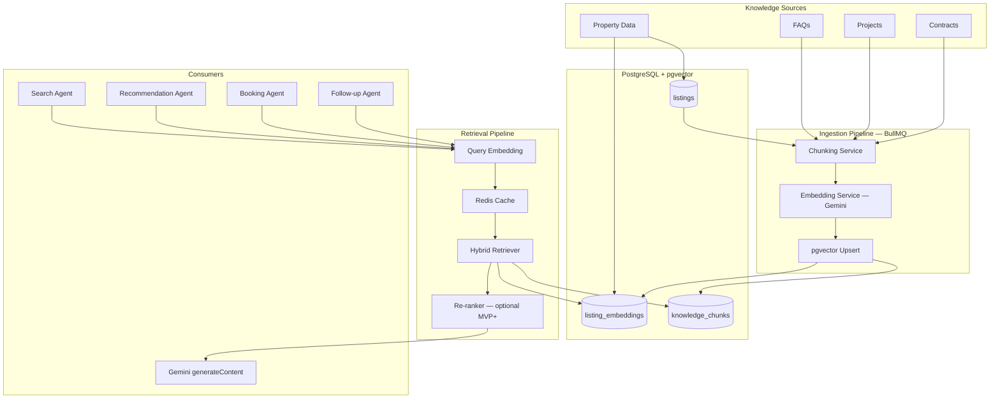

---

## 2. Knowledge Sources

### 2.1 Source Catalog

| Source ID | Name | Content | Update Frequency | Primary Agents |
|-----------|------|---------|------------------|----------------|
| `property` | Property Data | Synced listings (Shaety, Aqarmap, PF) | Every 30–60 min | Search, Recommendation, Booking |
| `faq` | FAQs | Platform help, buying/renting process, Egypt market | Weekly / on change | Search, Booking, Follow-up |
| `project` | Projects | Developments, compounds, off-plan (developer projects) | Daily / on change | Search, Recommendation |
| `contract` | Contracts | Template clauses, glossary, process guides (not legal advice) | On version bump | Booking, Follow-up |

### 2.2 Source Characteristics

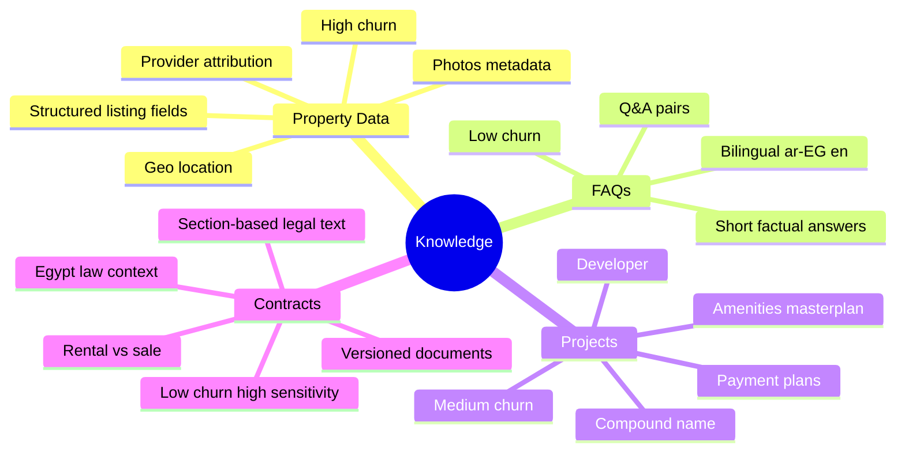

### 2.3 Source-to-Agent Matrix

| Agent | property | faq | project | contract |
|-------|:--------:|:---:|:-------:|:--------:|
| Search Agent | ✅ Primary | ✅ | ✅ | ❌ |
| Recommendation Agent | ✅ Primary | ❌ | ✅ | ❌ |
| Booking Agent | ✅ Context | ✅ | ❌ | ✅ |
| Follow-up Agent | ✅ Similar | ✅ | ❌ | ✅ |

### 2.4 Data Ownership

| Source | Authoritative Table | Vector Table |
|--------|---------------------|--------------|
| Property Data | `properties` | `embeddings` (`entity_type = property`) |
| Projects | `projects` | `embeddings` (`entity_type = project`, multi-chunk) |
| FAQs, Contracts | `knowledge_documents` (supporting) | `knowledge_chunks` or future `embeddings` extension |

---

## 3. Data Model

### 3.1 Entity Relationship

```mermaid
erDiagram
    listings ||--o| listing_embeddings : has
    knowledge_documents ||--|{ knowledge_chunks : contains

    listings {
        uuid id PK
        string external_id
        enum provider
        jsonb location
        decimal price_egp
        boolean is_active
        tsvector search_vector
    }

    listing_embeddings {
        uuid listing_id PK_FK
        vector embedding
        text content_hash
        text model_version
    }

    knowledge_documents {
        uuid id PK
        enum source_type
        string external_key UK
        jsonb title_i18n
        enum status
        text version
        timestamp published_at
    }

    knowledge_chunks {
        uuid id PK
        uuid document_id FK
        enum source_type
        int chunk_index
        text content
        jsonb metadata
        vector embedding
        text content_hash
        text model_version
    }
```

### 3.2 `knowledge_documents`

| Column | Type | Description |
|--------|------|-------------|
| `id` | UUID | Primary key |
| `source_type` | enum | `faq`, `project`, `contract` |
| `external_key` | string | Stable ID (e.g. `faq:booking-process`, `project:new-capital-east`) |
| `title_i18n` | jsonb | `{ "en": "...", "ar": "..." }` |
| `locale_primary` | string | `ar-EG` or `en` |
| `status` | enum | `draft`, `published`, `archived` |
| `version` | string | Semantic version for contracts |
| `published_at` | timestamptz | When live |
| `source_uri` | string? | CMS / file path for audit |

### 3.3 `knowledge_chunks`

| Column | Type | Description |
|--------|------|-------------|
| `id` | UUID | Primary key |
| `document_id` | UUID | FK → `knowledge_documents` |
| `source_type` | enum | Denormalized for filter index |
| `chunk_index` | int | Order within document |
| `content` | text | Chunk text (embedded) |
| `metadata` | jsonb | Source-specific filters (see §4) |
| `embedding` | vector(768) | Gemini embedding |
| `content_hash` | text | SHA-256 — skip re-embed if unchanged |
| `model_version` | text | `text-embedding-004` |
| `token_count` | int | Approximate tokens |

### 3.4 Indexes

```sql
CREATE EXTENSION IF NOT EXISTS vector;

-- Property (existing pattern)
CREATE INDEX listing_embeddings_hnsw_idx
  ON listing_embeddings USING hnsw (embedding vector_cosine_ops);

-- Knowledge chunks — HNSW + metadata
CREATE INDEX knowledge_chunks_hnsw_idx
  ON knowledge_chunks USING hnsw (embedding vector_cosine_ops);

CREATE INDEX knowledge_chunks_source_idx
  ON knowledge_chunks (source_type, (metadata->>'locale'));

CREATE INDEX knowledge_chunks_document_idx
  ON knowledge_chunks (document_id, chunk_index);

-- Full-text fallback on chunk content
CREATE INDEX knowledge_chunks_fts_idx
  ON knowledge_chunks USING gin (to_tsvector('simple', content));
```

---

## 4. Chunking Strategy

### 4.1 Principles

| Principle | Rule |
|-----------|------|
| **Source-specific** | Each source type has its own chunker — no one-size-fits-all |
| **Self-contained** | Each chunk must be understandable without adjacent chunks |
| **Metadata-rich** | Every chunk carries filters for retrieval (locale, type, price band) |
| **Stable IDs** | `content_hash` prevents redundant re-embedding |
| **Bilingual** | Arabic and English content chunked separately when both exist |
| **Max token budget** | Target 256–512 tokens per chunk; hard cap 768 tokens |

### 4.2 Chunking by Source

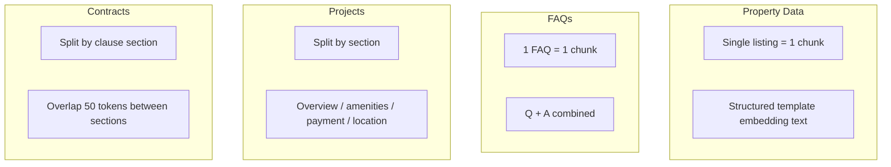

#### 4.2.1 Property Data — **Entity Chunk** (1:1)

| Attribute | Value |
|-----------|-------|
| **Granularity** | 1 listing = 1 embedding (no text splitting) |
| **Rationale** | Listings are atomic retrieval units; splitting breaks price/location integrity |
| **Storage** | `listing_embeddings` (not `knowledge_chunks`) |

**Chunk template (embedding text):**
```
[PROPERTY]
Title: {{title}}
Type: {{propertyType}} | {{listingType}} | {{bedrooms}} BR | {{areaSqm}} sqm
Price: {{priceEgp}} EGP
Location: {{district}}, {{city}}, {{governorate}}
Description: {{description}}
Amenities: {{amenities}}
Provider: {{provider}} | ID: {{listingId}}
```

**Metadata (on `listings` row, used at retrieval):**
```json
{
  "source_type": "property",
  "listing_id": "uuid",
  "governorate": "Cairo",
  "city": "New Cairo",
  "listing_type": "rent",
  "property_type": "apartment",
  "price_egp": 15000,
  "bedrooms": 3,
  "provider": "shaety",
  "is_active": true
}
```

#### 4.2.2 FAQs — **Q+A Pair Chunk** (1:1 per FAQ)

| Attribute | Value |
|-----------|-------|
| **Granularity** | 1 FAQ entry = 1 chunk |
| **Max size** | ~400 tokens (typical FAQ fits) |
| **Split rule** | If Q+A > 512 tokens → split answer into paragraphs with shared `faq_id` |

**Chunk template:**
```
[FAQ]
Category: {{category}}
Question: {{question}}
Answer: {{answer}}
Locale: {{locale}}
```

**Metadata:**
```json
{
  "source_type": "faq",
  "category": "booking",
  "locale": "ar-EG",
  "tags": ["viewing", "appointment"],
  "faq_id": "faq-booking-001"
}
```

**Categories (MVP):** `search`, `booking`, `account`, `payments`, `egypt_market`, `agents`, `ai_chat`

#### 4.2.3 Projects — **Section Chunk** (1:N per project)

| Attribute | Value |
|-----------|-------|
| **Granularity** | Split by logical section |
| **Sections** | `overview`, `location`, `amenities`, `unit_types`, `payment_plans`, `developer` |
| **Max size** | 512 tokens per section |
| **Overlap** | 0 (sections are disjoint by heading) |

**Chunk template:**
```
[PROJECT]
Name: {{projectName}}
Developer: {{developer}}
Section: {{section}}
Content: {{sectionContent}}
Location: {{city}}, {{governorate}}
Locale: {{locale}}
```

**Metadata:**
```json
{
  "source_type": "project",
  "project_id": "project-new-capital-east",
  "section": "payment_plans",
  "developer": "Palm Hills",
  "city": "New Cairo",
  "governorate": "Cairo",
  "locale": "ar-EG",
  "status": "active"
}
```

#### 4.2.4 Contracts — **Clause Chunk** with Overlap (1:N per document)

| Attribute | Value |
|-----------|-------|
| **Granularity** | Split by clause / heading (H2/H3) |
| **Max size** | 400 tokens per chunk |
| **Overlap** | **50 tokens** between consecutive chunks (preserve legal context) |
| **Sensitivity** | Include `disclaimer` chunk at document level always retrieved for contract queries |

**Chunk template:**
```
[CONTRACT — INFORMATIONAL ONLY]
Document: {{documentTitle}}
Type: {{contractType}}
Version: {{version}}
Section: {{sectionTitle}}
Content: {{clauseText}}
Locale: {{locale}}

DISCLAIMER: This is general information only, not legal advice. Consult a licensed attorney.
```

**Metadata:**
```json
{
  "source_type": "contract",
  "contract_type": "rental",
  "document_id": "contract-rental-standard-v2",
  "section": "security_deposit",
  "version": "2.1.0",
  "locale": "ar-EG",
  "jurisdiction": "EG"
}
```

### 4.3 Chunking Pipeline

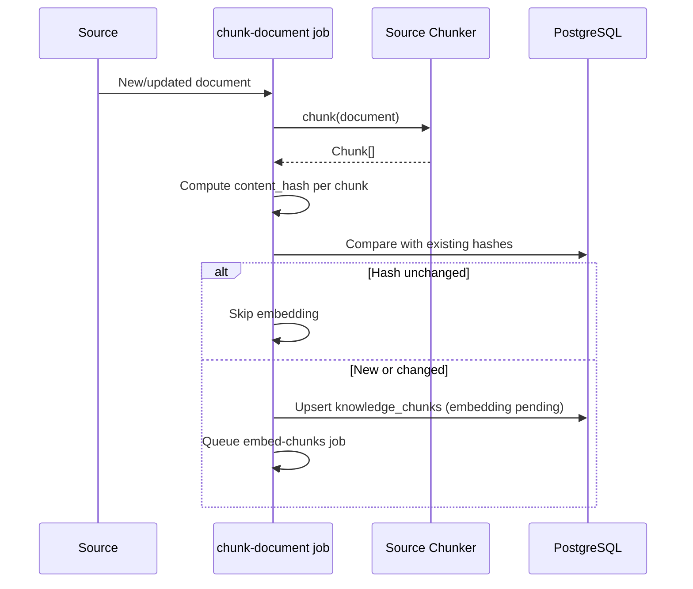

### 4.4 Chunk Size Summary

| Source | Strategy | Target Tokens | Overlap | Chunks per Entity |
|--------|----------|---------------|---------|-------------------|
| Property | Entity (whole listing) | 150–400 | 0 | 1 |
| FAQ | Q+A pair | 50–400 | 0 | 1 (rarely 2+) |
| Project | Section-based | 200–512 | 0 | 4–8 |
| Contract | Clause + overlap | 200–400 | 50 tokens | 10–30 |

---

## 5. Embedding Strategy

### 5.1 Model & Configuration

| Setting | Value |
|---------|-------|
| **Model** | Gemini `text-embedding-004` |
| **Dimensions** | 768 |
| **Distance metric** | Cosine (`<=>` operator in pgvector) |
| **Normalization** | Vectors normalized by Gemini API (unit length) |
| **Batch size** | 100 texts per API call (rate limit aware) |
| **Concurrency** | Max 3 parallel batches per worker |

### 5.2 Embedding Pipeline

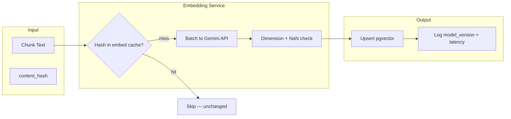

### 5.3 Text Preprocessing (Before Embed)

| Step | Rule | Applies To |
|------|------|------------|
| Normalize whitespace | Collapse multiple spaces/newlines | All |
| Strip HTML | Remove tags from CMS content | FAQ, Project, Contract |
| Preserve Arabic | No transliteration; UTF-8 as-is | All |
| Prefix tag | `[PROPERTY]`, `[FAQ]`, etc. | All (improves source discrimination) |
| Truncate | Max 8,000 chars input to embed API | All |
| PII scrub | Remove phone/email from contract chunks | Contract |
| Lowercase | **No** for Arabic; optional for English tags only | FAQ metadata only |

### 5.4 Embedding Versioning

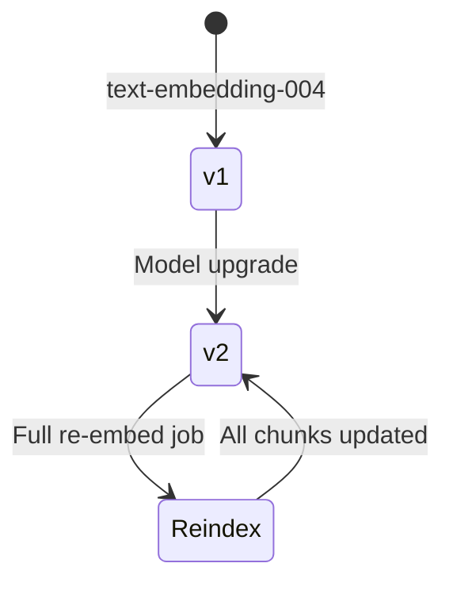

| Event | Action |
|-------|--------|
| New chunk | Embed immediately via `embed-chunks` job |
| Content hash change | Re-embed single chunk |
| Model version bump | Background full re-index; `model_version` column tracks generation |
| Listing price change | Update listing row + re-embed if description/price text changed |

### 5.5 Property vs Knowledge Embeddings

| Aspect | `listing_embeddings` | `knowledge_chunks` |
|--------|----------------------|-------------------|
| Parent | `listings.id` | `knowledge_documents.id` |
| Cardinality | 1:1 | 1:N |
| Join at retrieval | Direct property card render | Text context block in prompt |
| Filters | SQL on `listings` columns | JSONB `metadata` + SQL |
| Refresh | Listing sync pipeline | Document publish pipeline |

---

## 6. Retrieval Strategy

### 6.1 Retrieval Modes

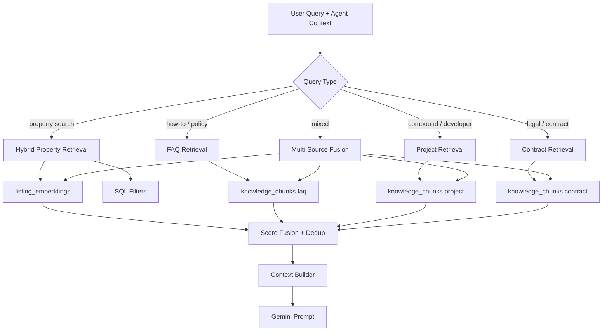

### 6.2 Hybrid Retrieval (Per Source)

#### Property — Vector + Structured Filters

```sql
-- Step 1: Embed query (Gemini)
-- Step 2: Hybrid property retrieval
SELECT
  l.id,
  l.title,
  l.price_egp,
  l.location,
  (le.embedding <=> $1::vector) AS vector_distance,
  ts_rank(l.search_vector, plainto_tsquery('simple', $2)) AS text_rank
FROM listings l
JOIN listing_embeddings le ON le.listing_id = l.id
WHERE l.is_active = true
  AND ($3::text IS NULL OR l.location->>'city' = $3)
  AND ($4::numeric IS NULL OR l.price_egp <= $4)
  AND ($5::text IS NULL OR l.listing_type = $5)
ORDER BY
  (0.7 * (le.embedding <=> $1::vector)) +
  (0.3 * (1 - ts_rank(l.search_vector, plainto_tsquery('simple', $2))))
ASC
LIMIT 10;
```

| Parameter | Default | Description |
|-----------|---------|-------------|
| `vector_weight` | 0.7 | Semantic similarity weight |
| `keyword_weight` | 0.3 | Full-text rank weight |
| `top_k` | 10 | Candidates before re-rank |
| `final_k` | 5 | Chunks passed to context builder |

#### FAQ / Project / Contract — Vector + Metadata Filters

```sql
SELECT
  kc.id,
  kc.content,
  kc.metadata,
  kc.source_type,
  (kc.embedding <=> $1::vector) AS distance
FROM knowledge_chunks kc
JOIN knowledge_documents kd ON kd.id = kc.document_id
WHERE kc.source_type = ANY($2)          -- e.g. '{faq,project}'
  AND kd.status = 'published'
  AND (kc.metadata->>'locale' = $3 OR $3 IS NULL)
  AND (kc.embedding <=> $1::vector) < 0.45   -- similarity threshold
ORDER BY kc.embedding <=> $1::vector
LIMIT $4;
```

### 6.3 Agent-Aware Retrieval Config

| Agent | Sources | top_k | final_k | Min Similarity | Extra Filters |
|-------|---------|-------|---------|----------------|---------------|
| Search Agent | property, project, faq | 10 | 5 | 0.55 | User budget/area from context |
| Recommendation Agent | property | 20 | 8 | 0.50 | Exclude disliked IDs |
| Booking Agent | property, faq, contract | 5 | 3 | 0.60 | — |
| Follow-up Agent | faq, contract, property | 5 | 3 | 0.60 | — |

### 6.4 Multi-Source Fusion

When a query spans sources (e.g. *"rental contract for apartment in Maadi"*):

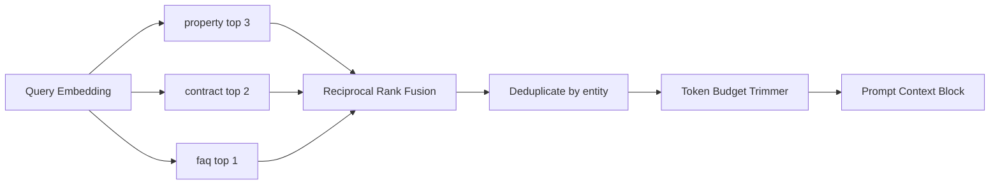

**Reciprocal Rank Fusion (RRF):**
```
score(chunk) = Σ 1 / (k + rank_i)   where k = 60
```

| Source | Max Chunks in Prompt | Max Tokens |
|--------|---------------------|------------|
| property | 5 | 1,500 |
| project | 2 | 600 |
| faq | 2 | 400 |
| contract | 2 | 800 + disclaimer |
| **Total cap** | 11 | **3,300** |

### 6.5 Context Builder Output

```markdown
## Retrieved Context (do not invent beyond this)

### Properties
1. [listing:uuid-1] 3BR Apartment, Maadi — 25,000 EGP/mo rent — ...
2. [listing:uuid-2] ...

### Projects
1. [project:palm-hills] Payment plans: 10% down, 7-year installment...

### FAQs
1. [faq:booking-001] Q: How do I book a viewing? A: ...

### Contracts (informational only — not legal advice)
1. [contract:rental-v2:deposit] Security deposit typically 1-2 months...

---
CITATION RULE: Reference IDs in brackets when stating facts.
```

### 6.6 Retrieval Sequence

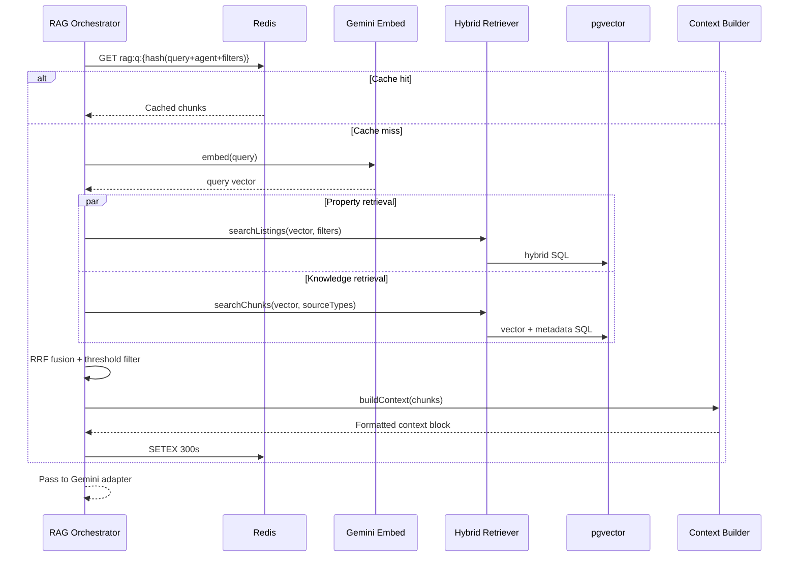

---

## 7. Caching Strategy

### 7.1 Cache Layers

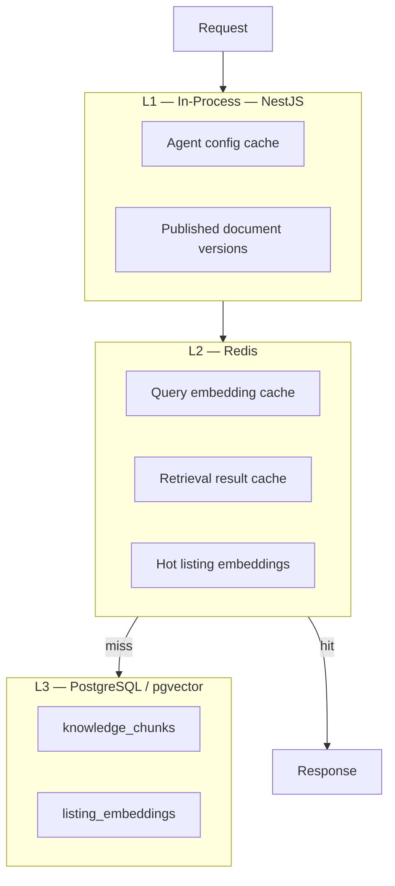

### 7.2 Cache Key Design

| Cache | Key Pattern | TTL | Invalidation |
|-------|-------------|-----|--------------|
| Query embedding | `emb:q:{sha256(normalized_query)}` | 24h | None (query-stable) |
| RAG retrieval result | `rag:{agentId}:{sha256(query+filters+locale)}` | 5 min | Listing/FAQ/project/contract update |
| Listing embedding | `emb:listing:{listingId}` | 1h | `content_hash` change on sync |
| Published doc version | `doc:ver:{sourceType}` | 10 min | Document publish webhook |
| Full agent config | `agent:{agentId}` | 15 min | Admin toggle |

### 7.3 Invalidation Rules

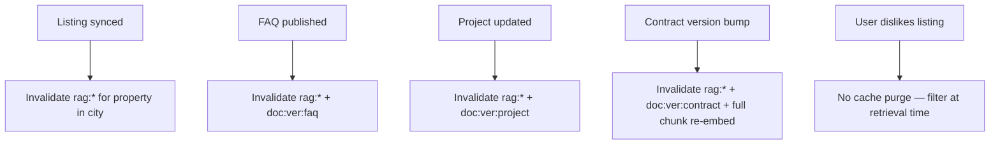

| Event | Invalidation Scope |
|-------|-------------------|
| Single listing update | `emb:listing:{id}` + `rag:*` keys mentioning listing city (optional: lazy expiry via TTL) |
| Bulk sync complete | `doc:ver:property` bump + 5 min TTL handles staleness |
| FAQ edit | Delete `rag:*` for `faq` source tag |
| Contract version change | Full re-embed + flush all `rag:*` |

### 7.4 Cache-Aside Pattern

```typescript
// Conceptual retrieval with cache-aside
async retrieve(context: RAGContext): Promise<RAGResult> {
  const key = buildRAGCacheKey(context);
  const cached = await redis.get(key);
  if (cached) return JSON.parse(cached);

  const queryVector = await this.getOrEmbedQuery(context.query);
  const chunks = await this.hybridRetrieve(queryVector, context);
  const result = this.contextBuilder.build(chunks);

  await redis.setex(key, 300, JSON.stringify(result));
  return result;
}
```

### 7.5 What NOT to Cache

| Data | Reason |
|------|--------|
| User-specific booking state | Must be real-time |
| Agent availability slots | Changes frequently |
| Gemini chat completions | Non-deterministic; stale responses confuse users |
| Contract chunks without version | Legal content must match published version |

---

## 8. Evaluation Metrics

### 8.1 Metric Framework

```mermaid
flowchart TB
    subgraph offline [Offline Evaluation — Weekly]
        Golden[Golden Dataset]
        Recall[Recall@K]
        MRR[MRR]
        Faith[Faithfulness Score]
    end

    subgraph online [Online Evaluation — Continuous]
        CTR[Listing Click-through]
        Thumb[Thumbs Feedback]
        Latency[Retrieval Latency]
        Empty[Empty Retrieval Rate]
    end

    subgraph ops [Operational — Dashboard]
        EmbedLag[Embedding Lag]
        CacheHit[Cache Hit Rate]
        Error[Retrieval Error Rate]
    end

    Golden --> Recall
    Golden --> MRR
    Golden --> Faith
```

### 8.2 Retrieval Quality Metrics

| Metric | Definition | Target (MVP) | Measurement |
|--------|------------|--------------|-------------|
| **Recall@5** | % of queries where relevant doc in top 5 | ≥ 85% | Offline golden set (200 queries) |
| **Recall@10** | Same for top 10 | ≥ 92% | Offline |
| **MRR** | Mean reciprocal rank of first relevant result | ≥ 0.75 | Offline |
| **nDCG@5** | Ranking quality with graded relevance | ≥ 0.80 | Offline |
| **Hit Rate** | % of queries with ≥1 result above similarity threshold | ≥ 95% | Online |
| **Empty Retrieval Rate** | % of queries returning 0 chunks | < 5% | Online |
| **Source Precision** | % of retrieved chunks from correct source type | ≥ 90% | Offline per-source |

### 8.3 Generation Quality Metrics (RAG-Specific)

| Metric | Definition | Target (MVP) | Measurement |
|--------|------------|--------------|-------------|
| **Faithfulness** | Response claims supported by retrieved chunks | ≥ 90% | LLM-as-judge + human sample |
| **Citation Rate** | % of property claims with listing ID citation | ≥ 95% | Automated parser |
| **Hallucination Rate** | Claims not in context | < 3% | LLM-as-judge |
| **Answer Relevance** | Response addresses user question | ≥ 4.0 / 5 | Human eval (50 samples/week) |
| **Arabic Quality** | Fluency and correctness in ar-EG | ≥ 4.0 / 5 | Native speaker review |

### 8.4 Latency Metrics

| Metric | Target (p95) | Alert Threshold |
|--------|--------------|-----------------|
| Query embedding | < 200 ms | > 500 ms |
| Property hybrid retrieval | < 150 ms | > 400 ms |
| Knowledge chunk retrieval | < 100 ms | > 300 ms |
| Full RAG pipeline (excl. Gemini chat) | < 400 ms | > 800 ms |
| Cache hit retrieval | < 20 ms | — |
| End-to-end chat (RAG + Gemini) | < 3 s | > 5 s |

### 8.5 Operational Metrics

| Metric | Target | Description |
|--------|--------|-------------|
| **Embedding lag** | < 15 min | Time from document publish → embedded |
| **Listing embed coverage** | > 99% | Active listings with embeddings |
| **Chunk freshness** | < 1h | Max age of published FAQ/project chunks |
| **Cache hit rate** | > 40% | RAG result cache (5 min TTL) |
| **Embed API error rate** | < 0.5% | Gemini embedding failures |
| **Re-embed queue depth** | < 1000 | BullMQ `embed-chunks` backlog |

### 8.6 Business Proxy Metrics

| Metric | Description | Links To |
|--------|-------------|----------|
| **RAG → Listing CTR** | User taps listing card after RAG-grounded reply | Search Agent quality |
| **RAG → Booking conversion** | Booking started within 2 min of grounded reply | Booking Agent |
| **Chat resolution rate** | No human handoff needed | Overall RAG + agent |
| **Dislike rate on recommendations** | Post-RAG recommendation feedback | Recommendation Agent |

### 8.7 Golden Dataset Structure

```json
{
  "id": "golden-001",
  "query": "شقة للإيجار في المعادي بحد أقصى 25000",
  "locale": "ar-EG",
  "agentId": "search-agent",
  "expected_sources": ["property"],
  "relevant_listing_ids": ["uuid-1", "uuid-2"],
  "relevant_chunk_ids": [],
  "filters": { "city": "Maadi", "listing_type": "rent", "max_price_egp": 25000 }
}
```

| Split | Size | Purpose |
|-------|------|---------|
| Dev | 100 queries | Tuning weights/thresholds |
| Test | 100 queries | Weekly regression report |
| Per-source | 25+ each | Source-specific recall |

### 8.8 Evaluation Cadence

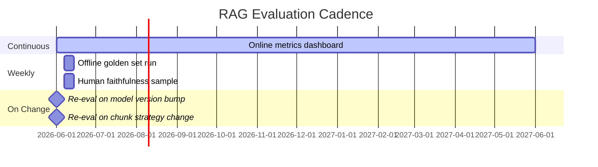

---

## 9. Ingestion Jobs (BullMQ)

| Queue | Job | Trigger | Output |
|-------|-----|---------|--------|
| `listing-sync` | `sync-provider` | Cron 30 min | `listings` + `listing_embeddings` |
| `knowledge-ingest` | `ingest-document` | CMS publish / API | `knowledge_documents` + chunks (pending embed) |
| `embed-chunks` | `embed-chunk-batch` | After ingest / hash change | `knowledge_chunks.embedding` |
| `embed-listings` | `embed-listing` | After listing sync | `listing_embeddings` |
| `rag-invalidate` | `purge-cache` | Document version bump | Redis `rag:*` flush |

---

## 10. Security & Compliance

| Concern | Mitigation |
|---------|------------|
| PII in contracts | Scrub before chunk + embed; audit log access |
| Stale legal content | `version` field; always append disclaimer chunk |
| Cross-user leakage | Retrieval always scoped by `userId` filters for bookings; no user PII in shared chunks |
| Prompt injection via FAQ | Sanitize CMS HTML; strip instruction-like patterns |
| Egypt PDPL | Contract chunks marked informational; no personal contract data in RAG |

---

## 11. MVP vs Post-MVP

| Capability | MVP | Post-MVP |
|------------|-----|----------|
| Property RAG | ✅ Hybrid vector + SQL | Cross-encoder re-ranker |
| FAQ RAG | ✅ | CMS webhook auto-ingest |
| Project RAG | ✅ Manual/seed ingest | Developer portal feed |
| Contract RAG | ✅ Seed templates + disclaimer | Versioned CMS + attorney review |
| Multi-source fusion | ✅ RRF | Learned fusion weights |
| Re-ranker | ❌ | Cohere / cross-encoder |
| RAG cache | ✅ Redis 5 min | Per-user cache for recommendations |
| Evaluation | ✅ Offline golden + online latency | Automated LLM-as-judge pipeline |

---

## 12. Related Documents

| Document | Path |
|----------|------|
| AI Services Architecture | [ai_services_architecture.md](./ai_services_architecture.md) |
| AI Agent Architecture | [ai_agent_architecture.md](./ai_agent_architecture.md) |
| Backend Architecture | [backend_architecture.md](./backend_architecture.md) |
| Listing Providers | [listing_providers.md](./listing_providers.md) |

## Approval

| Role | Name | Date | Status |
|------|------|------|--------|
| Tech Lead | — | — | Pending |
| AI/ML Lead | — | — | Pending |
