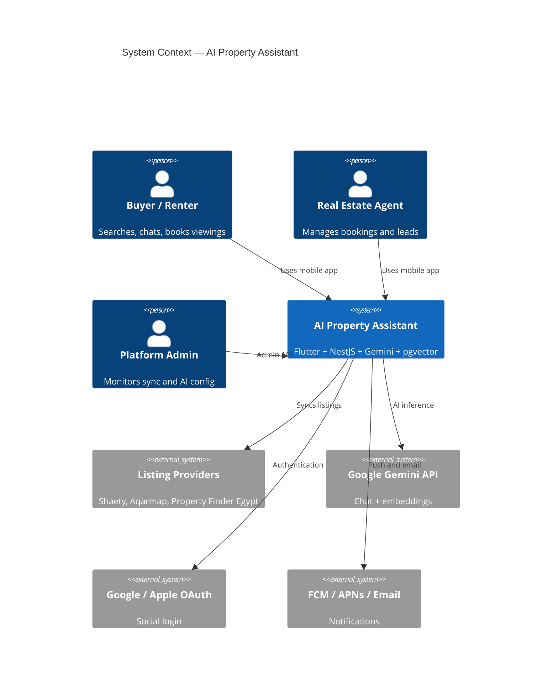
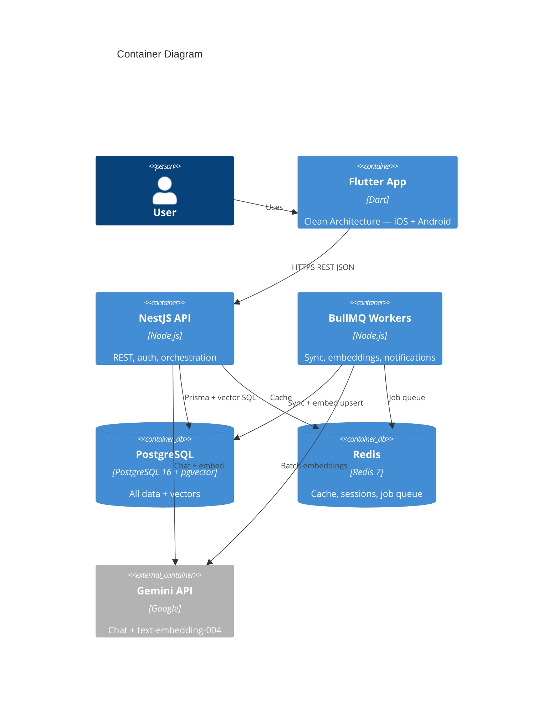
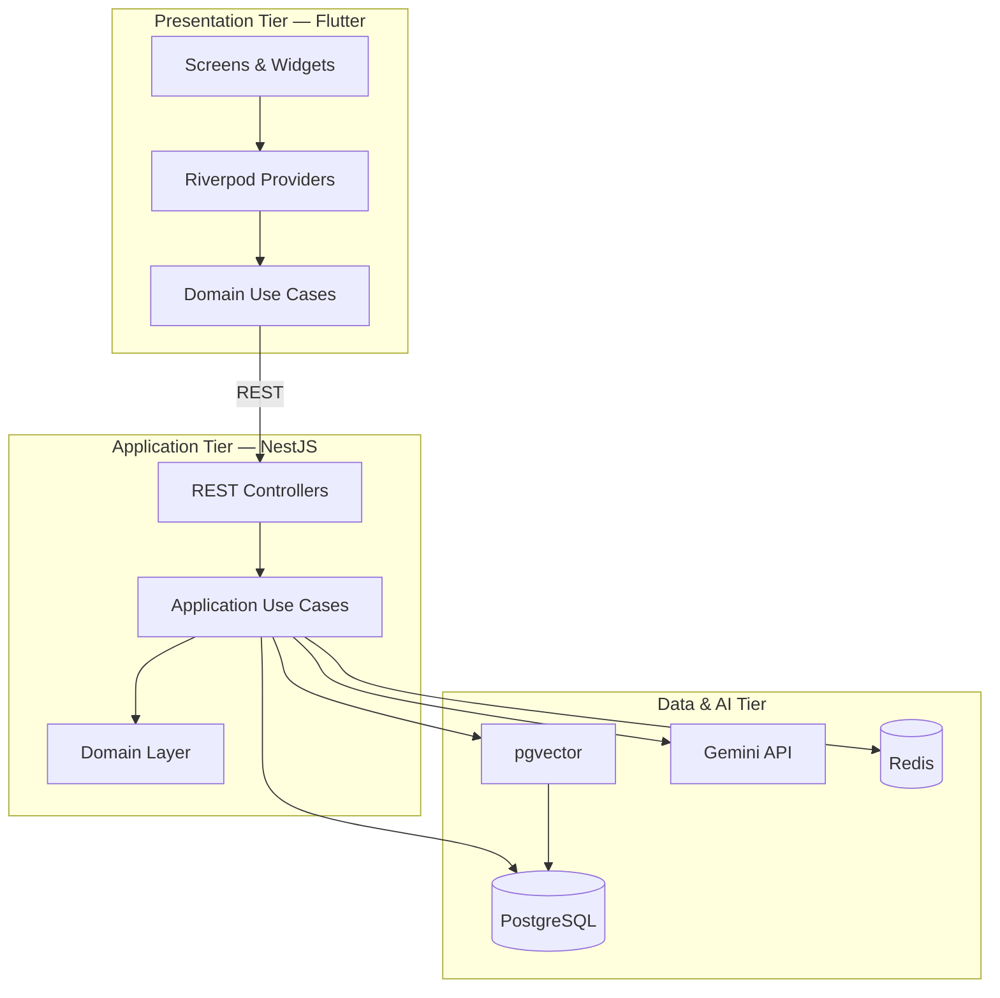
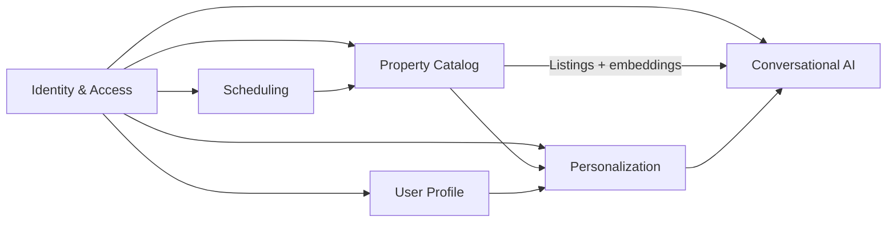
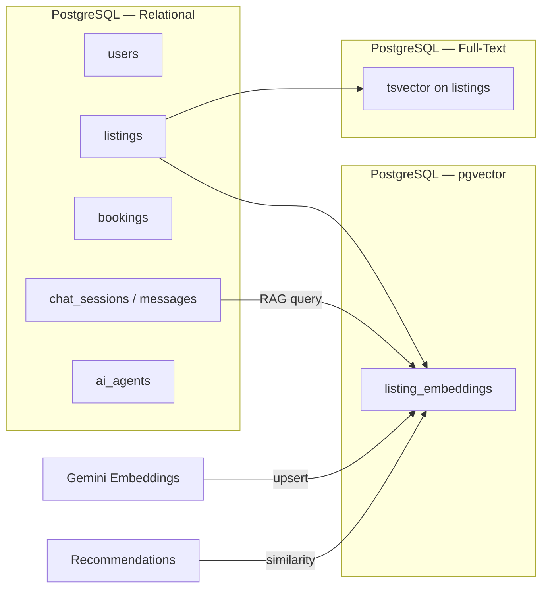
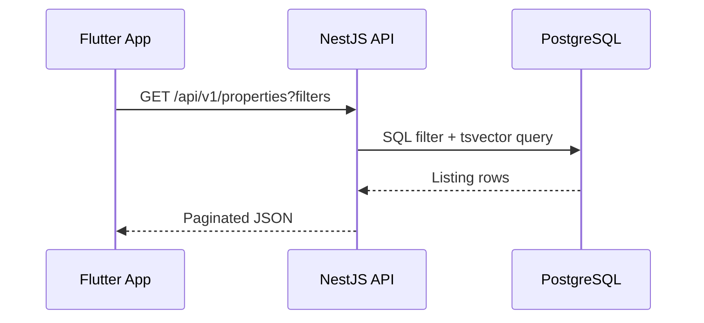
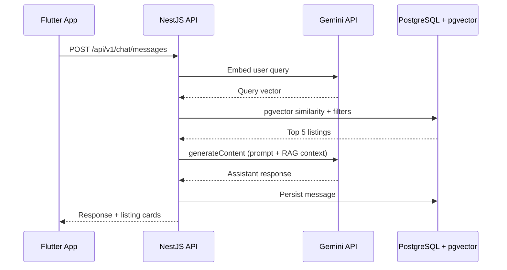
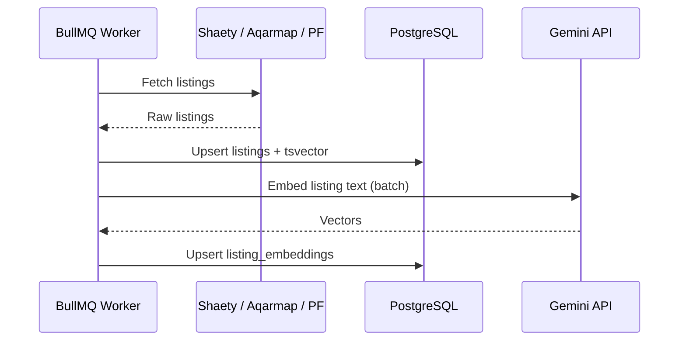
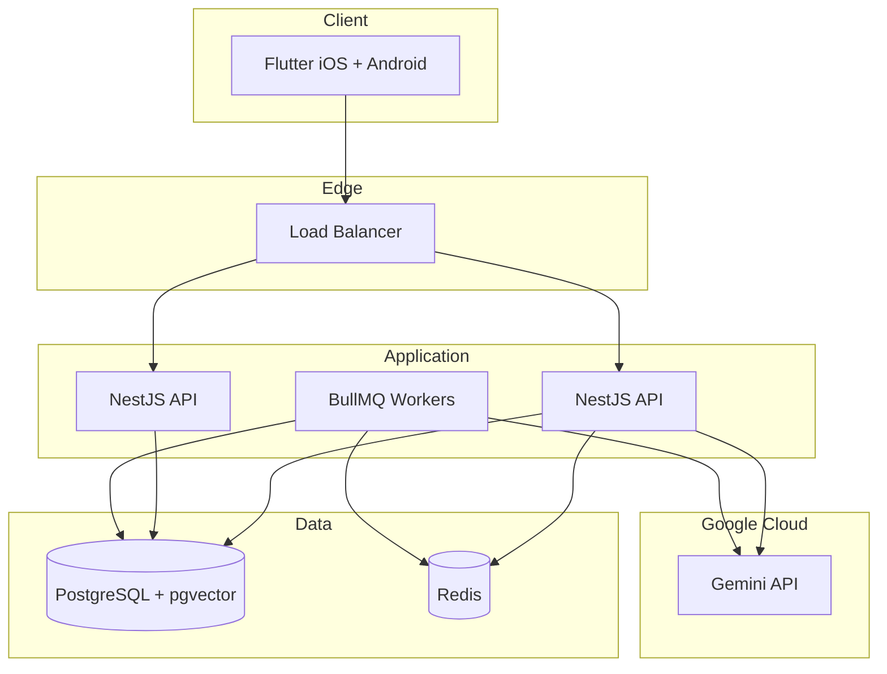

# System Design

> High-level architecture for the AI Property Assistant platform.

## Document Status

| Field | Value |
|-------|-------|
| Version | 1.0.0 |
| Status | Draft |
| Last Updated | 2026-06-03 |

## Architecture Documents

| Layer | Document |
|-------|----------|
| **Flutter** (Clean Architecture) | [flutter_architecture.md](./flutter_architecture.md) |
| **Backend** (NestJS) | [backend_architecture.md](./backend_architecture.md) |
| **AI Agents** (Search, Recommend, Book, Follow-up) | [ai_agent_architecture.md](./ai_agent_architecture.md) |
| **RAG** (Property, FAQ, Projects, Contracts) | [rag_architecture.md](./rag_architecture.md) |
| **AI Services** (Gemini + pgvector) | [ai_services_architecture.md](./ai_services_architecture.md) |
| **Gemini Integration Layer** | [gemini_integration_layer.md](./gemini_integration_layer.md) |
| **Monitoring Strategy** | [monitoring_strategy.md](./monitoring_strategy.md) |
| **Deployment** (GCP, Vertex AI, GitHub Actions) | [deployment_architecture.md](./deployment_architecture.md) |
| Shared layer rules | [clean_architecture.md](./clean_architecture.md) |

---

## Technology Stack

| Layer | Technology | Status |
|-------|------------|--------|
| Mobile | **Flutter / Dart** — Clean Architecture | ✅ Approved |
| Backend API | **Node.js / NestJS** — REST `/api/v1/*` | ✅ Approved |
| ORM | **Prisma** | ✅ Approved |
| Primary storage | **PostgreSQL 16** | ✅ Approved |
| Vector database | **pgvector** (PostgreSQL extension) | ✅ Approved |
| LLM / Embeddings | **Google Gemini** | ✅ Approved |
| Cache / Queue | **Redis** + **BullMQ** | ✅ Approved |
| Auth | JWT + Passport (Google, Apple, local) | ✅ Approved |
| Market | Egypt — EGP, ar-EG + en | ✅ Approved |

---

## System Context

---

## Container Diagram

---

## Three-Tier Architecture

---

## Bounded Contexts (DDD)

| Context | Responsibility | Feature Folder |
|---------|----------------|----------------|
| **Identity & Access** | Auth, roles, sessions | `features/authentication/` |
| **Property Catalog** | Listings, search, sync | `features/property_search/` |
| **Conversational AI** | Chat, agents, RAG | `features/ai_chat/` |
| **Personalization** | Recommendations | `features/recommendation/` |
| **Scheduling** | Viewing bookings | `features/booking/` |
| **User Profile** | Preferences, favorites | `features/profile/` |

## Context Map

---

## Data Architecture

| Storage Need | Technology |
|--------------|------------|
| Users, bookings, chat, agents | PostgreSQL tables (Prisma) |
| Property keyword search | PostgreSQL `tsvector` + GIN index |
| Semantic search / RAG | **pgvector** cosine similarity |
| Listing embeddings | Gemini `text-embedding-004` → pgvector |
| Session cache, rate limits | Redis |

---

## Communication Patterns

| Pattern | Use Case |
|---------|----------|
| **REST (sync)** | Flutter ↔ NestJS — all MVP endpoints |
| **Gemini API (sync)** | Chat completion + query embedding |
| **BullMQ (async)** | Listing sync, embedding generation, notifications |
| **pgvector (sync)** | RAG retrieval within chat request |
| **Domain events (in-process)** | `ListingSynced`, `BookingConfirmed`, `MessageSent` |

---

## Data Flow — Property Search

## Data Flow — AI Chat with RAG

## Data Flow — Listing Sync + Embedding

---

## Deployment Topology

---

## Resolved Decisions

| Decision | Choice |
|----------|--------|
| Mobile | Flutter Clean Architecture |
| Backend | NestJS modular monolith |
| LLM | **Google Gemini** |
| Embeddings | **Gemini text-embedding-004** |
| Vector store | **pgvector** in PostgreSQL |
| Primary storage | **PostgreSQL** |
| ORM | Prisma |
| Mobile API | REST |
| AI pattern | Pluggable agents + RAG |
| Listings | Shaety → Aqarmap → Property Finder Egypt |

## Related Documents

- [Flutter Architecture](./flutter_architecture.md)
- [Backend Architecture](./backend_architecture.md)
- [AI Services Architecture](./ai_services_architecture.md)
- [Gemini Integration Layer](./gemini_integration_layer.md)
- [Monitoring Strategy](./monitoring_strategy.md)
- [Deployment Architecture](./deployment_architecture.md)
- [Clean Architecture](./clean_architecture.md)
- [AI Provider Strategy](./ai_provider_strategy.md)
- [Listing Providers](./listing_providers.md)
- [Requirements](../specs/requirements.md)

## Approval

| Role | Name | Date | Status |
|------|------|------|--------|
| Tech Lead | — | — | Pending |
| Architect | — | — | Pending |
