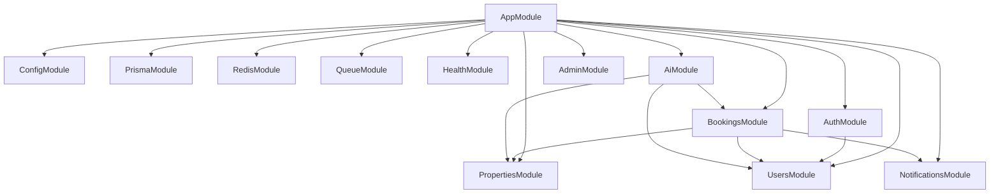

# NestJS Backend — Project Structure

> Modular monolith with Clean Architecture. **Folder structure only** — no implementation until specs approved.

## Modules

| NestJS Module | Bounded Context | API Prefix |
|---------------|-----------------|------------|
| **Auth** | Identity, tokens, OAuth | `/api/v1/auth` |
| **Users** | Profiles, preferences, favorites | `/api/v1/users` |
| **Properties** | Listings, search, sync | `/api/v1/properties` |
| **Bookings** | Viewing appointments | `/api/v1/bookings` |
| **AI** | Chat, agents, recommendations, RAG | `/api/v1/ai`, `/api/v1/agents` |
| **Notifications** | Push, email, dispatch | `/api/v1/notifications` |

---

## Root

```
backend/
├── prisma/
│   ├── schema.prisma
│   ├── migrations/
│   └── seed/
│       ├── ai-agents.seed.ts
│       ├── governorates.seed.ts
│       └── knowledge-documents.seed.ts
│
├── src/
│   ├── main.ts
│   ├── app.module.ts
│   │
│   ├── domain/
│   ├── application/
│   ├── infrastructure/
│   └── presentation/
│
├── test/
│   ├── unit/
│   ├── integration/
│   └── e2e/
│
├── docs/
├── nest-cli.json
├── tsconfig.json
├── tsconfig.build.json
├── package.json
├── .env.example
└── README.md
```

---

## Layer overview

```
src/
├── domain/           # Entities, ports, value objects, failures — NO NestJS / Prisma
├── application/      # Use cases, commands, queries, app DTOs — NO NestJS decorators
├── infrastructure/   # Prisma repos, Gemini, pgvector, Passport, BullMQ, FCM
└── presentation/     # NestJS modules, controllers, guards, HTTP DTOs
```

### Dependency rule

```
presentation  →  application  →  domain
infrastructure  →  domain  (+ implements ports)
presentation  ↛  infrastructure  (DI wiring only in module providers)
```

---

## `domain/`

```
domain/
├── shared/
│   ├── entity.base.ts
│   ├── result.ts
│   └── domain-event.base.ts
│
├── auth/
│   ├── entities/
│   │   ├── refresh-token.entity.ts
│   │   └── oauth-account.entity.ts
│   ├── value-objects/
│   │   ├── email.vo.ts
│   │   └── password.vo.ts
│   ├── enums/
│   │   └── user-role.enum.ts
│   ├── ports/
│   │   ├── auth.repository.port.ts
│   │   └── token.service.port.ts
│   └── failures/
│       └── auth.failures.ts
│
├── users/
│   ├── entities/
│   │   ├── user.entity.ts
│   │   ├── user-profile.entity.ts
│   │   ├── search-preferences.entity.ts
│   │   ├── favorite.entity.ts
│   │   └── agent-profile.entity.ts
│   ├── ports/
│   │   ├── user.repository.port.ts
│   │   └── favorite.repository.port.ts
│   └── failures/
│       └── user.failures.ts
│
├── properties/
│   ├── entities/
│   │   ├── listing.entity.ts
│   │   └── search-filters.entity.ts
│   ├── enums/
│   │   ├── listing-provider.enum.ts
│   │   ├── property-type.enum.ts
│   │   └── listing-type.enum.ts
│   ├── ports/
│   │   ├── listing.repository.port.ts
│   │   ├── listing-search.port.ts
│   │   └── listing-provider.port.ts
│   └── failures/
│       └── property.failures.ts
│
├── bookings/
│   ├── entities/
│   │   ├── booking.entity.ts
│   │   └── agent-availability.entity.ts
│   ├── enums/
│   │   └── booking-status.enum.ts
│   ├── ports/
│   │   └── booking.repository.port.ts
│   └── failures/
│       └── booking.failures.ts
│
├── ai/
│   ├── entities/
│   │   ├── ai-agent.entity.ts
│   │   ├── chat-session.entity.ts
│   │   ├── chat-message.entity.ts
│   │   ├── knowledge-document.entity.ts
│   │   ├── knowledge-chunk.entity.ts
│   │   └── recommendation-feedback.entity.ts
│   ├── enums/
│   │   ├── knowledge-source-type.enum.ts
│   │   └── message-role.enum.ts
│   ├── ports/
│   │   ├── chat.repository.port.ts
│   │   ├── ai-agent.repository.port.ts
│   │   ├── llm-completion.port.ts
│   │   ├── embedding.port.ts
│   │   ├── vector-search.port.ts
│   │   ├── rag.port.ts
│   │   ├── tool-executor.port.ts
│   │   └── recommendation.port.ts
│   └── failures/
│       └── ai.failures.ts
│
└── notifications/
    ├── entities/
    │   ├── notification.entity.ts
    │   └── notification-preference.entity.ts
    ├── enums/
    │   ├── notification-channel.enum.ts
    │   └── notification-event.enum.ts
    ├── ports/
    │   ├── notification.repository.port.ts
    │   ├── push.provider.port.ts
    │   └── email.provider.port.ts
    └── failures/
        └── notification.failures.ts
```

---

## `application/`

```
application/
├── shared/
│   └── interfaces/
│       └── use-case.interface.ts
│
├── auth/
│   ├── use-cases/
│   │   ├── register.use-case.ts
│   │   ├── login.use-case.ts
│   │   ├── logout.use-case.ts
│   │   ├── refresh-token.use-case.ts
│   │   ├── google-auth.use-case.ts
│   │   ├── apple-auth.use-case.ts
│   │   ├── forgot-password.use-case.ts
│   │   └── reset-password.use-case.ts
│   ├── commands/
│   ├── queries/
│   └── dto/
│       ├── register.dto.ts
│       ├── login.dto.ts
│       └── auth-response.dto.ts
│
├── users/
│   ├── use-cases/
│   │   ├── get-profile.use-case.ts
│   │   ├── update-profile.use-case.ts
│   │   ├── update-preferences.use-case.ts
│   │   ├── get-favorites.use-case.ts
│   │   ├── add-favorite.use-case.ts
│   │   ├── remove-favorite.use-case.ts
│   │   ├── update-agent-profile.use-case.ts
│   │   ├── export-user-data.use-case.ts
│   │   └── delete-account.use-case.ts
│   └── dto/
│       ├── profile.dto.ts
│       ├── preferences.dto.ts
│       └── favorite.dto.ts
│
├── properties/
│   ├── use-cases/
│   │   ├── search-properties.use-case.ts
│   │   ├── get-listing-detail.use-case.ts
│   │   ├── sync-listings.use-case.ts
│   │   └── trigger-provider-sync.use-case.ts
│   └── dto/
│       ├── search-properties.dto.ts
│       ├── listing.dto.ts
│       └── search-filters.dto.ts
│
├── bookings/
│   ├── use-cases/
│   │   ├── request-booking.use-case.ts
│   │   ├── confirm-booking.use-case.ts
│   │   ├── decline-booking.use-case.ts
│   │   ├── propose-alternative.use-case.ts
│   │   ├── cancel-booking.use-case.ts
│   │   ├── get-user-bookings.use-case.ts
│   │   ├── get-agent-bookings.use-case.ts
│   │   ├── get-availability.use-case.ts
│   │   └── update-availability.use-case.ts
│   └── dto/
│       ├── request-booking.dto.ts
│       ├── booking.dto.ts
│       └── availability.dto.ts
│
├── ai/
│   ├── use-cases/
│   │   ├── list-agents.use-case.ts
│   │   ├── list-chat-sessions.use-case.ts
│   │   ├── create-chat-session.use-case.ts
│   │   ├── switch-agent.use-case.ts
│   │   ├── send-message.use-case.ts
│   │   ├── get-recommendations.use-case.ts
│   │   ├── record-feedback.use-case.ts
│   │   ├── ingest-knowledge-document.use-case.ts
│   │   └── embed-chunks.use-case.ts
│   ├── services/
│   │   ├── rag-orchestrator.service.ts
│   │   ├── agent-router.service.ts
│   │   └── tool-executor.service.ts
│   └── dto/
│       ├── chat-session.dto.ts
│       ├── chat-message.dto.ts
│       ├── ai-agent.dto.ts
│       ├── send-message.dto.ts
│       └── recommendation.dto.ts
│
└── notifications/
    ├── use-cases/
    │   ├── send-push.use-case.ts
    │   ├── send-email.use-case.ts
    │   ├── get-preferences.use-case.ts
    │   ├── update-preferences.use-case.ts
    │   └── dispatch-booking-notification.use-case.ts
    └── dto/
        ├── notification.dto.ts
        └── notification-preference.dto.ts
```

---

## `infrastructure/`

```
infrastructure/
├── persistence/
│   ├── prisma/
│   │   ├── prisma.module.ts
│   │   ├── prisma.service.ts
│   │   └── schema/
│   ├── repositories/
│   │   ├── auth/
│   │   │   └── prisma-auth.repository.ts
│   │   ├── users/
│   │   │   ├── prisma-user.repository.ts
│   │   │   └── prisma-favorite.repository.ts
│   │   ├── properties/
│   │   │   └── prisma-listing.repository.ts
│   │   ├── bookings/
│   │   │   └── prisma-booking.repository.ts
│   │   ├── ai/
│   │   │   ├── prisma-chat.repository.ts
│   │   │   ├── prisma-ai-agent.repository.ts
│   │   │   └── prisma-knowledge.repository.ts
│   │   └── notifications/
│   │       └── prisma-notification.repository.ts
│   └── mappers/
│       ├── user.mapper.ts
│       ├── listing.mapper.ts
│       ├── booking.mapper.ts
│       ├── chat.mapper.ts
│       └── notification.mapper.ts
│
├── auth/
│   ├── passport/
│   │   ├── jwt.strategy.ts
│   │   ├── jwt-refresh.strategy.ts
│   │   ├── local.strategy.ts
│   │   ├── google.strategy.ts
│   │   └── apple.strategy.ts
│   ├── jwt-token.service.ts
│   └── bcrypt-password.service.ts
│
├── properties/
│   ├── search/
│   │   ├── hybrid-search.service.ts
│   │   └── pgvector-listing-search.service.ts
│   └── providers/
│       ├── shaety.adapter.ts
│       ├── aqarmap.adapter.ts
│       ├── property-finder.adapter.ts
│       └── listing-normalizer.service.ts
│
├── ai/
│   ├── gemini/
│   │   ├── gemini-chat.adapter.ts
│   │   ├── gemini-embedding.adapter.ts
│   │   └── gemini.config.ts
│   ├── rag/
│   │   ├── rag.service.ts
│   │   ├── context-builder.service.ts
│   │   ├── chunking/
│   │   │   ├── faq.chunker.ts
│   │   │   ├── project.chunker.ts
│   │   │   └── contract.chunker.ts
│   │   └── retrieval/
│   │       ├── hybrid-retriever.service.ts
│   │       └── rrf-fusion.service.ts
│   ├── agents/
│   │   └── agent-registry.service.ts
│   └── tools/
│       ├── tool-registry.ts
│       ├── search-properties.tool.ts
│       ├── semantic-search.tool.ts
│       ├── get-recommendations.tool.ts
│       ├── create-booking-request.tool.ts
│       └── schedule-follow-up.tool.ts
│
├── notifications/
│   ├── fcm/
│   │   └── fcm-push.provider.ts
│   ├── email/
│   │   ├── email.provider.ts
│   │   └── templates/
│   │       ├── booking-confirmed.hbs
│   │       ├── booking-requested.hbs
│   │       └── password-reset.hbs
│   └── notification-dispatcher.service.ts
│
├── cache/
│   ├── redis.module.ts
│   ├── redis.service.ts
│   └── rag-cache.service.ts
│
└── queue/
    ├── queue.module.ts
    ├── processors/
    │   ├── listing-sync.processor.ts
    │   ├── embed-listing.processor.ts
    │   ├── embed-chunks.processor.ts
    │   ├── recommendation.processor.ts
    │   └── notification.processor.ts
    └── producers/
        ├── listing-sync.producer.ts
        ├── embedding.producer.ts
        └── notification.producer.ts
```

---

## `presentation/` — NestJS modules

```
presentation/
├── common/
│   ├── decorators/
│   │   ├── current-user.decorator.ts
│   │   ├── roles.decorator.ts
│   │   └── public.decorator.ts
│   ├── guards/
│   │   ├── jwt-auth.guard.ts
│   │   ├── roles.guard.ts
│   │   └── throttle.guard.ts
│   ├── filters/
│   │   ├── http-exception.filter.ts
│   │   └── domain-exception.filter.ts
│   ├── interceptors/
│   │   ├── logging.interceptor.ts
│   │   └── transform.interceptor.ts
│   ├── pipes/
│   │   └── validation.pipe.ts
│   └── dto/
│       ├── pagination.dto.ts
│       └── api-response.dto.ts
│
├── health/
│   ├── health.module.ts
│   └── health.controller.ts
│
├── auth/
│   ├── auth.module.ts
│   ├── auth.controller.ts
│   └── dto/
│       ├── register-request.dto.ts
│       ├── login-request.dto.ts
│       ├── refresh-token-request.dto.ts
│       └── auth-response.dto.ts
│
├── users/
│   ├── users.module.ts
│   ├── users.controller.ts
│   ├── favorites.controller.ts
│   └── dto/
│       ├── update-profile-request.dto.ts
│       ├── update-preferences-request.dto.ts
│       └── profile-response.dto.ts
│
├── properties/
│   ├── properties.module.ts
│   ├── properties.controller.ts
│   ├── admin-sync.controller.ts
│   └── dto/
│       ├── search-properties-query.dto.ts
│       └── listing-response.dto.ts
│
├── bookings/
│   ├── bookings.module.ts
│   ├── bookings.controller.ts
│   ├── agent-bookings.controller.ts
│   └── dto/
│       ├── request-booking-request.dto.ts
│       ├── confirm-booking-request.dto.ts
│       └── booking-response.dto.ts
│
├── ai/
│   ├── ai.module.ts
│   ├── agents.controller.ts
│   ├── chat.controller.ts
│   ├── chat-sessions.controller.ts
│   ├── recommendations.controller.ts
│   └── dto/
│       ├── send-message-request.dto.ts
│       ├── chat-message-response.dto.ts
│       ├── switch-agent-request.dto.ts
│       └── recommendation-response.dto.ts
│
├── notifications/
│   ├── notifications.module.ts
│   ├── notifications.controller.ts
│   └── dto/
│       ├── update-notification-prefs.dto.ts
│       └── notification-response.dto.ts
│
└── admin/
    ├── admin.module.ts
    ├── admin.controller.ts
    └── dto/
        └── sync-status-response.dto.ts
```

---

## `app.module.ts` wiring



---

## Module responsibilities

### Auth

```
AuthModule
├── Register / login / logout / refresh
├── Google OAuth / Apple Sign In
├── Password reset
├── JWT issuance (Passport)
└── Does NOT own user profile CRUD → UsersModule
```

### Users

```
UsersModule
├── User profile (buyer + agent)
├── Search preferences
├── Favorites
├── Default AI agent preference
├── Notification preferences (read/write via NotificationsModule dispatch)
├── Account export / delete (PDPL)
└── Agent public profile
```

### Properties

```
PropertiesModule
├── Search (SQL + tsvector + pgvector semantic)
├── Listing detail
├── Listing sync (Shaety, Aqarmap, Property Finder)
├── Admin sync status / manual trigger
└── Listing embeddings pipeline (queue)
```

### Bookings

```
BookingsModule
├── Request / confirm / decline / cancel viewing
├── Agent availability
├── Buyer + agent booking lists
└── Emits domain events → NotificationsModule
```

### AI

```
AiModule
├── AI agents catalog
├── Chat sessions + messages
├── Send message (Gemini + RAG + tools)
├── Mid-session agent switch
├── Recommendations feed + feedback
├── Knowledge ingest (FAQ, projects, contracts)
├── RAG retrieval (pgvector)
└── Tool executor (cross-module actions)
```

### Notifications

```
NotificationsModule
├── Push (FCM / APNs)
├── Email (booking, auth)
├── Preference management API
├── BullMQ notification processor
└── Template rendering (ar-EG / en)
```

---

## API routes by module

```
/api/v1
├── /auth
│   ├── POST   /register
│   ├── POST   /login
│   ├── POST   /logout
│   ├── POST   /refresh
│   ├── POST   /google
│   ├── POST   /apple
│   ├── POST   /forgot-password
│   └── POST   /reset-password
│
├── /users
│   ├── GET    /me
│   ├── PATCH  /me
│   ├── PATCH  /me/preferences
│   ├── GET    /me/favorites
│   ├── POST   /me/favorites/:listingId
│   ├── DELETE /me/favorites/:listingId
│   ├── POST   /me/export
│   ├── DELETE /me
│   └── GET    /agents/:id          # public agent profile
│
├── /properties
│   ├── GET    /
│   ├── GET    /:id
│   └── GET    /:id/source
│
├── /bookings
│   ├── POST   /
│   ├── GET    /
│   ├── GET    /:id
│   ├── PATCH  /:id/confirm
│   ├── PATCH  /:id/decline
│   ├── PATCH  /:id/cancel
│   └── GET    /agent               # agent's bookings
│
├── /agents
│   └── GET    /
│
├── /ai
│   ├── GET    /chat/sessions
│   ├── POST   /chat/sessions
│   ├── PATCH  /chat/sessions/:id
│   ├── GET    /chat/sessions/:id/messages
│   ├── POST   /chat/sessions/:id/messages
│   └── GET    /recommendations
│
├── /notifications
│   ├── GET    /preferences
│   └── PATCH  /preferences
│
└── /admin
    ├── GET    /sync/status
    ├── POST   /sync/:provider/trigger
    └── PATCH  /agents/:id
```

---

## `test/`

```
test/
├── unit/
│   ├── domain/
│   ├── application/
│   └── infrastructure/
│
├── integration/
│   ├── auth/
│   ├── users/
│   ├── properties/
│   ├── bookings/
│   ├── ai/
│   └── notifications/
│
├── e2e/
│   ├── auth.e2e-spec.ts
│   ├── properties.e2e-spec.ts
│   ├── bookings.e2e-spec.ts
│   └── ai-chat.e2e-spec.ts
│
└── fixtures/
    ├── listings.json
    ├── users.json
    └── chat-messages.json
```

---

## Domain ↔ Module mapping

| Domain folder | NestJS module | Notes |
|---------------|---------------|-------|
| `domain/auth` | **Auth** | Tokens, OAuth links |
| `domain/users` | **Users** | User aggregate root |
| `domain/properties` | **Properties** | Listings |
| `domain/bookings` | **Bookings** | Appointments |
| `domain/ai` | **AI** | Chat, RAG, recommendations |
| `domain/notifications` | **Notifications** | Delivery channels |

---

## Related

- [Backend Architecture](../architecture/backend_architecture.md)
- [AI Services Architecture](../architecture/ai_services_architecture.md)
- [RAG Architecture](../architecture/rag_architecture.md)
