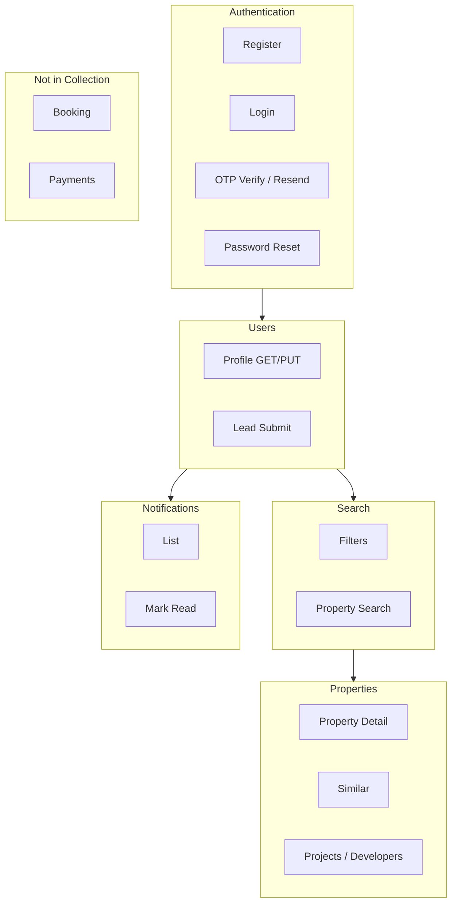

# Shaety API Analysis

> Generated from Postman collection `docs/external_apis/shaety_collection.json`  
> Analysis date: 2026-06-04

## Overview

| Attribute | Value |
|-----------|-------|
| Collection name | Shaety |
| Schema | Postman Collection v2.1.0 |
| Total documented requests | 25 |
| Base URL variable | `{{url}}` → `https://app.shaety.com/api/` (was `shaety.pountech.com`) |
| Primary market | Egypt — Alexandria & North Coast real estate (Arabic content) |
| Backend stack (inferred) | Laravel (Sanctum-style tokens, `laravel_session` / `shaety_session` cookies) |
| Rate limit | 60 requests/minute (`X-RateLimit-Limit: 60`) |

### Common response envelope

Most endpoints return JSON with this structure:

```json
{
  "status": true,
  "message": "Success!",
  "status_code": 200,
  "data": {}
}
```

Paginated property search adds top-level fields: `total`, `page`, `per_page`.

### Authentication mechanism

| Type | Details |
|------|---------|
| Public endpoints | No `Authorization` header |
| Protected endpoints | `Authorization: Bearer {{token}}` |
| Token format | Laravel Sanctum personal access token, e.g. `52|AcO8jCty6kiRdbNMsX3yVfPkclD6ZFjZnPThT5U0` |
| Alternate header | `X-Auth-Token` listed in CORS allowed headers |
| Localization | `X-localization: {{lang}}` on login (optional) |

### Content types

| Operation | Content-Type |
|-----------|--------------|
| Auth register/login/OTP | `application/x-www-form-urlencoded` |
| Profile update, lead, password change | `application/json` |
| All requests | `Accept: application/json` |

---


## Authentication

### POST `/register` — Register

| Attribute | Value |
|-----------|-------|
| **Purpose** | Create a new user account with phone, name, and password. Returns an access token on success. |
| **Business domain** | Identity & Access Management |
| **Authentication** | None |
| **Postman folder** | `Auth` |

**Request model**

| Field | Type |
|-------|------|
| `phone` | string (required) |
| `name` | string (required) |
| `password` | string (required) |

**Response model**

Envelope: `status`, `message`, `status_code`, `data`

`data` object:

| Field | Type |
|-------|------|
| `phone` | string |
| `name` | string |
| `token` | string |
---

### POST `/password/forgot` — Forgot password

| Attribute | Value |
|-----------|-------|
| **Purpose** | Initiate password recovery flow by submitting the user phone number. |
| **Business domain** | Identity & Access Management |
| **Authentication** | None |
| **Postman folder** | `Auth` |

**Request model**

| Field | Type |
|-------|------|
| `phone` | string (required) |

**Response model**

Envelope: `status`, `message`, `status_code`, `data`

`data` object:

| Field | Type |
|-------|------|
| `phone` | string |
| `name` | string |
| `token` | string |
---

### POST `/profile/verify` — verify

| Attribute | Value |
|-----------|-------|
| **Purpose** | Verify phone/account with OTP code after registration. |
| **Business domain** | Identity & Access Management |
| **Authentication** | None |
| **Postman folder** | `Auth` |

**Request model**

| Field | Type |
|-------|------|
| `phone` | string (required) |
| `code` | string (required) |
| `password` | string (optional, disabled in sample) |

**Response model**

Envelope: `status`, `message`, `status_code`, `data`

`data` object:

| Field | Type |
|-------|------|
| `phone` | string |
| `name` | string |
| `token` | string |
---

### POST `/register` — Social

| Attribute | Value |
|-----------|-------|
| **Purpose** | Social/OAuth registration placeholder — uses same `register` endpoint as standard registration (likely incomplete in collection). |
| **Business domain** | Identity & Access Management |
| **Authentication** | None |
| **Postman folder** | `Auth` |

**Request model**

| Field | Type |
|-------|------|
| `phone` | string |
| `name` | string |
| `password` | string |

**Response model**

Envelope: `status`, `message`, `status_code`, `data`

`data`: No saved example response

---

### POST `/login` — Login

| Attribute | Value |
|-----------|-------|
| **Purpose** | Authenticate user with phone (or email) and password; returns session token and user summary. |
| **Business domain** | Identity & Access Management |
| **Authentication** | None |
| **Postman folder** | `Auth` |

**Request model**

| Field | Type |
|-------|------|
| `phone` | string (required) |
| `password` | string (required) |
| `email` | string (optional, disabled) |

**Response model**

Envelope: `status`, `message`, `status_code`, `data`

`data` object:

| Field | Type |
|-------|------|
| `name` | string |
| `phone` | string |
| `verified_at` | boolean |
| `token` | string |
| `coupons` | integer |
| `orders` | array |
| `share` | string |
---

### POST `/logout` — Logout

| Attribute | Value |
|-----------|-------|
| **Purpose** | Invalidate the current bearer token / end session. |
| **Business domain** | Identity & Access Management |
| **Authentication** | Bearer token required |
| **Postman folder** | `Auth` |

**Request model**

Empty body

**Response model**

Envelope: `status`, `message`, `status_code`, `data`

`data`: Empty array in `data`; `status` may be `false` with success message

---

### POST `/verify-otp/resend` — resend

| Attribute | Value |
|-----------|-------|
| **Purpose** | Resend OTP verification code to phone number. |
| **Business domain** | Identity & Access Management |
| **Authentication** | None |
| **Postman folder** | `Auth` |

**Request model**

| Field | Type |
|-------|------|
| `phone` | string (required) |

**Response model**

Envelope: `status`, `message`, `status_code`, `data`

`data` object:

| Field | Type |
|-------|------|
| `attempts` | integer |
---

### POST `/password/verify-otp` — verify password rest

| Attribute | Value |
|-----------|-------|
| **Purpose** | Verify OTP during password reset flow; returns auth token on success. |
| **Business domain** | Identity & Access Management |
| **Authentication** | None |
| **Postman folder** | `Auth` |

**Request model**

| Field | Type |
|-------|------|
| `phone` | string (required) |
| `code` | string (required) |

**Response model**

Envelope: `status`, `message`, `status_code`, `data`

`data` object:

| Field | Type |
|-------|------|
| `name` | string |
| `phone` | string |
| `verified_at` | boolean |
| `token` | string |
| `coupons` | integer |
| `orders` | array |
| `share` | string |
---

## Users

### PUT `/profile` — update

| Attribute | Value |
|-----------|-------|
| **Purpose** | Update authenticated user profile (name, phone, email). |
| **Business domain** | User Profile Management |
| **Authentication** | Bearer token required |
| **Postman folder** | `Profile` |

**Request model**

| Field | Type |
|-------|------|
| `name` | string |
| `phone` | string |
| `email` | string |

**Response model**

Envelope: `status`, `message`, `status_code`, `data`

`data` object:

| Field | Type |
|-------|------|
| `hash_id` | string |
| `name` | string |
| `email` | string |
| `phone` | string |
| `filter` | array |
| `notifications` | array |
| `verified_at` | null|string |
---

### POST `/profile/forgot-password/change` — forgot password update

| Attribute | Value |
|-----------|-------|
| **Purpose** | Set new password after OTP verification during password reset. |
| **Business domain** | User Profile Management |
| **Authentication** | Bearer token required |
| **Postman folder** | `Profile` |

**Request model**

| Field | Type |
|-------|------|
| `password` | string |
| `password_confirmation` | string |

**Response model**

Envelope: `status`, `message`, `status_code`, `data`

`data`: Updated profile object (same as GET profile)

---

### POST `/lead` — lead

| Attribute | Value |
|-----------|-------|
| **Purpose** | Submit a sales lead / contact request (CRM intake). |
| **Business domain** | Lead Generation / CRM |
| **Authentication** | Bearer token required |
| **Postman folder** | `Profile` |

**Request model**

| Field | Type |
|-------|------|
| `name` | string |
| `type` | string |
| `phone` | string |
| `city` | string |

**Response model**

Envelope: `status`, `message`, `status_code`, `data`

`data`: Profile object in sample (may be placeholder response)

---

### GET `/profile` — profile

| Attribute | Value |
|-----------|-------|
| **Purpose** | Get authenticated user profile including saved filters and embedded notifications. |
| **Business domain** | User Profile Management |
| **Authentication** | Bearer token required |
| **Postman folder** | `Profile` |

**Request model**

None

**Response model**

Envelope: `status`, `message`, `status_code`, `data`

`data` object:

| Field | Type |
|-------|------|
| `hash_id` | string |
| `name` | string |
| `email` | string |
| `phone` | string |
| `filter` | array |
| `notifications` | array |
| `verified_at` | null|string |
---

## Properties

### GET `/projects` — Projects

| Attribute | Value |
|-----------|-------|
| **Purpose** | List development projects / compound listings (may overlap with property search). |
| **Business domain** | Real Estate Projects & Developments |
| **Authentication** | Bearer token required |
| **Postman folder** | `Property` |

**Request model**

Optional city filter

**Response model**

Envelope: `status`, `message`, `status_code`, `data`

`data`: Array of project/property hybrid objects with code, images[], location, agent


_Sample listing fields from collection: id, code, title, content, post_date, image, images, post_status, city, property_features, property_area, property_type..._

---

### GET `/properties/124235` — Property

| Attribute | Value |
|-----------|-------|
| **Purpose** | Fetch full detail for a single property listing by ID. |
| **Business domain** | Property Listings |
| **Authentication** | Bearer token required |
| **Postman folder** | `Property` |

**Request model**

Path param: property ID

**Response model**

Envelope: `status`, `message`, `status_code`, `data`

`data`: single property detail object (includes `terms`, `taxonomies`, `agent`, `views`).

| Field | Type | Description |
|-------|------|-------------|
| `id` | integer | Listing ID |
| `code` | string | Internal unit code |
| `title` | string | Listing title (Arabic) |
| `content` | string | HTML description |
| `post_date` | string (ISO 8601) | Published date |
| `image` | string (URL) | Primary image |
| `images` | string[] | Gallery URLs (detail/projects) |
| `post_status` | string | e.g. `publish` |
| `city` | string | City name (Arabic) |
| `property_features` | string[] | Feature tags |
| `property_area` | string | District/neighborhood |
| `property_type` | string | e.g. شقة, فيلا, شاليه |
| `property_status` | string | للبيع / للإيجار |
| `property_label` | string | Price band label |
| `property_price` | string/integer | Price in EGP |
| `property_size` | string | Area in m² |
| `property_bedrooms` | string | Bedroom count |
| `property_bathrooms` | string | Bathroom count |
| `property_location` | object | Lat/lng/zoom `{0, 1, 2}` |
| `agent` | object | Agent contact card |
| `views` | string | View count |

**Agent sub-object**

| Field | Type |
|-------|------|
| `id` | integer |
| `title` | string |
| `content` | string |
| `post_date` | string |
| `image` | string/null |
| `email` | string/null |
| `mobile` | string |
| `facebook` | string/null |
---

### GET `/properties/similar/22871` — Similar Properties

| Attribute | Value |
|-----------|-------|
| **Purpose** | Retrieve a property record similar to the given ID (recommendation/detail companion). |
| **Business domain** | Property Listings / Recommendations |
| **Authentication** | Bearer token required |
| **Postman folder** | `Property` |

**Request model**

Path param: property ID

**Response model**

Envelope: `status`, `message`, `status_code`, `data`

`data`: single property detail object (includes `terms`, `taxonomies`, `agent`, `views`).

| Field | Type | Description |
|-------|------|-------------|
| `id` | integer | Listing ID |
| `code` | string | Internal unit code |
| `title` | string | Listing title (Arabic) |
| `content` | string | HTML description |
| `post_date` | string (ISO 8601) | Published date |
| `image` | string (URL) | Primary image |
| `images` | string[] | Gallery URLs (detail/projects) |
| `post_status` | string | e.g. `publish` |
| `city` | string | City name (Arabic) |
| `property_features` | string[] | Feature tags |
| `property_area` | string | District/neighborhood |
| `property_type` | string | e.g. شقة, فيلا, شاليه |
| `property_status` | string | للبيع / للإيجار |
| `property_label` | string | Price band label |
| `property_price` | string/integer | Price in EGP |
| `property_size` | string | Area in m² |
| `property_bedrooms` | string | Bedroom count |
| `property_bathrooms` | string | Bathroom count |
| `property_location` | object | Lat/lng/zoom `{0, 1, 2}` |
| `agent` | object | Agent contact card |
| `views` | string | View count |

**Agent sub-object**

| Field | Type |
|-------|------|
| `id` | integer |
| `title` | string |
| `content` | string |
| `post_date` | string |
| `image` | string/null |
| `email` | string/null |
| `mobile` | string |
| `facebook` | string/null |
---

### GET `/projects/city` — Projects by city

| Attribute | Value |
|-----------|-------|
| **Purpose** | List projects filtered by city ID. |
| **Business domain** | Real Estate Projects & Developments |
| **Authentication** | Bearer token required |
| **Postman folder** | `projects` |

**Request model**

Query parameters:

| Parameter | Description |
|-----------|-------------|
| `city` | City ID (required) |

**Response model**

Envelope: `status`, `message`, `status_code`, `data`

`data`: Array of full listing objects OR city catalog `{id, image, city}` depending on endpoint variant


_Sample listing fields from collection: id, code, title, content, post_date, image, images, post_status, city, property_features, property_area, property_type..._

---

### GET `/developers` — Projects by Developer

| Attribute | Value |
|-----------|-------|
| **Purpose** | List real estate developers (duplicate URL with Developers request). |
| **Business domain** | Developers & Projects |
| **Authentication** | Bearer token required |
| **Postman folder** | `projects` |

**Request model**

None documented

**Response model**

Envelope: `status`, `message`, `status_code`, `data`

`data`: No saved example

---

### GET `/developers` — Developers

| Attribute | Value |
|-----------|-------|
| **Purpose** | List property developers / construction companies. |
| **Business domain** | Developers & Projects |
| **Authentication** | Bearer token required |
| **Postman folder** | `projects` |

**Request model**

None documented

**Response model**

Envelope: `status`, `message`, `status_code`, `data`

`data`: No saved example

---

### GET `/projects/1/properties` — Properties by Project

| Attribute | Value |
|-----------|-------|
| **Purpose** | List all property units belonging to a specific project/compound. |
| **Business domain** | Real Estate Projects & Developments |
| **Authentication** | Bearer token required |
| **Postman folder** | `projects` |

**Request model**

Path param: project ID

**Response model**

Envelope: `status`, `message`, `status_code`, `data`

`data`: No saved example

---

## Search

### GET `/filters` — Filters

| Attribute | Value |
|-----------|-------|
| **Purpose** | Retrieve searchable filter options (cities, property types, areas, sale/rent status, agents). |
| **Business domain** | Property Search & Discovery |
| **Authentication** | Bearer token required |
| **Postman folder** | `Property` |

**Request model**

| Field | Type |
|-------|------|
| `city` | string (optional, sent as body on GET — unusual) |

**Response model**

Envelope: `status`, `message`, `status_code`, `data`

`data` object:

| Field | Type |
|-------|------|
| `city` | string[] |
| `type` | string[] |
| `area` | string[] |
| `status` | string[] |
| `agents` | string[] |
---

### GET `/properties` — Properties

| Attribute | Value |
|-----------|-------|
| **Purpose** | Search and paginate property listings with optional filters. |
| **Business domain** | Property Search & Discovery |
| **Authentication** | Bearer token required |
| **Postman folder** | `Property` |

**Request model**

Query parameters:

| Parameter | Description |
|-----------|-------------|
| `city` | City ID |
| `type` | Property type ID |
| `area` | Zone/area ID |
| `status` | Sale/rent status ID |
| `agents` | Comma-separated agent IDs |
| `price` | Min price |
| `max_price` | Max price |
| `size` | Min size (m²) |
| `max_size` | Max size (m²) |
| `bedrooms` | Bedroom count |
| `bathrooms` | Bathroom count |
| `page` | Page number |
| `sort` | e.g. leastPrice |

**Response model**

Envelope: `status`, `message`, `status_code`, `data`

Pagination fields: `total`, `page`, `per_page`

`data`: array of property summary objects.

| Field | Type | Description |
|-------|------|-------------|
| `id` | integer | Listing ID |
| `code` | string | Internal unit code |
| `title` | string | Listing title (Arabic) |
| `content` | string | HTML description |
| `post_date` | string (ISO 8601) | Published date |
| `image` | string (URL) | Primary image |
| `images` | string[] | Gallery URLs (detail/projects) |
| `post_status` | string | e.g. `publish` |
| `city` | string | City name (Arabic) |
| `property_features` | string[] | Feature tags |
| `property_area` | string | District/neighborhood |
| `property_type` | string | e.g. شقة, فيلا, شاليه |
| `property_status` | string | للبيع / للإيجار |
| `property_label` | string | Price band label |
| `property_price` | string/integer | Price in EGP |
| `property_size` | string | Area in m² |
| `property_bedrooms` | string | Bedroom count |
| `property_bathrooms` | string | Bathroom count |
| `property_location` | object | Lat/lng/zoom `{0, 1, 2}` |
| `agent` | object | Agent contact card |
| `views` | string | View count |

_Sample listing fields from collection: id, title, content, post_date, image, post_status, city, property_features, property_area, property_type, property_status, property_label..._

---

## Booking

No booking endpoints are present in the Postman collection.

The Shaety API does not expose viewing appointments, reservations, or calendar booking in this artifact.

## Notifications

### PUT `/notification/2` — Notification  read at

| Attribute | Value |
|-----------|-------|
| **Purpose** | Mark a notification as read (updates `read_at` timestamp). |
| **Business domain** | User Notifications |
| **Authentication** | Bearer token required |
| **Postman folder** | `Notifications` |

**Request model**

Path param: notification ID

**Response model**

Envelope: `status`, `message`, `status_code`, `data`

`data`: Array of notification objects


_Sample listing fields from collection: id, title, message, property, type, created_at, read_at..._

---

### GET `/notification` — Notification

| Attribute | Value |
|-----------|-------|
| **Purpose** | List user push/in-app notifications. |
| **Business domain** | User Notifications |
| **Authentication** | Bearer token required |
| **Postman folder** | `Notifications` |

**Request model**

None (sample incorrectly includes JSON body on GET)

**Response model**

Envelope: `status`, `message`, `status_code`, `data`

`data` object:

| Field | Type |
|-------|------|
| `id` | integer |
| `title` | string |
| `message` | string |
| `property` | integer |
| `type` | string |
| `created_at` | string |
| `read_at` | string|null |

_Sample listing fields from collection: id, title, message, property, type, created_at, read_at..._

---

## Payments

No dedicated payment endpoints are present in the Postman collection.

Login/OTP responses reference `coupons` (integer) and `orders` (array), implying a commerce subsystem exists server-side but is not documented here.

## Others

### POST `/logout` — sms

| Attribute | Value |
|-----------|-------|
| **Purpose** | SMS-related endpoint — **misconfigured in collection** (duplicates `logout` URL, no body, no saved response). |
| **Business domain** | Messaging / OTP |
| **Authentication** | Bearer token required |
| **Postman folder** | `Auth` |

**Request model**

None documented

**Response model**

Envelope: `status`, `message`, `status_code`, `data`

`data`: Unknown

---

### POST `/fcm-hash` — Fcm

| Attribute | Value |
|-----------|-------|
| **Purpose** | Register Firebase Cloud Messaging (FCM) device hash for push notifications. |
| **Business domain** | Push Notifications / Device Management |
| **Authentication** | Bearer token required |
| **Postman folder** | `Auth` |

**Request model**

| Field | Type |
|-------|------|
| `fcm` | string |
| `hash_id` | string |
| `os_type` | string (e.g. ios) |

**Response model**

Envelope: `status`, `message`, `status_code`, `data`

`data`: Empty array in sample

---

## Summary Report

### Endpoint inventory

| Category | Count | Auth required | Notes |
|----------|-------|---------------|-------|
| Authentication | 8 | 1 of 8 (Logout) | Phone-first identity; OTP verification; Sanctum tokens |
| Users | 4 | All 4 | Profile CRUD, password change, lead capture |
| Properties | 7 | All 7 | Listings, projects, developers, similar listings |
| Search | 2 | All 2 | Filter metadata + paginated property search |
| Booking | 0 | — | Not exposed in collection |
| Notifications | 2 | All 2 | In-app notification feed + read marker |
| Payments | 0 | — | Only indirect references (`coupons`, `orders` in login) |
| Others | 2 | All 2 | FCM push registration; misconfigured SMS stub |

**Total: 25 requests** across 5 Postman folders (`Auth`, `Property`, `Notifications`, `Profile`, `projects`).

### Domain coverage map



### Key findings for Real Estate Agent integration

1. **Listing sync alignment** — The project's `ShaetyAdapter` expects `GET /v1/listings` with API key auth, while this collection documents a Laravel-style mobile API (`/properties`, `/filters`, bearer tokens). These may be different API surfaces (public sync vs. mobile app backend).

2. **Auth model difference** — Shaety uses phone + password + OTP, not email/OAuth. Mapping to the app's auth module will require an adapter layer.

3. **Rich property schema** — Listings include Arabic taxonomy terms, agent contacts, price bands, geo coordinates, and HTML content suitable for normalization into `RawListing`.

4. **Search is filter-driven** — City, type, area, status, agent, price, size, bedroom/bathroom filters with pagination (`per_page=15`).

5. **Gaps vs. product roadmap** — No booking, payments, favorites, or chat endpoints in this collection. Those features must come from other providers or future Shaety API versions.

### Collection quality issues

| Issue | Endpoint | Impact |
|-------|----------|--------|
| Duplicate URL | `sms` → `logout` | Cannot determine SMS API |
| Duplicate URL | `Social` → `register` | Social auth flow undocumented |
| Duplicate URL | `Projects by Developer` / `Developers` → `developers` | Unclear differentiation |
| GET with body | `Filters`, `profile`, `Notification` | Non-standard; may not work on all HTTP clients |
| Missing responses | `Social`, `sms`, `Developers`, `Properties by Project` | Response models inferred only |
| Stale examples | Most responses dated 2022–2023 | Validate against live API before integration |

### Recommended next steps

1. Confirm production `{{url}}` base URL and whether a separate listings export API exists for backend sync.
2. Obtain live API credentials and validate bearer-token flow end-to-end.
3. Map Shaety property fields to the project's `RawListing` / `ListingNormalizer` schema.
4. Request documentation for booking and payment flows if required by product scope.
5. Fix or clarify misconfigured Postman requests (`sms`, `Social`) with Shaety maintainers.

---

*Source: [shaety_collection.json](external_apis/shaety_collection.json)*
