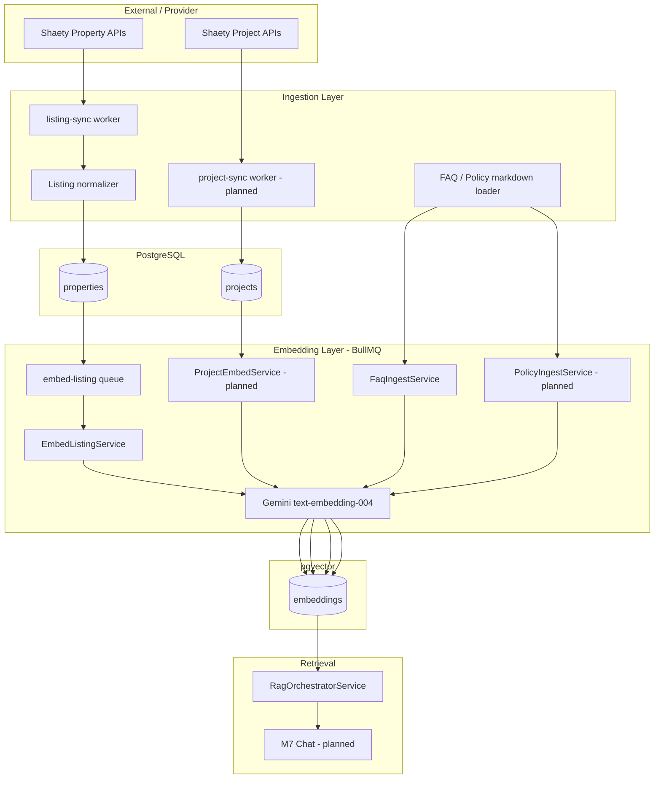
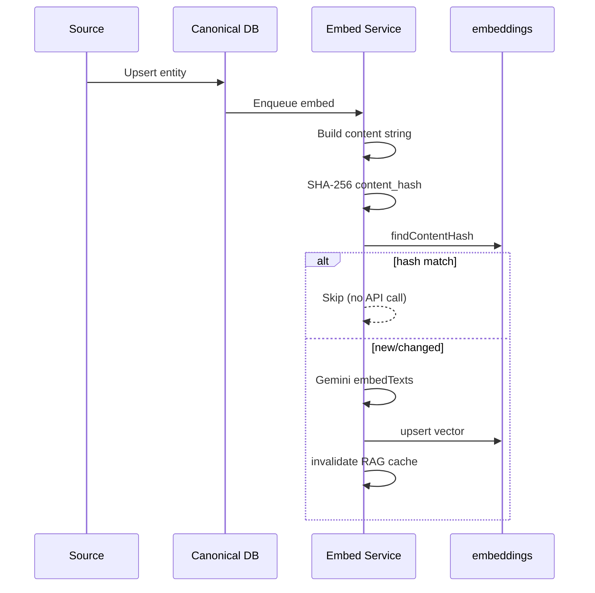

# RAG Data Ingestion Plan

> Strategy for ingesting property listings, descriptions, FAQs, platform policies, and development projects into the AI Property Assistant knowledge store for retrieval-augmented chat (FR-CHAT-007).

| Field | Value |
|-------|-------|
| Version | 1.0.0 |
| Status | Approved for implementation |
| Last updated | 2026-06-04 |
| Related | [`architecture/rag_architecture.md`](../architecture/rag_architecture.md), [`docs/domain_mapping.md`](domain_mapping.md), M6 completion ([`tasks/m06_rag_completion_report.md`](../tasks/m06_rag_completion_report.md)) |

---

## 1. Purpose

Ground Gemini chat agents in **verified, versioned platform knowledge** instead of model memory. Ingestion must be:

- **Idempotent** — re-runs skip unchanged content via `content_hash`
- **Incremental** — only changed entities are re-embedded
- **Source-aware** — each agent retrieves allowed `entity_type` values
- **Observable** — sync/embed jobs logged; metrics on `/metrics`

Consumers: `RagOrchestratorService` → `POST /api/v1/ai/rag/retrieve` (admin/agent) and future M7 chat pipeline.

---

## 2. Source catalog

| Source (product) | What it contains | Authoritative store | Vector store | Ingest trigger | MVP status |
|------------------|------------------|---------------------|--------------|----------------|------------|
| **Property APIs** | Structured listing fields from providers (Shaety first) | `properties` | `embeddings` (`property`, chunk 0) | Listing sync → embed queue | **Live** |
| **Property descriptions** | Long-form `description`, amenities, images metadata | Same row as property | Same embedding text (included in chunk) | Same as property | **Live** |
| **FAQs** | Help Q&A (search, booking, account, market) | `backend/data/knowledge/faq/*.md` | `embeddings` (`faq`) | App startup + manual re-ingest | **Live** |
| **Policies** | ToS, privacy, fair housing, booking rules (not legal advice) | `backend/data/knowledge/policies/*.md` (planned) | `embeddings` (`faq` category=`policy` or new enum) | Publish / CI deploy | **Planned** |
| **Projects** | Compounds, developers, payment plans, unit mix | `projects` (+ linked `properties`) | `embeddings` (`project`, multi-chunk) | Project sync job | **Planned** |

**Note:** Architecture docs refer to “contracts” for legal-style text; **Policies** in this plan are the same class of content (section-based, low churn, high sensitivity).

---

## 3. End-to-end ingestion architecture



---

## 4. Unified storage model (current implementation)

All RAG chunks today live in **`embeddings`**:

| Column | Role |
|--------|------|
| `entity_type` | `property` \| `project` \| `faq` (enum; extend for `policy` if needed) |
| `entity_id` | UUID of property/project, or deterministic UUID from stable FAQ/policy id |
| `chunk_index` | `0` for property/FAQ; `0..N` for projects/policies |
| `content` | Prefixed chunk text (`[PROPERTY]`, `[FAQ]`, …) |
| `content_hash` | SHA-256 of `content` — skip embed if unchanged |
| `embedding` | `vector(768)` cosine |
| `model_version` | `text-embedding-004` |

Property rows also maintain **`properties.search_vector`** (tsvector) for hybrid retrieval in `PrismaEmbeddingRepository`.

Future option (P2): migrate FAQ/policy/project to `knowledge_documents` + `knowledge_chunks` per [`rag_architecture.md`](../architecture/rag_architecture.md) §3 — not required for MVP.

---

## 5. Per-source ingestion strategy

### 5.1 Property APIs

**Role:** Primary factual inventory for Search, Recommendation, and Booking agents.

| Item | Detail |
|------|--------|
| **Upstream** | Provider adapter — Shaety `GET /properties`, `GET /properties/{id}` ([`docs/openapi.yaml`](openapi.yaml), REUSE in [`domain_mapping.md`](domain_mapping.md)) |
| **Pipeline** | `LISTING_SYNC_JOB` → `PropertyService.runListingSync` → `properties.upsertMany` → `enqueueEmbeddingBatch` |
| **Worker** | `embed-listing` processor → `EmbedListingService.embedProperty` / `embedMissingBatch` |
| **Cadence** | Every 30–60 min per provider; initial sync on empty catalog |
| **Staleness** | Listings not updated in 24h → `is_active = false`; embeddings retained until explicit delete (P1: purge inactive) |

**Field mapping (API → `properties`):**

- Title, price, type, bedrooms, area, location, images, `external_id`, `provider`
- **Description** ingested on same row (see §5.2)

**Embedding eligibility:** Active property with non-empty title; embed on create/update when hash changes.

**Code references:**

- `backend/src/application/property/property.service.ts` — sync + embed enqueue
- `backend/src/application/rag/embed-listing.service.ts`
- `backend/src/infrastructure/queue/embed-listing.processor.ts`

---

### 5.2 Property descriptions

**Role:** Natural-language detail inside the property chunk; critical for semantic queries (“sea view”, “fully furnished”, Arabic copy).

| Item | Detail |
|------|--------|
| **Source** | `properties.description` (from provider `content` / detail API) |
| **Not a separate pipeline** | Description is merged into **one listing chunk** (1:1 embedding) |
| **Preprocessing** | Trim; cap at 2,000 chars in `buildPropertyEmbeddingText`; strip HTML if provider sends markup |
| **Re-embed when** | Description, price, title, location, amenities, or type fields change (any change → new `content_hash`) |

**Chunk template (implemented):**

```
[PROPERTY]
Title: …
Type: … | … | … BR | … sqm
Price: … EGP
Location: district, city, governorate
Description: …
Amenities: …
Provider: … | ID: …
```

**Code reference:** `backend/src/domain/rag/property-embedding-text.ts`

**Quality checks:**

- Log `% listings with empty description` per sync run
- RAG eval set should include description-heavy queries ([`backend/scripts/rag-eval.ts`](../backend/scripts/rag-eval.ts))

---

### 5.3 FAQs

**Role:** Platform how-to and Egypt market context for Search, Booking, Follow-up agents.

| Item | Detail |
|------|--------|
| **Source of truth** | Git-managed Markdown under `backend/data/knowledge/faq/` |
| **Format** | YAML front matter + `# Question` heading + answer body |
| **Pipeline** | `FaqIngestService.onModuleInit` → `ingestFromDisk` (skip if `RAG_SKIP_FAQ_INGEST=true`) |
| **Cadence** | Every API/worker deploy; optional admin `POST /admin/rag/reingest-faq` (P1) |
| **Granularity** | 1 FAQ = 1 chunk (`chunk_index = 0`) |
| **Stable ID** | Front-matter `id` → deterministic UUID via `faqIdToUuid` |

**Example file:** `backend/data/knowledge/faq/search-001.md`

**Categories (target):** `search`, `booking`, `account`, `payments`, `egypt_market`, `agents`, `ai_chat`

**Chunk template (implemented):**

```
[FAQ]
Category: …
Question: …
Answer: …
Locale: …
faq_id: …
```

**Retrieval:** Included when `includeFaq: true` on `POST /api/v1/ai/rag/retrieve`.

**Expansion plan:**

- Add bilingual pairs (`locale: ar-EG` / `en`) as separate chunks or merged with locale tag
- CI check: every FAQ id unique; max ~512 tokens per chunk (split answer if longer)

---

### 5.4 Policies

**Role:** Platform rules, privacy, fair-housing guardrails context, booking cancellation text — **informational only** (FR-CHAT-014); never presented as legal advice.

| Item | Detail |
|------|--------|
| **Source of truth** | Markdown (MVP) or CMS (P1): `backend/data/knowledge/policies/` |
| **Document types** | `terms_of_service`, `privacy`, `fair_housing`, `booking_policy`, `data_retention` |
| **Pipeline (proposed)** | `PolicyIngestService` mirroring FAQ loader; run on deploy + version bump |
| **Granularity** | **Section-based** chunks (200–400 tokens, 50-token overlap) — see [`rag_architecture.md`](../architecture/rag_architecture.md) §4.2.4 |
| **Storage** | Phase 1: `entity_type = faq`, `category = policy` in content prefix; Phase 2: add `policy` to `EmbeddingEntityType` |
| **Preprocessing** | Strip HTML; **PII scrub** phone/email patterns; preserve Arabic |
| **Access control** | Booking + Follow-up agents only; exclude from Recommendation agent |

**Chunk template (proposed):**

```
[POLICY]
Type: booking_policy
Section: cancellation
Version: 1.2.0
Locale: ar-EG
Content: …
```

**Governance:**

- Legal/product sign-off on `version` field before publish
- Archived policies kept with `status=archived` but excluded from retrieval filters

---

### 5.5 Projects

**Role:** Compound-level context (“New Capital East”, developer, payment plans) for Search + Recommendation + chat.

| Item | Detail |
|------|--------|
| **Upstream** | Shaety `GET /projects`, `GET /projects/{id}/properties` (MODIFY — [`domain_mapping.md`](domain_mapping.md)) |
| **Canonical store** | `projects` table (already in Prisma schema) |
| **Link** | `properties.project_id` set during listing normalization when unit belongs to a project |
| **Pipeline (proposed)** | `project-sync` BullMQ job → upsert `projects` → `ProjectEmbedService` multi-chunk embed |
| **Cadence** | Daily + on-demand admin sync |
| **Granularity** | Section chunks: `overview`, `location`, `amenities`, `unit_types`, `payment_plans`, `developer` (4–8 chunks per project) |

**Chunk template (from architecture):**

```
[PROJECT]
Name: …
Developer: …
Section: payment_plans
…
```

**Retrieval:** Filter `entity_type = project`; join to active `properties` where needed for listing cards.

**MVP scope:** Ingest top N projects by city (e.g. Cairo, Alexandria, New Cairo) before full catalog.

---

## 6. Job orchestration

| Queue | Job | Producer | Consumer | Payload |
|-------|-----|----------|----------|---------|
| `listing-sync` | `sync-provider` | Cron / admin / startup | Listing sync processor | `{ provider }` |
| `embed-listing` | `embed-property` | After sync, manual | `EmbedListingProcessor` | `{ propertyId }` or `{ batchMissing: true }` |
| `embed-listing` | *(existing batch)* | `embedMissingBatch` | Same | — |
| `project-sync` *(planned)* | `sync-projects` | Cron | TBD | `{ provider, city? }` |
| `embed-knowledge` *(planned)* | `embed-document` | FAQ/Policy publish | TBD | `{ sourceType, externalKey }` |

**Ordering:** Always **canonical row first**, then embed job. Never embed without persisted source entity.

**Failure handling:**

- Sync failure → `sync_runs` row `failed`; no embed batch
- Embed failure → retry with backoff (3x); dead-letter log; property still searchable via SQL/tsvector
- FAQ/policy parse error → skip file, warn log; do not block startup

---

## 7. Freshness and idempotency



| Source | Change detection | Cache invalidation |
|--------|------------------|-------------------|
| Property | `content_hash` on embedding text | `RagCacheService.invalidateOnListingUpdate` |
| FAQ / Policy | Per-file hash | Global FAQ generation bump (P1) |
| Project | Per-section hash | Project-scoped invalidation |

---

## 8. Agent retrieval matrix

| Agent | Property | Descriptions (in property chunk) | FAQ | Policies | Projects |
|-------|:--------:|:------------------------------:|:---:|:--------:|:--------:|
| Search | ✅ Primary | ✅ | ✅ | ❌ | ✅ P1 |
| Recommendation | ✅ Primary | ✅ | ❌ | ❌ | ✅ P1 |
| Booking | ✅ Context | ✅ | ✅ | ✅ | ❌ |
| Follow-up | ✅ Similar | ✅ | ✅ | ✅ | ❌ |

Implemented filter: `RagOrchestratorService` passes `sourceTypes: ['property', 'faq?']` — extend for `project` and policy filter when ingested.

---

## 9. Implementation phases

### Phase A — Complete (M6)

- [x] Property sync → embed pipeline
- [x] Property description in embedding text
- [x] FAQ markdown ingest on startup
- [x] Hybrid retrieval (pgvector + property tsvector)
- [x] Admin retrieve API + metrics + eval script

### Phase B — Next (pre–M7 chat)

| # | Work item | Owner layer |
|---|-----------|-------------|
| B1 | Wire real Shaety property APIs in adapter ([`openapi.yaml`](openapi.yaml)) | Infrastructure |
| B2 | Add `backend/data/knowledge/policies/` + `PolicyIngestService` | Infrastructure |
| B3 | Extend retrieval to filter FAQ by category; exclude `policy` from Search agent | Application |
| B4 | Admin endpoint to re-run FAQ/policy ingest | Presentation |
| B5 | Monitor description coverage in sync metrics | Observability |

### Phase C — Projects (P1)

| # | Work item |
|---|-----------|
| C1 | `project-sync` worker + Shaety project adapter |
| C2 | `ProjectEmbedService` section chunking |
| C3 | Add `project` to `hybridRetrieve` source filter |
| C4 | Link listings via `project_id` in search UI (optional) |

### Phase D — Hardening (P2)

- `knowledge_documents` table + CMS workflow
- Full model re-index job on `text-embedding-004` upgrade
- Inactive listing embedding purge
- Bilingual duplicate detection (ar/en same FAQ id)

---

## 10. Operations

| Check | Command / endpoint |
|-------|-------------------|
| Embedding backlog | Worker logs: `Batch embed: N properties` |
| RAG quality | `npx ts-node backend/scripts/rag-eval.ts` |
| Metrics | `GET /metrics` (embed latency, retrieve counts) |
| Skip FAQ on dev | `RAG_SKIP_FAQ_INGEST=true` |
| Mock vectors | `GEMINI_MOCK_EMBEDDINGS=true` |

**SLO targets (MVP):**

- 95% of active listings embedded within 15 minutes of sync
- FAQ/policy deploy → searchable within 2 minutes of worker restart
- Embed API error rate &lt; 1% (with retries)

---

## 11. Security and compliance

- Provider API keys in secrets — never in repo
- Policies/contracts: no user PII in chunks; scrub before embed
- Fair housing: policy chunks + `FR-CHAT-014` system prompts
- Retrieval API: admin/agent roles only until chat consumer is authenticated
- Attribution: property chunks include `provider` for FR-SEARCH-014

---

## 12. Dependencies

| Dependency | Blocks |
|------------|--------|
| `GEMINI_API_KEY` | Production-quality vectors |
| Postgres + pgvector + Redis | All pipelines |
| Shaety production URL + auth | Real property/project ingest |
| Legal review of policy markdown | Policy source go-live |
| M7 chat feature | End-user consumption of ingested knowledge |

---

## 13. Summary

| Source | Ingest path | Chunk strategy | Status |
|--------|-------------|----------------|--------|
| Property APIs | Provider sync → `properties` | 1 entity = 1 vector | **Live** |
| Property descriptions | Same sync row | Embedded inside property chunk | **Live** |
| FAQs | Markdown on disk | 1 Q&A = 1 vector | **Live** |
| Policies | Markdown on disk (planned) | Section + overlap | **Planned** |
| Projects | Provider project sync (planned) | 4–8 sections per project | **Planned** |

This plan keeps **one embedding pipeline** (hash-gated, Gemini 768-dim, pgvector) while allowing each source to evolve independently—API sync for volatile listings, git/CMS for stable knowledge text.
