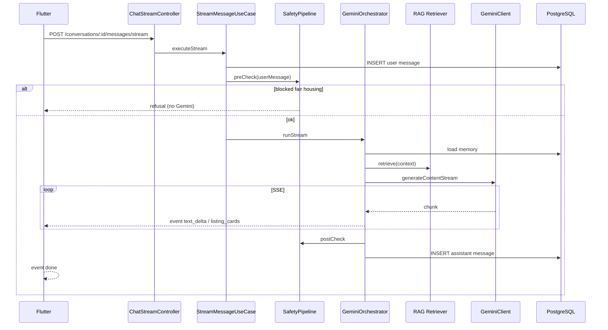

# Architecture — AI Chat

## Document Status

| Field | Value |
|-------|-------|
| Version | 1.0.0 |
| Status | Draft |
| Last Updated | 2026-06-03 |

---

## 1. Bounded context

**Conversational AI** — chat sessions, messages, agent orchestration, streaming to clients. No direct listing sync or booking state machine logic; delegates to property search, RAG, and booking modules via tools.

References: [system_design.md](../../architecture/system_design.md), [ai_agent_architecture.md](../../architecture/ai_agent_architecture.md).

---

## 2. Backend (NestJS)

### 2.1 Module structure

```
backend/src/modules/ai/                    # AiModule (feature wiring)
├── domain/
│   ├── entities/          conversation.ts, message.ts
│   └── ports/             conversation.repository, llm-*, safety-*
├── application/
│   ├── use-cases/
│   │   ├── create-conversation.use-case.ts
│   │   ├── list-conversations.use-case.ts
│   │   ├── send-message.use-case.ts
│   │   └── stream-message.use-case.ts
│   └── services/
│       └── tool-executor.service.ts       # Domain tools (not Gemini-specific)
├── infrastructure/
│   ├── persistence/         Prisma conversation + message repos
│   └── gemini/              Gemini integration layer
│       ├── gemini.module.ts
│       ├── gemini-orchestrator.service.ts
│       ├── gemini-stream.handler.ts
│       ├── tool-execution-loop.service.ts
│       ├── conversation-memory.service.ts
│       ├── context-manager.service.ts
│       └── safety/
│           └── safety-pipeline.service.ts
└── presentation/
    ├── conversations.controller.ts
    ├── chat-stream.controller.ts
    └── agents.controller.ts
```

### 2.2 Core components

| Component | Responsibility | Architecture reference |
|-----------|----------------|------------------------|
| **AiModule** | Registers controllers, use cases, Gemini adapters, RAG client | This document |
| **GeminiOrchestrator** | End-to-end completion: safety → memory → RAG → context → prompt → Gemini → tools → post-safety → persist | [gemini_integration_layer.md §10](../../architecture/gemini_integration_layer.md) |
| **GeminiStreamHandler** | Maps `generateContentStream` → `StreamChunk`; drives SSE | [gemini_integration_layer.md §3](../../architecture/gemini_integration_layer.md) |
| **SafetyPipeline** | Pre-call (injection, fair housing, quota, PII redact) + Gemini `safetySettings` + post-call (hallucination IDs, disclaimers) | [gemini_integration_layer.md §8](../../architecture/gemini_integration_layer.md) |
| **ToolExecutionLoop** | Execute function calls; max 3 per turn; parallel when independent | [gemini_integration_layer.md §5](../../architecture/gemini_integration_layer.md) |
| **ConversationMemoryService** | Load last N messages + optional summary from PostgreSQL | [gemini_integration_layer.md §6](../../architecture/gemini_integration_layer.md) |
| **ContextManager** | Token budget, RAG blocks, agent-switch system notice | [gemini_integration_layer.md §7](../../architecture/gemini_integration_layer.md) |
| **RAG retriever** | Hybrid retrieval → context block for property questions | [rag_architecture.md](../../architecture/rag_architecture.md) |

### 2.3 Domain ports (provider-agnostic)

Application code depends on ports only; Gemini implements them in infrastructure:

| Port | Purpose |
|------|---------|
| `LLMCompletionPort` | Non-streaming completion |
| `LLMStreamPort` | `AsyncIterable<StreamChunk>` |
| `EmbeddingPort` | Query embeddings (delegates to RAG module) |
| `PromptRegistryPort` | Versioned system prompts per agent/locale |
| `SafetyPolicyPort` | Fair housing templates, block reasons |

### 2.4 Request flow (streaming — primary path)



Non-streaming path: same orchestration via `SendMessageUseCase` → `POST .../messages` (MVP fallback).

### 2.5 Agent switch (FR-CHAT-005)

1. Client `PATCH /conversations/:id` with new `agentId`.
2. `ContextManager` injects one-turn system notice (not stored as user message).
3. Subsequent assistant messages use new `agent_id`; prior rows unchanged (FR-CHAT-006).

### 2.6 Disabled agent fallback (FR-CHAT-009)

On message send, if `conversations.agent_id` or user default references inactive agent:

1. Resolve platform default (`search-agent`).
2. Update conversation `agent_id`.
3. Return `agentSwitchedNotice` in response/SSE `done` payload.

---

## 3. RAG integration (FR-CHAT-007)

Property-related turns invoke tools (`semantic_search`, `search_properties`) backed by:

- Listing embeddings (`embeddings` + Elasticsearch per [rag_architecture.md](../../architecture/rag_architecture.md))
- Knowledge chunks (FAQ, projects, contracts) agent-filtered

Orchestrator injects verified listing IDs into context; post-call guard strips hallucinated IDs not in tool results.

---

## 4. Mobile (Flutter)

```
mobile/lib/features/ai_chat/
├── data/
│   ├── datasources/chat_remote_datasource.dart   # REST + SSE client
│   └── repositories/chat_repository_impl.dart
├── domain/
│   ├── entities/conversation.dart, chat_message.dart
│   └── repositories/chat_repository.dart
└── presentation/
    ├── pages/ chat_page, conversation_list_page
    └── widgets/ message_bubble, agent_picker, listing_card, stream_composer
```

| Concern | Implementation |
|---------|----------------|
| Streaming | SSE parser (`text_delta`, `a2ui_surface`, `listing_cards`, `done`, `error`) |
| Auth guard | `go_router` redirect guests (AC-CHAT-014) |
| Agent picker | Loads `GET /api/v1/agents`; mid-session switch |
| Listing cards | Navigate to property detail (M4) |
| GenUI surfaces | **M7.5** — `genui` `Surface` + widget catalog; see [genui_design.md](./genui_design.md) |
| Disclaimer | Footer on every assistant bubble |
| Degradation | Localized banner when `AI_UNAVAILABLE` |

### 4.1 GenUI layer (M7.5)

```
mobile/lib/features/ai_chat/genui/
├── catalog.dart              # A2UI allowlist → Flutter widgets
├── components/               # PropertyCarousel, FilterChipRow, …
└── genui_chat_controller.dart  # SurfaceController + SSE bridge
```

Server emits `a2ui_surface` events with catalog-aligned JSON. Legacy `listing_cards` remain until `GENUI_ENABLED` rollout ([genui_design.md](./genui_design.md)).

---

## 5. Cross-cutting

| Concern | Approach |
|---------|----------|
| Observability | `ai.*` metrics: latency, `toolsCalled`, safety blocks, quota | [monitoring_strategy.md](../../architecture/monitoring_strategy.md) |
| Compaction | BullMQ job when message count > 30 | [gemini_integration_layer.md §6](../../architecture/gemini_integration_layer.md) |
| Provider strategy | Gemini MVP; ports allow future adapters | [ai_provider_strategy.md](../../architecture/ai_provider_strategy.md) |

---

## Related documents

- [data_model.md](./data_model.md)
- [api_design.md](./api_design.md)
- [requirements.md](./requirements.md)
- [gemini_integration_layer.md](../../architecture/gemini_integration_layer.md)
- [rag_architecture.md](../../architecture/rag_architecture.md)
- [ai_agent_architecture.md](../../architecture/ai_agent_architecture.md)
- [genui_design.md](./genui_design.md)
