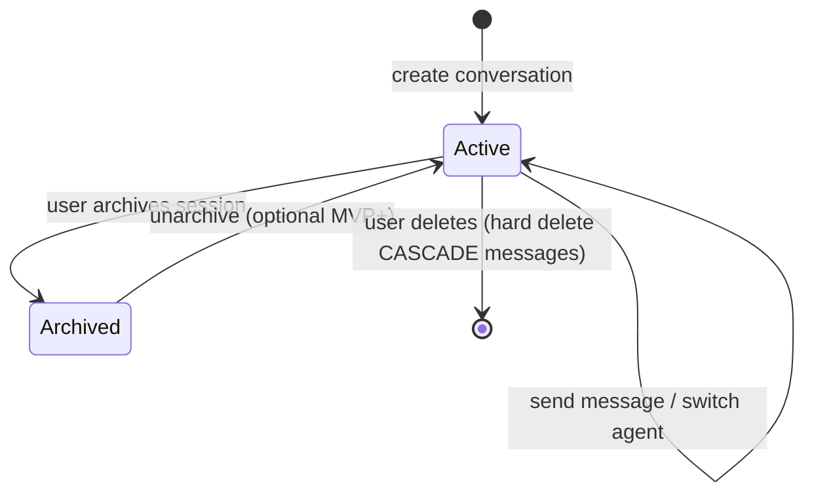

# Data Model — AI Chat

## Document Status

| Field | Value |
|-------|-------|
| Version | 1.0.0 |
| Status | Draft |
| Last Updated | 2026-06-03 |
| Schema reference | [postgresql_schema.md](../../architecture/postgresql_schema.md) |

---

## 1. Domain entities

### Conversation (aggregate root)

| Field | Type | Rules |
|-------|------|-------|
| id | UUID | Immutable |
| userId | UUID | Owner; must match JWT subject |
| agentId | string | Current agent (`search-agent`, etc.) |
| title | string? | Auto from first user message; max 200 |
| isArchived | boolean | Default false |
| lastMessageAt | DateTime? | Denormalized for list sort |
| summary | JSON? | Optional compaction payload (gemini §6) |

### Message (entity)

| Field | Type | Rules |
|-------|------|-------|
| id | UUID | Immutable |
| conversationId | UUID | FK |
| role | MessageRole | `user` \| `assistant` \| `system` |
| content | string | Required; max 4000 enforced in SafetyPipeline |
| agentId | string? | Required on `assistant` (FR-CHAT-006) |
| listingRefs | ListingRef[] | Cards cited; validated post-call |
| metadata | MessageMetadata? | Tools, latency, tokens |
| tokenCount | int? | Approximate |
| createdAt | DateTime | Immutable |

### Value objects

| VO | Validation |
|----|------------|
| `MessageRole` | Enum three values |
| `ListingRef` | `propertyId` UUID + display fields |
| `AgentId` | Must exist in `ai_agents` and `isActive` at send time (or fallback) |

### AiAgent (catalog — supporting entity)

Read-only catalog row; not owned by chat aggregate but referenced by `conversations.agent_id` and `users.preferred_agent_id`.

| Field | Notes |
|-------|-------|
| id | e.g. `search-agent` |
| nameI18n, descriptionI18n | ar-EG / en |
| isDefault, isActive | Admin toggle (FR-ADMIN-001) |
| tools[] | Allowlist for Gemini declarations |

See [ai_agent_architecture.md §3.1](../../architecture/ai_agent_architecture.md).

---

## 2. State transitions



Agent switch does not fork conversation — same `conversation.id`, updated `agent_id`.

---

## 3. PostgreSQL mapping

### 3.1 `conversations`

| Column | Type | Notes |
|--------|------|-------|
| `id` | UUID PK | |
| `user_id` | UUID FK → `users` | ON DELETE CASCADE |
| `agent_id` | VARCHAR(50) | Current agent |
| `title` | VARCHAR(200) | Nullable |
| `is_archived` | BOOLEAN | Default false |
| `last_message_at` | TIMESTAMPTZ | Updated each message |
| `created_at`, `updated_at` | TIMESTAMPTZ | |

**Optional (compaction):** `summary JSONB` — `{ "text", "upToMessageId", "version" }` per [gemini_integration_layer.md §6](../../architecture/gemini_integration_layer.md).

### 3.2 `messages`

| Column | Type | Notes |
|--------|------|-------|
| `id` | UUID PK | |
| `conversation_id` | UUID FK | ON DELETE CASCADE |
| `role` | `message_role` ENUM | user / assistant / system |
| `content` | TEXT | |
| `agent_id` | VARCHAR(50) | Assistant messages only |
| `listing_refs` | JSONB | Default `[]` |
| `metadata` | JSONB | `toolsCalled`, `latencyMs`, `model` |
| `token_count` | INT | Optional |
| `created_at` | TIMESTAMPTZ | |

**`listing_refs` example:**

```json
[
  { "propertyId": "uuid", "title": "3BR Maadi", "priceEgp": 25000 }
]
```

**`metadata` example:**

```json
{
  "toolsCalled": ["semantic_search"],
  "latencyMs": 1200,
  "model": "gemini-2.0-flash",
  "promptVersion": "search-agent-v1"
}
```

### 3.3 Related tables (not chat-owned)

| Table | Relationship |
|-------|--------------|
| `users.preferred_agent_id` | Default agent for new sessions (FR-CHAT-008) |
| `ai_agents` | Catalog for `agent_id` FK semantics (soft ref) |
| `embeddings` / `knowledge_chunks` | RAG; no direct FK from messages |

---

## 4. Indexes

```sql
CREATE INDEX conversations_user_id_idx ON conversations (user_id);
CREATE INDEX conversations_last_message_at_idx
  ON conversations (user_id, last_message_at DESC);

CREATE INDEX messages_conversation_id_idx
  ON messages (conversation_id, created_at);
```

---

## 5. Invariants

| Rule | Enforcement |
|------|-------------|
| User owns conversation | Repository filters `user_id = :jwtSub` |
| Assistant `agent_id` set | Use case on persist |
| No cross-user read | 404 if conversation not owned |
| Listing refs ⊆ tool results | SafetyPipeline post-call |
| System role | Internal only; not exposed in client history API |

---

## 6. Prisma mapping

| SQL | Prisma model |
|-----|--------------|
| `conversations` | `Conversation` |
| `messages` | `Message` |

---

## Related documents

- [api_design.md](./api_design.md)
- [architecture.md](./architecture.md)
- [postgresql_schema.md §4.5–4.6](../../architecture/postgresql_schema.md)
