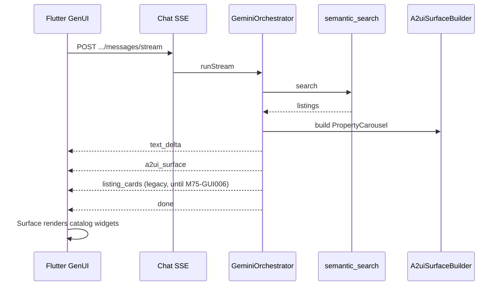

# GenUI Design — AI Chat

## Document Status

| Field | Value |
|-------|-------|
| Version | 0.1.0 |
| Status | Implemented — M75 complete |
| Last Updated | 2026-06-11 |
| Packages | `genui`, `genai_primitives` (Flutter, alpha) |
| Protocol | [A2UI](https://a2ui.org) v0.9 |

---

## 1. Goal

Upgrade chat from **text + static listing cards** to **generative surfaces**: the agent composes interactive Flutter UI (property carousels, filter chips, budget presets, booking CTAs) from a fixed widget catalog—so users feel they are texting a human real estate agent, not reading search dumps.

**M7 baseline (done):** SSE `text_delta`, `listing_cards`, `MessageBubble`, `ListingCardTile`.  
**M7.5 target:** SSE `a2ui_surface` + GenUI `Surface` rendering the same data with richer interaction.

---

## 2. Architecture

**Server-side generation (chosen):** NestJS orchestrator builds A2UI JSON from tool results and catalog schema hints. Gemini adds conversational text; structured surfaces come from `A2uiSurfaceBuilder` (deterministic in mock mode). Aligns with existing JWT, safety, and fair-housing pipeline.

---

## 3. Widget catalog (allowlist)

| A2UI name | Flutter component | Use case |
|-----------|-------------------|----------|
| `PropertyCard` | Wraps `ListingCardTile` | Single listing highlight |
| `PropertyCarousel` | Horizontal list of cards | Search / recommendation results |
| `FilterChipRow` | Chips for type, beds, listing | Refine search in-chat |
| `BudgetPresetRow` | Price preset chips | Quick budget selection |
| `PrimaryButton` | FilledButton | “Book viewing”, “See more” |

Only these names may appear in generated surfaces. Unknown components are stripped by `A2uiSafetyValidator`.

---

## 4. SSE protocol

| Event | Payload | Notes |
|-------|---------|-------|
| `text_delta` | `{ text }` | Unchanged from M7 |
| `a2ui_surface` | `{ surfaceId, a2ui }` | A2UI v0.9 JSON |
| `listing_cards` | `{ cards }` | Legacy; deprecated when `GENUI_ENABLED=true` |
| `tool_call` / `tool_result` | unchanged | |
| `done` | `{ messageId, ... }` | |

**Persistence:** Assistant messages may store `uiSurface` JSON for history reload.

---

## 5. Safety

- Listing `propertyId` values in surfaces must ⊆ tool result IDs.
- No filter props for religion, ethnicity, nationality, or family status.
- Catalog allowlist enforced server-side before SSE emit and on persist.
- Extends FR-CHAT-014 fair housing rules to generated UI.

---

## 6. i18n

Catalog labels and agent text remain **ar-EG** and **en** per conversation locale. A2UI payload uses stable keys; renderer resolves strings via `AppLocalizations`.

---

## 7. Feature flag

| Variable | Default | Purpose |
|----------|---------|---------|
| `GENUI_ENABLED` | `false` | Gradual rollout; legacy `listing_cards` when off |

---

## 8. Dependencies

| Milestone | Relationship |
|-----------|--------------|
| M7 | Required — chat, streaming, tools |
| M8 | Optional — recommendation carousel in chat |
| M9 | Reuses `PrimaryButton` + forms for booking agent |

---

## 9. Risks

| Risk | Mitigation |
|------|------------|
| `genui` alpha API churn | Pin version; thin adapter layer in `ai_chat/genui/` |
| Duplicate UI during migration | `GENUI_ENABLED` flag; M75-GUI006 |
| Token cost for UI JSON | Deterministic builder for listings; LLM text only |

---

## Related documents

- [architecture.md](./architecture.md)
- [api_design.md](./api_design.md)
- [Flutter GenUI docs](https://docs.flutter.dev/ai/genui)
- [tasks/m075-genui/](../../tasks/m075-genui/)
