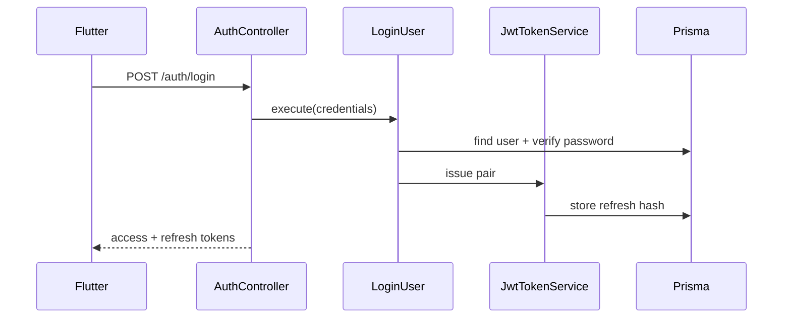

# Architecture — Authentication & Onboarding

## Document Status

| Field | Value |
|-------|-------|
| Version | 1.0.0 |
| Status | Draft |
| Last Updated | 2026-06-03 |

---

## 1. Bounded context

**Identity & Access** — registration, authentication, tokens, RBAC. No property or booking logic in this module.

References: [system_design.md](../../architecture/system_design.md), [backend_architecture.md](../../architecture/backend_architecture.md).

---

## 2. Backend (NestJS)

### 2.1 Module structure

```
backend/src/
├── domain/auth/           # Entities, VOs, ports (no Nest imports)
├── application/auth/      # Use cases
├── infrastructure/auth/   # JWT, Passport, Prisma repos
├── infrastructure/persistence/auth/
├── modules/auth/          # AuthModule wiring
└── presentation/
    ├── auth/auth.controller.ts
    └── guards/            # JwtAuthGuard, RolesGuard
```

### 2.2 Use cases

| Use case | Trigger |
|----------|---------|
| `RegisterUser` | POST /auth/register |
| `VerifyEmail` | GET /auth/verify-email |
| `LoginUser` | POST /auth/login |
| `RefreshTokens` | POST /auth/refresh |
| `LogoutUser` | POST /auth/logout |
| `ForgotPassword` | POST /auth/forgot-password |
| `ResetPassword` | POST /auth/reset-password |
| `GoogleAuth` | POST /auth/google |
| `AppleAuth` | POST /auth/apple |

### 2.3 Infrastructure

| Component | Technology |
|-----------|------------|
| Password hash | bcrypt cost 12 |
| Tokens | `@nestjs/jwt` + custom refresh store |
| OAuth | Passport Google + Apple strategies |
| Email jobs | BullMQ `send-email` queue |
| Events | In-process EventEmitter (MVP); no external bus |



---

## 3. Mobile (Flutter)

```
mobile/lib/features/authentication/
├── data/
│   ├── datasources/auth_remote_datasource.dart
│   └── repositories/auth_repository_impl.dart
├── domain/
│   ├── entities/user_session.dart
│   └── repositories/auth_repository.dart
└── presentation/
    ├── pages/ login, register, onboarding, forgot_password
    └── providers/ auth_notifier, route guard integration
```

| Concern | Implementation |
|---------|----------------|
| Token storage | `flutter_secure_storage` |
| HTTP auth | Dio interceptor in `core/network/auth_interceptor.dart` |
| OAuth | `google_sign_in`, `sign_in_with_apple` |
| i18n | `flutter gen-l10n` ar-EG + en |
| Route guard | `go_router` redirect if unauthenticated |

---

## 4. Security

- Rate limiting on `/auth/*` (see [api_conventions.md](../../architecture/api_conventions.md)).
- Unverified users: middleware returns 403 `EMAIL_NOT_VERIFIED` on protected routes except verify/resend.
- RBAC: `@Roles('buyer' | 'agent' | 'admin')` + domain checks for sensitive actions.

---

## Related documents

- [data_model.md](./data_model.md)
- [api_design.md](./api_design.md)
- [clean_architecture.md](../../architecture/clean_architecture.md)
