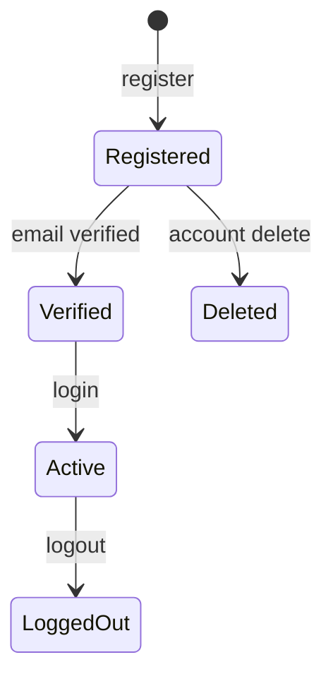

# Data Model — Authentication & Onboarding

## Document Status

| Field | Value |
|-------|-------|
| Version | 1.0.0 |
| Status | Draft |
| Last Updated | 2026-06-03 |
| Schema reference | [postgresql_schema.md](../../architecture/postgresql_schema.md) |

---

## 1. Domain entities

### User (aggregate root)

| Field | Type | Rules |
|-------|------|-------|
| id | UUID | Immutable |
| email | Email VO | Unique, case-insensitive |
| passwordHash | string? | Null for OAuth-only |
| role | UserRole | `buyer` \| `agent` \| `admin` |
| emailVerified | boolean | Default false |
| consentAt | DateTime? | Required for registration |
| locale | string | `ar-EG` \| `en` |

### Value objects

| VO | Validation |
|----|------------|
| `Email` | RFC-like format, normalized lowercase |
| `Password` | Min 8 chars, no max for MVP |
| `UserRole` | Enum |

### RefreshToken (entity)

| Field | Rules |
|-------|-------|
| tokenHash | Store hash only |
| userId | FK |
| expiresAt | 7 days |
| revokedAt | Set on logout / rotation |

### OAuthAccount (entity)

| Field | Rules |
|-------|-------|
| provider | `google` \| `apple` |
| providerUserId | Unique per provider |
| userId | FK → User |

---

## 2. State transitions

Unverified users may login but receive limited token scope or 403 on protected features per AC-AUTH-007.

---

## 3. PostgreSQL mapping

### `users` (core)

See [postgresql_schema.md §4.1](../../architecture/postgresql_schema.md).

Auth-owned columns: `email`, `password_hash`, `role`, `email_verified`, `consent_at`, `locale`.

### `refresh_tokens` (supporting)

| Column | Type | Notes |
|--------|------|-------|
| id | UUID PK | |
| user_id | UUID FK | ON DELETE CASCADE |
| token_hash | VARCHAR | bcrypt or SHA-256 of token |
| expires_at | TIMESTAMPTZ | |
| revoked_at | TIMESTAMPTZ | nullable |
| created_at | TIMESTAMPTZ | |

### `oauth_accounts` (supporting)

| Column | Type | Notes |
|--------|------|-------|
| id | UUID PK | |
| user_id | UUID FK | |
| provider | ENUM | google, apple |
| provider_user_id | VARCHAR | UNIQUE(provider, provider_user_id) |
| created_at | TIMESTAMPTZ | |

### `password_reset_tokens` (supporting)

| Column | Type | Notes |
|--------|------|-------|
| id | UUID PK | |
| user_id | UUID FK | |
| token_hash | VARCHAR | Single-use |
| expires_at | TIMESTAMPTZ | ≤ 1 hour |

---

## 4. Indexes

- `users_email_idx` UNIQUE WHERE `deleted_at IS NULL`
- `refresh_tokens_user_id_idx`
- `oauth_accounts_provider_user_id_idx` UNIQUE

---

## Related documents

- [api_design.md](./api_design.md)
- [architecture.md](./architecture.md)
