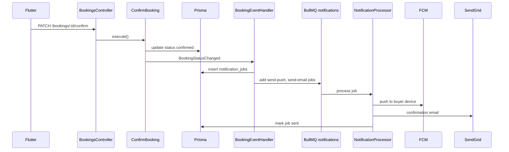

# Architecture — Booking & Notifications

## Document Status

| Field | Value |
|-------|-------|
| Version | 1.0.0 |
| Status | Draft |
| Last Updated | 2026-06-03 |
| Notifications scope | **Option A** — `NotificationsModule` lives in backend; SDD artifacts under `features/booking/` |

---

## 1. Bounded context

**Scheduling** — viewing appointments between buyers and agents.  
**Notifications (booking slice)** — async push and email for booking lifecycle events.

References: [system_design.md](../../architecture/system_design.md), [backend_architecture.md](../../architecture/backend_architecture.md).

No property catalog or auth logic in these modules; they consume ports from Users and Properties.

---

## 2. Backend (NestJS)

### 2.1 Module structure

```
backend/src/
├── domain/booking/              # Booking aggregate, status machine, policies
├── domain/notifications/        # NotificationJob entity, channel ports
├── application/booking/         # Create, list, confirm, decline, cancel use cases
├── application/notifications/   # EnqueueNotification use case
├── infrastructure/booking/      # Prisma booking repository
├── infrastructure/notifications/
│   ├── fcm.service.ts           # FCM push adapter
│   ├── sendgrid.service.ts      # Email adapter
│   └── templates/               # MJML/HTML ar-EG + en
├── modules/bookings/            # BookingsModule
├── modules/notifications/       # NotificationsModule + BullMQ processor
└── presentation/
    ├── bookings/bookings.controller.ts
    └── agent/agent-bookings.controller.ts
```

### 2.2 Modules

| Module | Responsibility | Exports |
|--------|----------------|---------|
| **BookingsModule** | CRUD, lifecycle transitions, quota + conflict guards | `CreateBookingUseCase`, `UpdateBookingUseCase` |
| **NotificationsModule** | Enqueue jobs, process push/email, template render | `EnqueueNotificationUseCase` |

`BookingsModule` imports `NotificationsModule`. On status change, booking use cases emit domain events; an event handler enqueues `notification_jobs` (in-process EventEmitter for MVP per [authentication/architecture.md](../authentication/architecture.md)).

### 2.3 Use cases

| Use case | Trigger |
|----------|---------|
| `CreateBooking` | POST `/bookings` |
| `ListBuyerBookings` | GET `/bookings` |
| `ListAgentBookings` | GET `/agent/bookings` |
| `GetBooking` | GET `/bookings/:id` |
| `ConfirmBooking` | PATCH `/bookings/:id/confirm` |
| `ProposeAlternativeTime` | PATCH `/bookings/:id/propose` |
| `DeclineBooking` | PATCH `/bookings/:id/decline` |
| `CancelBooking` | PATCH `/bookings/:id/cancel` |
| `CompleteBooking` | PATCH `/bookings/:id/complete` |
| `EnqueueNotification` | Domain event `BookingStatusChanged` |

### 2.4 Notifications pipeline

| Component | Technology |
|-----------|------------|
| Job queue | BullMQ queue `notifications` |
| Job types | `send-push`, `send-email` |
| Push | Firebase Cloud Messaging (FCM); APNs via FCM for iOS |
| Email | SendGrid transactional API |
| Templates | MJML → HTML; locale from recipient `users.locale` |
| Persistence | `notification_jobs` table (audit + retry state) |
| Preferences | Read `notification_preferences` before enqueue (FR-NOTIF-003) |



### 2.5 Policy services

| Service | Rules |
|---------|-------|
| `BookingConflictPolicy` | No two `confirmed` bookings overlap for same `agent_id` + `scheduled_at` window (FR-BOOK-010) |
| `AgentQuotaPolicy` | Count `requested`+`confirmed` bookings for agent in current calendar month; reject create at ≥5 for free tier (FR-BOOK-009) |
| `CancellationPolicy` | Cancel allowed only if `now() < scheduled_at` (or `preferred_at` if not yet confirmed) |

---

## 3. Mobile (Flutter)

```
mobile/lib/features/booking/
├── data/
│   ├── datasources/booking_remote_datasource.dart
│   ├── models/booking_dto.dart
│   └── repositories/booking_repository_impl.dart
├── domain/
│   ├── entities/booking.dart
│   ├── repositories/booking_repository.dart
│   └── usecases/ create_booking, list_bookings, cancel_booking
└── presentation/
    ├── pages/
    │   ├── booking_request_page.dart      # From listing detail
    │   ├── buyer_bookings_page.dart
    │   └── booking_detail_page.dart
    ├── agent/
    │   ├── agent_bookings_page.dart       # Inbox + filters
    │   └── agent_booking_actions.dart     # Confirm / decline / propose
    └── providers/ booking_notifier.dart
```

| Concern | Implementation |
|---------|----------------|
| Date/time picker | Local timezone display; ISO UTC to API |
| Push handling | `firebase_messaging`; deep link to `/bookings/:id` |
| Auth | Buyer vs agent routes via RBAC + role from session |
| i18n | `flutter gen-l10n` ar-EG + en |
| Idempotency | Generate UUID `Idempotency-Key` on create |

### 3.1 Mobile flows

**Buyer:** Listing detail → Book viewing → select date/time + message → POST → confirmation screen → My Bookings list → detail → cancel.

**Agent:** Push on new request → Agent inbox (requested first) → open booking → Confirm / Propose / Decline → buyer notified.

---

## 4. Cross-cutting

| Concern | Approach |
|---------|----------|
| Events | In-process EventEmitter (MVP); `BookingConfirmed`, `BookingCancelled`, etc. |
| Caching | None for bookings (source of truth PostgreSQL) |
| AI chat integration | Booking Agent calls `CreateBookingUseCase` via tool; same domain rules |
| Monitoring | `booking_created_total`, `notification_job_failed_total` per [monitoring_strategy.md](../../architecture/monitoring_strategy.md) |

---

## 5. External services

| Service | Purpose | Fallback |
|---------|---------|----------|
| FCM | Push to iOS/Android | Log failure; job retry; invalid token deactivated |
| SendGrid | Booking emails | Retry 3×; alert on DLQ |
| Redis | BullMQ backend | Required for notification dispatch |

---

## Related documents

- [data_model.md](./data_model.md)
- [api_design.md](./api_design.md)
- [clean_architecture.md](../../architecture/clean_architecture.md)
- [flutter_architecture.md](../../architecture/flutter_architecture.md)
