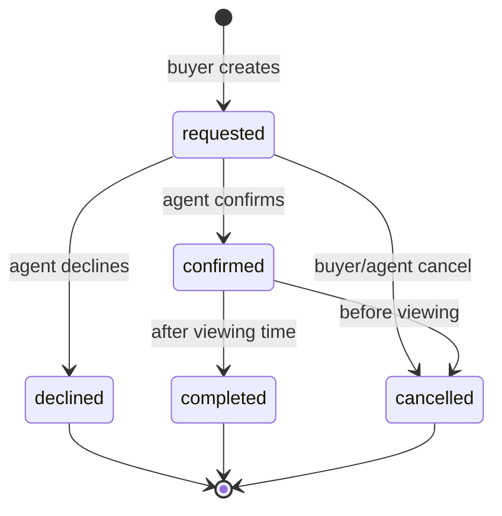

# Data Model — Booking & Notifications

## Document Status

| Field | Value |
|-------|-------|
| Version | 1.0.0 |
| Status | Draft |
| Last Updated | 2026-06-03 |
| Schema reference | [postgresql_schema.md](../../architecture/postgresql_schema.md) |

---

## 1. Domain entities

### Booking (aggregate root)

| Field | Type | Rules |
|-------|------|-------|
| id | UUID | Immutable |
| buyerId | UUID | FK → User, role `buyer` |
| agentId | UUID | FK → User, role `agent` |
| propertyId | UUID | FK → Property, must be active |
| status | BookingStatus | See state machine |
| preferredAt | DateTime | Buyer requested slot (UTC) |
| scheduledAt | DateTime? | Set on confirm |
| buyerMessage | string? | Optional note |
| agentMessage | string? | Decline reason or proposal note |
| confirmedAt | DateTime? | |
| cancelledAt | DateTime? | |
| createdAt | DateTime | |
| updatedAt | DateTime | |

### NotificationJob (entity)

| Field | Type | Rules |
|-------|------|-------|
| id | UUID | Immutable |
| userId | UUID | Recipient |
| channel | NotificationChannel | `push` \| `email` |
| eventType | string | e.g. `booking.confirmed` |
| payload | JSON | Template variables |
| status | JobStatus | `pending` → `processing` → `sent` \| `failed` |
| attempts | number | Max 5 |
| lastError | string? | |
| scheduledAt | DateTime | Usually immediate |
| sentAt | DateTime? | |
| createdAt | DateTime | |

### Value objects & enums

| Name | Values |
|------|--------|
| `BookingStatus` | `requested`, `confirmed`, `completed`, `cancelled`, `declined` |
| `NotificationChannel` | `push`, `email` |
| `JobStatus` | `pending`, `processing`, `sent`, `failed`, `skipped` |

`skipped` used when FR-NOTIF-003 preferences disable non-essential channel.

---

## 2. State machine



### Transition rules

| From | To | Actor | Guard |
|------|-----|-------|-------|
| — | `requested` | Buyer | Property active; agent quota OK |
| `requested` | `confirmed` | Agent | No slot conflict; sets `scheduled_at` |
| `requested` | `declined` | Agent | Optional `agent_message` |
| `requested` | `cancelled` | Buyer or Agent | Before `preferred_at` |
| `confirmed` | `cancelled` | Buyer or Agent | Before `scheduled_at` |
| `confirmed` | `completed` | Agent or System job | After `scheduled_at` |
| `requested` | `requested` | Agent | Propose alternative: update `preferred_at`, notify buyer |

**Invariants**

- `scheduled_at` required when `status = confirmed`.
- Only one `confirmed` booking per agent per time window (30 min slot, configurable).
- `buyer_id` ≠ `agent_id`.

---

## 3. Aggregates & policies

| Aggregate | Invariants enforced in domain |
|-----------|----------------------------|
| Booking | Valid transitions; cancel window; conflict check on confirm |
| AgentQuota | Monthly count per agent (free tier) |
| NotificationJob | Idempotent enqueue per `(userId, eventType, bookingId, channel)` within 5 min |

---

## 4. PostgreSQL mapping

### 4.1 `bookings` (core)

See [postgresql_schema.md §4.4](../../architecture/postgresql_schema.md).

| Column | Prisma field | Notes |
|--------|--------------|-------|
| `buyer_id` | `buyerId` | |
| `agent_id` | `agentId` | From property assignment |
| `property_id` | `propertyId` | |
| `status` | `status` | `booking_status` enum |
| `preferred_at` | `preferredAt` | TIMESTAMPTZ UTC |
| `scheduled_at` | `scheduledAt` | Set on confirm |
| `buyer_message` | `buyerMessage` | |
| `agent_message` | `agentMessage` | |
| `confirmed_at` | `confirmedAt` | |
| `cancelled_at` | `cancelledAt` | |

**Enum `booking_status`:** `requested`, `confirmed`, `completed`, `cancelled`, `declined`

**Indexes (existing):**

- `bookings_buyer_id_idx`
- `bookings_agent_id_idx`
- `bookings_status_idx`
- `bookings_scheduled_at_idx` WHERE `status = 'confirmed'`

**Additional index (conflict detection):**

```sql
CREATE UNIQUE INDEX bookings_agent_slot_uidx
  ON bookings (agent_id, scheduled_at)
  WHERE status = 'confirmed';
```

---

### 4.2 `notification_jobs` (supporting — booking-owned)

Not yet in global schema; add in M9 migration.

| Column | Type | Constraints | Description |
|--------|------|-------------|-------------|
| `id` | UUID | PK | |
| `user_id` | UUID | FK → `users(id)` NOT NULL | Recipient |
| `booking_id` | UUID | FK → `bookings(id)` ON DELETE SET NULL | Correlation |
| `channel` | VARCHAR(10) | NOT NULL | `push` \| `email` |
| `event_type` | VARCHAR(50) | NOT NULL | e.g. `booking.confirmed` |
| `payload` | JSONB | NOT NULL | Template variables |
| `status` | VARCHAR(20) | NOT NULL, default `'pending'` | |
| `attempts` | INT | NOT NULL, default `0` | |
| `last_error` | TEXT | | |
| `bull_job_id` | VARCHAR(100) | | BullMQ correlation |
| `scheduled_at` | TIMESTAMPTZ | NOT NULL | |
| `sent_at` | TIMESTAMPTZ | | |
| `created_at` | TIMESTAMPTZ | NOT NULL | |

**Indexes:**

```sql
CREATE INDEX notification_jobs_status_idx ON notification_jobs (status, scheduled_at);
CREATE INDEX notification_jobs_user_id_idx ON notification_jobs (user_id);
CREATE INDEX notification_jobs_booking_id_idx ON notification_jobs (booking_id);
```

---

### 4.3 Related supporting tables

| Table | Owner | Purpose |
|-------|-------|---------|
| `device_tokens` | Profile / platform | FCM registration tokens per user device |
| `notification_preferences` | Profile | Push/email opt-in per event category (FR-NOTIF-003) |

Booking module reads preferences; does not own preference CRUD.

---

## 5. Template payload schema (JSONB)

Common fields in `notification_jobs.payload`:

| Field | Type | Description |
|-------|------|-------------|
| `bookingId` | UUID | |
| `propertyTitle` | string | Localized |
| `propertyAddress` | string | Localized |
| `scheduledAt` | ISO8601 | Confirmed time |
| `preferredAt` | ISO8601 | Requested time |
| `buyerName` | string | Agent-facing emails |
| `agentName` | string | Buyer-facing emails |
| `locale` | string | `ar-EG` \| `en` |
| `deepLink` | string | `aiproperty://bookings/{id}` |

---

## 6. Migration notes

| Change | Milestone | Notes |
|--------|-----------|-------|
| `notification_jobs` table | M9-BOK005 | New supporting table |
| `bookings_agent_slot_uidx` | M9-BOK004 | Partial unique for double-book guard |
| `agent_availability` JSON on `users.agent_profile` | M9+ (P1) | FR-BOOK-012; optional separate table later |

Align Prisma models with [postgresql_schema.md](../../architecture/postgresql_schema.md) during S1-112 cross-check.

---

## Related documents

- [api_design.md](./api_design.md)
- [architecture.md](./architecture.md)
