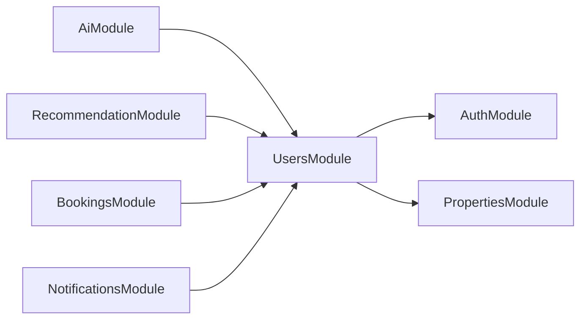
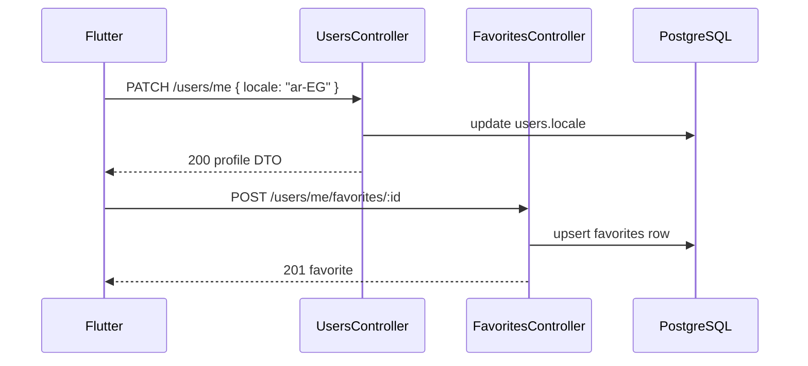
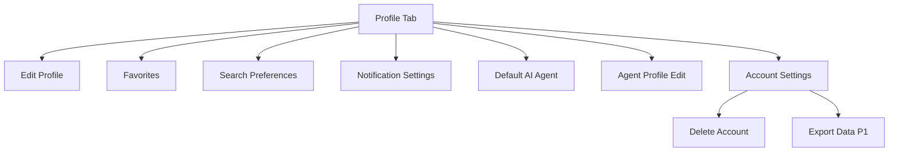

# Architecture — Profile & Preferences

## Document Status

| Field | Value |
|-------|-------|
| Version | 1.0.0 |
| Status | Draft |
| Last Updated | 2026-06-03 |

---

## 1. Bounded context

**User Profile** — personal data, preferences, favorites, agent public card, and PDPL erasure/export. No property search, booking workflow, or AI inference logic in this module.

References: [system_design.md](../../architecture/system_design.md), [backend_architecture.md](../../architecture/backend_architecture.md), [flutter_architecture.md](../../architecture/flutter_architecture.md).

---

## 2. Backend (NestJS)

### 2.1 Module structure

Profile lives in **UsersModule** per [backend_architecture.md §4](../../architecture/backend_architecture.md).

```
backend/src/
├── domain/users/              # UserProfile entity, Favorite, preference VOs
├── application/users/         # Use cases (profile, favorites, delete, export)
├── infrastructure/users/      # Prisma repositories, avatar upload adapter
├── modules/users/             # UsersModule wiring
└── presentation/
    ├── users/users.controller.ts
    ├── users/favorites.controller.ts
    └── agents/agents.controller.ts   # GET /agents/:id public card
```

### 2.2 Use cases

| Use case | Trigger |
|----------|---------|
| `GetMyProfile` | GET /users/me |
| `UpdateMyProfile` | PATCH /users/me |
| `UpdateSearchPreferences` | PATCH /users/me (partial) or PATCH /users/me/preferences |
| `SetDefaultAgent` | PATCH /users/me (`preferredAgentId`) |
| `AddFavorite` | POST /users/me/favorites/:propertyId |
| `RemoveFavorite` | DELETE /users/me/favorites/:propertyId |
| `ListFavorites` | GET /users/me/favorites |
| `GetAgentProfile` | GET /agents/:id |
| `DeleteAccount` | DELETE /users/me |
| `RequestDataExport` | POST /users/me/export |

Notification preference reads/writes delegate to **NotificationsModule** (`GET/PATCH /notifications/preferences`); profile settings UI orchestrates both endpoints.

### 2.3 Cross-module integration



| Consumer | Data read |
|----------|-----------|
| AI chat | `search_preferences`, favorites, `preferred_agent_id` |
| Recommendations | `search_preferences`, favorite property IDs |
| Bookings | Agent `agent_profile` on confirmation screen |
| Account delete | Cascades favorites; cancels active bookings via event |



---

## 3. Mobile (Flutter)

Per [flutter_architecture.md §6.1](../../architecture/flutter_architecture.md), profile is a authenticated tab reachable from home.

```
mobile/lib/features/profile/
├── data/
│   ├── datasources/profile_remote_datasource.dart
│   ├── datasources/favorites_remote_datasource.dart
│   └── repositories/profile_repository_impl.dart
├── domain/
│   ├── entities/user_profile.dart
│   ├── entities/favorite_listing.dart
│   └── repositories/profile_repository.dart
└── presentation/
    ├── pages/
    │   ├── profile_page.dart
    │   ├── edit_profile_page.dart
    │   ├── favorites_page.dart
    │   ├── search_preferences_page.dart
    │   ├── agent_profile_edit_page.dart   # role = agent
    │   └── account_settings_page.dart
    └── providers/
        ├── profile_notifier.dart
        └── favorites_notifier.dart
```

| Concern | Implementation |
|---------|----------------|
| Navigation | `go_router` — `/profile`, `/profile/favorites`, `/profile/settings` |
| State | `AsyncNotifierProvider` for profile and favorites lists |
| Locale switch | Update via PATCH /users/me; `LocaleNotifier` syncs app locale (NFR-UX-002) |
| Favorites heart | Shared widget on listing detail; optimistic toggle with rollback |
| Avatar pick | `image_picker` → upload → PATCH avatar URL |

### 3.1 Profile tab layout



---

## 4. Security & compliance

- All `/users/me*` routes require `JwtAuthGuard`; email-verified users only.
- Agent profile edit: `@Roles('agent')` on `agent_profile` fields.
- Public `GET /agents/:id` returns sanitized card — no email, no internal IDs beyond user UUID.
- Account deletion requires password confirmation or biometric re-auth on mobile.
- Soft delete sets `deleted_at`; BullMQ job purges PII within 30 days (NFR-COMP-003).

---

## Related documents

- [data_model.md](./data_model.md)
- [api_design.md](./api_design.md)
- [clean_architecture.md](../../architecture/clean_architecture.md)
