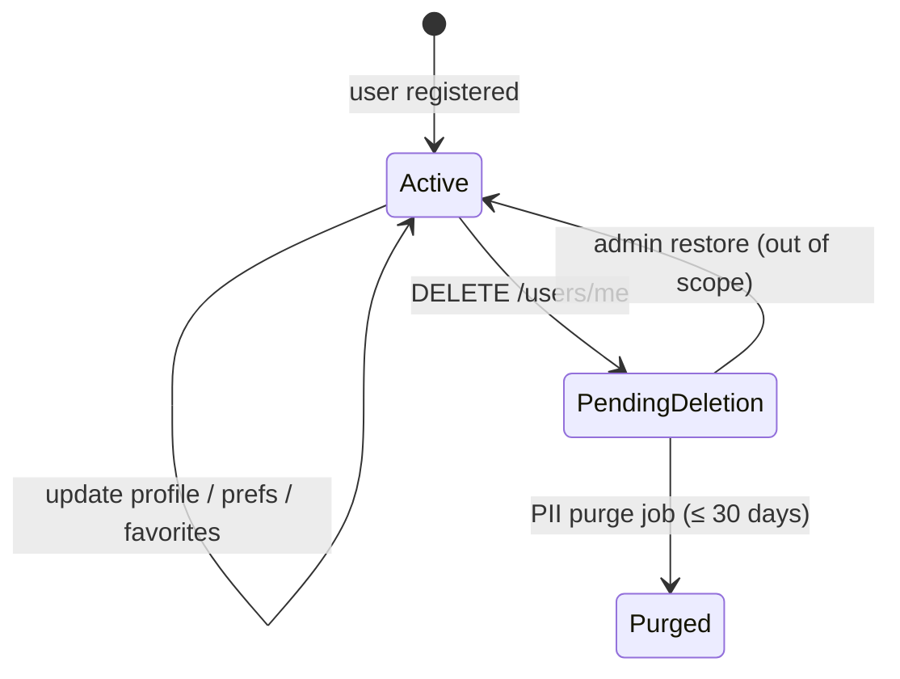

# Data Model — Profile & Preferences

## Document Status

| Field | Value |
|-------|-------|
| Version | 1.0.0 |
| Status | Draft |
| Last Updated | 2026-06-03 |
| Schema reference | [postgresql_schema.md](../../architecture/postgresql_schema.md) |

---

## 1. Domain entities

### UserProfile (aggregate root)

Extends auth `User` with profile-owned fields. Single row in `users` table.

| Field | Type | Rules |
|-------|------|-------|
| id | UUID | Immutable |
| name | string? | Max 120 chars |
| phone | Phone VO? | Egyptian mobile format |
| locale | Locale VO | `ar-EG` \| `en` |
| avatarUrl | string? | HTTPS URL after upload |
| preferredAgentId | string? | Must exist in `ai_agents` catalog |
| searchPreferences | SearchPreferences? | JSON object |
| agentProfile | AgentProfile? | Required when `role = agent` for public card |
| deletedAt | DateTime? | Soft delete marker |

### Favorite (entity)

| Field | Type | Rules |
|-------|------|-------|
| id | UUID | Immutable |
| userId | UUID | FK → users |
| propertyId | UUID | FK → properties |
| createdAt | DateTime | Set on insert |

Unique constraint: `(user_id, property_id)` — idempotent add.

### Value objects

| VO | Validation |
|----|------------|
| `Phone` | Egyptian mobile: `^(\+20\|0)1[0-9]{9}$` |
| `Locale` | Enum `ar-EG`, `en` |
| `SearchPreferences` | See §2.1 |
| `AgentProfile` | See §2.2 |

---

## 2. JSON preference schemas

Aligned with [postgresql_schema.md §4.1](../../architecture/postgresql_schema.md).

### 2.1 `search_preferences` (users column)

```json
{
  "listingType": "rent",
  "minPriceEgp": 8000,
  "maxPriceEgp": 15000,
  "propertyTypes": ["apartment"],
  "cities": ["Cairo", "New Cairo"]
}
```

| Field | Type | Rules |
|-------|------|-------|
| listingType | string? | `sale` \| `rent` |
| minPriceEgp | number? | ≥ 0, ≤ maxPriceEgp |
| maxPriceEgp | number? | ≥ minPriceEgp |
| propertyTypes | string[]? | Subset of `property_type` enum |
| cities | string[]? | Governorate or city names |

### 2.2 `agent_profile` (users column, agents only)

```json
{
  "bio": { "en": "Licensed agent in Cairo.", "ar": "..." },
  "serviceAreas": ["Cairo", "New Cairo", "Giza"],
  "photoUrl": "https://cdn.example.com/agents/photo.jpg",
  "licenseNumber": null
}
```

| Field | Type | Rules |
|-------|------|-------|
| bio | i18n object | Max 500 chars per locale |
| serviceAreas | string[] | 1–10 governorates |
| photoUrl | string? | HTTPS; falls back to `avatar_url` |
| licenseNumber | string? | Post-MVP validation |

### 2.3 `notification_preferences` (separate table)

Owned by Notifications bounded context; referenced here for profile UI.

```json
{
  "push": {
    "bookingUpdates": true,
    "recommendations": false
  },
  "email": {
    "bookingUpdates": true,
    "marketing": false
  }
}
```

Security emails (password reset) are not opt-outable per AC-PROF-005.

---

## 3. State transitions



Deleted users: login returns 401; favorites and conversations retained anonymized until purge.

---

## 4. PostgreSQL mapping

### 4.1 `users` (profile columns)

See [postgresql_schema.md §4.1](../../architecture/postgresql_schema.md).

Profile-owned columns: `name`, `phone`, `locale`, `avatar_url`, `preferred_agent_id`, `agent_profile`, `search_preferences`, `deleted_at`.

Auth-owned columns (read-only in profile module): `email`, `role`, `email_verified`, `consent_at`.

### 4.2 `favorites` (supporting)

Per [postgresql_schema.md §10](../../architecture/postgresql_schema.md) — required for MVP; DDL below is the profile feature canonical definition.

| Column | Type | Notes |
|--------|------|-------|
| id | UUID PK | default `gen_random_uuid()` |
| user_id | UUID FK | REFERENCES users(id) ON DELETE CASCADE |
| property_id | UUID FK | REFERENCES properties(id) ON DELETE CASCADE |
| created_at | TIMESTAMPTZ | NOT NULL default `now()` |

**Constraints:**

- `UNIQUE (user_id, property_id)`
- Index `favorites_user_id_created_at_idx` on `(user_id, created_at DESC)` for paginated list

```sql
CREATE TABLE favorites (
  id          UUID PRIMARY KEY DEFAULT gen_random_uuid(),
  user_id     UUID NOT NULL REFERENCES users(id) ON DELETE CASCADE,
  property_id UUID NOT NULL REFERENCES properties(id) ON DELETE CASCADE,
  created_at  TIMESTAMPTZ NOT NULL DEFAULT now(),
  UNIQUE (user_id, property_id)
);

CREATE INDEX favorites_user_id_created_at_idx
  ON favorites (user_id, created_at DESC);
```

### 4.3 `notification_preferences` (supporting)

| Column | Type | Notes |
|--------|------|-------|
| id | UUID PK | |
| user_id | UUID FK | UNIQUE, ON DELETE CASCADE |
| preferences | JSONB | Event-type opt-in map |
| updated_at | TIMESTAMPTZ | |

---

## 5. Indexes

| Index | Purpose |
|-------|---------|
| `users_email_idx` UNIQUE WHERE `deleted_at IS NULL` | Auth + profile |
| `favorites_user_id_created_at_idx` | Paginated favorites |
| `favorites_user_id_property_id_key` UNIQUE | Idempotent add |

---

## 6. Prisma mapping (reference)

| SQL Table | Prisma Model | Notes |
|-----------|--------------|-------|
| `users` | `User` | Profile fields on same model |
| `favorites` | `Favorite` | `@@unique([userId, propertyId])` |
| `notification_preferences` | `NotificationPreference` | Notifications module |

---

## Related documents

- [api_design.md](./api_design.md)
- [architecture.md](./architecture.md)
