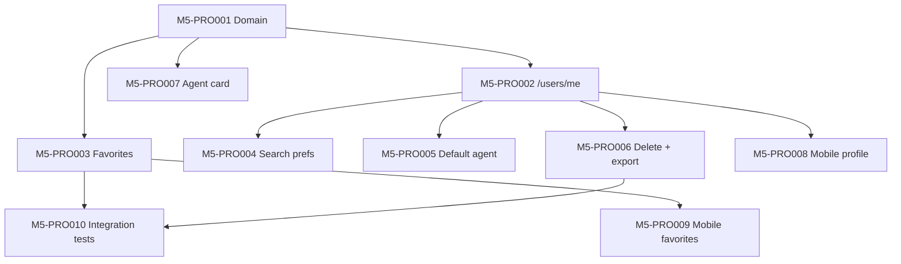

# Implementation Tasks — Profile & Preferences

## Document Status

| Field | Value |
|-------|-------|
| Version | 1.0.0 |
| Status | Draft |
| Approval | Pending PO / Tech Lead / QA |

Implementation is **blocked** until this feature SDD is approved.

---

## Task list

| Order | Task ID | Title | Est. |
|-------|---------|-------|------|
| 1 | [M5-PRO001](../../tasks/m05-profile/m5-pro001.md) | Profile domain layer + repository port | 3h |
| 2 | [M5-PRO002](../../tasks/m05-profile/m5-pro002.md) | GET/PATCH /api/v1/users/me | 3h |
| 3 | [M5-PRO003](../../tasks/m05-profile/m5-pro003.md) | Favorites CRUD API | 3h |
| 4 | [M5-PRO004](../../tasks/m05-profile/m5-pro004.md) | Search preferences API | 2h |
| 5 | [M5-PRO005](../../tasks/m05-profile/m5-pro005.md) | Default AI agent preference | 2h |
| 6 | [M5-PRO006](../../tasks/m05-profile/m5-pro006.md) | Account deletion + data export stub | 3h |
| 7 | [M5-PRO007](../../tasks/m05-profile/m5-pro007.md) | Agent public profile GET /agents/:id | 2h |
| 8 | [M5-PRO008](../../tasks/m05-profile/m5-pro008.md) | Mobile profile tab + edit profile | 4h |
| 9 | [M5-PRO009](../../tasks/m05-profile/m5-pro009.md) | Mobile favorites screen | 3h |
| 10 | [M5-PRO010](../../tasks/m05-profile/m5-pro010.md) | Profile P0 integration tests | 3h |

**Prerequisites:** M3-AUTH001–008 (auth domain + JWT + RBAC), M4-SEA003 (property detail for favorites).

---

## Execution order

---

## FR traceability

| Task | FR coverage |
|------|-------------|
| M5-PRO001 | FR-PROF-* (domain) |
| M5-PRO002 | FR-PROF-001, FR-PROF-002 |
| M5-PRO003 | FR-PROF-003, FR-PROF-004 |
| M5-PRO004 | FR-PROF-005 |
| M5-PRO005 | FR-PROF-007 |
| M5-PRO006 | FR-PROF-009, FR-PROF-010 |
| M5-PRO007 | FR-PROF-008 |
| M5-PRO008 | AC-PROF-001, AC-PROF-002 |
| M5-PRO009 | FR-PROF-003 |
| M5-PRO010 | All P0 AC per [tests.md](./tests.md) |

---

## Related documents

- [tests.md](./tests.md)
- [api_design.md](./api_design.md)
- [architecture.md](./architecture.md)
