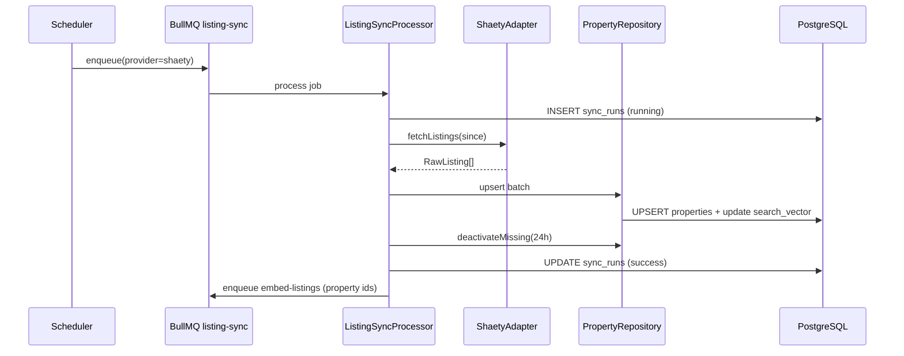

# Architecture — Property Search & Listing Sync

## Document Status

| Field | Value |
|-------|-------|
| Version | 1.0.0 |
| Status | Draft |
| Last Updated | 2026-06-03 |

---

## 1. Bounded context

**Property Catalog** — ingest external listings, normalize, persist, search, and expose detail. No booking or chat logic in this module.

References: [system_design.md](../../architecture/system_design.md), [backend_architecture.md](../../architecture/backend_architecture.md), [listing_providers.md](../../architecture/listing_providers.md).

**Storage decision:** PostgreSQL only for MVP search — **tsvector** (keyword) + **pgvector** via `embeddings` table. **No Elasticsearch.**

---

## 2. Backend (NestJS)

### 2.1 Module structure

```
backend/src/
├── domain/property/              # Listing entity, ports (no Nest imports)
├── application/property/         # SearchProperties, GetPropertyDetail, RunListingSync
├── infrastructure/
│   ├── listing/shaety/          # ShaetyAdapter (+ mock)
│   ├── persistence/property/     # Prisma PropertyRepository
│   ├── search/                   # tsvector query builder
│   └── queue/                    # listing-sync.processor.ts
├── modules/properties/           # PropertiesModule wiring
└── presentation/
    ├── properties/properties.controller.ts
    └── admin/sync.controller.ts  # sync status (AdminModule or nested)
```

### 2.2 PropertiesModule

| Export | Responsibility |
|--------|----------------|
| `PropertiesController` | `GET /properties`, `GET /properties/:id` |
| `SearchPropertiesUseCase` | Filters + pagination + sort |
| `GetPropertyDetailUseCase` | Active listing by id |
| `ListingProviderPort` | Provider fetch contract |
| `ShaetyAdapter` | First concrete adapter; mock when no credentials |
| `ListingSyncProcessor` | BullMQ worker for `listing-sync` queue |
| `PropertyRepository` | Upsert, deactivate stale, search queries |

`PropertiesModule` is imported by `BookingsModule` and `AiModule` for listing references only.

### 2.3 Use cases

| Use case | Trigger |
|----------|---------|
| `SearchProperties` | GET /api/v1/properties |
| `GetPropertyDetail` | GET /api/v1/properties/:id |
| `RunListingSync` | BullMQ scheduled job / manual enqueue (P1) |
| `GetSyncStatus` | GET /api/v1/admin/sync/status |

### 2.4 Shaety adapter

| Concern | Implementation |
|---------|----------------|
| Port | `ListingProviderPort` in domain |
| HTTP client | Axios/fetch with timeout; mock JSON fixture when `SHAETY_API_KEY` absent |
| Mapping | `mapToCanonical(RawListing)` → domain `Property` |
| Resilience | Retry 429/5xx with backoff at HTTP layer; job-level backoff per FR-SYNC-003 |
| Rollout | Only Shaety enabled in Phase 1; Aqarmap/PF adapters stubbed behind feature flags |

### 2.5 Listing sync (BullMQ)

| Component | Technology |
|-----------|------------|
| Queue | BullMQ `listing-sync` on Redis |
| Schedule | Cron every 15–60 min per provider (configurable) |
| Worker | `ListingSyncProcessor` — fetch → normalize → upsert → deactivate stale |
| Audit | `sync_runs` row per execution |
| Embeddings | Enqueue `embed-listings` after upsert (async; shares `embeddings` table) |
| Alerts | Metric/log when `consecutive_failures >= 3` per provider |



### 2.6 Search stack (PostgreSQL)

| Mode | Mechanism |
|------|-----------|
| Filters | B-tree / JSONB on `location`, `price_egp`, enums |
| Keyword | `search_vector` GIN + `plainto_tsquery` / `ts_rank` |
| Relevance sort | `ORDER BY ts_rank(search_vector, query) DESC` |
| Semantic (optional) | Join `embeddings` where `entity_type = property`; cosine distance |
| Geo (P1) | `location->>'latitude'` / PostGIS deferred; MVP uses haversine in SQL or bounding box |

---

## 3. Mobile (Flutter)

```
mobile/lib/features/property_search/
├── data/
│   ├── datasources/property_remote_datasource.dart
│   └── repositories/property_repository_impl.dart
├── domain/
│   ├── entities/property_listing.dart
│   └── repositories/property_repository.dart
└── presentation/
    ├── pages/ search, detail
    └── widgets/ filters_bottom_sheet, result_card
```

| Concern | Implementation |
|---------|----------------|
| API | Dio via `ApiConstants.properties` |
| State | `ChangeNotifier` or feature notifier for search + filters |
| i18n | `flutter gen-l10n` ar-EG + en |
| Guest | Page 1 without token; page 2+ triggers auth prompt |
| Navigation | `go_router` — `/search`, `/properties/:id` |

---

## 4. Provider rollout

| Phase | Provider | Module state |
|-------|----------|--------------|
| 1 | Shaety | Adapter + sync cron active |
| 2 | Aqarmap | Adapter registered; cron enabled |
| 3 | Property Finder Egypt | Full multi-provider catalog |

---

## 5. Security & compliance

- Public read on search and detail for active listings; inactive → 404.
- `GET /admin/sync/status` → `@Roles('admin', 'agent')`.
- Manual sync POST → `@Roles('admin')` only (P1).
- Rate limit search endpoints per [api_conventions.md](../../architecture/api_conventions.md).
- Store `source_url`; display attribution per NFR-COMP-006.

---

## Related documents

- [data_model.md](./data_model.md)
- [api_design.md](./api_design.md)
- [clean_architecture.md](../../architecture/clean_architecture.md)
