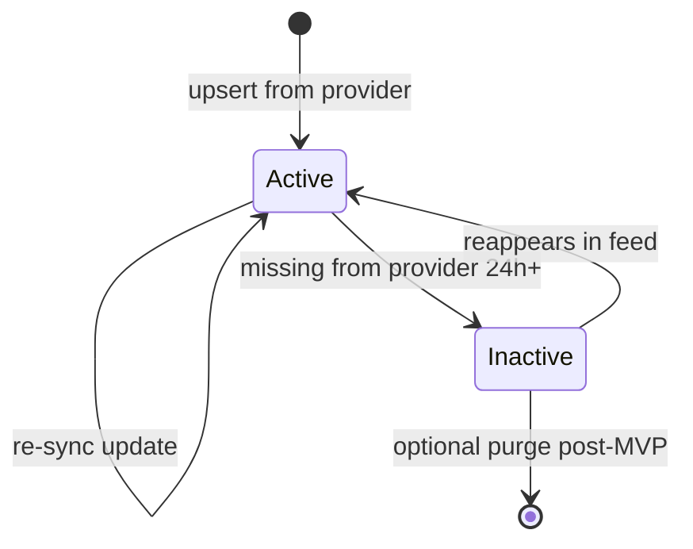

# Data Model — Property Search & Listing Sync

## Document Status

| Field | Value |
|-------|-------|
| Version | 1.0.0 |
| Status | Draft |
| Last Updated | 2026-06-03 |
| Schema reference | [postgresql_schema.md](../../architecture/postgresql_schema.md) |

---

## 1. Domain entities

### Property (aggregate root)

| Field | Type | Rules |
|-------|------|-------|
| id | UUID | Immutable platform ID |
| externalId | string | Provider listing ID |
| provider | ListingProvider | `shaety` \| `aqarmap` \| `property_finder` |
| title | string | Required |
| description | string? | |
| priceEgp | decimal | > 0 |
| propertyType | PropertyType | apartment, villa, duplex, commercial, … |
| listingType | ListingType | sale \| rent |
| bedrooms | int? | |
| bathrooms | int? | |
| areaSqm | decimal? | |
| location | LocationVO | governorate, city, district, lat/lng optional |
| amenities | string[] | Normalized vocabulary |
| images | string[] | Provider URLs |
| sourceUrl | string? | Original listing link |
| isActive | boolean | Default true |
| syncedAt | DateTime | Last successful provider sync |
| projectId | UUID? | Optional compound link |
| agentId | UUID? | Optional platform agent |

### Value objects

| VO | Validation |
|----|------------|
| `Location` | governorate, city, district required for search filters; coordinates optional |
| `ListingProvider` | Enum aligned with DB `listing_provider` |
| `PropertyType` | Enum aligned with DB `property_type` |
| `ListingType` | `sale` \| `rent` |

### SyncRun (entity)

Audit record for each provider sync execution (feature-owned supporting table).

| Field | Rules |
|-------|-------|
| id | UUID |
| provider | ListingProvider |
| status | `running` \| `success` \| `failed` |
| startedAt | Job start |
| finishedAt | Nullable until complete |
| listingsFetched | int ≥ 0 |
| listingsUpserted | int ≥ 0 |
| listingsDeactivated | int ≥ 0 |
| errorMessage | string? | Truncated stack/message on failure |
| attemptNumber | int | BullMQ attempt (for backoff visibility) |

---

## 2. State transitions — Property



Search and detail queries MUST filter `is_active = true`.

---

## 3. PostgreSQL mapping — `properties`

See [postgresql_schema.md §4.3](../../architecture/postgresql_schema.md).

| Column | Type | Notes |
|--------|------|-------|
| `id` | UUID PK | |
| `project_id` | UUID FK | Optional |
| `agent_id` | UUID FK | Optional |
| `external_id` | VARCHAR(100) | Provider ID |
| `provider` | `listing_provider` | |
| `listing_type` | `listing_type` | |
| `property_type` | `property_type` | |
| `title` | VARCHAR(500) | |
| `description` | TEXT | |
| `price_egp` | DECIMAL(14,2) | |
| `bedrooms` | INT | |
| `bathrooms` | INT | |
| `area_sqm` | DECIMAL(10,2) | |
| `location` | JSONB | governorate, city, district, latitude, longitude |
| `amenities` | JSONB | `[]` default |
| `images` | JSONB | URL array |
| `source_url` | TEXT | |
| `is_active` | BOOLEAN | default `true` |
| `search_vector` | TSVECTOR | Maintained on insert/update |
| `synced_at` | TIMESTAMPTZ | |
| `created_at` | TIMESTAMPTZ | |
| `updated_at` | TIMESTAMPTZ | |

**Unique:** `(provider, external_id)`

**`search_vector` trigger (conceptual):**

```sql
to_tsvector('simple', coalesce(title,'') || ' ' || coalesce(description,''))
```

Bilingual queries use `simple` config for MVP; `arabic` config evaluated in M4-SEA005.

---

## 4. PostgreSQL mapping — `sync_runs`

Supporting table for FR-SYNC-006 and FR-ADMIN-002. Documented here; add to Prisma migration with M4-SEA004.

| Column | Type | Notes |
|--------|------|-------|
| `id` | UUID PK | |
| `provider` | `listing_provider` | NOT NULL |
| `status` | `sync_run_status` | `running`, `success`, `failed` |
| `started_at` | TIMESTAMPTZ | NOT NULL |
| `finished_at` | TIMESTAMPTZ | |
| `listings_fetched` | INT | default 0 |
| `listings_upserted` | INT | default 0 |
| `listings_deactivated` | INT | default 0 |
| `error_message` | TEXT | |
| `attempt_number` | INT | default 1 |
| `created_at` | TIMESTAMPTZ | |

**Indexes:**

- `sync_runs_provider_started_idx` on `(provider, started_at DESC)`
- Partial index on latest success per provider for status API

**Consecutive failure tracking:** Application derives count from last N `sync_runs` where `status = failed` per provider; triggers alert at 3 (FR-SYNC-004).

---

## 5. Related storage — `embeddings`

Semantic vectors for listings (FR-SYNC-002). See [postgresql_schema.md §4.7](../../architecture/postgresql_schema.md).

| Rule | Value |
|------|-------|
| entity_type | `property` |
| entity_id | `properties.id` |
| chunk_index | `0` (one row per listing) |
| embedding | `vector(768)` |

Populated by `embed-listings` BullMQ job after sync upsert — not inline in search read path for MVP list API.

---

## 6. Indexes (search-critical)

From [postgresql_schema.md §6](../../architecture/postgresql_schema.md):

- `properties_provider_external_idx` UNIQUE `(provider, external_id)`
- `properties_is_active_idx` WHERE `is_active = true`
- `properties_price_egp_idx`, `properties_listing_type_idx`
- `properties_location_city_idx` on `(location->>'city')`
- `properties_search_vector_idx` GIN on `search_vector`

---

## Related documents

- [api_design.md](./api_design.md)
- [architecture.md](./architecture.md)
