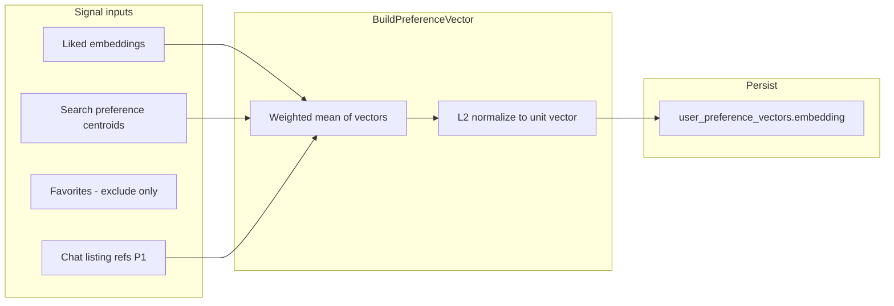
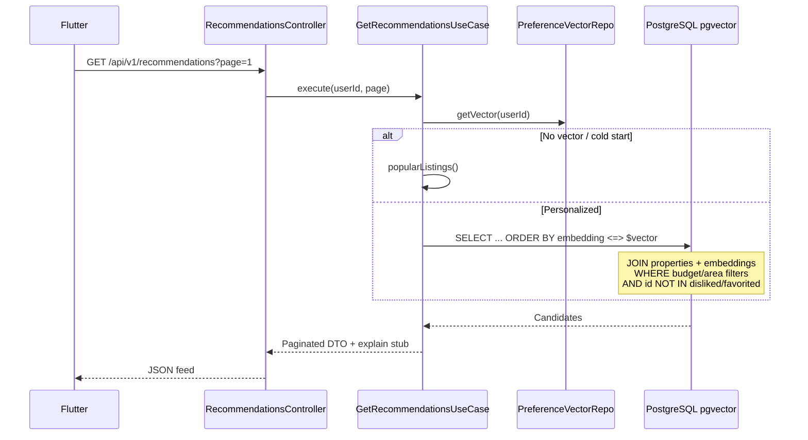

# Architecture — Recommendations

## Document Status

| Field | Value |
|-------|-------|
| Version | 1.0.0 |
| Status | Draft |
| Last Updated | 2026-06-03 |

---

## 1. Bounded context

**Personalization** — home feed recommendations, preference vector maintenance, and feedback persistence. No booking workflow, listing sync, or chat orchestration logic in this module.

References: [system_design.md](../../architecture/system_design.md), [ai_services_architecture.md](../../architecture/ai_services_architecture.md) §9, [clean_architecture.md](../../architecture/clean_architecture.md).

---

## 2. Design principles

| Principle | Detail |
|-----------|--------|
| Feed mode | Home screen uses **pgvector NN search** + SQL filters — no per-request Gemini call |
| Chat mode | Recommendation Agent calls the same use cases via tools |
| Single vector store | Reuse `embeddings` table and HNSW index ([postgresql_schema.md](../../architecture/postgresql_schema.md) §6.3) |
| Fair housing by construction | Scoring pipeline uses an allowlist of listing attributes; protected fields blocked at domain + SQL layers |
| Eventual consistency | Preference vector recomputed async on feedback; feed reads last committed vector |

---

## 3. Backend (NestJS)

### 3.1 Module structure

```
backend/src/
├── domain/recommendation/           # Entities, VOs, ports (no Nest imports)
│   ├── recommendation-candidate.ts
│   ├── feedback.vo.ts
│   ├── preference-vector.ts
│   └── ports/
│       ├── scoring.port.ts
│       ├── feedback.repository.port.ts
│       └── signals.port.ts
├── application/recommendation/
│   ├── get-recommendations.use-case.ts
│   ├── record-feedback.use-case.ts
│   ├── build-preference-vector.use-case.ts
│   └── popular-listings.use-case.ts   # cold start + guest
├── infrastructure/
│   ├── vector/pgvector-scoring.adapter.ts
│   └── persistence/recommendation/
│       ├── feedback.repository.ts
│       └── preference-vector.repository.ts
└── presentation/
    └── recommendations/
        ├── recommendations.module.ts    # RecommendationsModule
        └── recommendations.controller.ts
```

### 3.2 RecommendationsModule wiring

| Provider | Responsibility |
|----------|----------------|
| `GetRecommendationsUseCase` | Orchestrate signals → vector → pgvector query → DTO |
| `RecordFeedbackUseCase` | Upsert like/dislike; enqueue recompute |
| `BuildPreferenceVectorUseCase` | Mean embedding of liked listings + weighted chat/search signals |
| `PgvectorScoringAdapter` | Implements `ScoringPort` — cosine distance + hard filters |
| `PopularListingsUseCase` | Guest and cold-start path |

`RecommendationsModule` imports `PropertiesModule` (listing read), `UsersModule` (preferences, favorites), and registers under the **AI** presentation group per [backend_architecture.md](../../architecture/backend_architecture.md).

### 3.3 Preference vector algorithm (MVP)



| Signal | Weight (MVP) | Effect |
|--------|----------------|--------|
| Like | 1.0 | Included in mean embedding |
| Dislike | — | Exclusion list only; not in mean |
| Favorite | — | Excluded from feed; optional weak positive in P1 |
| Search preferences | 0.5 | Bias via SQL filters, not vector blend |
| Chat refs (P1) | 0.3 | Blend into mean when no likes yet |

Cold start: if `signal_count = 0`, skip vector search → `PopularListingsUseCase` (Greater Cairo, active listings).

### 3.4 pgvector retrieval



| Query guard | Rule |
|-------------|------|
| Distance | Cosine (`<=>`) on 768-dim Gemini embeddings |
| Filters | `price_egp`, `location`, `listing_type`, `property_type` from `search_preferences` |
| Exclusions | Disliked IDs, favorited IDs, inactive listings |
| Index | `embeddings_hnsw_idx` (see schema doc) |

### 3.5 Fair housing guard

`FairHousingFilter` (domain service) validates:

- No protected-attribute columns in SQL `WHERE`/`ORDER BY` builders
- No user-provided filter keys outside allowlist
- Audit log entry when a blocked feature is requested (aligns with Recommendation Agent rules)

Protected characteristics (MVP blocklist): nationality, religion, ethnicity, family status, gender, marital status, disability, source of income.

### 3.6 Async jobs

| Queue | Job | Trigger |
|-------|-----|---------|
| `recommendations` | `recompute-user` | Like/dislike upsert; favorite add (optional P1) |

Worker runs `BuildPreferenceVectorUseCase` idempotently per `userId`.

---

## 4. Mobile (Flutter)

```
mobile/lib/features/recommendation/
├── data/
│   ├── datasources/recommendation_remote_datasource.dart
│   └── repositories/recommendation_repository_impl.dart
├── domain/
│   ├── entities/recommended_listing.dart
│   └── repositories/recommendation_repository.dart
└── presentation/
    ├── widgets/recommendation_carousel.dart
    ├── widgets/feedback_buttons.dart
    └── providers/recommendation_feed_notifier.dart
```

| Concern | Implementation |
|---------|----------------|
| Home section | Horizontal `ListView` on home screen; title from l10n |
| Guest | Shows "Popular in Cairo" + register CTA (no Bearer token) |
| Feedback | Optimistic UI remove on dislike; POST feedback then invalidate feed |
| Pagination | Scroll listener loads `page + 1` |
| Navigation | Tap card → property detail (`go_router`) |

---

## 5. Integration with Recommendation Agent

| Tool | Backend delegate |
|------|------------------|
| `get_recommendations` | `GetRecommendationsUseCase` |
| `record_feedback` | `RecordFeedbackUseCase` |

Chat mode may include short natural-language explanations; feed mode returns `reasonStub` only (e.g. `"similar_to_liked"`).

---

## 6. Security and performance

- Personalized routes: `JwtAuthGuard` + `@Roles('buyer', 'agent')`
- Guest popular feed: public read, rate-limited per IP
- Cache: optional Redis 5 min per-user feed page 1 (invalidate on feedback)
- Target: p95 ≤ 2 s for first page (NFR-PERF-003)

---

## Related documents

- [data_model.md](./data_model.md)
- [api_design.md](./api_design.md)
- [requirements.md](./requirements.md)
- [rag_architecture.md](../../architecture/rag_architecture.md)
- [ai_agent_architecture.md](../../architecture/ai_agent_architecture.md) §5
