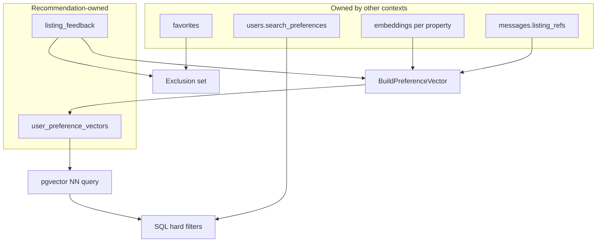
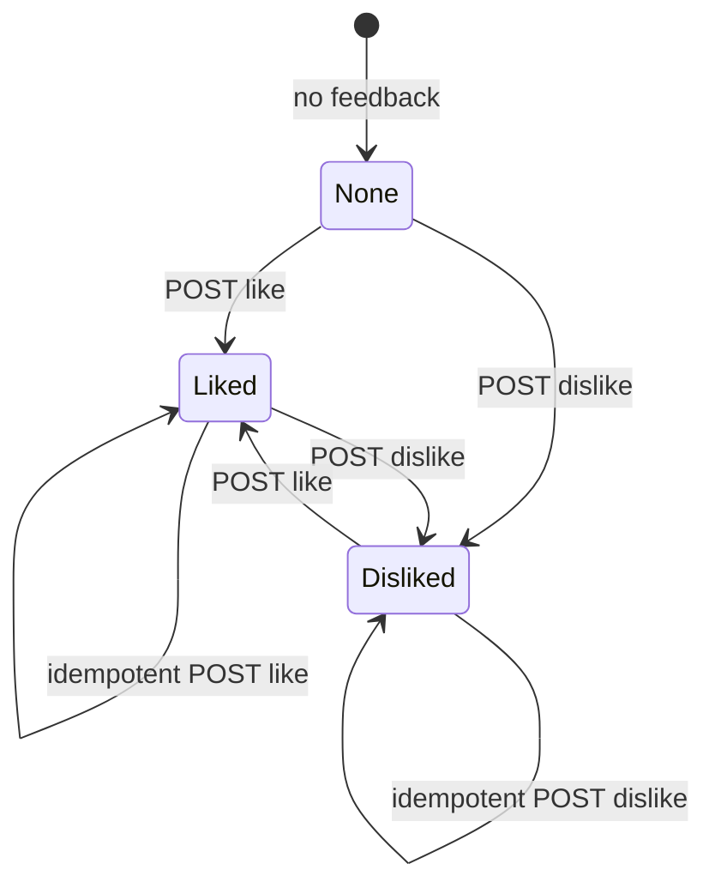

# Data Model — Recommendations

## Document Status

| Field | Value |
|-------|-------|
| Version | 1.0.0 |
| Status | Draft |
| Last Updated | 2026-06-03 |
| Schema reference | [postgresql_schema.md](../../architecture/postgresql_schema.md) |

---

## 1. Domain entities

### RecommendationCandidate (read model)

| Field | Type | Rules |
|-------|------|-------|
| propertyId | UUID | Active listing |
| score | number | Lower distance = higher rank; normalized 0–1 for UI |
| distance | number | Cosine distance from pgvector |
| reasonStub | string? | `similar_to_liked` \| `matches_preferences` \| `popular` \| `chat_interest` |

Not persisted — assembled per request from query results.

### ListingFeedback (entity)

| Field | Type | Rules |
|-------|------|-------|
| id | UUID | Immutable |
| userId | UUID | FK → users |
| propertyId | UUID | FK → properties |
| sentiment | FeedbackSentiment | `like` \| `dislike` |
| createdAt | DateTime | |
| updatedAt | DateTime | Upsert updates `updatedAt` |

**Invariant:** At most one feedback row per `(userId, propertyId)`.

### UserPreferenceVector (entity)

| Field | Type | Rules |
|-------|------|-------|
| userId | UUID | PK / FK → users |
| embedding | float[768] | Unit-normalized preference vector |
| signalCount | int | Number of signals used in last build |
| modelVersion | string | e.g. `text-embedding-004` |
| computedAt | DateTime | Last successful recompute |

### Value objects

| VO | Validation |
|----|------------|
| `FeedbackSentiment` | Enum `like` \| `dislike` |
| `PreferenceVector` | Length 768; no NaN; L2 norm ≈ 1 |

---

## 2. User signals (inputs to scoring)

Signals are aggregated by `SignalsPort` — not all stored in the recommendation schema.

| Signal | Source | Storage | Used for |
|--------|--------|---------|----------|
| **Explicit feedback** | Recommendation module | `listing_feedback` | Vector blend (like), hard exclude (dislike) |
| **Favorites** | Profile module | `favorites` | Exclude from feed; weak positive P1 |
| **Search preferences** | Profile module | `users.search_preferences` | SQL filters (budget, city, type) |
| **Search history** | Property search port | TBD (port contract) | Boost areas/types from recent searches |
| **Chat interest** | AI chat (P1) | `messages.listing_refs` | Vector blend when user discussed listings |



---

## 3. State transitions — feedback



On transition to `Disliked`, property removed from in-memory feed immediately (mobile optimistic UI).

---

## 4. PostgreSQL mapping

### `listing_feedback` (new — recommendation-owned)

| Column | Type | Notes |
|--------|------|-------|
| `id` | UUID PK | `gen_random_uuid()` |
| `user_id` | UUID FK | → `users.id` ON DELETE CASCADE |
| `property_id` | UUID FK | → `properties.id` ON DELETE CASCADE |
| `sentiment` | ENUM | `like`, `dislike` |
| `created_at` | TIMESTAMPTZ | NOT NULL |
| `updated_at` | TIMESTAMPTZ | NOT NULL |

**Constraints:**

```sql
CREATE UNIQUE INDEX listing_feedback_user_property_uidx
  ON listing_feedback (user_id, property_id);
```

### `user_preference_vectors` (new — recommendation-owned)

| Column | Type | Notes |
|--------|------|-------|
| `user_id` | UUID PK | FK → `users.id` ON DELETE CASCADE |
| `embedding` | `vector(768)` | pgvector |
| `signal_count` | INT | NOT NULL DEFAULT 0 |
| `model_version` | VARCHAR(40) | NOT NULL |
| `computed_at` | TIMESTAMPTZ | NOT NULL |

**Index (optional):** none required for MVP (lookup by PK only).

### Related existing tables

| Table | Relationship |
|-------|--------------|
| `embeddings` | `entity_type = 'property'`, `entity_id = properties.id`, `chunk_index = 0` |
| `favorites` | Exclusion + profile feature |
| `users.search_preferences` | JSONB filters — see [postgresql_schema.md §4.1](../../architecture/postgresql_schema.md) |
| `properties` | Candidate listings; fair-housing allowlist columns only |

### Enum

```sql
CREATE TYPE feedback_sentiment AS ENUM ('like', 'dislike');
```

---

## 5. Fair housing — data constraints

| Rule | Enforcement |
|------|-------------|
| No protected columns in `properties` used for scoring | Domain allowlist: price, location JSON, bedrooms, bathrooms, area, amenities, listing_type, property_type |
| User cannot submit protected filter keys | DTO validation on any future filter extension |
| Dislike never encodes protected reason | `sentiment` only; no free-text on feedback row |

---

## 6. Prisma model mapping (reference)

| SQL Table | Prisma Model | Notes |
|-----------|--------------|-------|
| `listing_feedback` | `ListingFeedback` | `@@unique([userId, propertyId])` |
| `user_preference_vectors` | `UserPreferenceVector` | `embedding Unsupported("vector")` |
| `embeddings` | `Embedding` | Read-only from recommendation repos |

---

## Related documents

- [architecture.md](./architecture.md)
- [api_design.md](./api_design.md)
- [profile/data model](../profile/) (favorites, preferences — when published)
- [postgresql_schema.md](../../architecture/postgresql_schema.md)
