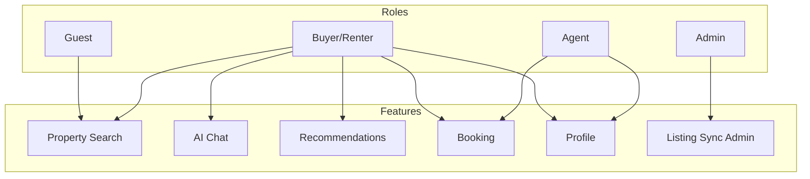
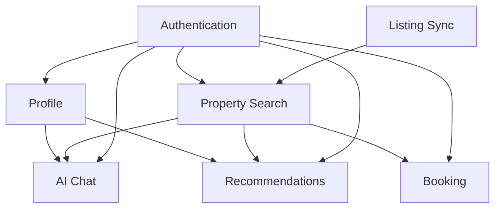

# Software Requirements Specification (SRS)

## AI Property Assistant — Mobile Application

> Complete software requirements derived from [vision.md](./vision.md). Feature-level detail lives under `features/<feature>/`.

---

## Document Control

| Field | Value |
|-------|-------|
| Document ID | SRS-001 |
| Version | 1.0.0 |
| Status | Draft |
| Last Updated | 2026-06-03 |
| Product | AI Property Assistant |
| Launch Market | Egypt (EGP) |
| Source Document | [vision.md](./vision.md) |

### Revision History

| Version | Date | Author | Changes |
|---------|------|--------|---------|
| 0.1.0 | 2026-06-03 | — | Initial draft |
| 0.4.0 | 2026-06-03 | — | Stack decisions recorded |
| 1.0.0 | 2026-06-03 | — | Complete SRS from vision.md |

### Approval

| Role | Name | Date | Status |
|------|------|------|--------|
| Product Owner | — | — | Pending |
| Tech Lead | — | — | Pending |
| QA Lead | — | — | Pending |

---

## 1. Introduction

### 1.1 Purpose

This document specifies the functional and non-functional requirements for **AI Property Assistant**, a mobile application that helps users in Egypt discover, evaluate, and book property viewings through AI-powered chat, unified search, and personalized recommendations.

It serves as the authoritative requirements baseline for design, development, and testing under Specification Driven Development (SDD).

### 1.2 Scope

**In scope (MVP):**

- Flutter mobile app (iOS + Android)
- NestJS REST backend
- Listing aggregation from Shaety (شقتي), Aqarmap, and Property Finder Egypt
- AI chat with user-selectable agents
- Property search, recommendations, booking, and user profile
- Roles: Buyer/Renter, Real Estate Agent, Platform Admin

**Out of scope (MVP):**

- Payment processing and escrow
- Mortgage calculators and financing
- Full agent CRM
- Promoted listings and paid subscriptions (post-MVP monetization)
- Offline-first sync
- Multi-country support beyond Egypt
- GraphQL API
- WhatsApp integration

### 1.3 Definitions

| Term | Definition |
|------|------------|
| **Listing** | A property record synced from an external provider |
| **AI Agent** | A platform-defined assistant persona with its own prompt, tools, and model config |
| **Grounding (RAG)** | Enriching AI responses with real listing data via **pgvector** semantic search |
| **Canonical listing** | Unified internal property model normalized from provider-specific formats |
| **Booking** | A viewing appointment request between a buyer/renter and an agent |
| **Provider** | External listing source (Shaety, Aqarmap, Property Finder Egypt) |

### 1.4 References

| Document | Path |
|----------|------|
| Product Vision | [vision.md](./vision.md) |
| System Design | [architecture/system_design.md](../architecture/system_design.md) |
| Listing Providers | [architecture/listing_providers.md](../architecture/listing_providers.md) |
| AI Provider Strategy | [architecture/ai_provider_strategy.md](../architecture/ai_provider_strategy.md) |
| Delivery Roadmap | [tasks/roadmap.md](../tasks/roadmap.md) |

---

## 2. User Roles

### 2.1 Role Summary

| Role | ID | Description | Primary Platform |
|------|----|-------------|------------------|
| **Guest** | `guest` | Unauthenticated user; limited browse | Mobile |
| **Buyer / Renter** | `buyer` | Property seeker — search, chat, book, save favorites | Mobile |
| **Real Estate Agent** | `agent` | Manages bookings, receives leads, maintains agent profile | Mobile |
| **Platform Admin** | `admin` | Internal operator — sync health, AI config, user moderation | Admin tools (API) |

### 2.2 Guest (Unauthenticated)

| Capability | Allowed |
|------------|---------|
| Browse property search results | ✅ Limited (first page, no personalization) |
| View listing detail | ✅ |
| Use AI chat | ❌ |
| Save favorites | ❌ |
| Request booking | ❌ |
| Access profile | ❌ |

### 2.3 Buyer / Renter

| Capability | Allowed |
|------------|---------|
| Register / log in (email, Google, Apple) | ✅ |
| Full property search and filters | ✅ |
| AI chat with agent selection and mid-session switch | ✅ |
| Personalized recommendations | ✅ |
| Save favorites | ✅ |
| Request viewing appointments | ✅ |
| Manage profile and preferences | ✅ |
| Set default AI agent | ✅ |
| Receive booking and notification updates | ✅ |

### 2.4 Real Estate Agent

| Capability | Allowed |
|------------|---------|
| All Buyer capabilities | ✅ (personal use) |
| Automated self-service registration as agent | ✅ |
| Agent profile (bio, contact, service areas) | ✅ |
| Receive booking request notifications | ✅ |
| Confirm, reschedule, or decline bookings | ✅ |
| View assigned booking list | ✅ |
| Manage availability (basic schedule) | ✅ MVP — basic |

**MVP agent tier:** Free tier — receive up to **5 booking requests per calendar month**.

### 2.5 Platform Admin

| Capability | Allowed |
|------------|---------|
| View listing sync status per provider | ✅ |
| Enable / disable AI agents | ✅ |
| View user accounts (read-only audit) | ✅ |
| Trigger manual listing sync | ✅ |
| Access system health metrics | ✅ |

Admin UI is **API-only for MVP**; dedicated admin dashboard deferred.

### 2.6 Role Permission Matrix

| Feature | Guest | Buyer | Agent | Admin |
|---------|-------|-------|-------|-------|
| Search (browse) | Limited | Full | Full | Full |
| Listing detail | ✅ | ✅ | ✅ | ✅ |
| AI chat | ❌ | ✅ | ✅ | ❌ |
| Recommendations | ❌ | ✅ | ✅ | ❌ |
| Favorites | ❌ | ✅ | ✅ | ❌ |
| Request booking | ❌ | ✅ | ✅ | ❌ |
| Manage bookings (agent side) | ❌ | ❌ | ✅ | ❌ |
| Profile & preferences | ❌ | ✅ | ✅ | ❌ |
| Listing sync admin | ❌ | ❌ | ❌ | ✅ |
| AI agent config admin | ❌ | ❌ | ❌ | ✅ |

---

## 3. Functional Requirements

Requirements use the format **FR-`<module>`-`<number>`**. Priority: **P0** = MVP must-have, **P1** = MVP should-have, **P2** = post-MVP.

---

### 3.1 Authentication & Onboarding

| ID | Requirement | Priority | Role |
|----|-------------|----------|------|
| FR-AUTH-001 | The system shall allow users to register with **email and password**. | P0 | All |
| FR-AUTH-002 | The system shall allow users to log in with **Google OAuth**. | P0 | All |
| FR-AUTH-003 | The system shall allow users to log in with **Sign in with Apple**. | P0 | All |
| FR-AUTH-004 | The system shall allow users to log out and invalidate the current session. | P0 | All |
| FR-AUTH-005 | The system shall support **password reset** via email verification link. | P0 | All |
| FR-AUTH-006 | The system shall issue **JWT access tokens** with short expiry and **refresh tokens** with rotation on use. | P0 | All |
| FR-AUTH-007 | During onboarding, the user shall select a role: **Buyer/Renter** or **Real Estate Agent**. | P0 | All |
| FR-AUTH-008 | Real estate agent registration shall be **automated** — no manual admin approval required for MVP. | P0 | Agent |
| FR-AUTH-009 | The system shall verify email addresses before granting full account access. | P0 | All |
| FR-AUTH-010 | The onboarding flow shall be available in **Arabic (ar-EG)** and **English**. | P0 | All |
| FR-AUTH-011 | The system shall prevent duplicate accounts for the same email across auth providers. | P0 | All |
| FR-AUTH-012 | OAuth accounts shall be linkable to an existing email/password account when emails match. | P1 | All |
| FR-AUTH-013 | The system shall enforce **RBAC** — API endpoints reject requests lacking required role. | P0 | All |

---

### 3.2 Property Search

| ID | Requirement | Priority | Role |
|----|-------------|----------|------|
| FR-SEARCH-001 | The system shall aggregate listings from **Shaety (شقتي)**, **Aqarmap**, and **Property Finder Egypt** into a unified catalog. | P0 | All |
| FR-SEARCH-002 | The system shall sync listings on a scheduled interval (target: every 15–60 minutes per provider). | P0 | System |
| FR-SEARCH-003 | Shaety shall be the **first provider integrated**; Aqarmap and Property Finder follow in rollout order. | P0 | System |
| FR-SEARCH-004 | Users shall search properties by **governorate, city, and district**. | P0 | All |
| FR-SEARCH-005 | Users shall filter by **price range** displayed in **EGP**. | P0 | All |
| FR-SEARCH-006 | Users shall filter by **property type** (apartment, villa, duplex, commercial, etc.). | P0 | All |
| FR-SEARCH-007 | Users shall filter by **listing type** (sale or rent). | P0 | All |
| FR-SEARCH-008 | Users shall filter by **bedrooms**, **bathrooms**, and **area (sqm)**. | P0 | All |
| FR-SEARCH-009 | Users shall filter by **amenities** from a normalized vocabulary. | P1 | All |
| FR-SEARCH-010 | Users shall perform **keyword / full-text search** across title and description. | P0 | All |
| FR-SEARCH-011 | Search results shall be **paginated** with configurable page size (default: 20). | P0 | All |
| FR-SEARCH-012 | Users shall sort results by **price**, **date listed**, and **relevance**. | P0 | All |
| FR-SEARCH-013 | Listing detail shall display photos, price, area, bedrooms, location, description, and amenities. | P0 | All |
| FR-SEARCH-014 | Listing detail shall show **source provider attribution** and a link to the **original listing URL**. | P0 | All |
| FR-SEARCH-015 | Listings removed from a provider for 24+ hours shall be marked **inactive** and excluded from search. | P0 | System |
| FR-SEARCH-016 | Guest users shall access the first page of search results without authentication. | P1 | Guest |
| FR-SEARCH-017 | The system shall support **geo-proximity search** when coordinates are available. | P1 | All |
| FR-SEARCH-018 | Search UI and listing content shall support **Arabic and English** display where provider data allows. | P0 | All |

---

### 3.3 AI Chat

| ID | Requirement | Priority | Role |
|----|-------------|----------|------|
| FR-CHAT-001 | Authenticated users shall converse with AI agents via a **chat interface**. | P0 | Buyer, Agent |
| FR-CHAT-002 | The system shall expose a catalog of **platform-defined AI agents** fetchable via API. | P0 | Buyer, Agent |
| FR-CHAT-003 | MVP shall ship at least **three agents**: Property Assistant, Neighborhood Guide, Buying Advisor. | P0 | Buyer, Agent |
| FR-CHAT-004 | Users shall **select an AI agent** when starting or continuing a chat session. | P0 | Buyer, Agent |
| FR-CHAT-005 | Users shall **switch agents mid-session** without losing conversation history. | P0 | Buyer, Agent |
| FR-CHAT-006 | Each message shall record the **agentId** that generated the response. | P0 | System |
| FR-CHAT-007 | AI responses shall be **grounded in real listing data** (RAG) when answering property questions. | P0 | Buyer, Agent |
| FR-CHAT-008 | Users shall set a **default AI agent** stored in their profile. | P0 | Buyer, Agent |
| FR-CHAT-009 | If the selected agent is disabled, the system shall fall back to the **platform default** and notify the user. | P0 | System |
| FR-CHAT-010 | Chat shall support **Arabic and English** user input and responses. | P0 | Buyer, Agent |
| FR-CHAT-011 | The system shall persist **chat session history** per user. | P0 | Buyer, Agent |
| FR-CHAT-012 | Users shall create **new chat sessions** and view past sessions. | P0 | Buyer, Agent |
| FR-CHAT-013 | The AI system shall use a **pluggable provider architecture** with **Google Gemini** as the MVP adapter. | P0 | System |
| FR-CHAT-014 | AI responses shall enforce **fair housing guardrails** — no discriminatory advice or filtering. | P0 | System |
| FR-CHAT-015 | The system shall **redact PII** from prompts sent to external LLM providers where feasible. | P0 | System |
| FR-CHAT-016 | When AI is unavailable, the app shall display a clear error and remain usable for search and booking. | P0 | All |
| FR-CHAT-017 | Users shall initiate a **booking request** from within a chat conversation (deep link to listing). | P1 | Buyer, Agent |
| FR-CHAT-018 | MVP free tier shall limit users to **10 AI messages per day** (per vision monetization model). | P1 | Buyer, Agent |

---

### 3.4 Recommendations

| ID | Requirement | Priority | Role |
|----|-------------|----------|------|
| FR-REC-001 | Authenticated users shall receive a **"Properties you might like"** feed on the home screen. | P0 | Buyer, Agent |
| FR-REC-002 | Recommendations shall consider **search history**, **saved favorites**, and **explicit feedback** (like/dislike). | P0 | Buyer, Agent |
| FR-REC-003 | Users shall **like or dislike** properties to refine future recommendations. | P0 | Buyer, Agent |
| FR-REC-004 | Recommendations shall incorporate signals from **AI chat interactions** (viewed/discussed listings). | P1 | Buyer, Agent |
| FR-REC-005 | Recommendations shall respect user **search preferences** (budget, areas, property type). | P0 | Buyer, Agent |
| FR-REC-006 | Recommended listings shall exclude properties the user has already disliked. | P0 | Buyer, Agent |
| FR-REC-007 | The recommendation feed shall be **paginated**. | P0 | Buyer, Agent |
| FR-REC-008 | Recommendations shall not apply **discriminatory filtering** based on protected characteristics. | P0 | System |

---

### 3.5 Booking

| ID | Requirement | Priority | Role |
|----|-------------|----------|------|
| FR-BOOK-001 | Authenticated buyers shall **request a viewing** from listing detail or AI chat. | P0 | Buyer |
| FR-BOOK-002 | A booking request shall include property ID, preferred date/time, and optional message. | P0 | Buyer |
| FR-BOOK-003 | The assigned agent shall receive a **push and/or email notification** for new booking requests. | P0 | Agent |
| FR-BOOK-004 | Agents shall **confirm**, **propose alternative times**, or **decline** booking requests. | P0 | Agent |
| FR-BOOK-005 | Buyers shall track booking status: **Requested → Confirmed → Completed → Cancelled**. | P0 | Buyer |
| FR-BOOK-006 | Both parties shall receive notifications on booking status changes. | P0 | Buyer, Agent |
| FR-BOOK-007 | Agents shall view a **list of their bookings** filtered by status. | P0 | Agent |
| FR-BOOK-008 | Buyers shall view **their booking history**. | P0 | Buyer |
| FR-BOOK-009 | Agents on the **free tier** shall be limited to **5 booking requests per calendar month**. | P1 | Agent |
| FR-BOOK-010 | The system shall prevent double-booking of the same time slot for an agent. | P0 | System |
| FR-BOOK-011 | Users shall **cancel** a booking before the viewing time. | P0 | Buyer, Agent |
| FR-BOOK-012 | Agents shall set **basic availability windows** (days and hours). | P1 | Agent |

---

### 3.6 Profile & Preferences

| ID | Requirement | Priority | Role |
|----|-------------|----------|------|
| FR-PROF-001 | Users shall view and edit **personal information** (name, phone, avatar). | P0 | Buyer, Agent |
| FR-PROF-002 | Users shall set **language preference** (Arabic or English). | P0 | All |
| FR-PROF-003 | Users shall **save and unsave favorite properties**. | P0 | Buyer, Agent |
| FR-PROF-004 | Users shall view a **favorites list** with pagination. | P0 | Buyer, Agent |
| FR-PROF-005 | Users shall persist **search preferences**: budget range, preferred areas, property type, listing type. | P0 | Buyer, Agent |
| FR-PROF-006 | Users shall set **notification preferences** (push, email) per event type. | P0 | Buyer, Agent |
| FR-PROF-007 | Users shall set their **default AI agent**. | P0 | Buyer, Agent |
| FR-PROF-008 | Agents shall maintain an **agent profile**: bio, phone, service areas, photo. | P0 | Agent |
| FR-PROF-009 | Users shall **delete their account** and associated personal data (PDPL right to erasure). | P0 | All |
| FR-PROF-010 | Users shall **export their personal data** in a machine-readable format (PDPL). | P1 | All |
| FR-PROF-011 | Users shall grant or revoke **consent** for data processing during onboarding. | P0 | All |

---

### 3.7 Notifications

| ID | Requirement | Priority | Role |
|----|-------------|----------|------|
| FR-NOTIF-001 | The system shall send **push notifications** for booking status changes. | P0 | Buyer, Agent |
| FR-NOTIF-002 | The system shall send **email notifications** for booking confirmations and password reset. | P0 | All |
| FR-NOTIF-003 | Users shall opt out of non-essential notifications via profile settings. | P0 | All |
| FR-NOTIF-004 | The system shall support **bilingual notification content** (ar-EG, en). | P1 | All |

---

### 3.8 Listing Sync (System)

| ID | Requirement | Priority | Role |
|----|-------------|----------|------|
| FR-SYNC-001 | The system shall ingest listings via **provider-specific adapters** normalizing to a canonical model. | P0 | System |
| FR-SYNC-002 | Normalized listings shall be stored in **PostgreSQL** with **tsvector** full-text index and **pgvector** embeddings. | P0 | System |
| FR-SYNC-003 | Sync jobs shall **retry with exponential backoff** on provider failure. | P0 | System |
| FR-SYNC-004 | The system shall alert admins after **3 consecutive sync failures** per provider. | P0 | Admin |
| FR-SYNC-005 | Admins shall **trigger a manual sync** for a specific provider. | P1 | Admin |
| FR-SYNC-006 | Sync status (last run, count, errors) shall be visible to admins via API. | P0 | Admin |

---

### 3.9 Admin & Platform Management

| ID | Requirement | Priority | Role |
|----|-------------|----------|------|
| FR-ADMIN-001 | Admins shall **enable or disable AI agents** without deleting configuration. | P0 | Admin |
| FR-ADMIN-002 | Admins shall view **listing sync health** per provider. | P0 | Admin |
| FR-ADMIN-003 | Admins shall view **audit logs** for booking and profile changes by agents. | P0 | Admin |
| FR-ADMIN-004 | AI agents shall be **seeded via database migration** at deploy (no admin UI for MVP). | P0 | System |

---

### 3.10 Functional Requirements Summary

| Module | P0 Count | P1 Count | Feature Spec |
|--------|----------|----------|--------------|
| Authentication | 12 | 1 | [authentication](../features/authentication/) |
| Property Search | 15 | 3 | [property_search](../features/property_search/) |
| AI Chat | 15 | 3 | [ai_chat](../features/ai_chat/) |
| Recommendations | 7 | 1 | [recommendation](../features/recommendation/) |
| Booking | 9 | 3 | [booking](../features/booking/) |
| Profile | 10 | 1 | [profile](../features/profile/) |
| Notifications | 2 | 2 | Cross-cutting |
| Listing Sync | 5 | 1 | [property_search](../features/property_search/) |
| Admin | 4 | 0 | Cross-cutting |

---

## 4. Non-Functional Requirements

### 4.1 Performance (NFR-PERF)

| ID | Requirement | Target |
|----|-------------|--------|
| NFR-PERF-001 | Mobile app cold start on mid-range devices | < 3 seconds |
| NFR-PERF-002 | Property search results (p95) | < 2 seconds |
| NFR-PERF-003 | REST API read operations (p95, excl. AI) | < 300 ms |
| NFR-PERF-004 | AI chat time to first token (p95) | < 3 seconds |
| NFR-PERF-005 | Listing detail page load (p95) | < 1.5 seconds |
| NFR-PERF-006 | Recommendation feed initial load (p95) | < 2 seconds |
| NFR-PERF-007 | Mobile app shall maintain ≥ 55 fps during scroll on target devices | ≥ 55 fps |

### 4.2 Availability & Reliability (NFR-AVAIL)

| ID | Requirement | Target |
|----|-------------|--------|
| NFR-AVAIL-001 | Core API uptime (excluding planned maintenance) | 99.5% |
| NFR-AVAIL-002 | App usable for search and booking when AI unavailable | Required |
| NFR-AVAIL-003 | Listing data freshness from provider source | ≤ 1 hour |
| NFR-AVAIL-004 | Planned maintenance windows communicated 24 hours in advance | Required |
| NFR-AVAIL-005 | Zero data loss for confirmed bookings during failover | Required |

### 4.3 Security (NFR-SEC)

| ID | Requirement |
|----|-------------|
| NFR-SEC-001 | All client-server communication over HTTPS/TLS 1.2 or higher |
| NFR-SEC-002 | Passwords hashed with bcrypt (cost ≥ 12) or Argon2id |
| NFR-SEC-003 | JWT access token expiry ≤ 15 minutes; refresh token rotation on every use |
| NFR-SEC-004 | RBAC enforced at API gateway and domain use-case layer |
| NFR-SEC-005 | Rate limiting on auth endpoints (≤ 10 attempts/minute per IP) |
| NFR-SEC-006 | Rate limiting on AI chat (≤ 30 messages/minute per user) |
| NFR-SEC-007 | LLM provider API keys stored in secrets manager — never in client or git |
| NFR-SEC-008 | Input validation and sanitization on all API endpoints |
| NFR-SEC-009 | OWASP Mobile Top 10 mitigations applied to Flutter app |

### 4.4 Privacy & Compliance (NFR-COMP)

| ID | Requirement |
|----|-------------|
| NFR-COMP-001 | Compliance with Egypt Personal Data Protection Law (Law No. 151 of 2020) |
| NFR-COMP-002 | Explicit user consent collected at registration for data processing |
| NFR-COMP-003 | Right to erasure — account deletion removes PII within 30 days |
| NFR-COMP-004 | Right to data export — JSON export within 72 hours of request |
| NFR-COMP-005 | Fair housing — no discriminatory search filters or AI recommendations |
| NFR-COMP-006 | Listing source attribution displayed per provider ToS requirements |
| NFR-COMP-007 | Google OAuth and Sign in with Apple comply with provider identity guidelines |
| NFR-COMP-008 | Audit log retained 12 months for agent booking and profile actions |

### 4.5 Scalability (NFR-SCALE)

| ID | Requirement |
|----|-------------|
| NFR-SCALE-001 | NestJS API tier stateless — supports horizontal scaling behind load balancer |
| NFR-SCALE-002 | PostgreSQL + pgvector handles ≥ 500,000 indexed listings without query degradation |
| NFR-SCALE-003 | BullMQ async workers scale independently for sync and notification jobs |
| NFR-SCALE-004 | System supports ≥ 10,000 concurrent mobile users at MVP launch |
| NFR-SCALE-005 | PostgreSQL read replicas provisioned before search traffic exceeds primary capacity |

### 4.6 Usability & Accessibility (NFR-UX)

| ID | Requirement |
|----|-------------|
| NFR-UX-001 | Full UI available in Arabic (ar-EG, RTL) and English (LTR) |
| NFR-UX-002 | User can switch language without re-authentication |
| NFR-UX-003 | Supports system dynamic font scaling without layout breakage |
| NFR-UX-004 | Semantic accessibility labels on all interactive elements |
| NFR-UX-005 | Minimum text contrast ratio 4.5:1 (WCAG 2.1 AA) |
| NFR-UX-006 | Touch targets minimum 44×44 dp |
| NFR-UX-007 | Error messages displayed in the user's selected language |
| NFR-UX-008 | Time to first relevant search result ≤ 30 seconds (new user flow) |

### 4.7 Maintainability (NFR-MAINT)

| ID | Requirement |
|----|-------------|
| NFR-MAINT-001 | Specification Driven Development — no feature code without approved specs |
| NFR-MAINT-002 | Clean Architecture — domain layer has zero framework dependencies |
| NFR-MAINT-003 | Domain layer unit test coverage ≥ 80% |
| NFR-MAINT-004 | Integration tests for all public REST API endpoints |
| NFR-MAINT-005 | API versioned under `/api/v1/` — breaking changes require new version |
| NFR-MAINT-006 | All environment config via environment variables — no secrets in source |

### 4.8 Observability (NFR-OBS)

| ID | Requirement |
|----|-------------|
| NFR-OBS-001 | Structured JSON logging with correlation/request IDs |
| NFR-OBS-002 | Metrics exported: API latency, error rate, AI token usage, sync job health |
| NFR-OBS-003 | Alerting on API error rate > 1% over 5 minutes |
| NFR-OBS-004 | Alerting on listing sync failure (3 consecutive per provider) |
| NFR-OBS-005 | Distributed tracing across API, workers, and AI calls |

### 4.9 Compatibility (NFR-COMPAT)

| ID | Requirement |
|----|-------------|
| NFR-COMPAT-001 | iOS 15.0 and above |
| NFR-COMPAT-002 | Android API level 24 (Android 7.0) and above |
| NFR-COMPAT-003 | REST API consumed as JSON over HTTPS |
| NFR-COMPAT-004 | EGP currency formatting per Egyptian locale conventions |

---

## 5. Constraints

### 5.1 Technical Constraints

| ID | Constraint |
|----|------------|
| CON-TECH-001 | Mobile client built with **Flutter** (iOS + Android) |
| CON-TECH-002 | Backend built with **Node.js / NestJS** |
| CON-TECH-003 | Database: **PostgreSQL 16** with **Prisma** ORM |
| CON-TECH-004 | Vector database: **pgvector** (PostgreSQL extension) |
| CON-TECH-005 | LLM / Embeddings: **Google Gemini** |
| CON-TECH-006 | Cache and job queue: **Redis** / **BullMQ** |
| CON-TECH-007 | Mobile API: **REST JSON** under `/api/v1/` for MVP |
| CON-TECH-008 | AI: **Pluggable agent system** with Gemini adapter |
| CON-TECH-009 | No GraphQL, no microservices, no offline sync for MVP |

### 5.2 Business Constraints

| ID | Constraint |
|----|------------|
| CON-BIZ-001 | Launch market restricted to **Egypt** — EGP currency only |
| CON-BIZ-002 | Listing data sourced exclusively from **third-party feeds** — no internal CMS |
| CON-BIZ-003 | Primary listing provider: **Shaety (شقتي)**; secondary: Aqarmap, Property Finder Egypt |
| CON-BIZ-004 | MVP monetization limited to **agent free tier** — paid tiers post-MVP |
| CON-BIZ-005 | Real estate agent onboarding is **automated** — no manual approval |
| CON-BIZ-006 | Development follows **SDD** — specs approved before implementation |

### 5.3 Regulatory Constraints

| ID | Constraint |
|----|------------|
| CON-REG-001 | Egypt PDPL (Law No. 151 of 2020) — consent, erasure, export |
| CON-REG-002 | Apple App Store requires Sign in with Apple when other social login is offered |
| CON-REG-003 | Fair housing laws — no discriminatory features in search, AI, or recommendations |
| CON-REG-004 | Provider ToS compliance for listing data usage and attribution |

### 5.4 Resource Constraints

| ID | Constraint |
|----|------------|
| CON-RES-001 | MVP delivery target: 4 months (per vision roadmap Phase 1) |
| CON-RES-002 | Admin operations via API only — no dedicated admin UI for MVP |
| CON-RES-003 | AI agent configuration seeded via migration — no admin CRUD UI for MVP |

---

## 6. Assumptions

| ID | Assumption |
|----|------------|
| ASM-001 | **Shaety (شقتي)**, **Aqarmap**, and **Property Finder Egypt** provide API access or an approved data sync mechanism before property search launch. |
| ASM-002 | **Google Gemini API** is available in Egypt with acceptable latency (< 3s first token) at launch. |
| ASM-003 | Users have **stable internet connectivity**; offline mode is not required for MVP. |
| ASM-004 | Target users are **comfortable with mobile apps** and chat interfaces (WhatsApp-like UX). |
| ASM-005 | **Email delivery** service (e.g., SendGrid, AWS SES) is available for verification and notifications. |
| ASM-006 | **Push notification** services (FCM for Android, APNs for iOS) are configured before booking launch. |
| ASM-007 | A **maps/geocoding API** (Google Maps or equivalent) is available for location-based search. |
| ASM-008 | Egyptian **governorate and district data** can be normalized across the three listing providers. |
| ASM-009 | At least **three AI agents** are seeded at launch with **Gemini** as the inference and embedding provider. |
| ASM-010 | Users accept **AI-generated content disclaimers** — AI guides discovery but is not legal or financial advice. |
| ASM-011 | Agents self-registering are assumed to act in good faith; license verification is **post-MVP**. |
| ASM-012 | Listing images are **hotlinked or proxied** from provider URLs unless CDN proxy is implemented. |
| ASM-013 | **Bilingual content** (ar-EG + en) is supported in the app UI; listing content language depends on provider data. |
| ASM-014 | MVP targets **Greater Cairo and Alexandria** initially; national coverage expands as provider data allows. |
| ASM-015 | No payment gateway integration is required for MVP — all features free except future agent tier limits. |

---

## 7. Dependencies

### 7.1 External Service Dependencies

| Dependency | Required For | Blocks |
|------------|--------------|--------|
| Shaety (شقتي) feed/API | Listing sync (Phase 1) | Search, AI grounding, recommendations |
| Aqarmap feed/API | Listing sync (Phase 2) | Expanded catalog coverage |
| Property Finder Egypt feed/API | Listing sync (Phase 3) | Full multi-provider catalog |
| Google Gemini API | AI chat, embeddings | AI chat feature |
| pgvector (PostgreSQL) | Semantic search, RAG, recommendations | AI chat, recommendations |
| Google OAuth | Google sign-in | Auth — Google method |
| Apple Sign In | Apple sign-in | Auth — Apple method; iOS App Store |
| Email provider (SMTP/API) | Verification, password reset, booking emails | Auth, booking |
| FCM + APNs | Push notifications | Booking notifications |
| Maps / geocoding API | Location search, geo filters | Geo search (P1) |
| PostgreSQL + pgvector | Storage, full-text, vectors | All features |
| Redis | Cache, sessions, BullMQ | Performance, sync jobs |

### 7.2 Internal Feature Dependencies

| Feature | Depends On |
|---------|------------|
| Property Search | Listing Sync (Shaety minimum) |
| AI Chat | Authentication, Property Search (RAG) |
| Recommendations | Authentication, Property Search, Profile |
| Booking | Authentication, Property Search |
| Profile | Authentication |

---

## 8. Requirements Traceability Matrix

| Vision Feature | SRS Module | Feature Spec Folder |
|----------------|------------|---------------------|
| Authentication & Onboarding | FR-AUTH-* | [features/authentication/](../features/authentication/) |
| Property Search | FR-SEARCH-*, FR-SYNC-* | [features/property_search/](../features/property_search/) |
| AI Chat | FR-CHAT-* | [features/ai_chat/](../features/ai_chat/) |
| Recommendations | FR-REC-* | [features/recommendation/](../features/recommendation/) |
| Viewing Booking | FR-BOOK-* | [features/booking/](../features/booking/) |
| User Profile | FR-PROF-* | [features/profile/](../features/profile/) |
| Notifications | FR-NOTIF-* | Cross-cutting (booking, auth specs) |
| Admin | FR-ADMIN-* | Cross-cutting |

---

## 9. Open Items

| # | Item | Owner | Target Resolution |
|---|------|-------|-------------------|
| 1 | API credentials and legal terms for Shaety, Aqarmap, Property Finder Egypt | Product / Legal | Before property search implementation |
| 2 | Gemini model selection per agent (flash vs pro) | Tech Lead | AI chat feature spec |
| 3 | Maps provider selection (Google Maps vs Mapbox) | Tech Lead | Property search feature spec |
| 4 | Email/push notification provider selection | Tech Lead | Auth / booking feature spec |
| 5 | Event bus for domain events (in-process sufficient for MVP?) | Architect | Architecture review |
| 6 | Agent free tier enforcement — hard block or soft warning at 5 bookings | Product | Booking feature spec |

---

## 10. Related Documents

| Document | Path |
|----------|------|
| Product Vision | [vision.md](./vision.md) |
| System Design | [architecture/system_design.md](../architecture/system_design.md) |
| Clean Architecture | [architecture/clean_architecture.md](../architecture/clean_architecture.md) |
| Listing Providers | [architecture/listing_providers.md](../architecture/listing_providers.md) |
| AI Provider Strategy | [architecture/ai_provider_strategy.md](../architecture/ai_provider_strategy.md) |
| Delivery Roadmap | [tasks/roadmap.md](../tasks/roadmap.md) |
