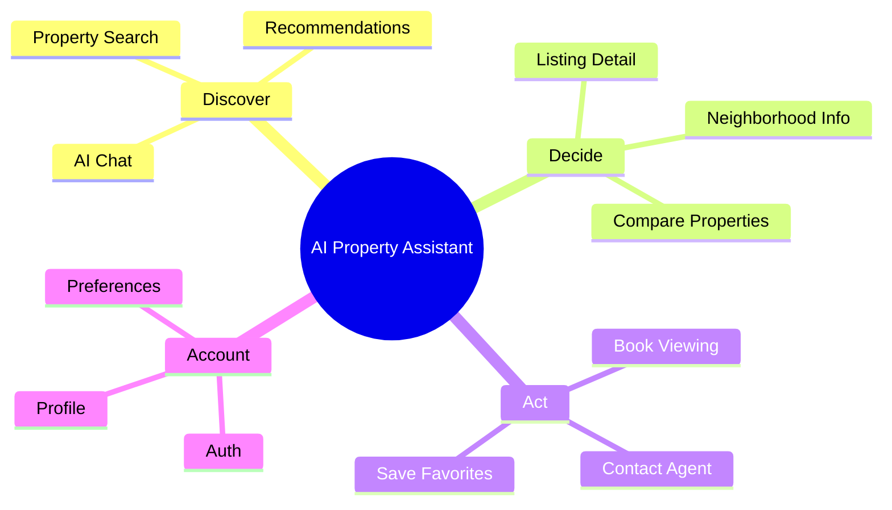
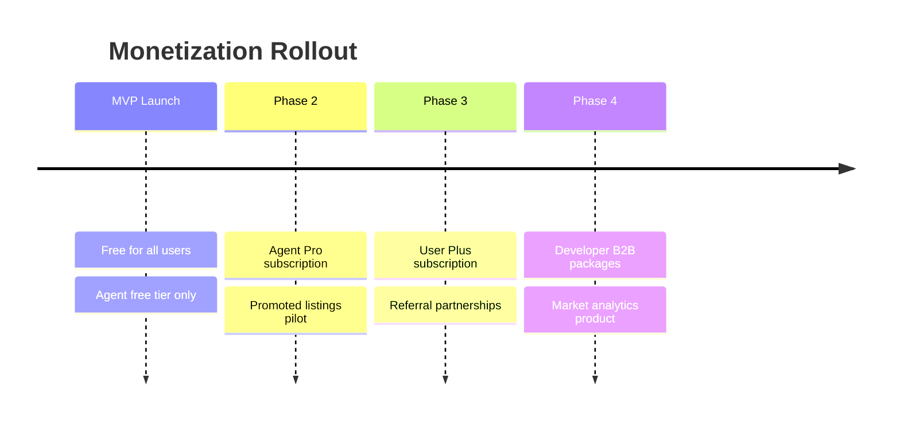

# Product Vision — AI Property Assistant

## Document Status

| Field | Value |
|-------|-------|
| Version | 1.0.0 |
| Status | Draft |
| Last Updated | 2026-06-03 |
| Product | AI Property Assistant (Mobile) |
| Launch Market | Egypt |

---

## Executive Summary

**AI Property Assistant** is a mobile-first application that helps Egyptians find, evaluate, and book properties through conversational AI, intelligent search, and personalized recommendations. Instead of scrolling endless listing pages, users describe what they want in natural language — in Arabic or English — and the app guides them from discovery to viewing appointment.

The platform aggregates listings from leading Egyptian property portals (**Shaety — شقتي**, **Aqarmap**, **Property Finder Egypt**) and layers an AI assistant on top, giving buyers and renters a smarter way to search while giving real estate agents faster lead qualification and booking tools.

---

## Problem Statement

### For Buyers & Renters

Searching for property in Egypt today is frustrating:

- **Fragmented listings** — The same property may appear across Shaety, Aqarmap, and Property Finder with no unified view. Users install multiple apps and repeat the same searches.
- **Filter fatigue** — Traditional search relies on rigid filters (price, bedrooms, area). Users often know what they want in words — *"شقة 3 غرف في التجمع الخامس قريبة من مول"* — but cannot express it easily.
- **Information overload** — Hundreds of results with inconsistent data quality, duplicate listings, and outdated prices waste time.
- **Slow agent response** — After finding a listing, contacting an agent via phone or WhatsApp often means hours or days of waiting with no guarantee of a viewing slot.
- **Low trust in recommendations** — Existing portals optimize for ad impressions and listing volume, not for matching the user to the right property.

### For Real Estate Agents

- **Unqualified leads** — Agents receive inquiries from users who are not serious, not in budget, or not in the right area.
- **Manual follow-up** — Lead management happens across WhatsApp, phone calls, and spreadsheets with no structured pipeline.
- **Missed opportunities** — Slow response times cause agents to lose clients to faster competitors.

### The Opportunity

An **AI Property Assistant** that understands natural language, aggregates Egypt's major listing sources, learns user preferences, and connects qualified buyers to agents at the moment of intent — transforming property search from a chore into a guided conversation.

---

## Target Audience

### Primary Personas

#### 1. The Property Seeker (Buyer / Renter)

| Attribute | Detail |
|-----------|--------|
| **Who** | Egyptians aged 25–45 searching for apartments, villas, or commercial space to buy or rent |
| **Where** | Greater Cairo (Cairo, Giza, 6th of October, New Cairo), Alexandria; expanding nationally |
| **Behavior** | Mobile-first; uses Arabic and English; compares listings across multiple apps |
| **Pain** | Too many listings, unclear pricing, hard to narrow down neighborhoods |
| **Goal** | Find the right property quickly, understand the area, book a viewing with minimal friction |
| **Tech comfort** | Comfortable with chat interfaces (WhatsApp, Messenger); open to AI assistance |

#### 2. The Real Estate Agent

| Attribute | Detail |
|-----------|--------|
| **Who** | Licensed or semi-professional agents, brokerage associates, independent brokers |
| **Where** | Same urban centers as buyers; often specialized by compound or district |
| **Pain** | Time wasted on unqualified leads; no centralized booking calendar |
| **Goal** | Receive pre-qualified viewing requests, respond fast, close more deals |
| **Onboarding** | Automated self-service registration — no manual approval gate for MVP |

#### 3. The Platform Administrator

| Attribute | Detail |
|-----------|--------|
| **Who** | Internal operations team |
| **Goal** | Monitor listing sync health, manage AI agents, enforce fair housing and data policies |

### Secondary Audiences (Post-MVP)

- **Property developers** — New compound and off-plan project promotion
- **Corporate relocation teams** — Bulk housing for expatriate employees
- **Investors** — Portfolio and ROI analysis tools

---

## Core Features

### MVP Features

#### 1. Authentication & Onboarding

- Sign up / log in via **email & password**, **Google**, or **Sign in with Apple**
- Role selection: Buyer/Renter or Real Estate Agent (automated agent onboarding)
- Bilingual onboarding flow (Arabic / English)

#### 2. AI Chat — Property Assistant

The heart of the product. Users converse with specialized AI agents:

| Agent | Purpose |
|-------|---------|
| **Property Assistant** | Search, compare, and explain listings in natural language |
| **Neighborhood Guide** | Area info, amenities, commute, schools, safety |
| **Buying Advisor** | Egypt-specific buy/rent process guidance |

- **User-selectable agents** — pick the assistant that fits the task
- **Mid-session switching** — change agent without losing conversation history
- **Grounded responses** — answers backed by real listings from aggregated feeds
- Powered by a **pluggable AI system** (OpenAI at launch; additional providers later)

#### 3. Property Search

- Unified search across **Shaety (شقتي)**, **Aqarmap**, and **Property Finder Egypt**
- Filters: location (governorate, city, district), price (EGP), property type, bedrooms, amenities
- Full-text and geo search via Elasticsearch
- Listing detail with photos, price, area, source attribution, and link to original listing
- Sort by price, date, relevance

#### 4. Personalized Recommendations

- Suggestions based on search history, saved favorites, and explicit feedback (like / dislike)
- "Properties you might like" feed on home screen
- Preference learning from AI chat interactions

#### 5. Viewing Booking

- Request a property viewing directly from listing detail or AI chat
- Agent receives notification; confirms or proposes alternative times
- Booking status tracking for the user (requested → confirmed → completed)

#### 6. User Profile

- Edit personal info and language preference
- Save favorite properties
- Set default AI agent and notification preferences
- Persist search preferences (budget range, preferred areas, property type)

### Feature Map

---

## Non-Functional Requirements

### Performance

| Requirement | Target |
|-------------|--------|
| App cold start | < 3 seconds on mid-range Android/iOS devices |
| Search results | < 2 seconds for typical queries |
| API response (reads) | p95 < 300 ms (excluding AI inference) |
| AI chat first token | < 3 seconds under normal load |

### Availability & Reliability

| Requirement | Target |
|-------------|--------|
| Core API uptime | 99.5% (excluding planned maintenance) |
| AI degradation | App remains usable for search/booking when AI is unavailable |
| Listing sync | Listings no older than 1 hour from provider source |

### Security & Privacy

- All traffic encrypted via HTTPS/TLS 1.2+
- Passwords hashed with bcrypt or Argon2; JWT with refresh token rotation
- Role-based access control (Buyer, Agent, Admin)
- Compliance with **Egypt Personal Data Protection Law** (Law No. 151 of 2020)
- OAuth compliance with Google and Apple identity requirements
- AI guardrails: fair housing, no discriminatory filtering, PII redaction

### Scalability

- Stateless NestJS API tier — horizontal scaling
- Elasticsearch for search-heavy workloads
- Async job processing (BullMQ) for listing sync and notifications

### Usability & Accessibility

- **Bilingual UI** — Arabic (ar-EG, RTL) and English (LTR)
- Support system font scaling (dynamic text size)
- Semantic labels for screen readers (TalkBack / VoiceOver)
- Minimum 4.5:1 text contrast ratio (WCAG 2.1)

### Maintainability

- Specification Driven Development — specs before code
- Clean Architecture with domain layer unit test coverage > 80%
- Integration tests for all public REST API endpoints

### Observability

- Structured logging with request correlation IDs
- Metrics: latency, error rate, AI token usage, listing sync health
- Alerting on sync failures and API error spikes
- Full strategy: [monitoring_strategy.md](../architecture/monitoring_strategy.md)

---

## Monetization

### Philosophy

Free for buyers to search and discover — monetize at the **moment of intent** (booking, agent connection) and through **agent-side value** (leads, visibility, tools).

### Revenue Streams

#### 1. Agent Subscriptions (Primary — B2B)

| Tier | Price (indicative) | Includes |
|------|-------------------|----------|
| **Free** | EGP 0 / month | Profile, receive up to 5 booking requests/month |
| **Pro** | EGP 499 / month | Unlimited bookings, lead dashboard, priority listing badge |
| **Premium** | EGP 999 / month | Featured agent profile, analytics, AI lead scoring summary |

Real estate agents pay because the platform delivers **pre-qualified, booking-ready leads** instead of casual browsers.

#### 2. Promoted Listings (B2B — Agents & Developers)

- Agents or developers pay to **boost visibility** of specific listings in search results and recommendation feeds
- Clearly labeled as "Promoted" / "مميز" — no deceptive placement
- Pricing: CPM or fixed weekly boost fee (TBD based on market testing)

#### 3. Premium User Plan (B2C — Optional Post-MVP)

| Tier | Price (indicative) | Includes |
|------|-------------------|----------|
| **Free** | EGP 0 | Search, 10 AI chat messages/day, basic recommendations |
| **Plus** | EGP 49 / month | Unlimited AI chat, priority booking, advanced filters, price alerts |

Introduced after MVP validates core engagement metrics.

#### 4. Referral & Partnership Revenue (Future)

- Referral fees from mortgage brokers, home insurance, or moving services
- Developer partnerships for new compound launches
- Data insights (anonymized market trends) for institutional investors

### Monetization Timeline

### Key Monetization Metrics

| Metric | Purpose |
|--------|---------|
| Cost per qualified lead (agent) | Pricing anchor for agent tiers |
| Search-to-booking conversion | Validates buyer-side value |
| Agent retention (90-day) | Subscription health |
| ARPU (average revenue per user) | Overall business viability |
| AI messages per session | Usage-based pricing input for Plus tier |

---

## Future Roadmap

### Phase 1 — MVP (Months 1–4)

**Goal:** Prove the AI-assisted property discovery loop in Egypt.

- Authentication (Google, Apple, email/password)
- Property search (Shaety → Aqarmap → Property Finder rollout)
- AI chat with selectable agents (OpenAI)
- Recommendations, booking, profile
- Agent free tier

### Phase 2 — Growth (Months 5–8)

**Goal:** Increase engagement and activate monetization.

- Agent Pro subscription and promoted listings
- WhatsApp notification integration (critical for Egypt market)
- Price drop and new-listing alerts
- Enhanced recommendation engine (collaborative filtering)
- User reviews and agent ratings
- Map-based search with neighborhood heatmaps

### Phase 3 — Platform (Months 9–12)

**Goal:** Become the default property assistant in Egypt.

- User Plus subscription (unlimited AI)
- Mortgage calculator and financing partner referrals
- Virtual property tours (360° photos / video)
- Agent CRM lite (lead pipeline, follow-up reminders)
- Voice input for AI chat (Arabic speech-to-text)
- Additional listing providers and direct developer feeds

### Phase 4 — Expansion (Year 2+)

**Goal:** Scale across MENA and deepen the product.

| Initiative | Description |
|------------|-------------|
| **Geographic expansion** | UAE, Saudi Arabia, Morocco |
| **New construction** | Off-plan projects, payment plan calculators |
| **Investment tools** | ROI analysis, rental yield estimates |
| **Payments & escrow** | Secure deposit handling for rentals |
| **White-label B2B** | Branded app for large brokerages |
| **AI agent marketplace** | Third-party specialized agents (legal, interior design) |
| **GraphQL API** | Replace REST for mobile if complexity warrants |

### Vision Horizon (3–5 Years)

> *Every property decision in the Arab world starts with a conversation with AI Property Assistant.*

- Real-time market intelligence powered by aggregated listing data
- AI negotiator assistant for rent and purchase discussions
- Integrated end-to-end journey: search → view → contract → move-in
- Recognized brand alongside Shaety and Aqarmap as a **decision layer**, not just another listing portal

---

## Success Metrics (MVP)

| Metric | Target |
|--------|--------|
| Time to first relevant result | < 30 seconds |
| AI chat resolution rate | > 70% without human handoff |
| Search-to-booking conversion | +15% vs. traditional browse-only flow |
| 30-day user retention | > 40% |
| Agent response time (to booking request) | < 5 minutes |
| App store rating | ≥ 4.2 stars |

---

## Guiding Principles

1. **AI as guide, not gatekeeper** — Human agents remain essential for closing deals; AI accelerates discovery and qualification.
2. **User choice** — Selectable AI agents, transparent promoted listings, clear source attribution.
3. **Egypt-first** — Arabic language, EGP pricing, local neighborhoods, local regulations.
4. **Privacy by design** — Collect only what is needed; comply with Egypt PDPL.
5. **Specification driven** — Every feature fully specified before implementation.
6. **Aggregate, don't duplicate** — Partner with existing listing ecosystems; add intelligence on top.

---

## Related Documents

| Document | Path |
|----------|------|
| Requirements | [requirements.md](./requirements.md) |
| System Design | [architecture/system_design.md](../architecture/system_design.md) |
| Listing Providers | [architecture/listing_providers.md](../architecture/listing_providers.md) |
| AI Provider Strategy | [architecture/ai_provider_strategy.md](../architecture/ai_provider_strategy.md) |
| Delivery Roadmap | [tasks/roadmap.md](../tasks/roadmap.md) |

---

## Approval

| Role | Name | Date | Status |
|------|------|------|--------|
| Product Owner | — | — | Pending |
| Tech Lead | — | — | Pending |
