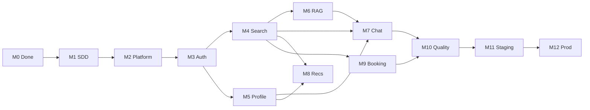

# Task Registry

> **133** implementation tasks (each **≤ 4 hours**), derived from
> `/specs`, `/architecture`, `/features`, and
> [master_execution_plan.md](./master_execution_plan.md).

## Conventions

| Rule | Detail |
|------|--------|
| **Estimate** | Wall-clock for one engineer; max 4h |
| **Testable alone** | Task has its own tests/verification without finishing the milestone |
| **ID format** | `M{milestone}-{AREA}{nnn}` (e.g. `M4-SEA006`) |
| **Status** | `pending` · `in_progress` · `done` |
| **Regenerate** | `python3 tasks/build_registry.py` |

## Progress

| Metric | Value |
|--------|-------|
| Total tasks | 133 |
| Done | 1 |
| Pending | 132 |

## Milestone Folders

| Folder | Milestone |
|--------|-----------|
| `m01-sdd/` | M1 — SDD Completion (specs only) |
| `m02-platform/` | M2 — Platform Bootstrap |
| `m03-authentication/` | M3 — Authentication |
| `m04-property-search/` | M4 — Property Search & Sync |
| `m05-profile/` | M5 — User Profile |
| `m06-rag/` | M6 — Embeddings & RAG |
| `m07-ai-chat/` | M7 — AI Chat |
| `m08-recommendations/` | M8 — Recommendations |
| `m09-booking/` | M9 — Booking & Notifications |
| `m10-quality/` | M10 — Quality & E2E |
| `m11-staging-gcp/` | M11 — Staging on GCP |
| `m12-production/` | M12 — Production Release |

## Dependency Graph (milestones)

## Critical Path (suggested)

1. Complete **M1** `authentication` + `property_search` SDD first (gates M2 backend).
2. **M2-PLT002** → **M2-PLT007** (platform).
3. **M3** auth vertical slice.
4. **M4** search (enables M6, M8, M9).
5. **M6** RAG before **M7** chat.
6. **M10** → **M11** → **M12**.

## All Tasks by Folder

### m01-sdd

| Task | Title | Est. | Status | Dependencies |
|------|-------|------|--------|--------------|
| [M1-AUT-REQ](./m01-sdd/m1-aut-req.md) | Authentication — Requirements | 2–3h | pending | M0 |
| [M1-AUT-ARC](./m01-sdd/m1-aut-arc.md) | Authentication — Architecture Design | 2–3h | pending | M1-AUT-REQ |
| [M1-AUT-DAT](./m01-sdd/m1-aut-dat.md) | Authentication — Data Model | 2–3h | pending | M1-AUT-ARC |
| [M1-AUT-API](./m01-sdd/m1-aut-api.md) | Authentication — API Design | 2–3h | pending | M1-AUT-DAT |
| [M1-AUT-TST](./m01-sdd/m1-aut-tst.md) | Authentication — Tests + Implementation Tasks | 2–3h | pending | M1-AUT-API |
| [M1-SEA-REQ](./m01-sdd/m1-sea-req.md) | Property Search — Requirements | 2–3h | pending | M0 |
| [M1-SEA-ARC](./m01-sdd/m1-sea-arc.md) | Property Search — Architecture Design | 2–3h | pending | M1-SEA-REQ |
| [M1-SEA-DAT](./m01-sdd/m1-sea-dat.md) | Property Search — Data Model | 2–3h | pending | M1-SEA-ARC |
| [M1-SEA-API](./m01-sdd/m1-sea-api.md) | Property Search — API Design | 2–3h | pending | M1-SEA-DAT |
| [M1-SEA-TST](./m01-sdd/m1-sea-tst.md) | Property Search — Tests + Implementation Tasks | 2–3h | pending | M1-SEA-API |
| [M1-PRO-REQ](./m01-sdd/m1-pro-req.md) | Profile — Requirements | 2–3h | pending | M0 |
| [M1-PRO-ARC](./m01-sdd/m1-pro-arc.md) | Profile — Architecture Design | 2–3h | pending | M1-PRO-REQ |
| [M1-PRO-DAT](./m01-sdd/m1-pro-dat.md) | Profile — Data Model | 2–3h | pending | M1-PRO-ARC |
| [M1-PRO-API](./m01-sdd/m1-pro-api.md) | Profile — API Design | 2–3h | pending | M1-PRO-DAT |
| [M1-PRO-TST](./m01-sdd/m1-pro-tst.md) | Profile — Tests + Implementation Tasks | 2–3h | pending | M1-PRO-API |
| [M1-CHT-REQ](./m01-sdd/m1-cht-req.md) | Ai Chat — Requirements | 2–3h | pending | M0 |
| [M1-CHT-ARC](./m01-sdd/m1-cht-arc.md) | Ai Chat — Architecture Design | 2–3h | pending | M1-CHT-REQ |
| [M1-CHT-DAT](./m01-sdd/m1-cht-dat.md) | Ai Chat — Data Model | 2–3h | pending | M1-CHT-ARC |
| [M1-CHT-API](./m01-sdd/m1-cht-api.md) | Ai Chat — API Design | 2–3h | pending | M1-CHT-DAT |
| [M1-CHT-TST](./m01-sdd/m1-cht-tst.md) | Ai Chat — Tests + Implementation Tasks | 2–3h | pending | M1-CHT-API |
| [M1-REC-REQ](./m01-sdd/m1-rec-req.md) | Recommendation — Requirements | 2–3h | pending | M0 |
| [M1-REC-ARC](./m01-sdd/m1-rec-arc.md) | Recommendation — Architecture Design | 2–3h | pending | M1-REC-REQ |
| [M1-REC-DAT](./m01-sdd/m1-rec-dat.md) | Recommendation — Data Model | 2–3h | pending | M1-REC-ARC |
| [M1-REC-API](./m01-sdd/m1-rec-api.md) | Recommendation — API Design | 2–3h | pending | M1-REC-DAT |
| [M1-REC-TST](./m01-sdd/m1-rec-tst.md) | Recommendation — Tests + Implementation Tasks | 2–3h | pending | M1-REC-API |
| [M1-BOK-REQ](./m01-sdd/m1-bok-req.md) | Booking — Requirements | 2–3h | pending | M0 |
| [M1-BOK-ARC](./m01-sdd/m1-bok-arc.md) | Booking — Architecture Design | 2–3h | pending | M1-BOK-REQ |
| [M1-BOK-DAT](./m01-sdd/m1-bok-dat.md) | Booking — Data Model | 2–3h | pending | M1-BOK-ARC |
| [M1-BOK-API](./m01-sdd/m1-bok-api.md) | Booking — API Design | 2–3h | pending | M1-BOK-DAT |
| [M1-BOK-TST](./m01-sdd/m1-bok-tst.md) | Booking — Tests + Implementation Tasks | 2–3h | pending | M1-BOK-API |

### m02-platform

| Task | Title | Est. | Status | Dependencies |
|------|-------|------|--------|--------------|
| [M2-PLT001](./m02-platform/m2-plt001.md) | Flutter Platform Bootstrap | 4h | done | M1-AUT-TST |
| [M2-PLT002](./m02-platform/m2-plt002.md) | NestJS Scaffold + Clean Architecture Folders | 3h | pending | M1-AUT-TST |
| [M2-PLT003](./m02-platform/m2-plt003.md) | Prisma Schema + Initial Migration | 3h | pending | M2-PLT002 |
| [M2-PLT004](./m02-platform/m2-plt004.md) | Docker Compose Local Stack | 2h | pending | M2-PLT003 |
| [M2-PLT005](./m02-platform/m2-plt005.md) | Health Endpoints + Logging Interceptor | 2h | pending | M2-PLT002 |
| [M2-PLT006](./m02-platform/m2-plt006.md) | Backend CI Pipeline Skeleton | 2h | pending | M2-PLT002 |
| [M2-PLT007](./m02-platform/m2-plt007.md) | Redis + BullMQ Module Wiring | 3h | pending | M2-PLT004 |

### m03-authentication

| Task | Title | Est. | Status | Dependencies |
|------|-------|------|--------|--------------|
| [M3-AUTH001](./m03-authentication/m3-auth001.md) | Auth Domain Layer (entities, ports, VOs) | 3h | pending | M2-PLT003, M1-AUT-REQ |
| [M3-AUTH002](./m03-authentication/m3-auth002.md) | JWT + Refresh Token Service | 3h | pending | M3-AUTH001 |
| [M3-AUTH003](./m03-authentication/m3-auth003.md) | POST /auth/register + Email Verification | 4h | pending | M3-AUTH002 |
| [M3-AUTH004](./m03-authentication/m3-auth004.md) | POST /auth/login + Logout | 3h | pending | M3-AUTH003 |
| [M3-AUTH005](./m03-authentication/m3-auth005.md) | Password Reset Flow | 3h | pending | M3-AUTH004 |
| [M3-AUTH006](./m03-authentication/m3-auth006.md) | Google OAuth Backend | 4h | pending | M3-AUTH004 |
| [M3-AUTH007](./m03-authentication/m3-auth007.md) | Apple Sign-In Backend | 4h | pending | M3-AUTH006 |
| [M3-AUTH008](./m03-authentication/m3-auth008.md) | RBAC Guards + JWT Passport | 3h | pending | M3-AUTH002 |
| [M3-AUTH009](./m03-authentication/m3-auth009.md) | Mobile Auth Screens (Register, Login, Onboarding) | 4h | pending | M2-PLT001, M3-AUTH004 |
| [M3-AUTH010](./m03-authentication/m3-auth010.md) | Mobile Google + Apple Sign-In | 4h | pending | M3-AUTH009, M3-AUTH006, M3-AUTH007 |
| [M3-AUTH011](./m03-authentication/m3-auth011.md) | Mobile Token Storage + Auto Refresh | 3h | pending | M3-AUTH009 |
| [M3-AUTH012](./m03-authentication/m3-auth012.md) | PDPL Consent on Onboarding | 2h | pending | M3-AUTH009 |

### m04-property-search

| Task | Title | Est. | Status | Dependencies |
|------|-------|------|--------|--------------|
| [M4-SEA001](./m04-property-search/m4-sea001.md) | Listing Provider Port + Property Domain | 3h | pending | M2-PLT003, M1-SEA-REQ |
| [M4-SEA002](./m04-property-search/m4-sea002.md) | Shaety Listing Adapter (with mock fallback) | 4h | pending | M4-SEA001 |
| [M4-SEA003](./m04-property-search/m4-sea003.md) | Properties Prisma Repository | 3h | pending | M4-SEA001 |
| [M4-SEA004](./m04-property-search/m4-sea004.md) | Listing Sync BullMQ Worker | 4h | pending | M4-SEA002, M4-SEA003, M2-PLT007 |
| [M4-SEA005](./m04-property-search/m4-sea005.md) | Full-Text Search (tsvector) + Query Builder | 3h | pending | M4-SEA003 |
| [M4-SEA006](./m04-property-search/m4-sea006.md) | GET /api/v1/properties (filter, sort, paginate) | 4h | pending | M4-SEA005 |
| [M4-SEA007](./m04-property-search/m4-sea007.md) | GET /api/v1/properties/:id | 2h | pending | M4-SEA003 |
| [M4-SEA008](./m04-property-search/m4-sea008.md) | Admin Sync Status Endpoint | 2h | pending | M4-SEA004, M3-AUTH008 |
| [M4-SEA009](./m04-property-search/m4-sea009.md) | Mobile Search Screen + Results List | 4h | pending | M2-PLT001, M4-SEA006 |
| [M4-SEA010](./m04-property-search/m4-sea010.md) | Mobile Filters Bottom Sheet | 3h | pending | M4-SEA009 |
| [M4-SEA011](./m04-property-search/m4-sea011.md) | Mobile Listing Detail Screen | 4h | pending | M4-SEA009, M4-SEA007 |
| [M4-SEA012](./m04-property-search/m4-sea012.md) | Property Search Integration Test Pack | 3h | pending | M4-SEA006, M4-SEA007, M4-SEA004 |

### m05-profile

| Task | Title | Est. | Status | Dependencies |
|------|-------|------|--------|--------------|
| [M5-PRO001](./m05-profile/m5-pro001.md) | Profile Domain + Repository Port | 3h | pending | M3-AUTH001, M1-PRO-REQ |
| [M5-PRO002](./m05-profile/m5-pro002.md) | GET/PATCH /api/v1/users/me | 3h | pending | M5-PRO001, M3-AUTH008 |
| [M5-PRO003](./m05-profile/m5-pro003.md) | Favorites CRUD API | 3h | pending | M5-PRO001, M4-SEA003 |
| [M5-PRO004](./m05-profile/m5-pro004.md) | Search Preferences API | 2h | pending | M5-PRO002 |
| [M5-PRO005](./m05-profile/m5-pro005.md) | Default AI Agent Preference | 2h | pending | M5-PRO002 |
| [M5-PRO006](./m05-profile/m5-pro006.md) | Account Deletion + Data Export Stub | 3h | pending | M5-PRO002 |
| [M5-PRO007](./m05-profile/m5-pro007.md) | Agent Public Profile GET /agents/:id | 2h | pending | M5-PRO001 |
| [M5-PRO008](./m05-profile/m5-pro008.md) | Mobile Profile Tab + Edit Profile | 4h | pending | M3-AUTH009, M5-PRO002 |
| [M5-PRO009](./m05-profile/m5-pro009.md) | Mobile Favorites Screen | 3h | pending | M5-PRO008, M5-PRO003, M4-SEA011 |
| [M5-PRO010](./m05-profile/m5-pro010.md) | Profile P0 Integration Tests | 3h | pending | M5-PRO003, M5-PRO006 |

### m06-rag

| Task | Title | Est. | Status | Dependencies |
|------|-------|------|--------|--------------|
| [M6-RAG001](./m06-rag/m6-rag001.md) | Gemini Embedding Adapter | 3h | pending | M2-PLT007, M4-SEA003 |
| [M6-RAG002](./m06-rag/m6-rag002.md) | embed-listing BullMQ Worker | 4h | pending | M6-RAG001, M4-SEA004 |
| [M6-RAG003](./m06-rag/m6-rag003.md) | HNSW Index Migration + pgvector Tuning | 2h | pending | M6-RAG002 |
| [M6-RAG004](./m06-rag/m6-rag004.md) | RAG Orchestrator (hybrid vector + SQL + tsvector) | 4h | pending | M6-RAG003, M4-SEA005 |
| [M6-RAG005](./m06-rag/m6-rag005.md) | POST /api/v1/ai/rag/retrieve (dev/admin) | 2h | pending | M6-RAG004, M3-AUTH008 |
| [M6-RAG006](./m06-rag/m6-rag006.md) | Redis RAG Result Cache | 3h | pending | M6-RAG004, M2-PLT007 |
| [M6-RAG007](./m06-rag/m6-rag007.md) | Project Knowledge Ingest (FAQ chunks) | 3h | pending | M6-RAG001 |
| [M6-RAG008](./m06-rag/m6-rag008.md) | RAG Metrics Instrumentation | 2h | pending | M6-RAG004 |
| [M6-RAG009](./m06-rag/m6-rag009.md) | RAG Golden-Set Evaluation Script | 3h | pending | M6-RAG005 |

### m07-ai-chat

| Task | Title | Est. | Status | Dependencies |
|------|-------|------|--------|--------------|
| [M7-CHT001](./m07-ai-chat/m7-cht001.md) | Conversation Domain + Repositories | 3h | pending | M2-PLT003, M1-CHT-REQ |
| [M7-CHT002](./m07-ai-chat/m7-cht002.md) | AiModule + Agents Catalog API | 2h | pending | M7-CHT001 |
| [M7-CHT003](./m07-ai-chat/m7-cht003.md) | GeminiOrchestrator + Prompt Version Loader | 4h | pending | M7-CHT002, M6-RAG004 |
| [M7-CHT004](./m07-ai-chat/m7-cht004.md) | SafetyPipeline + Fair Housing Rules | 3h | pending | M7-CHT003 |
| [M7-CHT005](./m07-ai-chat/m7-cht005.md) | ToolExecutionLoop (semantic_search, etc.) | 4h | pending | M7-CHT003, M6-RAG004 |
| [M7-CHT006](./m07-ai-chat/m7-cht006.md) | POST /conversations + /messages (non-stream) | 4h | pending | M7-CHT005, M3-AUTH008 |
| [M7-CHT007](./m07-ai-chat/m7-cht007.md) | SSE Streaming Endpoint | 4h | pending | M7-CHT006 |
| [M7-CHT008](./m07-ai-chat/m7-cht008.md) | Conversation Memory Compaction Job | 3h | pending | M7-CHT006 |
| [M7-CHT009](./m07-ai-chat/m7-cht009.md) | Mobile Chat UI + Stream Rendering | 4h | pending | M3-AUTH011, M7-CHT007 |
| [M7-CHT010](./m07-ai-chat/m7-cht010.md) | Mobile Agent Picker + Listing Cards | 3h | pending | M7-CHT009, M4-SEA011, M5-PRO005 |
| [M7-CHT011](./m07-ai-chat/m7-cht011.md) | AI Chat P0 Test Pack | 3h | pending | M7-CHT007, M7-CHT004 |

### m08-recommendations

| Task | Title | Est. | Status | Dependencies |
|------|-------|------|--------|--------------|
| [M8-REC001](./m08-recommendations/m8-rec001.md) | Recommendation Domain + Scoring Port | 3h | pending | M1-REC-REQ, M6-RAG003 |
| [M8-REC002](./m08-recommendations/m8-rec002.md) | User Preference Vector Builder | 3h | pending | M8-REC001, M5-PRO003 |
| [M8-REC003](./m08-recommendations/m8-rec003.md) | GET /api/v1/recommendations | 4h | pending | M8-REC002, M4-SEA006 |
| [M8-REC004](./m08-recommendations/m8-rec004.md) | POST /recommendations/feedback | 2h | pending | M8-REC003 |
| [M8-REC005](./m08-recommendations/m8-rec005.md) | Mobile Home Recommendations Section | 4h | pending | M8-REC003, M2-PLT001 |
| [M8-REC006](./m08-recommendations/m8-rec006.md) | Recommendation P0 Test Pack | 3h | pending | M8-REC004 |

### m09-booking

| Task | Title | Est. | Status | Dependencies |
|------|-------|------|--------|--------------|
| [M9-BOK001](./m09-booking/m9-bok001.md) | Booking Domain + Repository | 3h | pending | M2-PLT003, M1-BOK-REQ |
| [M9-BOK002](./m09-booking/m9-bok002.md) | POST /api/v1/bookings (buyer request) | 4h | pending | M9-BOK001, M4-SEA007, M3-AUTH008 |
| [M9-BOK003](./m09-booking/m9-bok003.md) | Agent Confirm / Decline / Cancel APIs | 3h | pending | M9-BOK002 |
| [M9-BOK004](./m09-booking/m9-bok004.md) | Double-Booking + Agent Quota Guards | 3h | pending | M9-BOK003 |
| [M9-BOK005](./m09-booking/m9-bok005.md) | NotificationsModule + BullMQ Processor | 3h | pending | M2-PLT007, M9-BOK003 |
| [M9-BOK006](./m09-booking/m9-bok006.md) | FCM Push Integration | 4h | pending | M9-BOK005 |
| [M9-BOK007](./m09-booking/m9-bok007.md) | Bilingual Email Templates (ar/en) | 3h | pending | M9-BOK005 |
| [M9-BOK008](./m09-booking/m9-bok008.md) | Mobile Booking Request from Listing Detail | 4h | pending | M4-SEA011, M9-BOK002, M3-AUTH011 |
| [M9-BOK009](./m09-booking/m9-bok009.md) | Mobile Agent Booking Inbox | 3h | pending | M9-BOK008, M9-BOK003 |
| [M9-BOK010](./m09-booking/m9-bok010.md) | Booking E2E Lifecycle Test | 3h | pending | M9-BOK006, M9-BOK004 |

### m10-quality

| Task | Title | Est. | Status | Dependencies |
|------|-------|------|--------|--------------|
| [M10-QLT001](./m10-quality/m10-qlt001.md) | MVP Launch Checklist Document | 2h | pending | M9-BOK010, M7-CHT011 |
| [M10-QLT002](./m10-quality/m10-qlt002.md) | Flutter integration_test P0 Journey | 4h | pending | M9-BOK009, M7-CHT010 |
| [M10-QLT003](./m10-quality/m10-qlt003.md) | API E2E Suite (supertest) | 4h | pending | M9-BOK010 |
| [M10-QLT004](./m10-quality/m10-qlt004.md) | Domain Coverage Gate ≥80% | 3h | pending | M10-QLT003 |
| [M10-QLT005](./m10-quality/m10-qlt005.md) | Prometheus Metrics + Grafana Dashboards | 4h | pending | M6-RAG008, M7-CHT003 |
| [M10-QLT006](./m10-quality/m10-qlt006.md) | Firebase Analytics + Crashlytics | 3h | pending | M2-PLT001 |
| [M10-QLT007](./m10-quality/m10-qlt007.md) | AI Quality Metrics (hallucination, citations) | 3h | pending | M7-CHT011 |
| [M10-QLT008](./m10-quality/m10-qlt008.md) | Security Review Checklist (OWASP + PDPL) | 3h | pending | M3-AUTH012 |
| [M10-QLT009](./m10-quality/m10-qlt009.md) | Load Test Report (search + chat) | 4h | pending | M4-SEA012, M7-CHT007 |
| [M10-QLT010](./m10-quality/m10-qlt010.md) | PO MVP Sign-Off Artifact | 2h | pending | M10-QLT001, M10-QLT009 |

### m11-staging-gcp

| Task | Title | Est. | Status | Dependencies |
|------|-------|------|--------|--------------|
| [M11-DEP001](./m11-staging-gcp/m11-dep001.md) | GCP Staging Project + WIF for GitHub | 4h | pending | M10-QLT010 |
| [M11-DEP002](./m11-staging-gcp/m11-dep002.md) | Cloud SQL PostgreSQL + pgvector | 4h | pending | M11-DEP001, M2-PLT003 |
| [M11-DEP003](./m11-staging-gcp/m11-dep003.md) | Cloud Run API + Worker Services | 4h | pending | M11-DEP002, M2-PLT004 |
| [M11-DEP004](./m11-staging-gcp/m11-dep004.md) | Secret Manager Wiring | 3h | pending | M11-DEP003 |
| [M11-DEP005](./m11-staging-gcp/m11-dep005.md) | Vertex AI Gemini Staging Config | 3h | pending | M11-DEP004, M7-CHT003 |
| [M11-DEP006](./m11-staging-gcp/m11-dep006.md) | GitHub Actions deploy-staging Workflow | 3h | pending | M11-DEP003 |
| [M11-DEP007](./m11-staging-gcp/m11-dep007.md) | Flutter Staging → Staging API URL | 2h | pending | M11-DEP003, M2-PLT001 |
| [M11-DEP008](./m11-staging-gcp/m11-dep008.md) | Cloud Monitoring Alerts | 3h | pending | M10-QLT005, M11-DEP003 |
| [M11-DEP009](./m11-staging-gcp/m11-dep009.md) | Staging Smoke + Rollback Drill | 3h | pending | M11-DEP006, M11-DEP007 |

### m12-production

| Task | Title | Est. | Status | Dependencies |
|------|-------|------|--------|--------------|
| [M12-PRD001](./m12-production/m12-prd001.md) | GCP Production Project + IAM | 4h | pending | M11-DEP009 |
| [M12-PRD002](./m12-production/m12-prd002.md) | Production CD (canary + traffic shift) | 4h | pending | M12-PRD001, M11-DEP006 |
| [M12-PRD003](./m12-production/m12-prd003.md) | Custom Domain + Managed SSL | 3h | pending | M12-PRD002 |
| [M12-PRD004](./m12-production/m12-prd004.md) | Fastlane App Store + Play Release | 4h | pending | M11-DEP007, M10-QLT002 |
| [M12-PRD005](./m12-production/m12-prd005.md) | Production Vertex Quotas + Budget Alerts | 2h | pending | M12-PRD001 |
| [M12-PRD006](./m12-production/m12-prd006.md) | Incident Runbook + On-Call Rotation | 3h | pending | M11-DEP009 |
| [M12-PRD007](./m12-production/m12-prd007.md) | Production Smoke + Hypercare Dashboard | 3h | pending | M12-PRD003, M12-PRD004 |

## Related

- [Master Execution Plan](./master_execution_plan.md)
- [Roadmap](./roadmap.md)
- [Mobile bootstrap report](./mobile_platform_bootstrap_completion_report.md)
