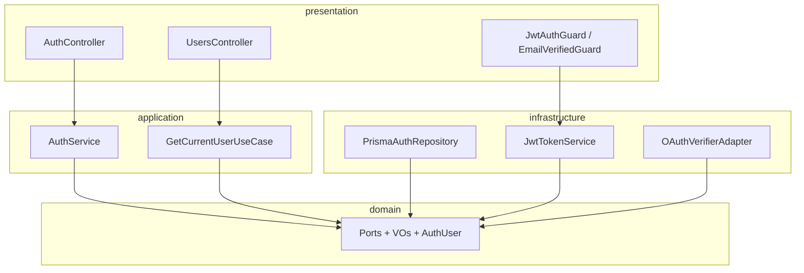

# M3 Authentication — Implementation Review (v2)

**Date:** 2026-06-03  
**Scope:** Backend (`backend/src`) + Mobile (`mobile/lib/features/authentication`, `core/auth`, `core/network`)  
**Baseline:** Post-refinement implementation (ports, guards, e2e, session expiry)

---

## Executive summary

| Dimension | Backend | Mobile | Overall |
|-----------|---------|--------|---------|
| Clean Architecture | **A−** | **B+** | **B+** |
| SOLID | **B+** | **B** | **B+** |
| Testability | **B** | **C+** | **B−** |
| Naming conventions | **A−** | **A−** | **A−** |
| Scalability | **B+** | **B** | **B+** |

M3 is **production-viable for an MVP auth slice**. The backend now follows the documented dependency rule for application → domain (ports only). Remaining debt is mostly **SRP** (monolithic `AuthService`), **test breadth**, and **mobile OAuth coupling**.

---

## 1. Clean Architecture compliance

### 1.1 Backend — aligned

| Practice | Status | Evidence |
|----------|--------|----------|
| Layer separation | ✅ | `domain/`, `application/`, `infrastructure/`, `presentation/` |
| Domain free of Prisma/Nest | ✅ | No `@prisma/client` under `domain/`; `OAuthProvider` domain enum |
| Application depends on ports | ✅ | `AuthService` injects `AUTH_REPOSITORY`, `TOKEN_SERVICE`, `PASSWORD_HASHER`, `EMAIL_SENDER`, `OAUTH_VERIFIER` |
| Infrastructure implements ports | ✅ | `PrismaAuthRepository`, `JwtTokenService`, `OAuthVerifierAdapter`, `useExisting` for email/password |
| Thin controllers | ✅ | `AuthController`, `UsersController` delegate to application |
| Cross-cutting HTTP mapping | ✅ | `ApiExceptionFilter`, `TransformInterceptor`, guards in presentation |
| Profile read model | ✅ | `UserProfile` + `findProfileById` on repository port |

### 1.2 Backend — remaining gaps

| Issue | Severity | Detail |
|-------|----------|--------|
| `@Injectable()` on application classes | Low | `AuthService`, `GetCurrentUserUseCase` use Nest decorators; docs prefer framework-free application with wiring only in modules. Acceptable for Nest monolith. |
| `common/utils/token-hash` in application | Low | Crypto/token helpers are shared kernel, not domain; consider `domain/auth` or `PasswordHasherPort` owning hash contract. |
| `AuthResponseDto` in application | Low | HTTP-shaped response type in application layer; could be mapper in presentation. |
| `UseCase<TIn,TOut>` mostly unused | Low | Only `GetCurrentUserUseCase` follows pattern; auth flows live in `AuthService`. |
| Infra verifiers still loaded in e2e | Low | `jest-e2e-setup.ts` mocks Google/Apple verifiers to avoid ESM `jose` issues. |

### 1.3 Mobile — aligned

| Practice | Status | Evidence |
|----------|--------|----------|
| Feature folders | ✅ | `domain/`, `data/`, `presentation/` |
| Repository abstraction | ✅ | `AuthRepository` + `AuthRepositoryImpl` |
| Remote boundary | ✅ | `AuthRemoteDataSource`, `ApiClient`, `unwrapApiData` |
| Core token/session | ✅ | `TokenStorage`, `AuthInterceptor`, `SessionExpiredNotifier` |
| Platform API URL | ✅ | `devApiBaseUrlDefault()` in `app_config.dart` |

### 1.4 Mobile — remaining gaps

| Issue | Severity | Detail |
|-------|----------|--------|
| OAuth SDKs in `AuthRepositoryImpl` | Medium | `google_sign_in` / `sign_in_with_apple` inside data layer; harder to test and swap. |
| Register bypasses `AuthSessionNotifier` | Low | Register page calls repository directly; login uses notifier. |
| No domain use-case layer | Low | Acceptable for M3; Riverpod notifiers act as application layer. |
| API error codes not mapped | Low | UI shows generic Dio failures vs `DUPLICATE_EMAIL`, etc. |

---

## 2. SOLID compliance

### Single Responsibility Principle (SRP)

| Component | Grade | Notes |
|-----------|-------|-------|
| `AuthService` | **C+** | ~285 lines, 10+ operations (register, verify, login, refresh, logout, forgot/reset, Google, Apple). Should split into `RegisterUser`, `LoginUser`, `RefreshSession`, etc. |
| `GetCurrentUserUseCase` | **A** | Single responsibility, clear input (`userId`). |
| `PrismaAuthRepository` | **B** | Persistence + token tables + OAuth linking; wide but cohesive for auth bounded context. |
| `JwtTokenService` | **A−** | Token issue/verify + refresh persistence via port. |
| `AuthRepositoryImpl` (mobile) | **B−** | HTTP + tokens + OAuth orchestration. |

### Open/Closed Principle (OCP)

| Area | Grade | Notes |
|------|-------|-------|
| New OAuth provider | **B** | Add enum value + verifier + adapter branch; no registry pattern yet. |
| New auth endpoint | **C+** | Requires editing `AuthService` / `AuthController`. |
| Swap email provider | **A−** | Implement `EmailSenderPort`, bind in module. |

### Liskov Substitution Principle (LSP)

| Area | Grade | Notes |
|------|-------|-------|
| Repository / token / hasher / email / oauth ports | **A** | Implementations honor contracts. |

### Interface Segregation Principle (ISP)

| Area | Grade | Notes |
|------|-------|-------|
| `AuthRepositoryPort` | **B−** | 15+ methods (users, refresh, verification, reset, OAuth). Consider `IRefreshTokenStore`, `IVerificationTokenStore` when other modules need narrower deps. |
| Mobile `AuthRepository` | **A−** | Focused client surface. |

### Dependency Inversion Principle (DIP)

| Area | Grade | Notes |
|------|-------|-------|
| `AuthService` | **A−** | Depends on abstractions only (fixed since v1 review). |
| `UsersController` | **A** | Depends on `GetCurrentUserUseCase`, not Prisma (fixed). |
| `JwtAuthGuard` | **A** | Depends on `TokenServicePort`. |

---

## 3. Testability

### Backend

| Asset | Count / status |
|-------|----------------|
| Unit tests | **11** (`email`, `password`, `result`, `auth.service` ×4, `app.module` smoke) |
| E2E tests | **5** (`health` ×1, `auth` ×4) |
| Integration (DB module) | Via e2e with real Prisma when `DATABASE_URL` set |

**Covered behaviors**

- Register consent, duplicate email, verification email sent  
- Login blocked when `emailVerified === false`  
- E2E: 201 register, 409 duplicate, 403 unverified login, 200 login + `/users/me` after verify  

**Gaps**

| Gap | Impact |
|-----|--------|
| No `PrismaAuthRepository` tests | Regression risk on token consume / OAuth link |
| No guard/filter unit tests | `EmailVerifiedGuard`, `ApiExceptionFilter` untested in isolation |
| No `JwtTokenService` unit tests | Refresh rotation logic untested directly |
| E2E OAuth mocks required | Full AppModule load still pulls auth graph |
| Domain coverage | VOs only; not entities/failures/enums |
| M3 task “≥80% domain auth” | **Not met** for full domain folder |

### Mobile

| Asset | Status |
|-------|--------|
| Auth unit/widget tests | **None** |
| `SessionExpiredNotifier` | Untested |
| `failure_mapper_test` | Core only |

**Enablers:** injectable DI, repository interface, `SessionExpiredNotifier` stream — tests are feasible once OAuth is extracted.

### Testability score rationale

Improved from v1 (**C+** → **B** backend) due to e2e auth suite and login-unverified unit test. Still below ideal for a P0 security module.

---

## 4. Naming conventions

### Backend

| Convention | Compliance | Examples |
|------------|------------|----------|
| `*.vo.ts` | ✅ | `email.vo.ts`, `password.vo.ts` |
| `*.port.ts` | ✅ | `auth.repository.port.ts`, `email-sender.port.ts` |
| `*.entity.ts` | ✅ | `auth-user.entity.ts` |
| `*.enum.ts` | ✅ | `oauth-provider.enum.ts`, `user-role.enum.ts` |
| `*.use-case.ts` | ✅ | `get-current-user.use-case.ts` |
| Symbol tokens | ✅ | `AUTH_REPOSITORY`, `EMAIL_SENDER`, … |
| Nest suffixes | ✅ | `AuthController`, `AuthModule`, `*Guard` |
| Read model naming | ✅ | `UserProfile` vs aggregate `AuthUser` |

### Mobile

| Convention | Compliance | Examples |
|------------|------------|----------|
| `snake_case` files | ✅ | `auth_repository_impl.dart` |
| `PascalCase` types | ✅ | `AuthUser`, `AuthSession` |
| Providers/pages | ✅ | `authSessionProvider`, `LoginPage` |

---

## 5. Scalability

### Strengths

| Capability | Implementation |
|------------|----------------|
| Horizontal API scaling | Stateless JWT access tokens |
| Refresh security | Hashed storage, rotation on refresh, revoke-all on password reset |
| Rate limiting | `@Throttle` on `AuthController` |
| Email verification gate | Login 403 + `EmailVerifiedGuard` on protected routes |
| Modular monolith | `AuthModule` exports guards/ports for other features |
| Mobile resilience | Queued refresh interceptor, session expiry → router redirect |
| Multi-platform dev | iOS `127.0.0.1` / Android `10.0.2.2` defaults |

### Risks at scale

| Risk | Mitigation |
|------|------------|
| Monolithic `AuthService` | Split use cases before adding MFA, SSO, magic links |
| Console `EmailService` | SES/SendGrid adapter behind `EmailSenderPort` |
| Wide repository port | Segregate when bookings/search import auth deps |
| JWT denylist / session revocation | Redis blocklist for compromised tokens (future) |
| Distributed throttling | Redis-backed throttler for multi-instance |
| Mobile OAuth in repository | Platform adapter + flavor-specific client IDs |

---

## 6. Security & acceptance criteria

| Criterion | Status |
|-----------|--------|
| AC-AUTH-001: register + verify pending | ✅ 201 + mobile verify screen |
| AC-AUTH-001: duplicate email | ✅ 409 + domain error |
| AC-AUTH-001: block unverified protected access | ✅ Login 403 + `EmailVerifiedGuard` on `/users/me` |
| AC-AUTH-004: verified login | ✅ After `emailVerified` |
| AC-AUTH-005: logout | ✅ Server revoke + local clear |
| AC-AUTH-006: forgot password | ✅ Generic message + email log |
| OAuth (002/003) | ⚠️ Requires env + platform config |
| Resend verification endpoint | ❌ Not implemented (spec lists it) |

---

## 7. Recommendations (prioritized)

### P1 — Quality & maintainability

1. **Split `AuthService`** into one class per flow implementing `UseCase<TIn, TOut>`.
2. **Add unit tests** for `EmailVerifiedGuard`, `JwtTokenService`, `GetCurrentUserUseCase`.
3. **Mobile:** extract `OAuthSignInPort`; add `auth_repository_impl_test.dart` with mocked remote + storage.
4. **Map API `error.code`** in `failure_mapper` / auth UI for register/login.

### P2 — Product & scale

5. Implement `POST /auth/resend-verification` (spec).
6. Explicit `implements EmailSenderPort` on `EmailService` (documentation/clarity).
7. Segregate `AuthRepositoryPort` when M4+ modules consume auth.
8. Redis email queue + real provider for production email.

---

## 8. v1 → v2 improvements

| Item | v1 | v2 |
|------|----|----|
| Prisma in domain | ❌ | ✅ Removed |
| Application → infrastructure imports | ❌ | ✅ Ports only |
| `UsersController` → Prisma | ❌ | ✅ `GetCurrentUserUseCase` |
| Email verification enforcement | Partial | ✅ Login + guard |
| Register HTTP status | 200 default | ✅ 201 |
| E2E auth tests | None | ✅ 4 cases |
| Mobile failed refresh | Pass-through 401 | ✅ Session clear + redirect |
| iOS API host | Wrong `10.0.2.2` | ✅ Platform default |

---

## 9. Conclusion

M3 authentication **meets the architectural intent** of the project’s NestJS and Flutter structure after refinement. Clean Architecture compliance is **strong on the backend** (ports, guards, use case for profile); **good on mobile** with one notable coupling (OAuth SDKs in the repository). SOLID is held back mainly by **SRP** in `AuthService`. **Testability improved** with e2e coverage but remains the weakest dimension overall. **Naming** is consistent. **Scalability** is appropriate for early production with clear upgrade paths.

**Suggested next slice:** split `AuthService` + mobile OAuth port + resend-verification endpoint.

---

## Appendix — files reviewed

**Backend:** `auth.service.ts`, `get-current-user.use-case.ts`, all `domain/auth/ports/*`, `prisma-auth.repository.ts`, `oauth-verifier.adapter.ts`, `auth.module.ts`, `users.controller.ts`, `email-verified.guard.ts`, `jwt-auth.guard.ts`, `api-exception.filter.ts`, `test/auth.e2e-spec.ts`, `test/jest-e2e-setup.ts`

**Mobile:** `auth_repository_impl.dart`, `auth_remote_datasource.dart`, `auth_provider.dart`, `session_expired_notifier.dart`, `auth_interceptor.dart`, `app_config.dart`, auth pages

**Docs:** `backend/PROJECT_STRUCTURE.md`, `features/authentication/acceptance_criteria.md`
