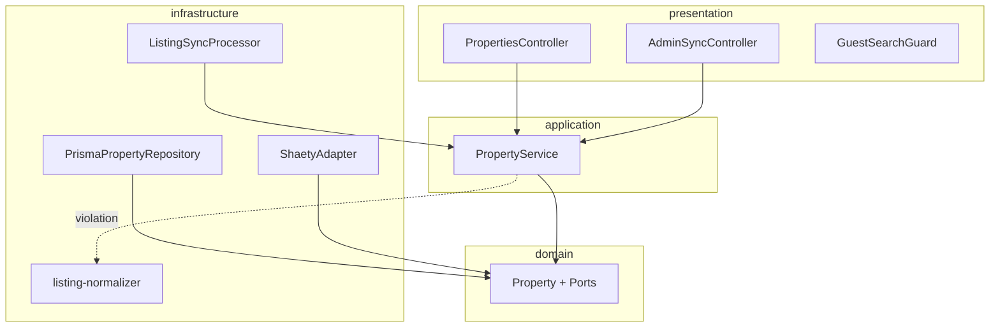

# M4 Property Search — Implementation Review

**Date:** 2026-06-03  
**Scope:** Backend (`backend/src` — property domain, sync, search) + Mobile (`mobile/lib/features/property_search`)  
**Reference:** `features/property_search/*`, M4-SEA001–012

---

## Executive summary

| Dimension | Backend | Mobile | Overall |
|-----------|---------|--------|---------|
| Clean Architecture | **B+** | **A−** | **B+** |
| SOLID | **B** | **B+** | **B** |
| Testability | **B−** | **C+** | **B−** |
| Naming conventions | **A−** | **A−** | **A−** |
| Scalability | **B** | **B** | **B** |

M4 delivers a **complete browse/search vertical slice**: mock Shaety ingest, BullMQ sync, full-text search, guest-aware pagination, admin sync health, and Flutter search/detail UI. Architecture matches M3 patterns (ports + Prisma adapters). Main gaps: **application → infrastructure imports** for normalizer/queue constants, **monolithic `PropertyService`**, **sequential upserts**, and **thin unit coverage** on repository/search.

---

## 1. Clean Architecture compliance

### 1.1 Backend — aligned

| Practice | Status | Evidence |
|----------|--------|----------|
| Domain layer purity | ✅ | No Nest/Prisma in `domain/property/`; enums, `Property` entity, `Location` VO, ports |
| Repository port | ✅ | `PropertyRepositoryPort`, `SyncRunRepositoryPort` |
| External listings port | ✅ | `ListingProviderPort` + `RawListing` DTO in domain |
| Infrastructure adapters | ✅ | `PrismaPropertyRepository`, `ShaetyAdapter`, `listing-normalizer` |
| Thin controllers | ✅ | `PropertiesController`, `AdminSyncController` delegate to `PropertyService` |
| Presentation guards | ✅ | `OptionalJwtAuthGuard`, `GuestSearchGuard` (page > 1 → auth) |
| Domain errors → HTTP | ✅ | `PropertyDomainException` + `ApiExceptionFilter` |
| Read models | ✅ | `PropertyListItem`, `UserProfile`-style separation in search results |

### 1.2 Backend — gaps

| Issue | Severity | Detail |
|-------|----------|--------|
| **Application imports infrastructure** | Medium | `PropertyService` imports `mapRawListingToProperty` from `infrastructure/listing/listing-normalizer` and queue constants from `infrastructure/queue`. Normalization belongs in domain service or a `ListingNormalizerPort` in domain/application. |
| **Normalizer in infrastructure** | Low | `listing-normalizer.ts` has no I/O but lives under infra; could be `domain/property/services/listing-mapper.ts`. |
| **Single listing provider binding** | Low | `LISTING_PROVIDER` → `ShaetyAdapter` only; `getSyncStatus()` loops all enum values but only Shaety can sync. |
| **`@Injectable()` on application** | Low | Same Nest pattern as M3; acceptable in monolith. |
| **No dedicated use cases** | Low | Search, detail, sync, status all in `PropertyService` (~225 lines). |
| **Prisma schema vs domain** | Low | `search_vector` maintained by DB trigger, not in Prisma model — correct use of `$queryRaw` for FTS. |

### 1.3 Mobile — aligned

| Practice | Status | Evidence |
|----------|--------|----------|
| Feature module | ✅ | `domain/`, `data/`, `presentation/` |
| Repository pattern | ✅ | `PropertyRepository` + `PropertyRepositoryImpl` |
| Remote datasource | ✅ | `PropertyRemoteDataSource` + `unwrapApiData` / `{ data, meta }` |
| UI separation | ✅ | `SearchPage`, `FiltersBottomSheet`, `PropertyDetailPage`, `PropertyCard` |
| Guest routing | ✅ | `RouteGuards.isGuestAllowed` for home, search, `/properties/:id` |
| Guest pagination UX | ✅ | Page 2+ prompts sign-in (matches API) |

### 1.4 Mobile — gaps

| Issue | Severity | Detail |
|-------|----------|--------|
| **No local cache / offline** | Low | Acceptable for M4 MVP. |
| **API error codes** | Low | Generic errors vs `LISTING_NOT_FOUND`, `AUTH_REQUIRED`. |
| **Hardcoded English strings** | Low | e.g. `'No properties found'` not in ARB. |

---

## 2. SOLID compliance

### Single Responsibility Principle (SRP)

| Component | Grade | Notes |
|-----------|-------|-------|
| `PropertyService` | **C+** | Search orchestration, detail mapping, sync workflow, sync health, job enqueue — split into `SearchProperties`, `SyncListings`, `GetSyncStatus` use cases. |
| `PrismaPropertyRepository` | **B+** | Persistence + search query building + FTS SQL — cohesive but large (~340 lines). |
| `ShaetyAdapter` | **A−** | Fetch + retry + mock fallback only. |
| `ListingSyncProcessor` | **A** | Thin BullMQ worker delegating to `PropertyService`. |
| `PropertySearchNotifier` (mobile) | **B+** | List state, pagination, filters. |

### Open/Closed Principle (OCP)

| Area | Grade | Notes |
|------|-------|-------|
| New listing provider | **B−** | Add adapter + enum + manual wiring; no provider registry/factory. |
| New search filter | **B** | Extend DTO, `normalizeSearchFilters`, `buildWhereClause` / SQL append. |
| Semantic search (pgvector) | **C** | API mentions `semantic` param; not implemented — would touch repository + service. |

### Liskov Substitution Principle (LSP)

| Area | Grade | Notes |
|------|-------|-------|
| `PropertyRepositoryPort` / Prisma impl | **A** | Contract honored; inactive listings excluded. |
| `ListingProviderPort` / Shaety | **A** | Mock fallback preserves interface. |

### Interface Segregation Principle (ISP)

| Area | Grade | Notes |
|------|-------|-------|
| `PropertyRepositoryPort` | **B** | Upsert + search + stats — reasonable for bounded context; could split read/write for M6 RAG ingest. |
| Mobile `PropertyRepository` | **A** | Minimal: `search`, `getDetail`. |

### Dependency Inversion Principle (DIP)

| Area | Grade | Notes |
|------|-------|-------|
| `PropertyService` → ports | **A−** | Repository, sync run, listing provider injected via symbols. |
| Normalizer in sync path | **C+** | Direct import of infra function breaks strict DIP. |
| Controllers | **A** | Depend on `PropertyService` only. |

---

## 3. Testability

### Backend

| Asset | Status |
|-------|--------|
| `listing-normalizer.spec.ts` | ✅ 2 cases (type fallback, amenities) |
| `location.vo.spec.ts` | ✅ 2 cases |
| `properties.e2e-spec.ts` | ✅ Guest page 1, page 2 → 401, detail (requires DB + sync) |
| `PropertyService` unit tests | ❌ Missing |
| `PrismaPropertyRepository` tests | ❌ Missing (FTS SQL, JSON filters) |
| `ShaetyAdapter` tests | ❌ Missing (retry/mock path) |
| `GuestSearchGuard` unit tests | ❌ Missing |

**Total automated:** 15 unit + 8 e2e (shared with auth/health); **~4 tests** property-specific.

**Enablers:** ports, mock JSON fixtures, `jest-e2e-setup` OAuth mocks (unchanged for properties).

**Blockers:** `PropertyService` bundles sync + search; FTS path needs test DB or mocked `PrismaService.$queryRaw`.

### Mobile

| Asset | Status |
|-------|--------|
| `search_page_test.dart` | ✅ Error state widget test |
| Repository/datasource unit tests | ❌ Missing |
| Pagination / guest gate tests | ❌ Missing |

### Testability score rationale

E2E gives confidence for the **happy path** with real DB. Unit coverage on **normalization** is good; **search matrix** and **sync failure** paths are under-tested vs `features/property_search/tests.md`.

---

## 4. Naming conventions

### Backend

| Convention | Compliance | Examples |
|------------|------------|----------|
| `*.port.ts` | ✅ | `property.repository.port.ts`, `listing-provider.port.ts` |
| `*.entity.ts` | ✅ | `property.entity.ts` |
| `*.vo.ts` | ✅ | `location.vo.ts` |
| `*.enum.ts` | ✅ | `listing-provider.enum.ts`, `property-type.enum.ts` |
| Symbol tokens | ✅ | `PROPERTY_REPOSITORY`, `LISTING_PROVIDER` |
| Nest modules/controllers | ✅ | `PropertiesModule`, `PropertiesController` |
| DTOs | ✅ | `SearchPropertiesQueryDto`, `PropertySortQuery` |
| API field casing | ✅ | camelCase in responses (`priceEgp`, `syncedAt`) |

Minor: `PropertyService` vs task docs saying `search.use-case.ts` — naming drift from plan, not runtime issue.

### Mobile

| Convention | Compliance | Examples |
|------------|------------|----------|
| `snake_case` files | ✅ | `property_search_provider.dart` |
| Entities | ✅ | `PropertyListItem`, `PropertySearchFilters` |
| Pages/widgets | ✅ | `SearchPage`, `PropertyCard` |

---

## 5. Scalability

### Strengths

| Capability | Implementation |
|------------|----------------|
| Idempotent ingest | `@@unique([provider, externalId])` upsert |
| Stale listing handling | `deactivateStale` after 24h |
| Full-text search | GIN `search_vector` + `plainto_tsquery('simple', …)` |
| Filtered search | JSONB location paths, price/beds/area ranges |
| Async sync | BullMQ queue; worker module imports `PropertiesModule` |
| Rate limiting | Throttle on properties controller (60/min) |
| Guest scale-out | Stateless search; page-1 public reduces auth load |
| Sync observability | `SyncRun` audit + admin status with consecutive failure count |
| Provider retry | Shaety 429/5xx retry with mock fallback |

### Risks at scale

| Risk | Impact | Mitigation |
|------|--------|------------|
| **Sequential `upsertMany`** | O(n) round-trips per sync | Batch upsert / `createMany` + conflict strategy |
| **Full feed sync** | No `since` cursor on Shaety yet | Incremental sync when API supports it |
| **Dual search implementations** | Prisma + raw SQL paths diverge | Shared filter builder or integration tests for both |
| **API + worker both register processor** | Duplicate consumers OK in BullMQ but duplicate `onModuleInit` enqueue if both start | Document single leader or distributed lock |
| **No semantic/pgvector search** | FR future / API param stub | M6/M8 embedding pipeline |
| **Guest guard only on list** | Detail endpoint open to guests (by design) | OK for MVP |
| **10k+ row FTS** | `tests.md` mentions explain plan — not automated | Add perf test or monitoring |

### Horizontal scaling checklist

- [ ] Redis-backed BullMQ (already used)
- [ ] Read replica for search queries
- [ ] CDN for `images` URLs
- [ ] Provider-specific queues per adapter

---

## 6. Security & acceptance criteria

| Criterion | Status |
|-----------|--------|
| Guest browse page 1 | ✅ API + mobile routes |
| Guest page 2+ requires auth | ✅ `GuestSearchGuard` + mobile snackbar |
| Search filters / sort | ✅ Query DTO + validation |
| Listing detail | ✅ Active-only |
| Duplicate external IDs | ✅ Unique constraint |
| Inactive excluded from search | ✅ `isActive: true` in queries |
| Admin sync status | ✅ Roles `admin` / `agent` |
| Manual sync trigger | ✅ Admin only, 202 Accepted |
| Arabic/English keyword search | ✅ `simple` tsconfig (not `arabic` config yet) |
| Pull-to-refresh (mobile) | ✅ `RefreshIndicator` |
| Widget empty/error tests | ✅ Partial (error only) |

---

## 7. Comparison with M3 (auth) review

| Aspect | M3 (post-refinement) | M4 |
|--------|----------------------|-----|
| Domain purity | ✅ No Prisma in domain | ✅ No Prisma in domain |
| Application → infra leaks | Fixed via ports | **Normalizer + queue constants still leak** |
| Use case split | Partial (`GetCurrentUser`) | **Monolithic `PropertyService`** |
| E2E coverage | Auth flows | Property search flows |
| Mobile layer quality | Good; OAuth in repo | **Cleaner** (no platform SDK in repo) |

---

## 8. Recommendations (prioritized)

### P1 — Architecture & quality

1. Move `mapRawListingToProperty` to **domain** (or `ListingNormalizerPort` implemented in infra).
2. Split **`PropertyService`** into use cases: `SearchProperties`, `GetPropertyDetail`, `RunListingSync`, `GetSyncStatus`.
3. Add **unit tests** for `normalizeSearchFilters`, `GuestSearchGuard`, and `PropertyService.runListingSync` (mocked ports).
4. Add **repository integration test** for FTS with fixture rows (Maadi / المعادي).

### P2 — Scale & product

5. **Batch upsert** in `upsertMany` (transaction + chunked writes).
6. **Provider registry** for multi-adapter sync (Aqarmap, Property Finder).
7. Implement or remove **`semantic`** query param until pgvector search exists.
8. Mobile: localize remaining strings; map `AUTH_REQUIRED` to sign-in prompt.

### P3 — Ops

9. Document **API vs worker** deployment (avoid double `onModuleInit` sync enqueue).
10. Add metrics for `consecutiveFailures >= 3` (spec FR-SYNC-004 alert).

---

## 9. Conclusion

M4 property search is **well-structured for an MVP** and consistent with the project's modular monolith approach. **Clean Architecture** is strong in domain and infrastructure adapters, with a **known application-layer leak** for listing normalization. **SOLID** is adequate but limited by a **fat application service** and **single-provider** sync wiring. **Testability** relies heavily on one e2e suite; unit tests cover normalization/location only. **Naming** is consistent across backend and Flutter. **Scalability** is fine for thousands of listings; batch ingest and incremental sync are the next bottlenecks.

**Suggested next slice:** P1 items 1–3 (normalizer placement, use-case split, guard/service unit tests) before M5/M6 features depend on property data.

---

## Appendix — files reviewed

**Backend:** `property.service.ts`, `property.repository.port.ts`, `listing-provider.port.ts`, `property.entity.ts`, `location.vo.ts`, `prisma-property.repository.ts`, `prisma-sync-run.repository.ts`, `shaety.adapter.ts`, `listing-normalizer.ts`, `listing-sync.processor.ts`, `properties.controller.ts`, `admin-sync.controller.ts`, `guest-search.guard.ts`, `properties.module.ts`, `search-properties-query.dto.ts`, `transform.interceptor.ts`

**Mobile:** `property_remote_datasource.dart`, `property_repository_impl.dart`, `property_search_provider.dart`, `search_page.dart`, `property_detail_page.dart`, `filters_bottom_sheet.dart`, `route_guards.dart`

**Tests:** `listing-normalizer.spec.ts`, `location.vo.spec.ts`, `properties.e2e-spec.ts`

**Docs:** `features/property_search/api_design.md`, `data_model.md`, `implementation_tasks.md`
