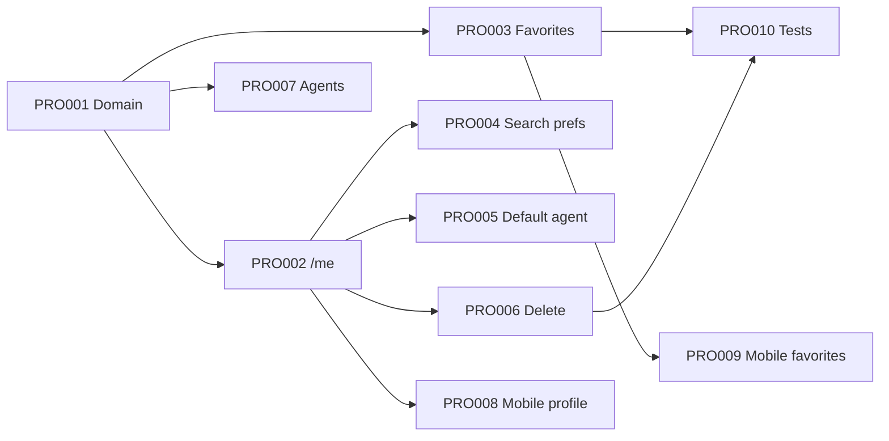

# M5 — User Profile & Preferences — Implementation Plan

**Date:** 2026-06-04  
**Milestone:** M5 — User Profile & Preferences  
**Prerequisites:** M1 closed, M3 complete, M4 complete  
**Spec:** [features/profile/](../features/profile/)

## Goal

Authenticated users manage profile fields, locale, favorites, search preferences, default AI agent, and account lifecycle (delete/export stub). Agents expose a public profile card. Mobile delivers profile tab, edit flow, and favorites screen.

## Execution order

| Wave | Task | Layer | Est. | Depends on | Deliverable |
|------|------|-------|------|------------|-------------|
| 1 | [M5-PRO001](m05-profile/m5-pro001.md) | backend domain | 3h | M3-AUTH001 | `UserProfile` entity, VOs (phone, locale, search prefs), `ProfileRepositoryPort`, failures |
| 1b | — | backend infra | 2h | PRO001 | `PrismaProfileRepository`, `profile.mapper`, `PrismaAgentCatalog` |
| 2 | [M5-PRO002](m05-profile/m5-pro002.md) | backend API | 3h | PRO001, M3-AUTH008 | `GET/PATCH /api/v1/users/me`, use cases |
| 2 | [M5-PRO003](m05-profile/m5-pro003.md) | backend API | 3h | PRO001, M4-SEA007 | Favorites CRUD (`POST/DELETE/GET /users/me/favorites`) |
| 2 | [M5-PRO007](m05-profile/m5-pro007.md) | backend API | 2h | PRO001 | `GET /api/v1/agents/:id` public agent card |
| 3 | [M5-PRO004](m05-profile/m5-pro004.md) | backend API | 2h | PRO002 | Search preferences on `/me` |
| 3 | [M5-PRO005](m05-profile/m5-pro005.md) | backend API | 2h | PRO002 | Default AI agent preference |
| 3 | [M5-PRO006](m05-profile/m5-pro006.md) | backend API | 3h | PRO002 | Account deletion (204) + export stub |
| 4 | [M5-PRO008](m05-profile/m5-pro008.md) | mobile | 4h | PRO002 | Profile tab, edit profile screen |
| 4 | [M5-PRO009](m05-profile/m5-pro009.md) | mobile | 3h | PRO003 | Favorites list + add/remove from detail |
| 5 | [M5-PRO010](m05-profile/m5-pro010.md) | test | 3h | PRO003, PRO006 | P0 integration/E2E per `features/profile/tests.md` |



## In-progress / started work

| Area | Status | Notes |
|------|--------|-------|
| `backend/src/domain/profile/**` | Started (untracked) | VOs, ports, failures scaffolded — finish PRO001 DoD (unit tests ≥80%) |
| Prisma persistence | Not started | Wire `PrismaProfileRepository` after domain tests green |
| `UsersModule` / REST | Not started | PRO002+ |
| `mobile/lib/features/profile/` | Not started | PRO008–009 |

## FR traceability (P0)

| FR | Task(s) |
|----|---------|
| FR-PROF-001, FR-PROF-002 | PRO002, PRO008 |
| FR-PROF-003, FR-PROF-004 | PRO003, PRO009 |
| FR-PROF-005 | PRO004 |
| FR-PROF-007 | PRO005 |
| FR-PROF-008 | PRO007 |
| FR-PROF-009, FR-PROF-010 | PRO006 |

## Definition of Done (milestone)

- [ ] Buyer completes profile setup after first login (mobile)
- [ ] Favorites persist across sessions (API + mobile)
- [ ] `GET/PATCH /users/me` with JWT; 401 without token
- [ ] Account deletion returns 204; export stub documented
- [ ] Integration tests cover all P0 AC in `features/profile/tests.md`

## Verification

```bash
cd backend && docker compose up -d && npm run start:dev
# Login (M3) → PATCH /api/v1/users/me → POST favorite on listing → GET favorites
cd mobile && flutter run --flavor dev
# Profile tab → edit name/locale → favorites from property detail
```

## After M5

| Milestone | Rationale |
|-----------|-----------|
| **M6** (RAG) | Listings in DB (M4); embeddings unblock M7 chat |
| **M6 ∥ M5 tail** | M6 can start once PRO001–003 stable; no hard dependency on profile mobile |

Recommended: complete M5 backend (PRO001–007) before starting M6 workers, or assign M6 embedding adapter in parallel after M4.
