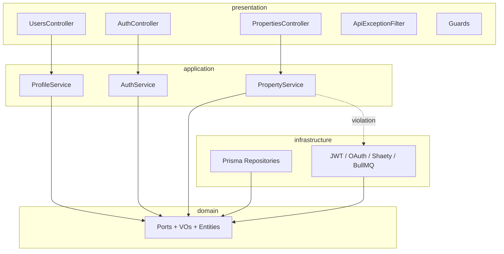

# M5 Profile & Cross-Milestone Implementation Review

**Date:** 2026-06-04  
**Scope:** Backend M3 (Auth) · M4 (Property Search) · M5 (Profile) + Mobile profile feature  
**Reference:** `architecture/clean_architecture.md`, `features/profile/*`, M5-PRO001–010

---

## Executive summary

| Dimension | Backend (M3–M5) | Mobile (Profile) | Overall |
|-----------|-------------------|------------------|---------|
| Clean Architecture | **A−** | **A−** | **A−** |
| SOLID | **B+** | **B+** | **B+** |
| Testability | **B−** | **C+** | **B−** |
| Naming conventions | **A** | **A−** | **A−** |
| Scalability | **B** | **B** | **B** |

The backend follows a **consistent hexagonal layout**: framework-free domain, Symbol-based ports, NestJS wiring in presentation, and Prisma adapters in infrastructure. M5 (profile) aligns with M3/M4 patterns and improves on property search by **not** importing infrastructure from the application layer. Remaining gaps are **monolithic application services**, **thin unit coverage** (~16% lines), **string-based error contracts** in one repository path, and **cross-bounded-context coupling** for account deletion.

**Verdict:** Production-viable for MVP vertical slices; address property-layer boundary violations and test gaps before M6–M7 (higher complexity).

---

## 1. Clean Architecture compliance

### 1.1 Layer dependency map



| Practice | Auth (M3) | Search (M4) | Profile (M5) |
|----------|-----------|-------------|--------------|
| Domain free of Nest/Prisma | ✅ | ✅ | ✅ |
| Ports as interfaces + `Symbol` tokens | ✅ | ✅ | ✅ |
| Infra implements ports only | ✅ | ✅ | ✅ |
| Controllers delegate to application | ✅ | ✅ | ✅ |
| Domain exceptions → HTTP filter | ✅ | ✅ | ✅ |
| Application depends only on domain | ✅ | ❌ | ✅ |
| Entities used in auth flow | ✅ `AuthUser` | ✅ `Property` | ⚠️ Read models on port only |

### 1.2 Strengths

**Domain purity** — No `@nestjs/*` imports under `backend/src/domain/` (verified). Value objects (`Email`, `Password`, `Phone`, `SearchPreferences`, `Location`) encapsulate validation via static `create()` factories.

**Port boundaries** — Each feature exposes focused ports:

| Feature | Ports |
|---------|-------|
| Auth | `AUTH_REPOSITORY`, `TOKEN_SERVICE`, `PASSWORD_HASHER`, `EMAIL_SENDER`, `OAUTH_VERIFIER` |
| Property | `PROPERTY_REPOSITORY`, `SYNC_RUN_REPOSITORY`, `LISTING_PROVIDER` |
| Profile | `PROFILE_REPOSITORY`, `AGENT_CATALOG` |

**DI wiring** — Modules bind implementations explicitly, e.g. `ProfileModule`:

```9:16:backend/src/presentation/profile/profile.module.ts
@Module({
  imports: [AuthModule],
  providers: [
    ProfileService,
    { provide: PROFILE_REPOSITORY, useClass: PrismaProfileRepository },
    { provide: AGENT_CATALOG, useClass: PrismaAgentCatalog },
  ],
  exports: [ProfileService, PROFILE_REPOSITORY],
})
```

**Unified HTTP error surface** — `ApiExceptionFilter` maps `AuthDomainException`, `PropertyDomainException`, and `ProfileDomainException` to structured JSON with correlation IDs.

**M5 improvement over M4** — `ProfileService` uses auth **domain ports** (`AUTH_REPOSITORY`, `PASSWORD_HASHER`) for delete-account, not infrastructure classes.

### 1.3 Violations and drift

| Severity | Issue | Location | Recommendation |
|----------|-------|----------|----------------|
| **High** | Application imports infrastructure | `PropertyService` → `mapRawListingToProperty`, `LISTING_SYNC_QUEUE` | Introduce `ListingNormalizerPort` or move mapping into `ListingProviderPort` adapter; inject queue via port or domain event |
| **Medium** | Generic `Error` for business rule | `PrismaProfileRepository.addFavorite` throws `'PROPERTY_MISSING'` | Return `null` / `Result` or throw `ProfileDomainException` in infra via mapper helper |
| **Medium** | Broad `catch` masks failures | `ProfileService.addFavorite` catches all errors | Catch typed domain/infra errors only; log unexpected |
| **Low** | `UseCase<TInput,TOutput>` unused | `application/shared/use-case.interface.ts` | Split services into use cases or remove interface + update docs |
| **Low** | Docs drift | `PROJECT_STRUCTURE.md` references removed use-case files | Align with service-centric pattern |
| **Design** | Cross-context imports | Profile VO imports property enums; port uses `UserRole` from auth | Acceptable for MVP; consider shared kernel module or anti-corruption DTOs at scale |

**Property application → infrastructure (primary violation):**

```4:27:backend/src/application/property/property.service.ts
import { mapRawListingToProperty } from '../../infrastructure/listing/listing-normalizer';
// ...
import {
  LISTING_SYNC_JOB,
  LISTING_SYNC_QUEUE,
} from '../../infrastructure/queue/queue.constants';
```

Per `clean_architecture.md`, application must depend **only** on domain. Profile and auth comply; property does not.

### 1.4 Mobile (profile)

| Practice | Status |
|----------|--------|
| `domain/` — entities + repository interface | ✅ |
| `data/` — remote datasource + repository impl | ✅ |
| `presentation/` — Riverpod, pages only call repository | ✅ |
| No Dio/HTTP in presentation | ✅ |

Structure mirrors auth and property_search features.

---

## 2. SOLID compliance

### 2.1 Single Responsibility Principle — **B**

| Class | Responsibility count | Notes |
|-------|-------------------|-------|
| `AuthService` | High (~8 flows) | Register, login, OAuth, refresh, reset, verify — **SRP strain** |
| `PropertyService` | High | Search, detail, sync orchestration, health, `OnModuleInit` bootstrap |
| `ProfileService` | Medium | Me CRUD, prefs, favorites, delete, export stub, agent public |
| Controllers | Low | ✅ Thin HTTP adapters |
| Repositories | Low | ✅ Persistence only |

`ProfileService.buildPatch` (~100 lines) mixes validation orchestration; acceptable but could extract `ProfilePatchBuilder` domain service.

### 2.2 Open/Closed Principle — **B+**

- New listing providers: extend `ListingProviderPort` + adapter without changing search API ✅
- New OAuth providers: extend `OAuthVerifierPort` ✅
- New profile fields: requires changes to port DTOs, mapper, service, and DTOs — **expected** for schema evolution

### 2.3 Liskov Substitution Principle — **A−**

Prisma repository implementations honor port contracts. `addFavorite` throwing generic `Error` is a **contract leak** — callers cannot substitute a fake without mimicking string messages.

### 2.4 Interface Segregation Principle — **A−**

Ports are focused (no fat “god repository”). `AuthRepositoryPort` is larger due to OAuth/token concerns but still cohesive.

### 2.5 Dependency Inversion Principle — **B+**

- Auth & profile: high ✅ (depend on abstractions)
- Property sync: partial ❌ (concrete normalizer + BullMQ constants in application)

---

## 3. Testability

### 3.1 Test inventory

| Type | Count | Notable coverage |
|------|-------|------------------|
| Unit (`*.spec.ts` co-located) | 9 | VOs (email, password, phone, search-prefs, location), `auth.service.spec.ts`, `listing-normalizer`, `result`, `app.module` |
| E2E (`test/*.e2e-spec.ts`) | 4 | auth, properties, profile, health |
| **Coverage (Jest)** | — | **~16% lines** (250/1569 statements) |

### 3.2 Strengths

**Port mocking without Nest** — `auth.service.spec.ts` constructs `AuthService` with plain object mocks; no `TestingModule` required. Pattern is reusable for `ProfileService`.

**E2E profile suite** — `profile.e2e-spec.ts` covers me read/update, search preferences, preferred agent, favorites CRUD, export 202 when DB available.

**VO unit tests** — Domain validation is cheap to test and well-isolated.

### 3.3 Gaps

| Gap | Risk | Priority |
|-----|------|----------|
| No `profile.service.spec.ts` | Regression on `buildPatch`, delete-account, role gates | **P0** |
| No `property.service.spec.ts` | Sync/health logic untested at unit level | P1 |
| No repository unit tests | Mapper/query bugs found only in e2e | P1 |
| E2E skips without `DATABASE_URL` | CI may pass with zero assertions | P1 |
| No e2e for `DELETE /users/me` | PDPL-critical path unverified | **P0** |
| No e2e for `GET /agents/:id` | Agent public profile untested | P1 |
| No OAuth e2e | Google/Apple flows manual only | P2 |
| No mobile profile widget tests | UI regressions manual | P2 |

### 3.4 Testability enablers

| Enabler | Present |
|---------|---------|
| Constructor injection via symbols | ✅ |
| Pure VOs | ✅ |
| Domain exceptions with codes | ✅ |
| `FullUserProfile` read model on port (no ORM in app) | ✅ |
| Side effects isolated in infra | ✅ (except `PropertyService.onModuleInit`) |

**Recommendation:** Add `profile.service.spec.ts` with table-driven cases for `buildPatch` (buyer vs agent, invalid phone, invalid agent). Add e2e `deleteMe` with password confirmation.

---

## 4. Naming conventions

### 4.1 Backend — **A**

| Element | Convention | Example |
|---------|------------|---------|
| Files / folders | kebab-case | `profile.repository.port.ts` |
| Ports | `*Port` + `UPPER_SNAKE` symbol | `ProfileRepositoryPort`, `PROFILE_REPOSITORY` |
| Value objects | `*.vo.ts`, class name noun | `Phone`, `SearchPreferences` |
| Failures | `*.failures.ts` | `ProfileDomainException`, `ProfileErrorCode` |
| Application | `*.service.ts` | `ProfileService` |
| Infrastructure | `prisma-*.repository.ts` | `PrismaProfileRepository` |
| Mappers | pure functions in `*.mapper.ts` | `toFullProfile` |
| Presentation | `*.controller.ts`, `*.dto.ts`, `*.guard.ts` | `UsersController`, `PatchProfileDto` |
| Tests | `*.spec.ts` / `*.e2e-spec.ts` | Co-located vs `test/` |

Naming is **consistent across M3–M5** and matches `backend/PROJECT_STRUCTURE.md` intent.

### 4.2 Minor inconsistencies

| Item | Note |
|------|------|
| `UsersController` vs `ProfileService` | Controller named by REST resource; service by bounded context — acceptable |
| `requestDataExport()` | Verb on service without `async` — fine for stub; rename to `queueDataExport` when real |
| Jest path aliases (`@domain/*`) | Configured but unused in imports |

### 4.3 Mobile — **A−**

- `profile_repository.dart` / `ProfileRepository` — clear
- `user_profile.dart` / `UserProfile` — clear
- Providers: `userProfileProvider`, `favoritesProvider` — idiomatic Riverpod

---

## 5. Scalability

### 5.1 Horizontal scaling — **B**

| Component | Scalability | Notes |
|-----------|-------------|-------|
| API (NestJS) | Good | Stateless JWT; scale Cloud Run instances |
| Workers (BullMQ) | Good | `listing-sync` off main process via `worker.ts` |
| PostgreSQL | Good | Indexed search (tsvector); favorites join on `userId` |
| Redis queue | Good | Standard BullMQ pattern |

### 5.2 Data & performance — **B**

| Area | Current behavior | Scale concern |
|------|------------------|---------------|
| Listing sync | Sequential `upsertMany` in repository | Large catalogs → batch/chunk transactions |
| Favorites list | Paginated (`limit` capped at 50 in service) | ✅ |
| Search | DB-side full-text + filters | pgvector deferred — OK for MVP |
| Profile `GET /me` | Single-row user select | ✅ |
| Auto-sync on boot | `PropertyService.onModuleInit` | Multiple API replicas → duplicate enqueue; use distributed lock or single scheduler |
| Agent catalog check | DB hit per `preferredAgentId` update | Cache active agent IDs in Redis at M6+ |

### 5.3 Modular monolith boundaries — **B+**

Features are module-separated (`AuthModule`, `PropertiesModule`, `ProfileModule`). Shared `AuthModule` exports are intentional for JWT guards and token port.

**Risk at M6–M7:** AI/RAG modules should not bypass ports to query Prisma directly from controllers.

### 5.4 Multi-team / feature growth

| Enabler | Status |
|---------|--------|
| Add feature = new domain folder + module | ✅ |
| Shared kernel (`domain/shared`) | Minimal (`Entity`, `Result`) — room to grow |
| Cross-feature coupling | Profile ↔ Auth, Profile ↔ Property enums — monitor |

---

## 6. Feature-specific notes

### 6.1 Profile (M5) — highlights

**`ProfileService`** — Clear orchestration; validates through VOs before persistence:

```183:290:backend/src/application/profile/profile.service.ts
  private async buildPatch(
    raw: Record<string, unknown>,
    role: UserRole,
  ): Promise<UpdateProfilePatch> {
    // ... Phone.create, LocalePreference.create, agentCatalog.isActiveAgentId
  }
```

**Repository favorite path** — Needs typed failure:

```88:97:backend/src/infrastructure/persistence/profile/prisma-profile.repository.ts
    if (!property) {
      throw new Error('PROPERTY_MISSING');
    }
```

**Delete account** — Correct sequencing (revoke tokens → soft delete); OAuth-only users skip password check — document in API spec; add e2e.

**Data export** — Stub returns random UUID; acceptable for M5-PRO006 stub; wire queue in M9/M10.

### 6.2 Auth (M3) — carryover

- `AuthUser` entity used end-to-end ✅
- `JwtAuthGuard` throws Nest `UnauthorizedException` instead of domain exception — pragmatic; filter still works
- `ConfigService` in application layer — framework coupling accepted in Nest projects

### 6.3 Property (M4) — carryover

- Guest search page-1 guard — good product/scale tradeoff
- Sync pipeline production-ready pattern; application boundary needs refactor before adding more providers

---

## 7. Action items (prioritized)

| Priority | Action | Effort |
|----------|--------|--------|
| **P0** | Add `profile.service.spec.ts` (buildPatch, deleteAccount, favorites) | 2–3h |
| **P0** | E2e `DELETE /api/v1/users/me` | 1h |
| **P0** | Replace `throw new Error('PROPERTY_MISSING')` with port contract (`null` or `ProfileErrorCode`) | 1h |
| **P1** | Extract listing normalization behind port; remove infra imports from `PropertyService` | 3–4h |
| **P1** | Narrow `addFavorite` catch to expected error types | 30m |
| **P1** | E2e `GET /api/v1/agents/:id` | 1h |
| **P1** | Fail CI when e2e skipped (separate job with `DATABASE_URL`) | 2h |
| **P2** | Split `AuthService` into use cases when adding M7 chat | 1d |
| **P2** | Distributed lock for `onModuleInit` sync enqueue | 2h |
| **P2** | Mobile profile widget/golden tests | 3h |
| **P3** | Remove or implement `UseCase` interface; update architecture docs | 1h |

---

## 8. Conclusion

The implementation **meets MVP clean-architecture intent**: domain stays pure, features are module-bound, and M5 profile follows the same port/service/controller pattern established in M3–M4. **Profile is the cleanest application layer** of the three features; **property search carries the main architectural debt** (application → infrastructure imports, sync side effects in service).

Before M6 (embeddings/RAG), close **P0 test and error-contract gaps** on profile and **refactor property application boundaries** so new AI pipelines do not inherit the same coupling pattern.

---

## Related documents

- [M3 authentication review](./m03_authentication_implementation_review.md)
- [M4 property search review](./m04_property_search_implementation_review.md)
- [M5 implementation plan](./m05_profile_implementation_plan.md)
- [Clean architecture](../architecture/clean_architecture.md)
