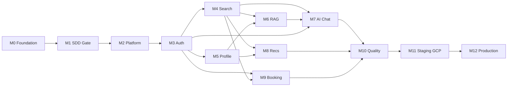
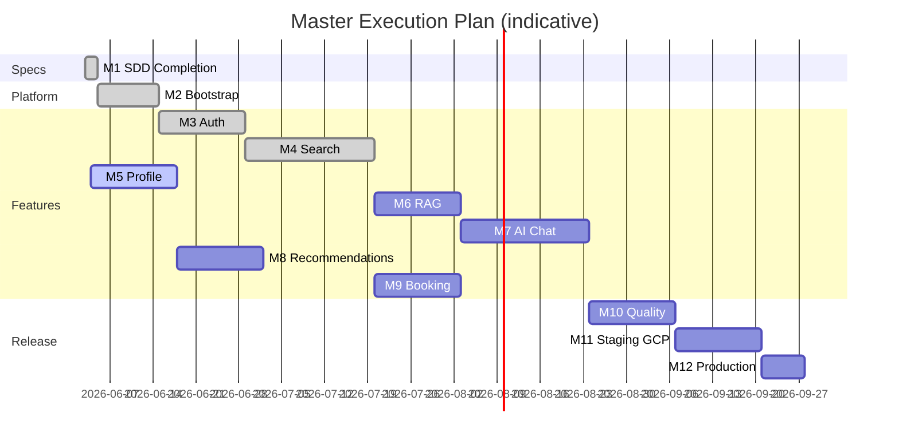

# Master Execution Plan

> End-to-end delivery milestones for AI Property Assistant — derived from `/specs`, `/architecture`, and `/features`.

## Document Status

| Field | Value |
|-------|-------|
| Version | 1.1.0 |
| Status | Active |
| Last Updated | 2026-06-04 |
| Methodology | Specification Driven Development (SDD) |
| Total user stories | 76 (63 P0 MVP) |
| Architecture docs | 13 complete |
| Feature SDD artifacts | 48/48 complete (M1 closed) |
| Current implementation focus | **M5** — User Profile & Preferences |

---

## 1. Executive Summary

The project is delivered in **12 milestones** (M0–M11), ordered foundation → production. Each milestone produces a **independently runnable** increment: verifiable via local run, API tests, mobile build, or deployed environment without requiring later milestones.



### 1.1 Current State (2026-06-04)

| Area | Status |
|------|--------|
| `specs/vision.md`, `requirements.md`, `user_stories_index.md` | ✅ Complete |
| `architecture/*` (13 docs) | ✅ Complete |
| Feature SDD (6 features × 8 artifacts) | ✅ Complete — [M1 report](./m1_sdd_completion_report.md) |
| M1 approval gate | ✅ Closed — [sign-off](./m1_approval_signoff.md) |
| M2 platform bootstrap | ✅ Complete |
| M3 authentication | ✅ Complete — [report](./m03_authentication_completion_report.md) |
| M4 property search & sync | ✅ Complete — [report](./m04_property_search_completion_report.md) |
| **M5 profile (current)** | 🔄 Not started — [plan](./m05_profile_implementation_plan.md) |
| `mobile/` platform bootstrap | ✅ Done — [report](./mobile_platform_bootstrap_completion_report.md) |

### 1.2 Approved Stack (Implementation Reference)

| Layer | Choice |
|-------|--------|
| Mobile | Flutter, Clean Architecture, Riverpod, go_router |
| Backend | NestJS modular monolith, Prisma, REST `/api/v1` |
| Database | PostgreSQL 16 + pgvector |
| AI | Google Gemini via **Vertex AI** (cloud) |
| Cache/Queue | Redis + BullMQ |
| Cloud | Google Cloud (Cloud Run, Cloud SQL, Memorystore) |
| CI/CD | GitHub Actions |

---

## 2. Milestone Index

| ID | Name | Runnable as | Est. duration |
|----|------|-------------|---------------|
| **M0** | Architecture & Product Foundation | Documentation + approvals | Complete |
| **M1** | Feature SDD Completion Gate | Spec review sign-off | Complete (2026-06-04) |
| **M2** | Platform Bootstrap | `docker compose up` + health checks | Complete |
| **M3** | Authentication | Register/login mobile ↔ API | Complete |
| **M4** | Property Search & Listing Sync | Browse/search listings (guest OK) | Complete |
| **M5** | User Profile & Preferences | Favorites + prefs with auth | **Current** — 1–2 weeks |
| **M6** | Embeddings, RAG & Knowledge | RAG API returns grounded chunks | 2 weeks |
| **M7** | AI Chat | Full chat with agents + streaming | 2–3 weeks |
| **M8** | Recommendations | Home feed personalized | 1–2 weeks |
| **M9** | Booking & Notifications | End-to-end viewing request | 2 weeks |
| **M10** | Quality, Security & E2E | Test suite green + monitoring live | 1–2 weeks |
| **M11** | Staging on GCP | Staging URL + Vertex AI | 1–2 weeks |
| **M12** | Production Release | App stores + prod API | 1 week |

---

## 3. Milestone Definitions

---

### M0 — Architecture & Product Foundation

#### Goal

Establish authoritative product vision, SRS, system architecture, and cross-cutting technical designs so all features implement against a single blueprint.

#### Dependencies

- None (project inception).

#### Deliverables

| Deliverable | Path | Status |
|-------------|------|--------|
| Product vision | `specs/vision.md` | ✅ |
| Software requirements (SRS) | `specs/requirements.md` | ✅ |
| User stories index (76 stories) | `specs/user_stories_index.md` | ✅ |
| System design | `architecture/system_design.md` | ✅ |
| Clean architecture | `architecture/clean_architecture.md` | ✅ |
| Flutter architecture | `architecture/flutter_architecture.md` | ✅ |
| Backend architecture | `architecture/backend_architecture.md` | ✅ |
| PostgreSQL schema | `architecture/postgresql_schema.md` | ✅ |
| Listing providers | `architecture/listing_providers.md` | ✅ |
| AI provider strategy | `architecture/ai_provider_strategy.md` | ✅ |
| AI services + agents + RAG | `architecture/ai_*.md`, `rag_architecture.md` | ✅ |
| Gemini integration layer | `architecture/gemini_integration_layer.md` | ✅ |
| Monitoring strategy | `architecture/monitoring_strategy.md` | ✅ |
| Deployment architecture | `architecture/deployment_architecture.md` | ✅ |
| Feature folders scaffolded | `features/*/README.md` | ✅ |
| Project structure docs | `backend/`, `mobile/` PROJECT_STRUCTURE.md | ✅ |

#### Test Requirements

| Check | Method |
|-------|--------|
| SRS FR IDs trace to feature READMEs | Manual traceability matrix |
| Architecture decisions consistent (pgvector, Vertex, no Elasticsearch) | Architecture review |
| Stakeholder approval recorded | Sign-off table in SRS §Approval |

#### Definition of Done

- [ ] Product Owner and Tech Lead sign off `specs/vision.md` and `specs/requirements.md`
- [ ] Tech Lead sign off all `architecture/*.md` documents
- [ ] Stack decisions recorded with no conflicting references in feature READMEs (update property_search README: pgvector not Elasticsearch)
- [ ] `tasks/roadmap.md` aligned with this master plan

#### Independently Runnable Verification

> Review-only milestone. **Run:** walk through docs index (`docs/README.md`); no application binary required.

---

### M1 — Feature SDD Completion Gate

#### Goal

Complete all eight SDD artifacts per feature (requirements → tests) and obtain explicit **approval to implement** before any code in `backend/` or `mobile/`.

#### Dependencies

- M0 (architecture baseline).

#### Deliverables

Per feature (`authentication`, `property_search`, `profile`, `ai_chat`, `recommendation`, `booking`):

| # | Artifact | Status (all features) |
|---|----------|----------------------|
| 1 | `requirements.md` | ✅ |
| 2 | `user_stories.md` | ✅ |
| 3 | `acceptance_criteria.md` | ✅ |
| 4 | `architecture.md` | ✅ |
| 5 | `data_model.md` | ✅ |
| 6 | `api_design.md` | ✅ |
| 7 | `implementation_tasks.md` | ✅ |
| 8 | `tests.md` | ✅ |

**Recommended completion order:**

1. `authentication` (blocks all authenticated features)
2. `property_search` (blocks data-dependent features)
3. `profile`
4. `ai_chat`
5. `recommendation`
6. `booking`

**Cross-cutting deliverables:**

| Deliverable | Owner feature |
|-------------|---------------|
| Notifications API spec | `booking` or shared `features/notifications/` |
| Admin sync health API | `property_search` |
| Prisma schema alignment | Reference `architecture/postgresql_schema.md` in each `data_model.md` |

#### Test Requirements

| Check | Method |
|-------|--------|
| Every P0 user story maps to ≥1 acceptance criterion | Traceability spreadsheet |
| Every P0 AC maps to ≥1 FR-* in SRS | Traceability spreadsheet |
| API designs cover all AC “Then API returns…” clauses | API review checklist |
| `tests.md` defines unit, integration, and E2E cases per P0 AC | QA review |
| Fair housing + PDPL called out in ai_chat + recommendation tests | Compliance checklist |

#### Definition of Done

- [x] 48/48 artifact files exist (6 features × 8 artifacts)
- [x] Each feature README SDD table shows ✅ for all rows
- [x] Written **Approval to implement** per feature (PO + Tech Lead + QA) — [m1_approval_signoff.md](./m1_approval_signoff.md)
- [x] No open P0 ambiguities in issue tracker
- [x] Global API conventions documented (errors, pagination, i18n, auth headers)

**Completion report:** [m1_sdd_completion_report.md](./m1_sdd_completion_report.md)

#### Independently Runnable Verification

> **Run:** SDD review meeting; demo = walkthrough of API contracts via OpenAPI/Markdown without running code. Optional: Spectral lint on OpenAPI if generated.

---

### M2 — Platform Bootstrap

#### Goal

Initialize runnable **local development platform**: NestJS API skeleton, Flutter app skeleton, PostgreSQL + pgvector + Redis, Prisma migrations for core schema, CI lint/test pipelines (no feature logic yet).

#### Dependencies

- M1 approval for **authentication** `implementation_tasks.md` (minimum) OR explicit bootstrap waiver from Tech Lead.

#### Deliverables

| Deliverable | Location |
|-------------|----------|
| NestJS app boots | `backend/src/main.ts`, modules scaffold per PROJECT_STRUCTURE.md |
| Prisma schema (users, properties, projects, conversations, messages, embeddings) | `backend/prisma/schema.prisma` |
| Initial migration + seed (ai_agents, prompt_templates) | `backend/prisma/migrations/` |
| Docker Compose (Postgres pgvector, Redis, API) | `backend/docker-compose.yml` |
| Health endpoints | `GET /health`, `GET /health/ready` |
| Flutter app boots (flavors: dev) | ✅ `mobile/` — Riverpod, GoRouter, Dio, Freezed, Injectable |
| GitHub Actions: `mobile-ci.yml` | ✅ `.github/workflows/mobile-ci.yml` |
| GitHub Actions: `backend-ci.yml` | ⬜ Pending backend bootstrap |
| `.env.example` documented | `backend/`, `mobile/` |
| Logging interceptor + correlation ID | `backend/src/common/` |

#### Test Requirements

| Test | Type | Pass criteria |
|------|------|---------------|
| `docker compose up` → API healthy | Smoke | `/health` returns 200 |
| Prisma migrate on clean DB | Integration | Migration applies without error |
| `flutter analyze` | Static | Zero errors |
| `npm test` (skeleton) | Unit | CI green |
| DB has `vector` extension | Integration | `SELECT 1 FROM pg_extension WHERE extname='vector'` |

#### Definition of Done

- [ ] New developer can clone repo and run API + DB in < 30 minutes (README quickstart)
- [ ] CI passes on `main` for lint + empty/skeleton tests
- [ ] No feature business logic beyond health checks
- [ ] Domain layer has zero NestJS imports (folder structure enforced)

#### Independently Runnable Verification

```bash
cd backend && docker compose up -d
curl http://localhost:3000/health
cd mobile && flutter run --flavor dev
```

---

### M3 — Authentication

#### Goal

Users register, verify email, log in (email, Google, Apple), refresh tokens, and access role-protected endpoints. Agents onboard via automated flow.

#### Dependencies

- M2 (platform)
- M1: `features/authentication/*` approved

#### Deliverables

| Layer | Deliverable |
|-------|-------------|
| Backend | AuthModule: register, login, logout, refresh, forgot/reset password, Google, Apple |
| Backend | JWT + Passport guards, RBAC decorator, `refresh_tokens`, `oauth_accounts` tables |
| Backend | Email verification job (BullMQ or sync for MVP) |
| Mobile | Onboarding, login, register, forgot password screens (ar-EG + en) |
| Mobile | Secure token storage, Dio auth interceptor, auto-refresh |
| API | `/api/v1/auth/*` per feature `api_design.md` |

**SRS coverage:** FR-AUTH-001 through FR-AUTH-013 (P0).

#### Test Requirements

| Test | Type | Pass criteria |
|------|------|---------------|
| Register → verify email → login | E2E API | 200 + valid JWT |
| Refresh token rotation | Integration | Old refresh invalid after use |
| Google OAuth mock | Integration | Account created/linked |
| Apple Sign In mock | Integration | Account created |
| RBAC: buyer cannot access agent-only route | Integration | 403 |
| Agent self-registration | E2E | Role `agent` without admin |
| Duplicate email rejected | Unit | FR-AUTH-011 |
| All P0 authentication AC | E2E / integration | Per `features/authentication/tests.md` |
| Domain auth use cases | Unit | ≥ 80% domain coverage (NFR-MAINT-003) |

#### Definition of Done

- [ ] All P0 acceptance criteria in `authentication/acceptance_criteria.md` pass
- [ ] Postman/contract collection published
- [ ] Mobile can complete full onboarding on iOS + Android simulators
- [ ] No secrets in repository
- [ ] Feature README SDD table unchanged except implementation status note

#### Independently Runnable Verification

> **Run:** Mobile app → register buyer → login → `GET /api/v1/users/me` with token. No property search required.

---

### M4 — Property Search & Listing Sync

#### Goal

Ingest listings from **Shaety (شقتي)** first; expose search, filter, sort, pagination, and listing detail. Guests can browse (P1); authenticated users get full access.

#### Dependencies

- M2 (platform)
- M3 (optional for guest browse; required for saved searches if in scope)
- M1: `features/property_search/*` approved
- Shaety API credentials (or approved mock adapter)

#### Deliverables

| Layer | Deliverable |
|-------|-------------|
| Backend | PropertiesModule, listing provider adapter (Shaety) |
| Backend | BullMQ `listing-sync` worker, normalized `properties` table |
| Backend | Full-text search (`tsvector`), filter query API |
| Backend | `GET /api/v1/properties`, `GET /api/v1/properties/:id` |
| Backend | Admin sync status endpoint (FR-SYNC-006) |
| Mobile | Search screen, filters, results list, listing detail |
| Data | Seed or sync ≥ 100 real/mock listings for QA |

**SRS coverage:** FR-SEARCH-* P0, FR-SYNC-* P0.

**Note:** Use **pgvector + tsvector** per architecture — not Elasticsearch.

#### Test Requirements

| Test | Type | Pass criteria |
|------|------|---------------|
| Sync job ingests Shaety listings | Integration | Properties row count increases |
| Search by city + price | Integration | Correct filter behavior |
| Pagination | Integration | FR-SEARCH-011 |
| Inactive listing excluded after 24h | Integration | FR-SEARCH-015 |
| Provider attribution on detail | E2E | FR-SEARCH-014 |
| 3 consecutive sync failures → alert | Integration | FR-SYNC-004 (log + metric) |
| Search p95 < 2s with 10k listings | Load | NFR-PERF-002 (staging data volume) |
| All P0 property_search AC | Per tests.md | Pass |

#### Definition of Done

- [ ] User can search and open listing detail on device without AI chat
- [ ] Shaety sync runs on schedule in local/staging worker
- [ ] Second provider (Aqarmap) documented as fast-follow task, not blocking
- [ ] Listing images load with error placeholder

#### Independently Runnable Verification

> **Run:** `docker compose up` → trigger sync → mobile guest browse → search "Maadi" → view detail. Auth optional.

---

### M5 — User Profile & Preferences

#### Goal

Authenticated users manage profile, locale, favorites, search preferences, default AI agent, notification prefs; agents maintain agent profile; PDPL consent and account deletion.

#### Dependencies

- M3 (authentication)
- M4 (properties exist for favorites)
- M1: `features/profile/*` approved ✅

**Implementation plan:** [m05_profile_implementation_plan.md](./m05_profile_implementation_plan.md)

#### Deliverables

| Layer | Deliverable |
|-------|-------------|
| Backend | UsersModule: `GET/PATCH /me`, favorites CRUD, preferences, delete/export |
| Backend | `favorites` table, extend `users` per schema |
| Mobile | Profile tab, edit profile, favorites list, settings |
| API | Agent public profile `GET /agents/:id` |

**SRS coverage:** FR-PROF-* P0.

#### Test Requirements

| Test | Type | Pass criteria |
|------|------|---------------|
| Add/remove favorite | Integration | Idempotent |
| Update search preferences → reflected in `GET /me` | Integration | FR-PROF-005 |
| Set default AI agent | Integration | FR-PROF-007 |
| Account deletion cascades user data | Integration | FR-PROF-009 |
| Agent profile fields | E2E | FR-PROF-008 |
| All P0 profile AC | Per tests.md | Pass |

#### Definition of Done

- [ ] Buyer completes profile setup after first login
- [ ] Favorites persist across sessions
- [ ] Account deletion returns 204 and removes PII within policy window

#### Independently Runnable Verification

> **Run:** Login → save favorite on listing from M4 → view favorites in profile. No AI or booking required.

---

### M6 — Embeddings, RAG & Knowledge Pipeline

#### Goal

Background embedding of listings and project knowledge; hybrid retrieval API; Redis RAG cache — **runnable without chat UI** for quality tuning.

#### Dependencies

- M4 (properties in DB)
- M2 (Redis, pgvector)
- M1: `ai_chat` + `property_search` data models approved
- Architecture: `rag_architecture.md`, `postgresql_schema.md`

#### Deliverables

| Layer | Deliverable |
|-------|-------------|
| Backend | Gemini embedding adapter (Vertex or AI Studio local) |
| Backend | BullMQ `embed-listing`, `embed-chunks` workers |
| Backend | `embeddings` table upsert, HNSW index |
| Backend | RAG orchestrator: vector + SQL filters + tsvector |
| Backend | Knowledge ingest for projects (FAQ optional MVP) |
| Backend | Internal/debug `POST /api/v1/ai/rag/retrieve` (admin or dev only) |
| Metrics | `ai_rag_retrieve_duration_ms`, empty retrieval counter |

#### Test Requirements

| Test | Type | Pass criteria |
|------|------|---------------|
| New listing → embedding within 15 min | Integration | FR-SYNC / RAG ops metric |
| Semantic query returns relevant listings | Integration | Recall@5 on golden set sample |
| Hybrid filter (price + city) | Integration | SQL + vector |
| Empty retrieval rate < 5% | Integration | Test query set |
| RAG pipeline p95 < 400ms (excl. chat) | Perf | `rag_architecture.md` §8.4 |
| Cache hit path < 20ms | Integration | Second identical query |
| Embed API failure handling | Integration | Graceful degrade flag |

#### Definition of Done

- [ ] ≥ 99% active listings have embeddings
- [ ] RAG retrieve endpoint returns cited listing IDs + chunks
- [ ] `architecture/rag_architecture.md` evaluation metrics instrumented
- [ ] No user-facing chat required for sign-off

#### Independently Runnable Verification

```bash
# After sync + embed worker run
curl -X POST /api/v1/ai/rag/retrieve -d '{"query":"شقة 3 غرف المعادي"}' -H "Authorization: Bearer $TOKEN"
# Expect: listings[] with similarity scores
```

---

### M7 — AI Chat

#### Goal

Authenticated users chat with four agents (Search, Recommendation, Booking, Follow-up), switch agents mid-session, stream responses, execute tools, grounded replies with listing cards.

#### Dependencies

- M3 (auth), M4 (listings), M5 (default agent pref), M6 (RAG)
- M1: `features/ai_chat/*` approved
- `architecture/gemini_integration_layer.md`, `ai_agent_architecture.md`

#### Deliverables

| Layer | Deliverable |
|-------|-------------|
| Backend | AiModule: conversations, messages, agents catalog |
| Backend | GeminiOrchestrator, ToolExecutionLoop, SafetyPipeline, streaming SSE |
| Backend | Prompt versioning (`prompt_template_versions`) |
| Backend | `POST /conversations`, `POST .../messages`, `POST .../messages/stream` |
| Mobile | Chat UI, agent picker, listing cards, stream rendering |
| Seed | `ai_agents` migration (4 agents) |

**SRS coverage:** FR-CHAT-* P0, fair housing FR-CHAT-014.

#### Test Requirements

| Test | Type | Pass criteria |
|------|------|---------------|
| Create session + send message | E2E | 200 + assistant reply |
| SSE stream completes with `done` event | E2E | FR streaming |
| Tool `semantic_search` invoked | Integration | metadata.toolsCalled |
| Mid-session agent switch preserves history | E2E | FR-CHAT-005 |
| Disabled agent → fallback | Integration | FR-CHAT-009 |
| Fair housing refusal | Integration | No Gemini call on blocked input |
| Hallucination rule: invalid listing ID stripped | Integration | monitoring metric |
| 10 messages/day quota (P1) | Integration | 429 |
| Chat e2e p95 < 3s | Perf | NFR-PERF + monitoring |
| Arabic + English responses | Manual QA | Native speaker sample |
| All P0 ai_chat AC | Per tests.md | Pass |

#### Definition of Done

- [ ] User discovers property via natural language in ar-EG and en
- [ ] Listing cards tap through to M4 detail
- [ ] Vertex AI used in staging (not API key in client)
- [ ] AI disclaimer on every response

#### Independently Runnable Verification

> **Run:** Login → new chat (Search Agent) → "شقة للإيجار في المعادي" → receive cards → tap listing. Booking not required.

---

### M8 — Recommendations

#### Goal

Personalized **"Properties you might like"** feed using embeddings, favorites, search history, and feedback — fair housing compliant.

#### Dependencies

- M4 (listings + embeddings), M5 (preferences, favorites), M3 (auth)
- M1: `features/recommendation/*` approved
- M7 optional (chat signals P1 — can stub)

#### Deliverables

| Layer | Deliverable |
|-------|-------------|
| Backend | RecommendationsModule: feed API, like/dislike |
| Backend | User preference vector (mean of liked embeddings) |
| Mobile | Home feed section, feedback gestures |
| API | `GET /api/v1/recommendations`, `POST .../feedback` |

**SRS coverage:** FR-REC-* P0.

#### Test Requirements

| Test | Type | Pass criteria |
|------|------|---------------|
| Cold start user gets popular listings | Integration | Non-empty feed |
| After like, feed shifts | Integration | Different top IDs |
| Disliked listing excluded | Integration | FR-REC-006 |
| Budget/area prefs respected | Integration | FR-REC-005 |
| No discriminatory filters | Unit | Compliance test |
| Feed pagination | Integration | FR-REC-007 |
| All P0 recommendation AC | Per tests.md | Pass |

#### Definition of Done

- [ ] Home screen shows personalized feed for returning user
- [ ] Like/dislike updates next page of recommendations
- [ ] Feed works without chat history (M7 not required for cold start path)

#### Independently Runnable Verification

> **Run:** Login → like 3 listings → refresh home feed → see related properties. Independent of booking and chat.

---

### M9 — Booking & Notifications

#### Goal

Buyers request viewings; agents confirm/decline; push and email notifications on status changes; agent free-tier quota.

#### Dependencies

- M3 (buyer + agent roles), M4 (property_id), M5 (notification prefs)
- M1: `features/booking/*` approved
- FCM/APNs credentials (or mock for local)

#### Deliverables

| Layer | Deliverable |
|-------|-------------|
| Backend | BookingsModule: CRUD, confirm, decline, cancel |
| Backend | NotificationsModule: BullMQ processor, FCM, email templates (ar/en) |
| Mobile | Booking request flow from listing detail, booking list, agent inbox |
| API | `/api/v1/bookings/*` |

**SRS coverage:** FR-BOOK-* P0, FR-NOTIF-* P0.

#### Test Requirements

| Test | Type | Pass criteria |
|------|------|---------------|
| Buyer creates booking | E2E | status `requested` |
| Agent confirm → buyer notified | Integration | FR-BOOK-003/006 |
| Double-booking prevented | Integration | FR-BOOK-010 |
| Agent free tier 5/month | Integration | FR-BOOK-009 |
| Cancel before viewing | E2E | FR-BOOK-011 |
| Bilingual email template | Snapshot | FR-NOTIF-004 (P1) |
| All P0 booking AC | Per tests.md | Pass |

#### Definition of Done

- [ ] Full lifecycle: request → confirm → completed on staging
- [ ] Agent receives push within 60s of request (staging)
- [ ] Chat-initiated booking deep link works if M7 done (P1)

#### Independently Runnable Verification

> **Run:** Buyer login → listing detail → request viewing → Agent login → confirm → buyer sees confirmed. Single vertical slice.

---

### M10 — Quality, Security & E2E Hardening

#### Goal

Production-quality test coverage, observability instrumentation, security review, and MVP success metrics validation before cloud deploy.

#### Dependencies

- M3–M9 feature-complete for P0 scope
- `architecture/monitoring_strategy.md`

#### Deliverables

| Deliverable | Detail |
|-------------|--------|
| E2E test suite | Patheon/Detox or integration_test: auth → search → chat → book |
| Domain coverage ≥ 80% | NFR-MAINT-003 |
| All public REST endpoints integration tested | NFR-MAINT-004 |
| Prometheus metrics + Grafana dashboards | AI + API + RAG |
| Firebase Analytics events | Funnels in monitoring_strategy.md |
| Crashlytics wired | Mobile |
| Hallucination + citation monitoring | AI quality dashboard |
| Security checklist | OWASP API, JWT, secrets, PDPL |
| Load test report | Search + chat at target RPS |
| MVP launch checklist | `tasks/mvp_launch_checklist.md` (create) |

#### Test Requirements

| Test | Type | Pass criteria |
|------|------|---------------|
| Full P0 user journey E2E | E2E | 100% pass on CI |
| API 5xx < 0.1% under load | Load | NFR |
| Search p95 < 2s | Load | NFR-PERF-002 |
| Chat p95 < 3s | Load | NFR-PERF |
| Hallucination rate < 3% (7-day) | AI eval | monitoring_strategy |
| Crash-free users > 99.5% | Crashlytics | 7-day |
| Search → booking conversion measurable | Analytics | Baseline recorded |

#### Definition of Done

- [ ] No P0 open defects
- [ ] Security review signed off
- [ ] Observability alerts fire correctly in staging dry-run
- [ ] PO accepts MVP against `specs/vision.md` success metrics

#### Independently Runnable Verification

> **Run:** `npm run test:e2e` + `flutter test integration_test/` green on CI; Grafana dashboards show live metrics from staging soak test.

---

### M11 — Staging on GCP

#### Goal

Deploy full stack to **GCP staging**: Cloud Run, Cloud SQL, Memorystore, Vertex AI, GitHub Actions CD, Flutter App Distribution.

#### Dependencies

- M10 (quality gate passed)
- M1 deployment approval
- GCP projects + WIF configured
- `architecture/deployment_architecture.md`

#### Deliverables

| Deliverable | Detail |
|-------------|--------|
| GCP staging project | `re-agent-staging` |
| Cloud SQL + pgvector + migrations | Private VPC |
| Cloud Run `api-staging`, `worker-staging` | From Artifact Registry |
| Vertex AI Gemini | `GEMINI_PROVIDER=vertex` |
| Secret Manager secrets | DB, Redis, JWT, providers |
| GitHub Actions deploy staging on `main` | Per deployment_architecture.md |
| Flutter staging flavor → API staging URL | Firebase App Distribution |
| Cloud Logging + Monitoring alerts | Critical alerts wired |

#### Test Requirements

| Test | Type | Pass criteria |
|------|------|---------------|
| Smoke test staging `/health/ready` | Post-deploy | 200 |
| Mobile staging → staging API | Manual | Full P0 journey |
| Vertex AI chat message | Integration | Stream completes |
| Migrate job on deploy | CD | No failed migration |
| Rollback drill | Ops | Previous revision < 5 min |
| Sync worker on schedule | Integration | Listings update |
| SSL + Cloud Armor | Security | HTTPS only |

#### Definition of Done

- [ ] QA sign-off on staging build
- [ ] All secrets in Secret Manager (none in GitHub vars except WIF)
- [ ] Runbook for rollback documented
- [ ] Staging costs within budget alert threshold

#### Independently Runnable Verification

> **Run:** Install App Distribution build → complete onboarding against `api-staging.*.run.app` → chat uses Vertex → booking notification received.

---

### M12 — Production Release

#### Goal

Release MVP to production GCP and public app stores; enable monitoring and on-call.

#### Dependencies

- M11 (staging sign-off)
- App Store + Play Console accounts
- Production listing provider agreements
- Legal: privacy policy, terms (PDPL)

#### Deliverables

| Deliverable | Detail |
|-------------|--------|
| GCP production project | `re-agent-prod` |
| Production deploy via tag `backend/v1.0.0` | Canary + traffic shift |
| Custom domain + managed cert | `api.propertyassistant.eg` |
| Mobile `mobile/v1.0.0` → stores | Fastlane |
| Production Vertex quotas + budget alerts | GCP billing |
| On-call rotation + incident runbook | Ops |
| Post-launch monitoring dashboard | 24h hypercare |

#### Test Requirements

| Test | Type | Pass criteria |
|------|------|---------------|
| Production smoke suite | Automated | Post-deploy green |
| Store submission accepted | Manual | iOS + Android |
| Production chat + booking | Manual | 3 real-device smoke tests |
| DR rollback tested | Ops | Cloud Run revision rollback |
| Analytics funnel live | Product | Events flowing |

#### Definition of Done

- [ ] App live on App Store and Google Play (or phased rollout 10%)
- [ ] Production SLOs active: uptime, error rate, crash-free, AI cost
- [ ] MVP success metrics baseline week 1 documented
- [ ] Hypercare period (7 days) staffed

#### Independently Runnable Verification

> **Run:** Production app download → real user registration → search Cairo → AI chat → booking request. Monitored via production Grafana + Firebase.

---

## 4. Traceability Matrix (P0 MVP)

| Milestone | Primary FR modules | Feature folder |
|-----------|-------------------|----------------|
| M3 | FR-AUTH-* | `authentication/` |
| M4 | FR-SEARCH-*, FR-SYNC-* | `property_search/` |
| M5 | FR-PROF-* | `profile/` |
| M6 | FR-CHAT-007, FR-SYNC-002 | `ai_chat/` + architecture |
| M7 | FR-CHAT-* | `ai_chat/` |
| M8 | FR-REC-* | `recommendation/` |
| M9 | FR-BOOK-*, FR-NOTIF-* | `booking/` |

---

## 5. Risk Register (Execution)

| Risk | Milestone impact | Mitigation |
|------|------------------|------------|
| SDD bottleneck | — (M1 closed) | Maintain specs when FRs change |
| Shaety API access | Blocks M4 | Mock adapter in M4; real adapter fast-follow |
| Vertex AI quota/latency | M7, M11 | Staging soak in M11 before prod |
| AI cost overrun | M7+ | Daily quota, monitoring from M6 |
| Scope creep | All | P1 items only after P0 DoD |
| Feature README stale (Elasticsearch) | M4 | Update in M1 property_search architecture.md |

---

## 6. Parallel Workstreams (After M2)



**Parallelization notes:**

- M5 can start when M3 completes (parallel with M4 tail).
- M6 starts when M4 has listings in DB (parallel with M5).
- M8 can overlap M7 tail if M5 + M4 embeddings ready.
- M9 can start after M4 (minimal M7 for chat booking P1).

---

## 7. Approval Gates Summary

| Gate | After milestone | Approvers |
|------|-----------------|-----------|
| Architecture baseline | M0 | PO, Tech Lead |
| Implement code | M1 | PO, Tech Lead, QA per feature — **closed 2026-06-04** |
| Staging deploy | M10 | Tech Lead, SRE |
| Production release | M11 | PO, Tech Lead, Security |

---

## 8. Related Documents

| Document | Path |
|----------|------|
| **Task registry (133 × ≤4h tasks)** | [README.md](./README.md) |
| Roadmap (phase view) | [roadmap.md](./roadmap.md) |
| Vision | [../specs/vision.md](../specs/vision.md) |
| Requirements | [../specs/requirements.md](../specs/requirements.md) |
| User stories index | [../specs/user_stories_index.md](../specs/user_stories_index.md) |
| Deployment | [../architecture/deployment_architecture.md](../architecture/deployment_architecture.md) |
| Monitoring | [../architecture/monitoring_strategy.md](../architecture/monitoring_strategy.md) |
| Documentation index | [../docs/README.md](../docs/README.md) |

## Document Approval

| Role | Name | Date | Status |
|------|------|------|--------|
| Product Owner | — | 2026-06-04 | Approved (M1 gate) |
| Tech Lead | — | 2026-06-04 | Approved (M1 gate) |
| QA Lead | — | 2026-06-04 | Approved (M1 gate) |
