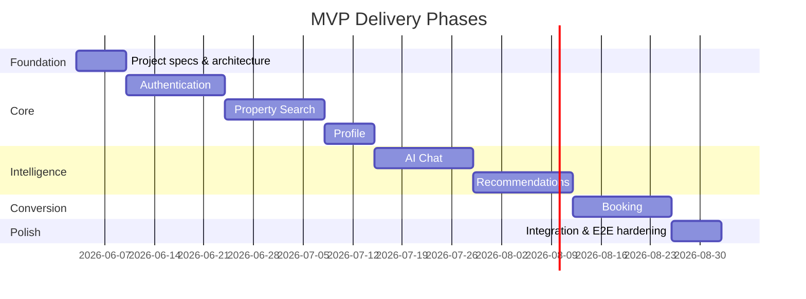

# Roadmap

> Incremental delivery plan aligned with Specification Driven Development.

## Document Status

| Field | Value |
|-------|-------|
| Version | 0.3.0 |
| Status | Draft |
| Last Updated | 2026-06-03 |
| Master plan | [master_execution_plan.md](./master_execution_plan.md) |

## Delivery Philosophy

1. **Specs first** — Complete feature specifications before any implementation
2. **Vertical slices** — Deliver end-to-end capability per feature, not layer-by-layer
3. **MVP focus** — Ship the smallest usable product, then iterate
4. **Approval gates** — Product and architecture sign-off at each phase boundary

## Phase Overview

## Phase 0 — Foundation (Current)

**Goal:** Establish project structure, vision, requirements, and architecture.

| Task | Status | Owner |
|------|--------|-------|
| Create project folder structure | ✅ Done | — |
| Write `specs/vision.md` | ✅ Done | — |
| Write `specs/requirements.md` | ✅ Done | — |
| Write `architecture/system_design.md` | ✅ Done | — |
| Write `architecture/clean_architecture.md` | ✅ Done | — |
| Scaffold feature spec folders | ✅ Done | — |
| Phase 0 foundation & stack decisions | ✅ Done | — |
| Initialize backend project skeleton | ⬜ Blocked | Awaiting feature spec approval |
| Initialize mobile project skeleton | ⬜ Blocked | Awaiting feature spec approval |

### Approved Stack (2026-06-03)

| Component | Choice |
|-----------|--------|
| Backend | Node.js / NestJS |
| Search | PostgreSQL tsvector + pgvector |
| AI | Custom pluggable agents (user-selectable) |
| Market | Egypt — EGP |
| Auth | Google, Apple, email/password |
| LLM | Google Gemini (Vertex AI in cloud) |
| Cloud / CI/CD | GCP + GitHub Actions |
| Agent switching | Mid-session |
| Agent onboarding | Automated |
| ORM | Prisma |
| Mobile API | REST |
| Listings | Shaety (شقتي) primary; Aqarmap; Property Finder Egypt |

> **Detailed milestones (M0–M12):** see [master_execution_plan.md](./master_execution_plan.md).

## Phase 1 — Authentication

**Goal:** Users can register, log in, and access role-protected resources.

| Deliverable | Spec Status | Implementation |
|-------------|-------------|----------------|
| Feature specs (full SDD cycle) | ⬜ Not started | Blocked |
| Backend auth API | — | Blocked |
| Mobile auth screens | — | Blocked |
| Unit + integration tests | — | Blocked |

**Dependencies:** Phase 0 approval

## Phase 2 — Property Search

**Goal:** Users can search, filter, and view property details.

| Deliverable | Spec Status | Implementation |
|-------------|-------------|----------------|
| Feature specs (full SDD cycle) | ⬜ Not started | Blocked |
| Listing data pipeline | — | Blocked |
| Search API + index | — | Blocked |
| Mobile search UI | — | Blocked |

**Dependencies:** Phase 1 (auth for saved searches later)

## Phase 3 — Profile

**Goal:** Users manage preferences, favorites, and account settings.

| Deliverable | Spec Status | Implementation |
|-------------|-------------|----------------|
| Feature specs (full SDD cycle) | ⬜ Not started | Blocked |
| Profile API | — | Blocked |
| Mobile profile screens | — | Blocked |

**Dependencies:** Phase 1

## Phase 4 — AI Chat

**Goal:** Conversational property discovery with grounded responses.

| Deliverable | Spec Status | Implementation |
|-------------|-------------|----------------|
| Feature specs (full SDD cycle) | ⬜ Not started | Blocked |
| Chat API + AI adapter | — | Blocked |
| Mobile chat UI | — | Blocked |

**Dependencies:** Phase 2 (listing data for RAG)

## Phase 5 — Recommendations

**Goal:** Personalized property suggestions.

| Deliverable | Spec Status | Implementation |
|-------------|-------------|----------------|
| Feature specs (full SDD cycle) | ⬜ Not started | Blocked |
| Recommendation engine | — | Blocked |
| Mobile recommendation UI | — | Blocked |

**Dependencies:** Phase 2, Phase 3

## Phase 6 — Booking

**Goal:** Schedule and manage property viewings.

| Deliverable | Spec Status | Implementation |
|-------------|-------------|----------------|
| Feature specs (full SDD cycle) | ⬜ Not started | Blocked |
| Booking API + notifications | — | Blocked |
| Mobile booking flow | — | Blocked |

**Dependencies:** Phase 1, Phase 2

## Phase 7 — Hardening

**Goal:** Production readiness — performance, security audit, E2E tests.

| Task | Status |
|------|--------|
| Load testing | ⬜ Not started |
| Security review | ⬜ Not started |
| E2E test suite | ⬜ Not started |
| Documentation pass | ⬜ Not started |
| MVP launch checklist | ⬜ Not started |

## SDD Checklist Per Feature

Each feature must complete before implementation:

- [ ] Requirements
- [ ] User Stories
- [ ] Acceptance Criteria
- [ ] Architecture Design
- [ ] Data Model
- [ ] API Design
- [ ] Implementation Tasks
- [ ] Tests
- [ ] **Approval to implement**

## Risk Register

| Risk | Impact | Mitigation |
|------|--------|------------|
| Listing data unavailable | Blocks search, chat, recommendations | Identify provider early; build mock data layer |
| AI cost/latency | Poor chat UX | Caching, smaller models for triage, rate limits |
| Fair housing compliance | Legal exposure | Spec review with compliance checklist |
| Scope creep | Delayed MVP | Strict phase gates; defer out-of-scope items |

## Next Action

**Phase 0 (M0) complete** — architecture and SRS baseline done.

**Current focus: M1** — complete remaining SDD artifacts (6 features × 6 missing files each).

See [master_execution_plan.md](./master_execution_plan.md) for full milestone order, DoD, and test requirements.

## Related Documents

- [Vision](../specs/vision.md)
- [Requirements](../specs/requirements.md)
- [System Design](../architecture/system_design.md)
- [AI Provider Strategy](../architecture/ai_provider_strategy.md)
- [Listing Providers](../architecture/listing_providers.md)
- [Master Execution Plan](./master_execution_plan.md)
