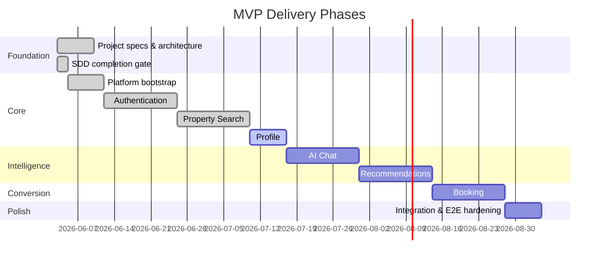

# Roadmap

> Incremental delivery plan aligned with Specification Driven Development.

## Document Status

| Field | Value |
|-------|-------|
| Version | 0.4.0 |
| Status | Active |
| Last Updated | 2026-06-04 |
| Master plan | [master_execution_plan.md](./master_execution_plan.md) |

## Delivery Philosophy

1. **Specs first** — Complete feature specifications before any implementation
2. **Vertical slices** — Deliver end-to-end capability per feature, not layer-by-layer
3. **MVP focus** — Ship the smallest usable product, then iterate
4. **Approval gates** — Product and architecture sign-off at each phase boundary

## Phase Overview

## Phase 0 — Foundation ✅ Complete

**Goal:** Establish project structure, vision, requirements, and architecture.

| Task | Status | Owner |
|------|--------|-------|
| Create project folder structure | ✅ Done | — |
| Write `specs/vision.md` | ✅ Done | — |
| Write `specs/requirements.md` | ✅ Done | — |
| Write `architecture/system_design.md` | ✅ Done | — |
| Write `architecture/clean_architecture.md` | ✅ Done | — |
| Scaffold feature spec folders | ✅ Done | — |
| Phase 0 foundation & stack decisions | ✅ Done | — |
| M1 SDD gate (48/48 artifacts + sign-off) | ✅ Done | — |
| Initialize backend project skeleton | ✅ Done | M2 |
| Initialize mobile project skeleton | ✅ Done | M2 |

### Approved Stack (2026-06-03)

| Component | Choice |
|-----------|--------|
| Backend | Node.js / NestJS |
| Search | PostgreSQL tsvector + pgvector |
| AI | Custom pluggable agents (user-selectable) |
| Market | Egypt — EGP |
| Auth | Google, Apple, email/password |
| LLM | Google Gemini (Vertex AI in cloud) |
| Cloud / CI/CD | GCP + GitHub Actions |
| Agent switching | Mid-session |
| Agent onboarding | Automated |
| ORM | Prisma |
| Mobile API | REST |
| Listings | Shaety (شقتي) primary; Aqarmap; Property Finder Egypt |

> **Detailed milestones (M0–M12):** see [master_execution_plan.md](./master_execution_plan.md).

## Phase 1 — Authentication ✅ Complete

**Goal:** Users can register, log in, and access role-protected resources.

| Deliverable | Spec Status | Implementation |
|-------------|-------------|----------------|
| Feature specs (full SDD cycle) | ✅ Approved (M1) | Done |
| Backend auth API | — | Done (M3) |
| Mobile auth screens | — | Done (M3) |
| Unit + integration tests | — | Done (M3) |

**Report:** [m03_authentication_completion_report.md](./m03_authentication_completion_report.md)

## Phase 2 — Property Search ✅ Complete

**Goal:** Users can search, filter, and view property details.

| Deliverable | Spec Status | Implementation |
|-------------|-------------|----------------|
| Feature specs (full SDD cycle) | ✅ Approved (M1) | Done |
| Listing data pipeline | — | Done (M4, mock Shaety) |
| Search API + index | — | Done (M4) |
| Mobile search UI | — | Done (M4) |

**Report:** [m04_property_search_completion_report.md](./m04_property_search_completion_report.md)

## Phase 3 — Profile 🔄 Current

**Goal:** Users manage preferences, favorites, and account settings.

| Deliverable | Spec Status | Implementation |
|-------------|-------------|----------------|
| Feature specs (full SDD cycle) | ✅ Approved (M1) | — |
| Profile API | — | Not started (M5) |
| Mobile profile screens | — | Not started (M5) |

**Dependencies:** Phase 1 (auth), Phase 2 (listings for favorites)

**Plan:** [m05_profile_implementation_plan.md](./m05_profile_implementation_plan.md)  
**First task:** [M5-PRO001](./m05-profile/m5-pro001.md)

## Phase 4 — AI Chat

**Goal:** Conversational property discovery with grounded responses.

| Deliverable | Spec Status | Implementation |
|-------------|-------------|----------------|
| Feature specs (full SDD cycle) | ✅ Approved (M1) | Blocked on M6 RAG |
| Chat API + AI adapter | — | Not started (M7) |
| Mobile chat UI | — | Not started (M7) |

**Dependencies:** Phase 2 (listing data for RAG), M6 embeddings

## Phase 5 — Recommendations

**Goal:** Personalized property suggestions.

| Deliverable | Spec Status | Implementation |
|-------------|-------------|----------------|
| Feature specs (full SDD cycle) | ✅ Approved (M1) | Not started (M8) |
| Recommendation engine | — | Not started (M8) |
| Mobile recommendation UI | — | Not started (M8) |

**Dependencies:** Phase 2, Phase 3

## Phase 6 — Booking

**Goal:** Schedule and manage property viewings.

| Deliverable | Spec Status | Implementation |
|-------------|-------------|----------------|
| Feature specs (full SDD cycle) | ✅ Approved (M1) | Not started (M9) |
| Booking API + notifications | — | Not started (M9) |
| Mobile booking flow | — | Not started (M9) |

**Dependencies:** Phase 1, Phase 2

## Phase 7 — Hardening

**Goal:** Production readiness — performance, security audit, E2E tests.

| Task | Status |
|------|--------|
| Load testing | ⬜ Not started (M10) |
| Security review | ⬜ Not started (M10) |
| E2E test suite | ⬜ Not started (M10) |
| Documentation pass | ⬜ Not started (M10) |
| MVP launch checklist | ⬜ Not started (M10) |

## SDD Checklist Per Feature

Each feature completed in M1:

- [x] Requirements
- [x] User Stories
- [x] Acceptance Criteria
- [x] Architecture Design
- [x] Data Model
- [x] API Design
- [x] Implementation Tasks
- [x] Tests
- [x] **Approval to implement** — [m1_approval_signoff.md](./m1_approval_signoff.md)

## Risk Register

| Risk | Impact | Mitigation |
|------|--------|------------|
| Listing data unavailable | Blocks production search sync | Mock adapter in M4; Shaety credentials for prod |
| AI cost/latency | Poor chat UX | Caching, smaller models for triage, rate limits |
| Fair housing compliance | Legal exposure | Spec review with compliance checklist (M1 done) |
| Scope creep | Delayed MVP | Strict phase gates; defer out-of-scope items |
| Vertex AI not provisioned | M6–M7 local dev | AI Studio / mocks until M11 staging |

## Next Action

**M1 closed (2026-06-04)** — all feature SDDs approved; see [m1_sdd_completion_report.md](./m1_sdd_completion_report.md).

**Current focus: M5 — User Profile & Preferences**

1. Complete [M5-PRO001](./m05-profile/m5-pro001.md) (domain + repository port; partial scaffold exists)
2. Follow [m05_profile_implementation_plan.md](./m05_profile_implementation_plan.md)

**Dashboard:** [PROJECT_STATUS.md](../PROJECT_STATUS.md) (regenerate via `python3 tasks/build_project_status.py`)

## Related Documents

- [Vision](../specs/vision.md)
- [Requirements](../specs/requirements.md)
- [System Design](../architecture/system_design.md)
- [AI Provider Strategy](../architecture/ai_provider_strategy.md)
- [Listing Providers](../architecture/listing_providers.md)
- [Master Execution Plan](./master_execution_plan.md)
