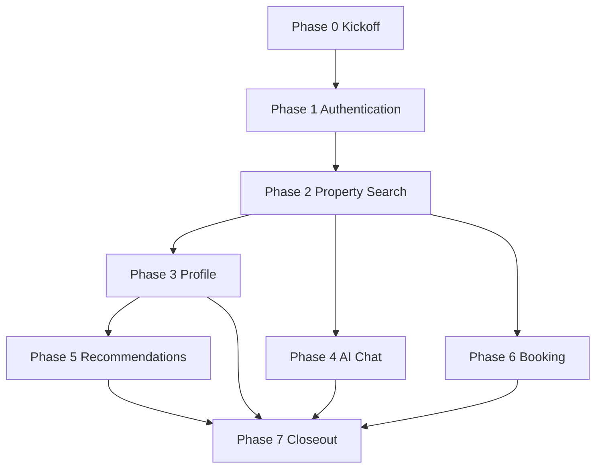

# Sprint 001 — Milestone 1 (SDD Completion Gate)

> **Sprint type:** Specification only — no application code in `backend/` or feature `mobile/` logic.  
> **Sources:** [specs/](../specs/), [architecture/](../architecture/), [master_execution_plan.md](./master_execution_plan.md)  
> **Registry alignment:** Maps to `tasks/m01-sdd/*` (30 tasks at 2–3h); this sprint splits each into **30–90 minute** work units.

---

## Sprint metadata

| Field | Value |
|-------|-------|
| **Sprint ID** | SPRINT-001 |
| **Milestone** | M1 — Feature SDD Completion Gate |
| **Goal** | Produce 48/48 SDD artifacts (6 features × 8 files) + cross-cutting API conventions + traceability + formal approval to implement |
| **Prerequisite** | M0 complete ([specs/vision.md](../specs/vision.md), [specs/requirements.md](../specs/requirements.md), [architecture/*.md](../architecture/)) |
| **Estimated effort** | ~52–68 hours (solo); ~5–8 working days at 8h/day |
| **Task count** | 74 micro-tasks |
| **Recommended order** | Phase 0 → Authentication → Property Search → Profile → AI Chat → Recommendation → Booking → Closeout |

---

## Sprint exit criteria (Milestone 1 Definition of Done)

From [master_execution_plan.md](./master_execution_plan.md) § M1:

- [ ] **48/48** artifact files exist under `features/<feature>/`
- [ ] Each feature [README](../features/) SDD table shows ✅ for all 8 rows
- [ ] **Approval to implement** recorded per feature (PO + Tech Lead + QA signatures)
- [ ] **No open P0 ambiguities** tracked in issues (or explicitly deferred with owner + date)
- [ ] **Global API conventions** documented (`architecture/api_conventions.md`)
- [ ] **Traceability matrix** covers all P0 user stories → AC → FR-*
- [ ] **Stack consistency:** `property_search` docs reference **PostgreSQL + pgvector + tsvector** (not Elasticsearch)
- [ ] **Notifications API** specified (owned by `booking` or `features/notifications/`)
- [ ] **Admin sync health API** specified in `property_search` `api_design.md` (FR-SYNC-006)

### Independently verifiable (no code)

| Verification | Method |
|--------------|--------|
| SDD walkthrough | 60-min review per feature; API contracts readable without running app |
| Traceability | Spreadsheet: 100% P0 stories → AC → FR |
| API completeness | Checklist: every AC clause with “API returns…” has endpoint + status code |
| Test coverage plan | QA sign-off: each P0 AC has ≥1 labeled test (unit / integration / E2E) |
| Compliance | Fair housing + PDPL called out in `ai_chat` and `recommendation` `tests.md` |

---

## Task conventions

| Field | Rule |
|-------|------|
| **Duration** | 30, 45, 60, or 90 minutes wall-clock |
| **ID** | `S1-###` (sprint) · maps to `M1-{FEATURE}-{ARTIFACT}` where noted |
| **Dependencies** | Must complete blockers before starting task |
| **Output** | Markdown files only under `features/` or `architecture/` |

---

## Phase 0 — Sprint kickoff & cross-cutting (5 tasks · ~4.5h)

| ID | Duration | Title | Depends on | Maps to |
|----|----------|-------|------------|---------|
| S1-001 | 45m | Create traceability matrix template (Story → AC → FR → API → Test) | M0 | — |
| S1-002 | 90m | Draft global API conventions (`architecture/api_conventions.md`) | M0 | M1 cross-cutting DoD |
| S1-003 | 30m | Fix `property_search/README.md` stack drift (pgvector, not Elasticsearch) | M0 | — |
| S1-004 | 45m | Define SDD artifact templates (headings checklist per file type) | S1-002 | — |
| S1-005 | 30m | Sprint planning: assign feature owners + review calendar | S1-001 | — |

### S1-001 — Traceability matrix template

**Output:** `tasks/traceability_matrix.csv` (or `.md` table) with columns: Feature, US-ID, AC-ID, FR-ID, API endpoint, Test-ID.

**Definition of Done**

- [ ] Template has column headers and one example row (authentication)
- [ ] Linked from [tasks/README.md](./README.md) or this sprint doc

**Tests required**

- [ ] Spot-check: one US-AUTH-001 row fills completely from existing `user_stories.md` + `acceptance_criteria.md`

---

### S1-002 — Global API conventions

**Output:** [architecture/api_conventions.md](../architecture/api_conventions.md)

**Content must include:** `/api/v1/` versioning (NFR-MAINT-005), auth header (`Authorization: Bearer`), locale (`Accept-Language` or `X-Locale`), pagination (`page`, `pageSize`, `total`), error envelope (`code`, `message`, `details`, `correlationId`), idempotency notes for POST favorites/bookings, date/time ISO-8601 + Egypt timezone default.

**Definition of Done**

- [ ] Referenced from all six feature `api_design.md` files (cross-link added as each is written)
- [ ] Tech Lead review slot scheduled

**Tests required**

- [ ] Checklist review: conventions cover NFR-MAINT-005, NFR-SEC-008, NFR-UX-007
- [ ] Sample error JSON documented for 400, 401, 403, 404, 409, 429, 500

---

### S1-003 — Property search README correction

**Output:** Updated [features/property_search/README.md](../features/property_search/README.md) Overview + traceability.

**Definition of Done**

- [ ] States canonical store: PostgreSQL; search: **tsvector** + **pgvector** per [postgresql_schema.md](../architecture/postgresql_schema.md)
- [ ] No remaining Elasticsearch references in feature README

**Tests required**

- [ ] `rg -i elasticsearch features/property_search/` returns zero matches

---

### S1-004 — SDD artifact templates

**Output:** Section in this doc or `tasks/sdd_artifact_checklist.md` listing required headings per artifact type.

**Definition of Done**

- [ ] Templates exist for: requirements, architecture, data_model, api_design, tests, implementation_tasks

**Tests required**

- [ ] Peer can draft `requirements.md` without asking what sections to include

---

### S1-005 — Sprint logistics

**Definition of Done**

- [ ] Owners assigned: Auth, Search, Profile, Chat, Rec, Booking
- [ ] Review meetings scheduled (6 × 45m feature reviews + 1 × 60m sprint closeout)

**Tests required**

- [ ] Calendar invites or issue milestones created

---

## Phase 1 — Authentication (13 tasks · ~11h)

**Inputs:** [user_stories.md](../features/authentication/user_stories.md) (13 stories), [acceptance_criteria.md](../features/authentication/acceptance_criteria.md) (13 AC), SRS §3.1 FR-AUTH-*, [postgresql_schema.md](../architecture/postgresql_schema.md), [backend_architecture.md](../architecture/backend_architecture.md), [flutter_architecture.md](../architecture/flutter_architecture.md)

| ID | Duration | Title | Depends on | Maps to |
|----|----------|-------|------------|---------|
| S1-010 | 45m | Auth `requirements.md` — scope, personas, out-of-scope | S1-004 | M1-AUT-REQ |
| S1-011 | 60m | Auth `requirements.md` — P0 FR-AUTH mapping table | S1-010 | M1-AUT-REQ |
| S1-012 | 30m | Auth `requirements.md` — NFR-SEC/COMP + open questions | S1-011 | M1-AUT-REQ |
| S1-013 | 45m | Auth `architecture.md` — backend AuthModule boundaries | S1-012, S1-002 | M1-AUT-ARC |
| S1-014 | 45m | Auth `architecture.md` — mobile feature layers + token flow | S1-013 | M1-AUT-ARC |
| S1-015 | 45m | Auth `data_model.md` — entities (User, RefreshToken, OAuthAccount) | S1-013 | M1-AUT-DAT |
| S1-016 | 45m | Auth `data_model.md` — Prisma alignment + indexes | S1-015 | M1-AUT-DAT |
| S1-017 | 45m | Auth `api_design.md` — endpoint inventory + auth flows diagram | S1-016, S1-002 | M1-AUT-API |
| S1-018 | 90m | Auth `api_design.md` — request/response schemas (register, login, refresh) | S1-017 | M1-AUT-API |
| S1-019 | 45m | Auth `api_design.md` — OAuth, reset password, errors, rate limits | S1-018 | M1-AUT-API |
| S1-020 | 60m | Auth `tests.md` — unit + integration cases per P0 AC | S1-019 | M1-AUT-TST |
| S1-021 | 45m | Auth `tests.md` — mobile widget/E2E cases + PDPL consent tests | S1-020 | M1-AUT-TST |
| S1-022 | 60m | Auth `implementation_tasks.md` + README ✅ + traceability column | S1-021, S1-001 | M1-AUT-TST |

### S1-010 — Auth requirements (scope)

**Definition of Done**

- [ ] `features/authentication/requirements.md` created with: purpose, scope, roles, dependencies, blocks
- [ ] Agent automated onboarding (FR-AUTH-008) explicitly in scope

**Tests required**

- [ ] README artifact #1 marked In Progress

---

### S1-011 — Auth requirements (FR mapping)

**Definition of Done**

- [ ] Table: each P0 `US-AUTH-*` → `FR-AUTH-*` with priority
- [ ] All 13 P0 FR-AUTH items from SRS §3.1 addressed or marked deferred with rationale

**Tests required**

- [ ] Traceability matrix: 13/13 P0 stories have FR column filled
- [ ] No orphan P0 FR without a story or explicit “system-only” note

---

### S1-012 — Auth requirements (NFR + gaps)

**Definition of Done**

- [ ] Sections for NFR-SEC-002/003/005, NFR-COMP-001/002/007
- [ ] Open questions list empty or each has owner + target date

**Tests required**

- [ ] PO review: no ambiguous P0 auth flows (verification, role pick, OAuth link)

---

### S1-013 — Auth architecture (backend)

**Definition of Done**

- [ ] `features/authentication/architecture.md` describes AuthModule, guards, Passport strategies, BullMQ email jobs
- [ ] Diagram: presentation → application → domain → infrastructure

**Tests required**

- [ ] Aligns with [clean_architecture.md](../architecture/clean_architecture.md) — domain has no Nest imports

---

### S1-014 — Auth architecture (mobile)

**Definition of Done**

- [ ] Mobile section: `features/authentication/` layers, secure storage, Dio interceptor, route guards
- [ ] Links [flutter_architecture.md](../architecture/flutter_architecture.md)

**Tests required**

- [ ] Onboarding flow covers ar-EG + en (FR-AUTH-010)

---

### S1-015 — Auth data model (entities)

**Definition of Done**

- [ ] `features/authentication/data_model.md` lists entities, VOs (Email, Password), enums (Role)
- [ ] State diagram: unverified → active → deleted

**Tests required**

- [ ] Matches bounded context in [system_design.md](../architecture/system_design.md)

---

### S1-016 — Auth data model (Prisma)

**Definition of Done**

- [ ] Field-level mapping to `users`, `refresh_tokens`, `oauth_accounts` per [postgresql_schema.md](../architecture/postgresql_schema.md)
- [ ] Notes on `consent_at`, `email_verified_at`, soft delete

**Tests required**

- [ ] Tech Lead: no schema fields invented without migration plan note

---

### S1-017 — Auth API (inventory)

**Definition of Done**

- [ ] All endpoints listed under `/api/v1/auth/*` with method, auth required, roles
- [ ] Sequence diagram: register → verify → login → refresh → logout

**Tests required**

- [ ] Every P0 AC with “API returns” has candidate endpoint named

---

### S1-018 — Auth API (schemas)

**Definition of Done**

- [ ] JSON examples for: register, login, refresh, `/users/me` (if in auth scope)
- [ ] Token pair structure documented (access + refresh expiry)

**Tests required**

- [ ] Matches NFR-SEC-003 expiry values
- [ ] Uses error envelope from S1-002

---

### S1-019 — Auth API (OAuth + edge cases)

**Definition of Done**

- [ ] Google + Apple endpoints, duplicate email (409), rate limit 429
- [ ] Password reset flow endpoints

**Tests required**

- [ ] API review checklist: 100% P0 auth AC covered

---

### S1-020 — Auth tests (backend)

**Definition of Done**

- [ ] `features/authentication/tests.md` unit cases for domain VOs and policies
- [ ] Integration cases: register, login, refresh rotation, RBAC 403

**Tests required**

- [ ] Each P0 AC-ID maps to ≥1 test case ID (AUTH-T-###)
- [ ] Coverage targets reference NFR-MAINT-003/004

---

### S1-021 — Auth tests (mobile + PDPL)

**Definition of Done**

- [ ] Widget tests: forms validation, consent checkbox
- [ ] E2E: register → verify message → login (manual/simulator steps)

**Tests required**

- [ ] AC-AUTH-010 (consent) has explicit test case
- [ ] NFR-COMP-002 traced

---

### S1-022 — Auth implementation tasks + sign-off prep

**Definition of Done**

- [ ] `implementation_tasks.md` lists chunks ≤4h referencing `tasks/m03-authentication/*`
- [ ] README all ✅; Approval to implement table ready (signatures pending)
- [ ] Traceability matrix auth section 100%

**Tests required**

- [ ] QA Lead checklist sign-off on `tests.md`
- [ ] Mark [M1-AUT-REQ](../tasks/m01-sdd/m1-aut-req.md) … [M1-AUT-TST](../tasks/m01-sdd/m1-aut-tst.md) ready for status `done` after reviews

---

## Phase 2 — Property Search & Sync (14 tasks · ~12h)

**Inputs:** 17 stories, 17 AC, FR-SEARCH-* + FR-SYNC-*, [listing_providers.md](../architecture/listing_providers.md), [postgresql_schema.md](../architecture/postgresql_schema.md)

| ID | Duration | Title | Depends on | Maps to |
|----|----------|-------|------------|---------|
| S1-030 | 45m | Search `requirements.md` — scope, providers, MVP vs fast-follow | S1-003, S1-004 | M1-SEA-REQ |
| S1-031 | 60m | Search `requirements.md` — FR-SEARCH P0 mapping | S1-030 | M1-SEA-REQ |
| S1-032 | 45m | Search `requirements.md` — FR-SYNC + guest browse P1 | S1-031 | M1-SEA-REQ |
| S1-033 | 45m | Search `architecture.md` — sync pipeline + BullMQ worker | S1-032 | M1-SEA-ARC |
| S1-034 | 45m | Search `architecture.md` — search (tsvector + filters), no ES | S1-033 | M1-SEA-ARC |
| S1-035 | 45m | Search `architecture.md` — mobile search feature structure | S1-034 | M1-SEA-ARC |
| S1-036 | 45m | Search `data_model.md` — Property, SyncRun, Provider enums | S1-033 | M1-SEA-DAT |
| S1-037 | 45m | Search `data_model.md` — Prisma `properties`, search_vector, embeddings FK | S1-036 | M1-SEA-DAT |
| S1-038 | 45m | Search `api_design.md` — GET /properties, /properties/:id | S1-037, S1-002 | M1-SEA-API |
| S1-039 | 60m | Search `api_design.md` — query params, pagination, sort, filters | S1-038 | M1-SEA-API |
| S1-040 | 45m | Search `api_design.md` — admin sync status (FR-SYNC-006) | S1-039 | M1-SEA-API |
| S1-041 | 60m | Search `tests.md` — sync + search integration cases | S1-040 | M1-SEA-TST |
| S1-042 | 45m | Search `tests.md` — mobile + load test notes (NFR-PERF-002) | S1-041 | M1-SEA-TST |
| S1-043 | 60m | Search `implementation_tasks.md` + README + traceability | S1-042, S1-022 | M1-SEA-TST |

**Phase 2 tests (apply per task):**

- [ ] Shaety-first called out (FR-SEARCH-003); Aqarmap/PFinder as P1 fast-follow
- [ ] FR-SEARCH-015 inactive-after-24h has sync + search test
- [ ] FR-SEARCH-014 provider attribution in API schema + detail AC test
- [ ] `rg -i elasticsearch features/property_search/` → 0 after S1-043

---

## Phase 3 — User Profile (11 tasks · ~9h)

**Inputs:** 11 stories, FR-PROF-*, depends on auth + properties for favorites.

| ID | Duration | Title | Depends on | Maps to |
|----|----------|-------|------------|---------|
| S1-050 | 45m | Profile `requirements.md` — scope + FR-PROF P0 map | S1-022 | M1-PRO-REQ |
| S1-051 | 30m | Profile `requirements.md` — PDPL delete/export | S1-050 | M1-PRO-REQ |
| S1-052 | 45m | Profile `architecture.md` — UsersModule + mobile profile tab | S1-051 | M1-PRO-ARC |
| S1-053 | 45m | Profile `data_model.md` — favorites, preferences JSON schema | S1-052 | M1-PRO-DAT |
| S1-054 | 60m | Profile `api_design.md` — /users/me, favorites, preferences | S1-053, S1-002 | M1-PRO-API |
| S1-055 | 30m | Profile `api_design.md` — GET /agents/:id public profile | S1-054 | M1-PRO-API |
| S1-056 | 45m | Profile `tests.md` — API integration per P0 AC | S1-055 | M1-PRO-TST |
| S1-057 | 30m | Profile `tests.md` — mobile favorites + locale | S1-056 | M1-PRO-TST |
| S1-058 | 45m | Profile `implementation_tasks.md` + README + traceability | S1-057 | M1-PRO-TST |

---

## Phase 4 — AI Chat (13 tasks · ~11.5h)

**Inputs:** 14 stories, FR-CHAT-*, [gemini_integration_layer.md](../architecture/gemini_integration_layer.md), [ai_agent_architecture.md](../architecture/ai_agent_architecture.md), [rag_architecture.md](../architecture/rag_architecture.md)

| ID | Duration | Title | Depends on | Maps to |
|----|----------|-------|------------|---------|
| S1-060 | 45m | Chat `requirements.md` — scope, agents, streaming | S1-043 | M1-CHT-REQ |
| S1-061 | 60m | Chat `requirements.md` — FR-CHAT P0 + fair housing FR-CHAT-014 | S1-060 | M1-CHT-REQ |
| S1-062 | 45m | Chat `architecture.md` — AiModule, orchestrator, tools | S1-061 | M1-CHT-ARC |
| S1-063 | 45m | Chat `architecture.md` — SSE streaming + safety pipeline | S1-062 | M1-CHT-ARC |
| S1-064 | 45m | Chat `architecture.md` — mobile chat UI + agent picker | S1-063 | M1-CHT-ARC |
| S1-065 | 45m | Chat `data_model.md` — conversations, messages, agents | S1-062 | M1-CHT-DAT |
| S1-066 | 30m | Chat `data_model.md` — prompt_template_versions link | S1-065 | M1-CHT-DAT |
| S1-067 | 45m | Chat `api_design.md` — conversations + messages CRUD | S1-066, S1-002 | M1-CHT-API |
| S1-068 | 90m | Chat `api_design.md` — SSE stream event schema + tools metadata | S1-067 | M1-CHT-API |
| S1-069 | 60m | Chat `tests.md` — integration + SSE + tool invocation | S1-068 | M1-CHT-TST |
| S1-070 | 45m | Chat `tests.md` — **fair housing** + PII redaction test cases | S1-069 | M1-CHT-TST |
| S1-071 | 45m | Chat `tests.md` — Arabic/English + AI-down (FR-CHAT-016) | S1-070 | M1-CHT-TST |
| S1-072 | 60m | Chat `implementation_tasks.md` + README + traceability | S1-071 | M1-CHT-TST |

**Compliance tests required (S1-070):**

- [ ] Blocked discriminatory prompts return refusal without LLM call
- [ ] Test IDs referenced in [monitoring_strategy.md](../architecture/monitoring_strategy.md) AI metrics section

---

## Phase 5 — Recommendations (10 tasks · ~8h)

**Inputs:** 9 stories, FR-REC-*, depends on search + profile.

| ID | Duration | Title | Depends on | Maps to |
|----|----------|-------|------------|---------|
| S1-080 | 45m | Rec `requirements.md` — scope + FR-REC P0 map | S1-058 | M1-REC-REQ |
| S1-081 | 30m | Rec `requirements.md` — FR-REC-008 fair housing | S1-080 | M1-REC-REQ |
| S1-082 | 45m | Rec `architecture.md` — scoring, preference vector | S1-081 | M1-REC-ARC |
| S1-083 | 45m | Rec `data_model.md` — feedback, signals | S1-082 | M1-REC-DAT |
| S1-084 | 45m | Rec `api_design.md` — GET /recommendations + feedback POST | S1-083, S1-002 | M1-REC-API |
| S1-085 | 45m | Rec `tests.md` — cold start, like/dislike, pagination | S1-084 | M1-REC-TST |
| S1-086 | 45m | Rec `tests.md` — **non-discrimination** compliance suite | S1-085 | M1-REC-TST |
| S1-087 | 45m | Rec `architecture.md` — mobile home feed section | S1-082 | M1-REC-ARC |
| S1-088 | 45m | Rec `implementation_tasks.md` + README + traceability | S1-086, S1-087 | M1-REC-TST |

---

## Phase 6 — Booking & Notifications (12 tasks · ~10h)

**Inputs:** 12 stories, FR-BOOK-* + FR-NOTIF-* (cross-cutting).

| ID | Duration | Title | Depends on | Maps to |
|----|----------|-------|------------|---------|
| S1-090 | 45m | Booking `requirements.md` — scope + FR-BOOK P0 | S1-043 | M1-BOK-REQ |
| S1-091 | 45m | Booking `requirements.md` — FR-NOTIF P0/P1 in same doc or `features/notifications/` | S1-090 | M1-BOK-REQ |
| S1-092 | 45m | Booking `architecture.md` — BookingsModule + NotificationsModule | S1-091 | M1-BOK-ARC |
| S1-093 | 45m | Booking `architecture.md` — FCM, email, BullMQ processor | S1-092 | M1-BOK-ARC |
| S1-094 | 45m | Booking `data_model.md` — booking state machine | S1-092 | M1-BOK-DAT |
| S1-095 | 30m | Booking `data_model.md` — notification_jobs, templates | S1-094 | M1-BOK-DAT |
| S1-096 | 60m | Booking `api_design.md` — /bookings CRUD + agent actions | S1-095, S1-002 | M1-BOK-API |
| S1-097 | 45m | Booking `api_design.md` — notification payloads + bilingual templates | S1-096 | M1-BOK-API |
| S1-098 | 60m | Booking `tests.md` — lifecycle E2E + double-booking + quota | S1-097 | M1-BOK-TST |
| S1-099 | 45m | Booking `tests.md` — push/email notification assertions | S1-098 | M1-BOK-TST |
| S1-100 | 45m | Booking `architecture.md` — mobile flows (buyer + agent) | S1-093 | M1-BOK-ARC |
| S1-101 | 60m | Booking `implementation_tasks.md` + README + traceability | S1-099, S1-100 | M1-BOK-TST |

---

## Phase 7 — Sprint closeout (6 tasks · ~5.5h)

| ID | Duration | Title | Depends on | Maps to |
|----|----------|-------|------------|---------|
| S1-110 | 60m | Complete traceability matrix (all 6 features, P0 only) | S1-101 | — |
| S1-111 | 45m | Cross-feature API review — auth headers, pagination, errors consistent | S1-110, S1-002 | — |
| S1-112 | 45m | Prisma schema cross-check — all `data_model.md` vs [postgresql_schema.md](../architecture/postgresql_schema.md) | S1-110 | — |
| S1-113 | 60m | Feature review meetings #1–3 (Auth, Search, Profile) | S1-110 | — |
| S1-114 | 60m | Feature review meetings #4–6 (Chat, Rec, Booking) | S1-113 | — |
| S1-115 | 90m | Sprint review + **Approval to implement** signatures (6 features) | S1-114 | M1 gate |

### S1-115 — Sprint review

**Definition of Done**

- [ ] All 48 artifacts exist and README tables ✅
- [ ] PO + Tech Lead + QA signed Approval to implement per feature
- [ ] [master_execution_plan.md](./master_execution_plan.md) M1 DoD checkboxes satisfied
- [ ] Sprint retrospective notes captured (blockers for M2)

**Tests required**

- [ ] Run M1 verification: SDD walkthrough demo (API markdown only)
- [ ] Optional: Spectral/OpenAPI lint if OpenAPI fragments added
- [ ] Issue tracker: zero open P0 spec ambiguities

---

## Dependency graph (sprint phases)

**Parallelization:** After S1-043, Phases 3–6 can run in parallel with separate owners (Profile ∥ Chat ∥ Booking; Recommendation after Profile).

---

## Sprint backlog summary

| Phase | Tasks | Est. hours |
|-------|-------|------------|
| 0 Kickoff | 5 | 4.5 |
| 1 Authentication | 13 | 11 |
| 2 Property Search | 14 | 12 |
| 3 Profile | 9 | 7.5 |
| 4 AI Chat | 13 | 11.5 |
| 5 Recommendations | 9 | 7.5 |
| 6 Booking | 12 | 10 |
| 7 Closeout | 6 | 5.5 |
| **Total** | **74** | **~69.5** |

---

## What comes after Sprint 001

Do **not** start feature code until S1-115 is complete.

| Next | First tasks |
|------|-------------|
| **M2 Platform** | [M2-PLT002](./m02-platform/m2-plt002.md) NestJS scaffold |
| **M3 Auth** | [M3-AUTH001](./m03-authentication/m3-auth001.md) after M1-AUT-TST approved |

---

## Related documents

| Document | Path |
|----------|------|
| Master execution plan (M1) | [master_execution_plan.md](./master_execution_plan.md) |
| M1 task registry | [m01-sdd/](./m01-sdd/) |
| SRS | [specs/requirements.md](../specs/requirements.md) |
| PostgreSQL schema | [architecture/postgresql_schema.md](../architecture/postgresql_schema.md) |
| Gemini integration | [architecture/gemini_integration_layer.md](../architecture/gemini_integration_layer.md) |
